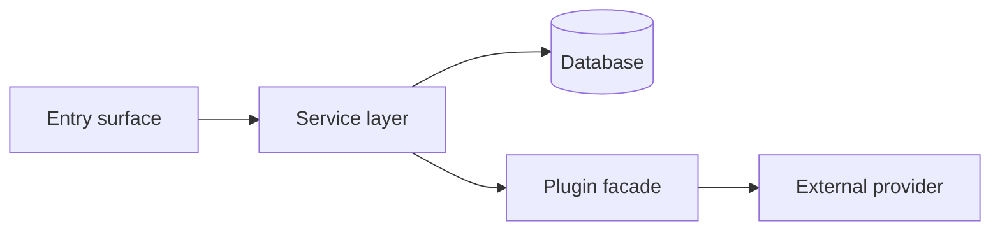

# Implementation Plan: [FEATURE NAME]

> Translates an approved spec.md into an architecture and tech-choice plan.
> The plan owns implementation details; the spec owns behaviour.

**Feature ID**: `[short-slug]`
**Spec**: `./spec.md`
**Tasks**: `./tasks.md`
**Status**: `Draft` | `In Review` | `Approved` | `In Progress` | `Done`
**Last updated**: YYYY-MM-DD

---

## 1. Architecture Summary

A diagram (Mermaid) showing the request/data flow for the new feature, from
the entry surface (API endpoint, CLI command, web page, scheduled job) to
the persisted state and external side effects.



## 2. Tech Choices

For each new dependency or pattern, justify it briefly.

| Concern        | Choice                | Rationale                         |
| -------------- | --------------------- | --------------------------------- |
| Persistence    | TypeORM entity + repo | Existing pattern in agent package |
| Background job | Trigger.dev cron task | Principle IV; survives restarts   |
| Plugin?        | New / existing        | …                                 |
| Web layer      | …                     | …                                 |

## 3. Data Model

### New entities

```ts
@Entity('feature_name')
export class FeatureNameEntity {
	// …
}
```

### Migrations

- `migrations/[timestamp]-AddFeatureName.ts` — additive, forward-only.
- Backfill strategy if the column is `NOT NULL`: …

### DTOs / contracts

Note any `@ever-works/contracts` additions — these affect external API consumers.

## 4. API Surface

| Method | Endpoint            | Description | Status |
| ------ | ------------------- | ----------- | ------ |
| `POST` | `/api/[resource]/…` | …           | New    |

For each endpoint:

- Request DTO (with class-validator decorators)
- Response shape
- Auth requirements (Public / authenticated / role-gated)
- Rate-limit tier
- Error responses with status codes

## 5. Plugin Surface (if any)

- New capability interface? → declare in `packages/plugin/src/<capability>/`
- New plugin? → fully scaffold under `packages/plugins/<id>/`
- Existing facade changes? → list method signatures touched

## 6. Web / CLI Surface

- New web pages → list routes under `apps/web/src/app/`
- New CLI commands → list under `apps/cli/src/commands/`
- New MCP tools → list under `apps/mcp/`

## 7. Background Jobs

| Trigger          | When        | What it does | Idempotency strategy |
| ---------------- | ----------- | ------------ | -------------------- |
| Cron `*/N * * *` | every N min | …            | …                    |

## 8. Security & Permissions

- Who can call each endpoint?
- New `@Public()` endpoints? List them and justify.
- New scopes / roles?
- Secret fields → confirm `x-secret: true`.
- Inputs validated by which DTO class?

## 9. Observability

- Activity-log events emitted (action types, status transitions)
- New Sentry tags / breadcrumbs
- New metrics / dashboards

## 10. Phased Rollout

1. **Phase 1 — DB & contracts**: ship the migration and DTO additions
   behind a feature flag. No user-visible behaviour yet.
2. **Phase 2 — Service & facade**: wire the service, but keep the API
   endpoint behind the flag.
3. **Phase 3 — UI / CLI surface**: enable user entry points; flag still on.
4. **Phase 4 — Default-on**: flip the flag default after soak.

## 11. Risks & Mitigations

| Risk | Likelihood | Impact | Mitigation |
| ---- | ---------- | ------ | ---------- |

## 12. Constitution Reconciliation

For each constitutional gate, confirm the plan aligns or document the
exception. Match the gate list in `spec.md` §9.

- Principle I (Plugin-first): …
- Principle II (Capability-driven): …
- … (continue for all 10)

## 13. References

- Spec: `./spec.md`
- Tasks: `./tasks.md`
- Related ADRs: …
