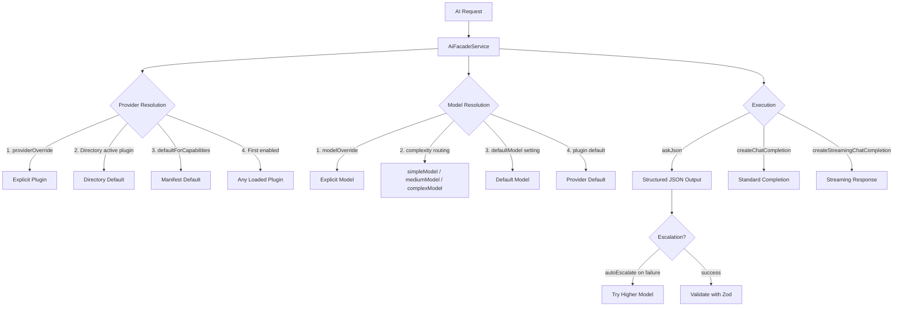

# AI Model Routing & Provider Resolution

## Overview

The AI facade in Ever Works provides intelligent routing of AI requests to the appropriate provider and model. The system resolves which plugin handles a request based on a priority chain (explicit override, directory default, user default, first enabled), then selects the appropriate model based on task complexity. It also supports automatic model escalation on failure, streaming responses, OpenRouter model metadata lookup, and cost calculation.

## Architecture



## Source Files

| File | Purpose |
|------|---------|
| `packages/agent/src/facades/ai.facade.ts` | Main AI facade with routing, escalation, cost calculation |
| `packages/agent/src/facades/base.facade.ts` | Abstract base with provider resolution and settings hierarchy |
| `packages/agent/src/facades/openrouter-model-lookup.ts` | OpenRouter API model list fetching and fuzzy matching |
| `packages/agent/src/facades/facades.module.ts` | Module registering all facades |

## Key Classes

### AiFacadeService

The primary interface for all AI operations. Extends `BaseFacadeService` to inherit provider resolution:

```typescript
@Injectable()
export class AiFacadeService extends BaseFacadeService implements IAiFacade {
    protected readonly CAPABILITY = PLUGIN_CAPABILITIES.AI_PROVIDER;

    async askJson<T>(
        promptTemplate: string,
        schema: z.ZodSchema<T>,
        options: AskJsonOptions | undefined,
        facadeOptions: FacadeOptions,
    ): Promise<AskJsonResponse<T>> {
        // 1. Resolve plugin
        const plugin = await this.resolvePlugin<IAiProviderPlugin>(
            options?.routing?.providerOverride ?? facadeOptions.providerOverride,
            facadeOptions.userId,
            facadeOptions.directoryId,
        );

        // 2. Resolve settings (4-level hierarchy)
        const settings = await this.getResolvedSettings(plugin.id, {
            userId: facadeOptions.userId,
            directoryId: facadeOptions.directoryId,
        });

        // 3. Resolve model
        const model = this.resolveModel(plugin, settings, options?.routing);

        // 4. Execute with escalation
        const response = await this.withEscalation(call, settings, model, options?.routing);

        // 5. Validate with Zod schema
        const validated = schema.safeParse(response.result);

        // 6. Calculate cost
        const cost = await this.calculateCost(plugin, response.model, response.usage, settings);

        return { result: validated.data, usage, cost, provider: plugin.id, model: response.model };
    }
}
```

### Provider Resolution (BaseFacadeService)

The base class implements the resolution priority chain:

```typescript
protected async resolvePlugin<T extends IPlugin>(
    providerOverride?: string,
    userId?: string,
    directoryId?: string,
): Promise<T> {
    // Priority 1: Explicit override
    if (providerOverride) {
        const registered = this.registry.get(providerOverride);
        if (registered?.state === 'loaded') return registered.plugin as T;
        throw new ProviderNotFoundError(providerOverride, this.CAPABILITY);
    }

    // Priority 2: Directory active plugin
    if (directoryId) {
        const activePlugin = await this.findActivePluginForDirectory(directoryId);
        if (activePlugin) return activePlugin.plugin as T;
    }

    // Priority 3+4: defaultForCapabilities, then first enabled
    const enabledPlugins = await this.getEnabledPlugins(directoryId, userId);
    if (enabledPlugins.length > 0) return enabledPlugins[0].plugin as T;

    throw new NoProviderError(this.CAPABILITY);
}
```

### Model Resolution

```typescript
private resolveModel(
    plugin: IAiProviderPlugin,
    settings: Record<string, unknown>,
    routing?: AiRoutingOptions,
): string | undefined {
    // 1. Explicit model override
    if (routing?.modelOverride) return routing.modelOverride;

    // 2. Complexity-based routing (simpleModel, mediumModel, complexModel)
    if (routing?.complexity) {
        const complexityModel = settings[`${routing.complexity}Model`];
        if (complexityModel) return complexityModel as string;
    }

    // 3. Default model from settings
    const defaultModel = settings.defaultModel as string;
    if (defaultModel) return defaultModel;

    // 4. Plugin decides
    return undefined;
}
```

### Automatic Model Escalation

When a request fails and `autoEscalate` is enabled, the system retries with a higher-complexity model:

```typescript
private async withEscalation(
    call: (model?: string) => Promise<AskJsonCompletionResponse>,
    settings: Record<string, unknown>,
    currentModel: string | undefined,
    routing?: AiRoutingOptions,
): Promise<AskJsonCompletionResponse> {
    try {
        return await call();
    } catch (error) {
        if (routing?.autoEscalate !== false && routing?.complexity) {
            const escalated = this.escalateModel(settings, routing.complexity);
            if (escalated && escalated !== currentModel) {
                this.logger.warn(`Escalating from ${currentModel} to ${escalated}`);
                return call(escalated);
            }
        }
        throw error;
    }
}

private escalateModel(settings, currentComplexity): string | undefined {
    const tiers: TaskComplexity[] = ['simple', 'medium', 'complex'];
    const currentIndex = tiers.indexOf(currentComplexity);
    for (let i = currentIndex + 1; i < tiers.length; i++) {
        const model = settings[`${tiers[i]}Model`];
        if (model) return model;
    }
    return undefined;
}
```

### OpenRouter Model Lookup

The system fetches model metadata from OpenRouter for context length resolution:

```typescript
export async function fetchOpenRouterModels(): Promise<OpenRouterModelEntry[] | null> {
    const response = await fetch('https://openrouter.ai/api/v1/models', {
        signal: AbortSignal.timeout(10_000),
        headers: { Accept: 'application/json' },
    });
    if (!response.ok) return null;
    const body = await response.json();
    return body.data;
}

// Fuzzy matching: exact ID first, then base-name match
export function fuzzyMatchModel(
    modelId: string,
    candidates: readonly OpenRouterModelEntry[],
): OpenRouterModelEntry | null {
    // Priority 1: exact match (case-insensitive)
    // Priority 2: base-name match (after last /)
    // Also tries -instruct and -thinking variants
}
```

### Cost Calculation

```typescript
private async calculateCost(
    plugin: IAiProviderPlugin,
    modelId: string,
    usage?: { promptTokens: number; completionTokens: number },
    settings?: Record<string, unknown>,
): Promise<number | null> {
    const modelInfo = await plugin.getModel(modelId, settings);
    if (!modelInfo?.inputCostPer1k || !modelInfo?.outputCostPer1k) return null;

    const inputCost = (usage.promptTokens * modelInfo.inputCostPer1k) / 1000;
    const outputCost = (usage.completionTokens * modelInfo.outputCostPer1k) / 1000;
    return inputCost + outputCost;
}
```

## Configuration

### Settings Hierarchy (4 Levels)

Settings are resolved by `PluginSettingsService` with this precedence:

| Level | Source | Scope |
|-------|--------|-------|
| 1 | Directory plugin settings | Per-directory overrides |
| 2 | User plugin settings | Per-user defaults |
| 3 | Admin settings | Server-wide defaults |
| 4 | Plugin manifest defaults | Built into the plugin |

### Routing Options

The `AiRoutingOptions` interface controls how requests are routed:

```typescript
interface AiRoutingOptions {
    providerOverride?: string;  // Force specific plugin
    modelOverride?: string;     // Force specific model
    complexity?: TaskComplexity; // 'simple' | 'medium' | 'complex'
    autoEscalate?: boolean;     // Retry with higher model on failure
}
```

## Code Examples

### Structured JSON Output

```typescript
const result = await this.aiFacade.askJson(
    'Analyze this item: {itemName}',
    z.object({
        category: z.string(),
        tags: z.array(z.string()),
        score: z.number().min(0).max(100),
    }),
    {
        variables: { itemName: 'React' },
        routing: { complexity: 'simple' },
        temperature: 0.3,
    },
    { userId: user.id, directoryId: directory.id },
);
```

### Streaming Chat Completion

```typescript
const stream = this.aiFacade.createStreamingChatCompletion(
    {
        messages: [{ role: 'user', content: 'Hello' }],
        model: 'gpt-4o',
    },
    { userId: user.id },
);

for await (const chunk of stream) {
    process.stdout.write(chunk.choices[0]?.delta?.content || '');
}
```

### Context Length Resolution

```typescript
const contextLength = await this.aiFacade.resolveModelContextLength(
    'gpt-4o',
    { userId: user.id },
);
// Returns 128000 (from OpenRouter metadata, cached for 1 hour)
```

## Best Practices

1. **Always pass `FacadeOptions`** -- include `userId` and `directoryId` so the settings hierarchy resolves correctly.

2. **Use complexity routing** -- set `routing.complexity` to `'simple'`, `'medium'`, or `'complex'` to let the settings determine the model.

3. **Enable auto-escalation** -- leave `autoEscalate` as default (`true`) so failures on simple models automatically retry on more capable ones.

4. **Use `askJson` for structured output** -- it handles JSON schema conversion, response parsing, repair, and Zod validation automatically.

5. **Template variables** -- use `{variableName}` placeholders in prompts with the `variables` option rather than string concatenation.

6. **Handle `NoProviderError`** -- catch this error to provide a user-friendly message when no AI provider is configured.

7. **Monitor costs** -- the `cost` field in responses allows tracking per-request spending.
