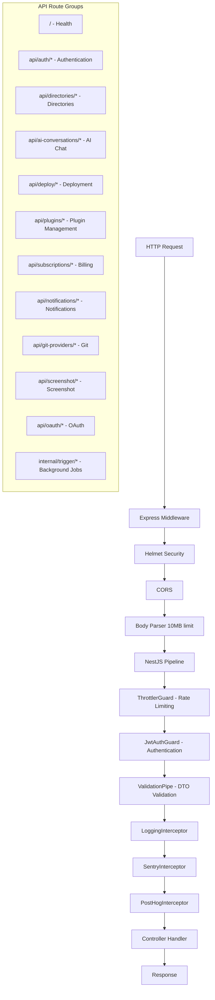

# API Structure, Versioning & Backwards Compatibility

## Overview

The Ever Works API is a NestJS 11 REST API that uses a flat route prefix (`api/`) with domain-based controller grouping. All routes are documented via OpenAPI/Swagger with Scalar API Reference. The API enforces authentication globally via `JwtAuthGuard`, applies rate limiting through tiered throttling, uses a global `ValidationPipe` for DTO validation, and registers interceptors for logging, Sentry error tracking, and PostHog analytics. This page documents the API's structural conventions, route organization, middleware stack, and approach to compatibility.

## Architecture



## Source Files

| File                                                   | Purpose                                                              |
| ------------------------------------------------------ | -------------------------------------------------------------------- |
| `apps/api/src/main.ts`                                 | Application bootstrap: Helmet, CORS, ValidationPipe, Swagger, Scalar |
| `apps/api/src/api.module.ts`                           | Root module: guards, interceptors, module imports, plugin bootstrap  |
| `apps/api/src/api.controller.ts`                       | Health check endpoints (`/`, `/api/health`)                          |
| `apps/api/src/config/throttler.config.ts`              | Tiered rate limiting configuration                                   |
| `apps/api/src/logging.interceptor.ts`                  | Debug-mode HTTP request/response logging                             |
| `apps/api/src/directories/directories.controller.ts`   | Primary domain controller (directories, items, taxonomy)             |
| `apps/api/src/auth/controllers/auth.controller.ts`     | Authentication (login, register, password reset)                     |
| `apps/api/src/auth/controllers/api-keys.controller.ts` | API key management                                                   |
| `apps/api/src/plugins/plugins.controller.ts`           | Plugin enable/disable and settings management                        |

## Key Classes

### Application Bootstrap (main.ts)

The API application configures the full middleware and documentation stack at startup:

```typescript
async function bootstrap() {
	const app = await NestFactory.create(ApiModule);

	// Body parser limits
	app.use(json({ limit: '10mb' }));
	app.use(urlencoded({ limit: '10mb', extended: true }));

	// Security: Helmet with relaxed CSP for API docs
	app.use((req, res, next) => {
		if (req.path.startsWith('/api/docs')) {
			return helmet({
				contentSecurityPolicy: {
					/* relaxed */
				}
			})(req, res, next);
		}
		return helmet()(req, res, next);
	});

	// CORS
	app.enableCors({
		origin: process.env.ALLOWED_ORIGINS?.split(',') || ['http://localhost:3000'],
		credentials: true,
		methods: ['GET', 'POST', 'PUT', 'DELETE', 'PATCH', 'OPTIONS']
	});

	// Global validation
	app.useGlobalPipes(
		new ValidationPipe({
			whitelist: true,
			transform: true,
			forbidNonWhitelisted: true
		})
	);

	// OpenAPI documentation
	const config = new DocumentBuilder()
		.setTitle('Ever Works API')
		.setVersion('1.0')
		.addBearerAuth(/* JWT config */)
		.addTag('Health')
		.addTag('Auth')
		.addTag('Directories') /* ... */
		.build();

	const document = SwaggerModule.createDocument(app, config);
	SwaggerModule.setup('api/swagger', app, document);

	// Scalar API Reference at /api/docs
	app.use('/api/docs', apiReference({ url: '/api/openapi.json', theme: 'kepler' }));

	await app.listen(process.env.PORT ?? 3100);
}
```

### Global Guard & Interceptor Stack

Registered in `ApiModule` via `APP_GUARD` and `APP_INTERCEPTOR` tokens:

```typescript
@Module({
	providers: [
		{ provide: APP_GUARD, useClass: JwtAuthGuard }, // Authentication
		{ provide: APP_GUARD, useClass: ThrottlerGuard }, // Rate limiting
		{ provide: APP_INTERCEPTOR, useClass: LoggingInterceptor }, // Debug logging
		{ provide: APP_INTERCEPTOR, useClass: SentryInterceptor }, // Error tracking
		{ provide: APP_INTERCEPTOR, useClass: PostHogInterceptor } // Analytics
	]
})
export class ApiModule implements OnApplicationBootstrap {
	async onApplicationBootstrap(): Promise<void> {
		await this.pluginBootstrap.bootstrap(); // Load all plugins
	}
}
```

### Controller Route Organization

Controllers use a flat `api/` prefix pattern with domain-specific sub-paths:

| Controller                  | Route Prefix                           | Tag              | Auth     |
| --------------------------- | -------------------------------------- | ---------------- | -------- |
| `APIController`             | `/`, `/api/health`                     | Health           | Public   |
| `AuthController`            | `api/auth`                             | Auth             | Mixed    |
| `ApiKeysController`         | `api/auth/api-keys`                    | API Keys         | JWT      |
| `DirectoriesController`     | `api`                                  | Directories      | JWT      |
| `MembersController`         | `api/directories/:directoryId/members` | Members          | JWT      |
| `AiConversationController`  | `api/ai-conversations`                 | AI Conversations | JWT      |
| `PluginsController`         | `api`                                  | Plugins          | JWT      |
| `DeployController`          | `api/deploy`                           | Deploy           | JWT      |
| `GitProviderController`     | `api/git-providers`                    | Git Providers    | JWT      |
| `ScreenshotController`      | `api/screenshot`                       | Screenshot       | JWT      |
| `OAuthController`           | `api/oauth`                            | OAuth            | Mixed    |
| `SubscriptionsController`   | `api/subscriptions`                    | Subscriptions    | JWT      |
| `NotificationsController`   | `api/notifications`                    | Notifications    | JWT      |
| `TriggerInternalController` | `internal/trigger`                     | --               | Internal |

### Rate Limiting (Throttler)

Three-tier rate limiting is applied globally:

```typescript
export const throttlerConfig: ThrottlerModuleOptions = {
	throttlers: [
		{ name: 'short', ttl: 1000, limit: 50 }, // 50 req/sec
		{ name: 'medium', ttl: 10000, limit: 300 }, // 300 req/10sec
		{ name: 'long', ttl: 60000, limit: 1000 } // 1000 req/min
	]
};
```

### LoggingInterceptor

Logs HTTP method, URL, status code, and response time when debug mode is enabled:

```typescript
@Injectable()
export class LoggingInterceptor implements NestInterceptor {
	intercept(context: ExecutionContext, next: CallHandler): Observable<any> {
		if (!config.debug()) return next.handle();

		const now = Date.now();
		const { method, originalUrl } = context.switchToHttp().getRequest();

		return next.handle().pipe(
			catchError((err) => {
				this.logger.error(`Error Response: ${method} ${originalUrl} ${statusCode} - ${delay}ms`);
				return throwError(() => err);
			}),
			tap(() => {
				this.logger.log(`Outgoing Response: ${method} ${originalUrl} ${statusCode} - ${delay}ms`);
			})
		);
	}
}
```

## Configuration

### Environment Variables

| Variable          | Purpose                      | Default                 |
| ----------------- | ---------------------------- | ----------------------- |
| `PORT`            | API server port              | `3100`                  |
| `ALLOWED_ORIGINS` | Comma-separated CORS origins | `http://localhost:3000` |
| `JWT_SECRET`      | JWT signing secret           | --                      |
| `JWT_EXPIRATION`  | Token expiration             | `7d`                    |
| `SENTRY_DSN`      | Sentry error tracking DSN    | --                      |
| `POSTHOG_API_KEY` | PostHog analytics key        | --                      |
| `NODE_ENV`        | Environment identifier       | `development`           |

### API Documentation Endpoints

| Endpoint            | Purpose                                          |
| ------------------- | ------------------------------------------------ |
| `/api/docs`         | Scalar API Reference (interactive documentation) |
| `/api/swagger`      | Swagger UI                                       |
| `/api/openapi.json` | OpenAPI 3.0 JSON specification                   |

## Code Examples

### Typical Controller Pattern

```typescript
@ApiTags('Directories')
@ApiBearerAuth('JWT-auth')
@Controller('api')
@UseGuards(JwtAuthGuard)
export class DirectoriesController {
	@Get('directories')
	@ApiOperation({ summary: 'List directories' })
	@ApiResponse({ status: 200, description: 'List of directories' })
	async listDirectories(@CurrentUser() user: AuthenticatedUser) {
		return this.queryService.findByUser(user.userId);
	}

	@Post('directories')
	@ApiOperation({ summary: 'Create directory' })
	@HttpCode(HttpStatus.CREATED)
	async createDirectory(@Body() dto: CreateDirectoryDto, @CurrentUser() user: AuthenticatedUser) {
		return this.lifecycleService.create(dto, user.userId);
	}

	@Put('directories/:slug')
	@ApiOperation({ summary: 'Update directory' })
	@ApiParam({ name: 'slug', description: 'Directory URL slug' })
	async updateDirectory(
		@Param('slug') slug: string,
		@Body() dto: UpdateDirectoryDto,
		@CurrentUser() user: AuthenticatedUser
	) {
		return this.lifecycleService.update(slug, dto, user.userId);
	}
}
```

### Public Route

```typescript
@Public()
@Get('api/health')
@ApiOperation({ summary: 'Health check' })
healthCheck() {
    return { status: 'success', message: 'API is up and running' };
}
```

### Internal Route (No Public Swagger Tag)

```typescript
@Controller('internal/trigger')
export class TriggerInternalController {
	@Post('generation/:slug')
	async triggerGeneration(@Param('slug') slug: string) {
		// Called by Trigger.dev background jobs
	}
}
```

### Dual Authentication (JWT + API Key)

All `api/*` routes automatically support both authentication methods via the `JwtAuthGuard`. No controller-level changes are needed:

```bash
# JWT authentication
curl -H "Authorization: Bearer eyJhbGciOi..." https://api.example.com/api/directories

# API key authentication
curl -H "x-api-key: ew_live_abc123..." https://api.example.com/api/directories
```

## Best Practices

1. **Use the `api/` prefix** -- all public-facing routes use the `api/` prefix. Internal routes use `internal/`. This makes reverse proxy and routing configuration straightforward.

2. **Tag controllers for Swagger** -- every controller should have `@ApiTags()` and every endpoint should have `@ApiOperation()` with a summary. This generates comprehensive API documentation automatically.

3. **Default to authenticated** -- routes require authentication unless explicitly marked with `@Public()`. This prevents accidental exposure of sensitive endpoints.

4. **Use `@ApiBearerAuth('JWT-auth')`** -- pair this with auth-protected controllers so the Swagger UI shows the lock icon and allows token entry.

5. **Document responses** -- use `@ApiResponse()` decorators to document success and error status codes for each endpoint.

6. **Leverage DTOs from the agent package** -- import DTOs from `@ever-works/agent/dto` to keep validation logic centralized and reusable across controllers.

7. **Use `HttpCode` for non-200 responses** -- NestJS defaults to 200 for POST. Use `@HttpCode(HttpStatus.CREATED)` for creation endpoints.

8. **Keep controllers thin** -- delegate business logic to service classes. Controllers should only handle request/response mapping, validation is handled by the global `ValidationPipe`.

9. **Monitor with interceptors** -- the Sentry and PostHog interceptors automatically capture errors and analytics. Health check routes are filtered to avoid noise.

10. **Use tiered throttling** -- the three-tier rate limiter (short/medium/long) protects against both burst and sustained abuse without impacting normal usage.
