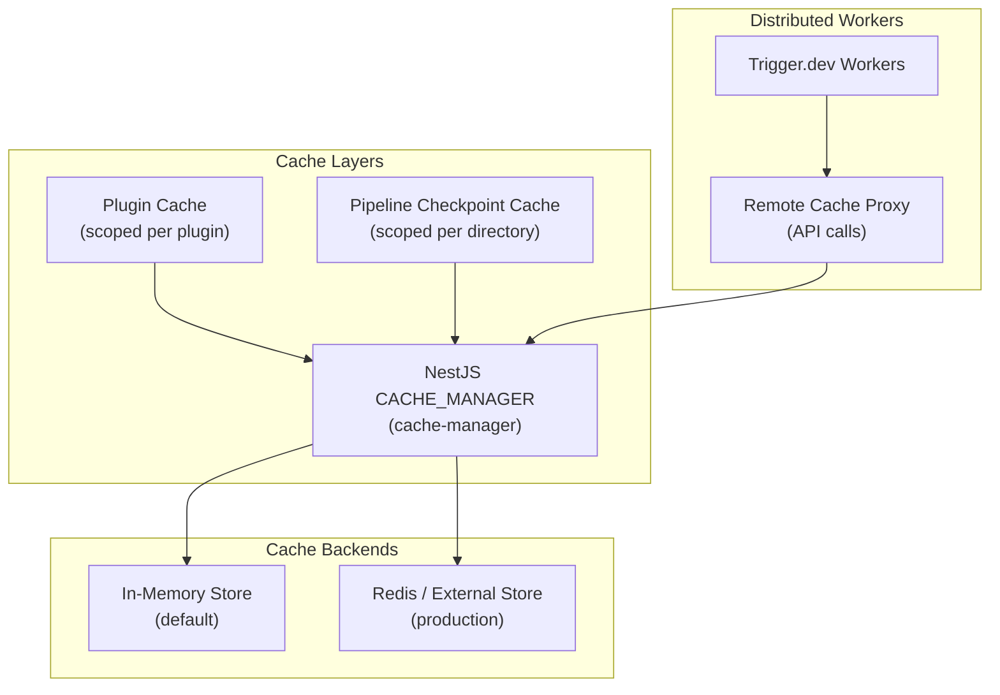
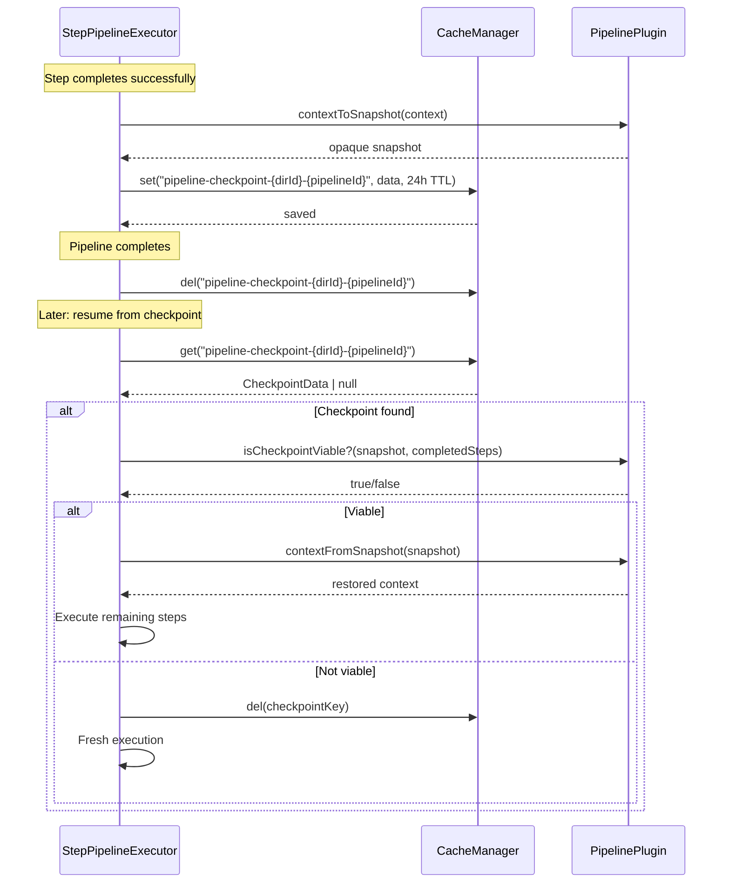

# Caching Strategy

Ever Works uses a multi-layer caching approach built on NestJS `CacheModule` with `cache-manager`. Caching is used for pipeline checkpoints, plugin-scoped data, settings resolution, and remote cache proxying in distributed worker environments.

**Key sources:**
- `packages/agent/src/pipeline/step-pipeline-executor.service.ts` -- Pipeline checkpoint caching
- `packages/agent/src/plugins/services/plugin-context-factory.service.ts` -- Plugin-scoped caching
- `packages/plugin/src/contracts/plugin-context.interface.ts` -- PluginCache interface
- `packages/tasks/src/trigger/worker/modules/trigger-remote-cache.module.ts` -- Remote cache proxy

## Architecture



## Plugin-Scoped Cache

Each plugin receives its own cache instance through `PluginContext`. The cache is namespace-isolated using a `plugin:<pluginId>:` key prefix.

### PluginCache Interface

```typescript
interface PluginCache {
    get<T>(key: string): Promise<T | undefined>;
    set<T>(key: string, value: T, ttl?: number): Promise<void>;
    delete(key: string): Promise<boolean>;
    has(key: string): Promise<boolean>;
    clear(): Promise<void>;
}
```

### Key Namespacing

The `PluginContextFactoryService` creates cache instances with automatic namespacing:

```typescript
private createCache(pluginId: string): PluginCache {
    const keyPrefix = `plugin:${pluginId}:`;

    return {
        get: async <T>(key: string): Promise<T | undefined> => {
            return this.cacheManager.get<T>(`${keyPrefix}${key}`);
        },
        set: async <T>(key: string, value: T, ttl?: number): Promise<void> => {
            await this.cacheManager.set(`${keyPrefix}${key}`, value, ttl);
        },
        delete: async (key: string): Promise<boolean> => {
            await this.cacheManager.del(`${keyPrefix}${key}`);
            return true;
        },
        has: async (key: string): Promise<boolean> => {
            const value = await this.cacheManager.get(`${keyPrefix}${key}`);
            return value !== undefined;
        },
        clear: async (): Promise<void> => {
            // Note: prefix-based clearing not supported by cache-manager
            // Would need custom implementation
        },
    };
}
```

### Cache Key Examples

| Plugin | Key Set By Plugin | Actual Cache Key |
|---|---|---|
| `openrouter` | `models-list` | `plugin:openrouter:models-list` |
| `scrapfly` | `screenshot:abc123` | `plugin:scrapfly:screenshot:abc123` |
| `github` | `repo-info:owner/repo` | `plugin:github:repo-info:owner/repo` |

## Pipeline Checkpoint Cache

The `StepPipelineExecutorService` uses the cache for pipeline checkpoint persistence. This enables resuming failed pipelines from the last successful step.

### Checkpoint Data Structure

```typescript
interface CheckpointData {
    stepIndex: number;        // Index of the last completed step
    stepName: string;         // Name of the last completed step
    pipelineId: string;       // Pipeline plugin ID
    timestamp: string;        // ISO timestamp
    context: unknown;         // Serialized pipeline context (opaque)
    completedSteps: string[]; // IDs of all completed steps
    schemaVersion: number;    // Version for migration (currently 4)
}
```

### Checkpoint Lifecycle



### Checkpoint Key Format

```
pipeline-checkpoint-{directoryId}-{pipelineId}
```

### Checkpoint Configuration

| Setting | Value | Description |
|---|---|---|
| TTL | 24 hours | Checkpoints expire after 24 hours |
| Schema Version | 4 | Version for forward compatibility |
| Serialization | superjson | Handles Date, Map, Set, BigInt |

### Schema Version Migration

When a checkpoint is loaded, the schema version is validated:

```typescript
const schemaVersion = data.schemaVersion ?? 0;
if (schemaVersion !== CURRENT_CHECKPOINT_VERSION) {
    // Incompatible checkpoint -- clear and restart
    await this.cacheManager.del(checkpointKey);
    return null;
}
```

If the checkpoint was saved with an older schema version, it is discarded and the pipeline restarts from scratch.

## Remote Cache Proxy (Trigger.dev Workers)

Trigger.dev workers run in isolated environments without direct access to the platform's cache. The `TriggerRemoteCacheModule` creates a proxy that forwards cache operations over HTTP to the main API.


```typescript
@Global()
@Module({})
export class TriggerRemoteCacheModule {
    static forRoot(): DynamicModule {
        return {
            module: TriggerRemoteCacheModule,
            global: true,
            providers: [
                {
                    provide: CACHE_MANAGER,
                    useFactory: (apiClient: TriggerInternalApiClient) =>
                        createRemoteProxy(apiClient, 'CacheManager'),
                    inject: [TriggerInternalApiClient],
                },
            ],
            exports: [CACHE_MANAGER],
        };
    }
}
```

This allows pipeline plugins running in Trigger.dev workers to use the same `CACHE_MANAGER` injection token, with operations transparently proxied to the API server.

## Cache Invalidation Patterns

### Automatic Invalidation

| Scenario | Invalidation |
|---|---|
| Pipeline completes | Checkpoint cleared via `clearCheckpoint()` |
| Schema version mismatch | Checkpoint cleared on load |
| Plugin unload | Plugin-scoped cache cleared |
| TTL expiry | Automatic by cache-manager |

### Manual Invalidation

```typescript
// Plugin clears its own cache
await context.cache.delete('expensive-computation-result');

// Pipeline checkpoint cleared after completion
await this.clearCheckpoint(directoryId, pipelineId);
```

## Best Practices

1. **Use TTL for all cache entries**: Always set a TTL to prevent stale data accumulation
2. **Namespace your keys**: Plugin cache is already namespaced, but add sub-namespaces for complex plugins (e.g., `models:`, `screenshots:`)
3. **Handle cache misses gracefully**: Always treat `undefined` returns as cache misses and fall back to fresh computation
4. **Use superjson for complex types**: When caching objects with Dates, Maps, or Sets, use `superjson.stringify()` / `superjson.parse()`
5. **Keep cached values small**: Large cache values consume memory and slow down serialization -- consider caching references (URLs, IDs) instead of full data
