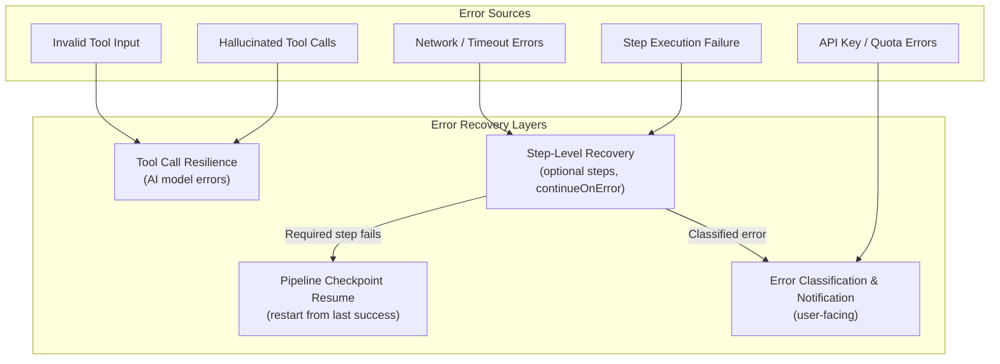
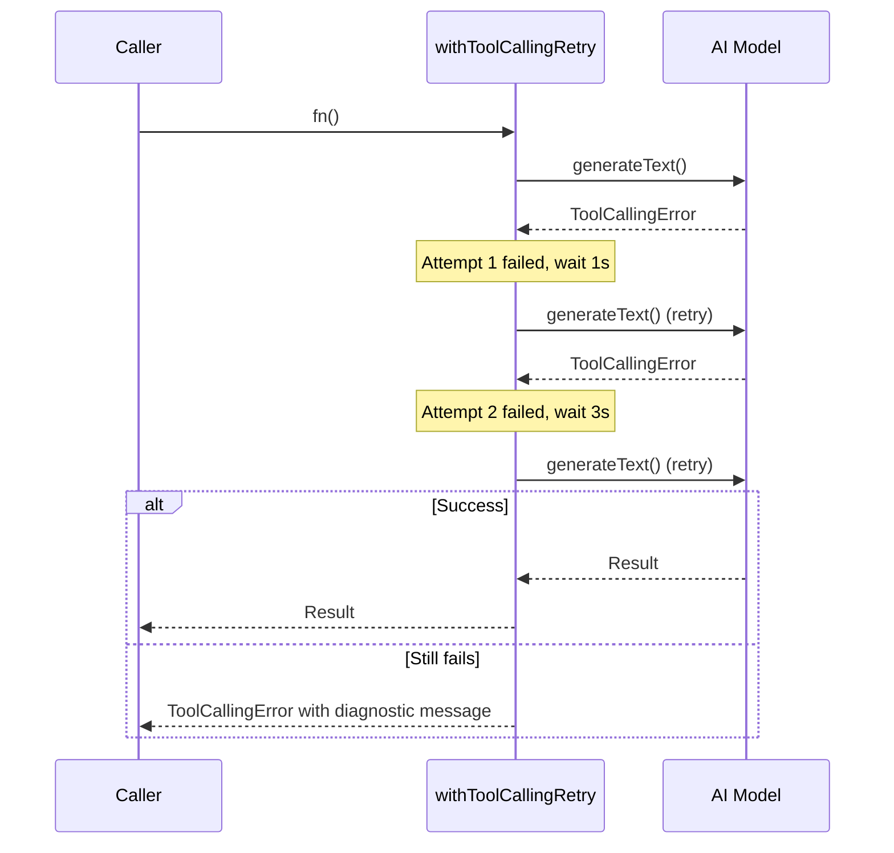
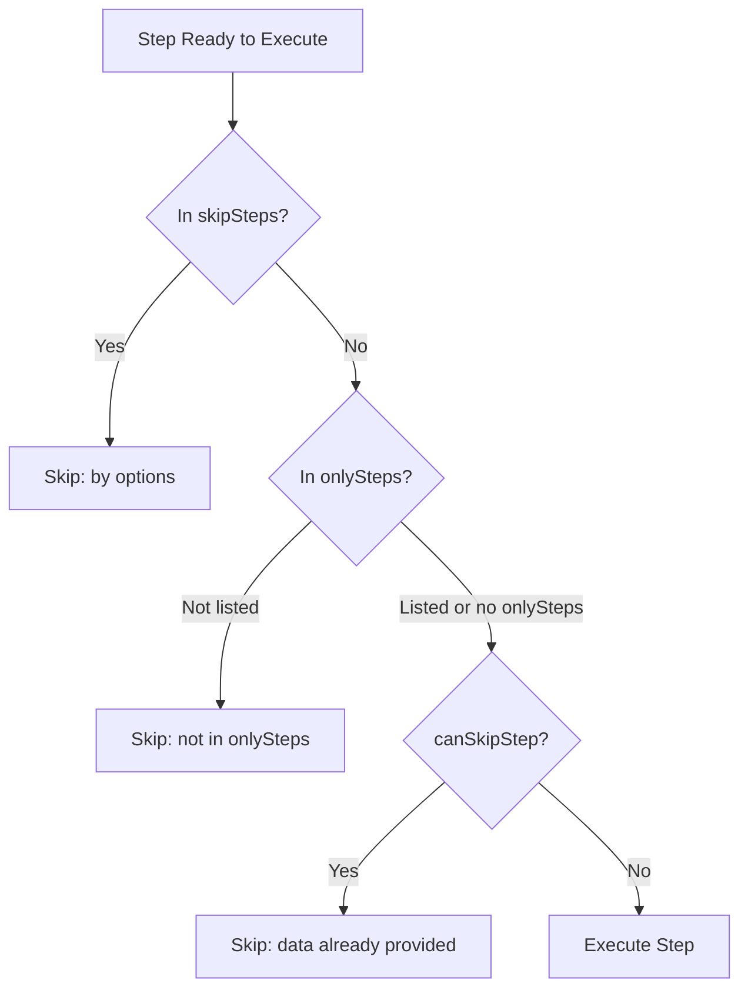
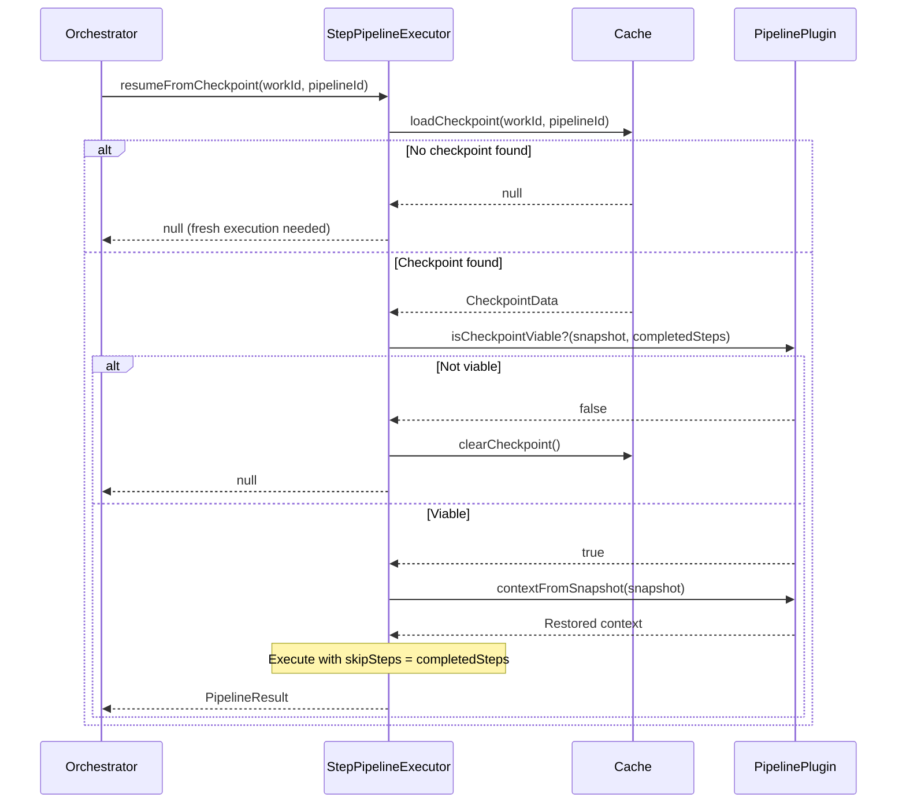
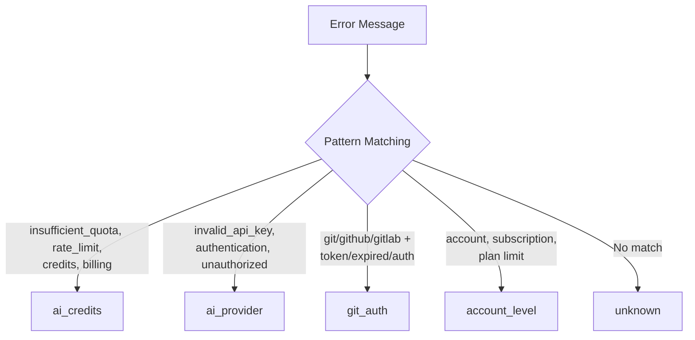
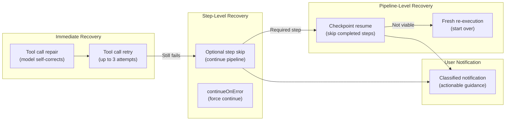

# Error Recovery & Resilience

Ever Works implements multiple layers of error recovery to handle failures gracefully during pipeline execution, AI tool calling, and work generation. The platform distinguishes between recoverable and non-recoverable errors, uses checkpoint-based resumption, and provides targeted user notifications based on error classification.

**Key sources:**

- `packages/plugins/agent-pipeline/src/utils/tool-call-resilience.ts` -- Tool call retry and repair
- `packages/agent/src/pipeline/step-pipeline-executor.service.ts` -- Pipeline step failure handling
- `packages/agent/src/pipeline/pipeline-orchestrator.service.ts` -- Checkpoint resume orchestration
- `packages/agent/src/services/utils/error-classification.utils.ts` -- Error classification and notification

## Architecture



## Tool Call Resilience

When AI models generate tool calls, they can hallucinate non-existent tool names or produce invalid input. The tool call resilience layer detects and recovers from these errors automatically.

### Error Detection

The `isToolCallingError()` function identifies tool-calling errors by checking for known error types and message patterns:

```typescript
const TOOL_ERROR_PATTERNS = [
	'parsing failed',
	'failed to parse',
	'tool call validation',
	'not in request.tools',
	'tool_use_failed',
	'invalid_tool_call',
	'failed to call a function',
	'failed_generation'
];

function isToolCallingError(error: unknown): boolean {
	if (NoSuchToolError.isInstance(error)) return true;
	if (InvalidToolInputError.isInstance(error)) return true;

	if (error instanceof Error) {
		const msg = error.message.toLowerCase();
		return TOOL_ERROR_PATTERNS.some((p) => msg.includes(p));
	}

	return false;
}
```

### Retry with Backoff

The `withToolCallingRetry()` wrapper retries tool-calling errors with exponential backoff. Non-tool-calling errors and aborted requests are never retried.



| Setting          | Value                          | Description              |
| ---------------- | ------------------------------ | ------------------------ |
| Max Retries      | 2                              | Up to 3 total attempts   |
| Backoff Schedule | `[1000, 3000]` ms              | 1 second, then 3 seconds |
| Non-retryable    | Abort signals, non-tool errors | Thrown immediately       |

### Tool Call Repair

The `createToolCallRepairFn()` function creates a callback for the Vercel AI SDK's `experimental_repairToolCall` option. When a model hallucinates a tool name or provides invalid input, the repair function re-asks the model to correct itself:

```typescript
const repairFn = createToolCallRepairFn(model, logger);

const result = await generateText({
	model,
	tools,
	experimental_repairToolCall: repairFn
	// ...
});
```

The repair flow:

1. The model calls a non-existent tool (e.g., `searchWeb` instead of `web_search`)
2. The repair function sends the failed call back to the model along with the error message and list of available tools
3. The model responds with a corrected tool call
4. If the repair produces valid JSON with `toolName` and `input`, the corrected call is used
5. If repair fails, the tool call is skipped (returns `null`)

## Step-Level Recovery

The `StepPipelineExecutorService` handles failures at the individual step level with three recovery mechanisms.

### Optional Steps

Steps marked as `optional: true` in their definition do not halt the pipeline when they fail:

```typescript
if (!options?.continueOnError && !step.optional) {
	throw err; // Re-throw: halts pipeline
}

// Optional step or continueOnError: log and continue
this.logger.warn(`Step "${step.id}" failed but continuing: ${err.message}`);
```

### Continue-on-Error Mode

The `continueOnError` execution option forces the pipeline to continue past any step failure, regardless of whether the step is marked optional:

```typescript
const result = await orchestrator.execute(work, request, existing, {
	continueOnError: true
});
```

### Step Skipping

Steps can be skipped in three ways:



| Skip Method     | Source            | Use Case                                      |
| --------------- | ----------------- | --------------------------------------------- |
| `skipSteps`     | Execution options | Resume from checkpoint (skip completed steps) |
| `onlySteps`     | Execution options | Run specific steps only                       |
| `canSkipStep()` | Pipeline plugin   | Skip when data is already available           |

### Step Failure Events

Every step failure emits a `pipeline:step-failed` event with a `recoverable` flag:

```typescript
// PipelineStepFailedPayload
{
	stepId: string;
	stepName: string;
	stepIndex: number;
	totalSteps: number;
	error: string;
	recoverable: boolean; // true if step is optional
	timestamp: string;
}
```

## Pipeline Checkpoint Resume

When a required step fails and halts the pipeline, the checkpoint system enables resuming from the last successful step rather than restarting from scratch.

### How Checkpoints Work

After each successful step, a checkpoint is saved to the cache:

```typescript
await this.cacheManager.set(
	`pipeline-checkpoint-${workId}-${pipelineId}`,
	superjson.stringify(checkpointData),
	CHECKPOINT_TTL_MS // 24 hours
);
```

### Resume Flow



The `resumeOrExecute()` method on the orchestrator combines both flows:

```typescript
async resumeOrExecute(work, request, existing, options): Promise<PipelineResult> {
    // Try checkpoint resume first
    const resumed = await this.stepExecutor.resumeFromCheckpoint(
        plugin, work.id, plugin.id, options
    );
    if (resumed) return resumed;

    // No checkpoint: fresh execution
    return this.execute(work, request, existing, options);
}
```

### Checkpoint Viability

The pipeline plugin decides whether a checkpoint is still usable:

| Check                   | Purpose                                                |
| ----------------------- | ------------------------------------------------------ |
| Schema version match    | Ensures checkpoint format is compatible                |
| `isCheckpointViable()`  | Plugin-specific validation (e.g., source data changed) |
| `contextFromSnapshot()` | Plugin must implement this to restore context          |
| TTL (24 hours)          | Stale checkpoints are automatically expired            |

## Error Classification

The `classifyGenerationError()` function categorizes errors to determine the appropriate user notification.

### Classification Logic



### Provider Auto-Detection

The error classifier automatically detects which AI or Git provider caused the error:

| Pattern               | Detected Provider |
| --------------------- | ----------------- |
| `openai`              | OpenAI            |
| `anthropic`, `claude` | Anthropic         |
| `google`, `gemini`    | Google            |
| `groq`                | Groq              |
| `ollama`              | Ollama            |
| `openrouter`          | OpenRouter        |
| `github`              | GitHub            |
| `gitlab`              | GitLab            |
| `bitbucket`           | Bitbucket         |

### Notification Routing

Each classification maps to a specific notification method:

```typescript
switch (classification.type) {
	case 'ai_credits':
		await notificationService.notifyAiCreditsDepleted(userId, provider, message);
		break;
	case 'ai_provider':
		await notificationService.notifyAiProviderError(userId, provider, message);
		break;
	case 'git_auth':
		await notificationService.notifyGitAuthExpired(userId, provider);
		break;
	case 'account_level':
		await notificationService.notifyGenerationAccountError(userId, workId, workName, message);
		break;
	// 'unknown': no notification sent
}
```

## Recovery Strategy Summary



## Best Practices

1. **Mark non-critical steps as optional**: Steps like screenshot capture or SEO analysis should be `optional: true` so they do not block the entire pipeline
2. **Implement `contextToSnapshot` and `contextFromSnapshot`**: Pipeline plugins should support checkpointing to enable resume after failures
3. **Implement `isCheckpointViable`**: Validate that checkpoint data is still relevant (e.g., source URLs have not changed)
4. **Use `withToolCallingRetry` for all tool-calling operations**: This handles the most common AI model failure mode automatically
5. **Handle `ToolCallingError` as a model compatibility issue**: When a model exhausts retries, suggest switching to a model with better tool-calling support (e.g., GPT-4o, Claude Sonnet)
