# Event Listeners & Event-Driven Patterns

## Overview

Ever Works uses the `@nestjs/event-emitter` package (built on `eventemitter2`) for in-process event-driven communication. The system defines two layers of events: domain events (work creation, user lifecycle, generation completion) handled by NestJS services via the `@OnEvent()` decorator, and pipeline runtime events emitted during step execution. Events decouple producers from consumers, allowing services like mail, cleanup, and analytics to react to domain changes without tight coupling.

## Architecture

```mermaid
flowchart TD
    A[Event Producer] -->|"eventEmitter.emit()"| B[EventEmitter2]
    B --> C{Event Routing}

    C --> D["@OnEvent('work.created')"]
    C --> E["@OnEvent('user.created')"]
    C --> F["@OnEvent('work.generation.completed')"]
    C --> G["@OnEvent('pipeline:step-completed')"]

    D --> H[WorkSetupService]
    E --> I[MailService]
    F --> J[WorkCleanupService]
    G --> K[Progress Tracking]

    subgraph "Agent Package Events"
        L[WorkCreatedEvent]
        M[WorkGenerationCompletedEvent]
        N[BaseEvent]
    end

    subgraph "API Package Events"
        O[UserCreatedEvent]
        P[UserForgotPasswordEvent]
        Q[MemberInvitedEvent]
        R[UserPasswordChangedEvent]
        S[UserConfirmedEvent]
        T[UserNewDeviceLoginEvent]
        U[UserAccountDeletionEvent]
    end

    subgraph "Plugin Event Types"
        V[PluginLifecycleEvent]
        W[WorkEvent]
        X[ItemEvent]
        Y[PipelineEvent]
        Z[SystemEvent]
    end
```



## Source Files

| File                                                                | Purpose                                                          |
| ------------------------------------------------------------------- | ---------------------------------------------------------------- |
| `packages/agent/src/events/base.ts`                                 | Abstract `BaseEvent` class with static `EVENT_NAME`              |
| `packages/agent/src/events/work-created.event.ts`              | `WorkCreatedEvent` domain event                             |
| `packages/agent/src/events/work-generation-completed.event.ts` | `WorkGenerationCompletedEvent` domain event                 |
| `apps/api/src/events/index.ts`                                      | API-layer user lifecycle events (created, forgot password, etc.) |
| `packages/plugin/src/events/event-types.ts`                         | Typed event names and payload interfaces for the plugin system   |
| `packages/agent/src/pipeline/step-pipeline-executor.service.ts`     | Pipeline runtime event emission                                  |
| `packages/agent/src/pipeline/executable-pipeline.class.ts`          | Pipeline runner state change events                              |
| `apps/api/src/mail/mail.service.ts`                                 | Event listener: sends emails on user events                      |
| `apps/api/src/works/tasks/work-cleanup.service.ts`       | Event listener: clears cache on generation completion            |

## Key Classes

### BaseEvent (Agent Package)

The abstract base for all agent-level domain events:

```typescript
export abstract class BaseEvent {
	static EVENT_NAME: string;
}
```

### Domain Event Classes

Each event extends `BaseEvent` and carries a typed payload:

```typescript
export class WorkCreatedEvent extends BaseEvent {
	static EVENT_NAME = 'work.created';

	constructor(public readonly work: Work) {
		super();
	}
}

export class WorkGenerationCompletedEvent extends BaseEvent {
	static EVENT_NAME = 'work.generation.completed';

	constructor(public readonly work: Work) {
		super();
	}
}
```

### API User Events

The API application defines its own event hierarchy for user lifecycle operations:

```typescript
export abstract class BaseUserEvent {
	public abstract user: User;
}

export class UserCreatedEvent extends BaseUserEvent {
	static EVENT_NAME = 'user.created';

	constructor(
		public user: User,
		public confirmationToken: string,
		public confirmationUrl: string
	) {
		super();
	}
}

export class MemberInvitedEvent {
	static EVENT_NAME = 'work.member_invited';

	constructor(
		public invitee: User,
		public inviter: User,
		public work: Work,
		public role: string,
		public workUrl: string
	) {}
}
```

Full list of API user events:

| Event Class                | EVENT_NAME                 | Payload                                               |
| -------------------------- | -------------------------- | ----------------------------------------------------- |
| `UserCreatedEvent`         | `user.created`             | user, confirmationToken, confirmationUrl              |
| `UserForgotPasswordEvent`  | `user.forgot_password`     | user, resetToken, resetUrl, expiresIn                 |
| `UserPasswordChangedEvent` | `user.password_changed`    | user, changedAt, ipAddress, location, device          |
| `UserConfirmedEvent`       | `user.confirmed`           | user, dashboardUrl                                    |
| `UserNewDeviceLoginEvent`  | `user.new_device_login`    | user, loginTime, device, browser, location, ipAddress |
| `UserAccountDeletionEvent` | `user.delete_account`      | user, deleteToken, deleteUrl, expiresIn               |
| `MemberInvitedEvent`       | `work.member_invited` | invitee, inviter, work, role, workUrl       |

### Plugin Event Type System

The `@ever-works/plugin` package defines a comprehensive typed event system for plugins:

```typescript
// Event name union types
type PluginLifecycleEvent =
	| 'plugin:loaded'
	| 'plugin:enabled'
	| 'plugin:disabled'
	| 'plugin:unloaded'
	| 'plugin:error'
	| 'plugin:settings-changed';

type WorkEvent =
	| 'work:created'
	| 'work:updated'
	| 'work:deleted'
	| 'work:deployed'
	| 'work:generation-started'
	| 'work:generation-completed'
	| 'work:generation-failed';

type ItemEvent = 'item:created' | 'item:updated' | 'item:deleted' | 'item:extracted' | 'item:validated';

type PipelineEvent =
	| 'pipeline:started'
	| 'pipeline:step-started'
	| 'pipeline:step-completed'
	| 'pipeline:step-failed'
	| 'pipeline:completed'
	| 'pipeline:failed'
	| 'pipeline:cancelled';

type SystemEvent = 'system:startup' | 'system:shutdown' | 'system:health-check';
```

Each event name maps to a typed payload interface via `PluginEventPayloads`:

```typescript
interface PluginEventPayloads {
	'plugin:loaded': PluginLoadedPayload;
	'plugin:error': PluginErrorPayload;
	'plugin:settings-changed': PluginSettingsChangedPayload;
	'work:generation-completed': WorkGenerationCompletedPayload;
	'pipeline:step-completed': PipelineStepCompletedPayload;
	'pipeline:failed': PipelineFailedPayload;
	// ... all events mapped to payloads
}
```

### Pipeline Runtime Events

The pipeline executor emits events during step execution:

```typescript
export const PipelineEvents = {
	STARTED: 'pipeline:started',
	STEP_STARTED: 'pipeline:step-started',
	STEP_COMPLETED: 'pipeline:step-completed',
	STEP_FAILED: 'pipeline:step-failed',
	STEP_SKIPPED: 'pipeline:step-skipped',
	COMPLETED: 'pipeline:completed',
	FAILED: 'pipeline:failed',
	CANCELLED: 'pipeline:cancelled'
} as const;
```

The `ExecutablePipelineRunner` also emits lower-level state change events:

```typescript
export const PipelineRuntimeEvents = {
	STATE_CHANGED: 'pipeline:state-changed',
	STEP_STATUS_CHANGED: 'pipeline:step-status-changed'
} as const;

export interface StateChangePayload {
	stepId: string;
	previousStatus: StepStatus;
	newStatus: StepStatus;
	timestamp: number;
}
```

## Configuration

### EventEmitter Module Registration

The `EventEmitterModule` is registered at the root of both the API application and the Pipeline module:

```typescript
// apps/api/src/api.module.ts
@Module({
	imports: [
		EventEmitterModule.forRoot()
		// ... other modules
	]
})
export class ApiModule {}

// packages/agent/src/pipeline/pipeline.module.ts
@Module({
	imports: [FacadesModule, EventEmitterModule.forRoot()]
	// ...
})
export class PipelineModule {}
```

### Listener Registration

Services become event listeners by using the `@OnEvent()` decorator on methods:

```typescript
import { OnEvent } from '@nestjs/event-emitter';

@Injectable()
export class MailService {
	@OnEvent(UserCreatedEvent.EVENT_NAME)
	async sendSignupConfirmation(data: UserCreatedEvent): Promise<void> {
		await this.mailerService.sendMail({
			/* ... */
		});
	}
}
```

## Code Examples

### Emitting a Domain Event

```typescript
import { EventEmitter2 } from '@nestjs/event-emitter';
import { WorkCreatedEvent } from '@ever-works/agent/events';

@Injectable()
export class WorkLifecycleService {
	constructor(private readonly eventEmitter: EventEmitter2) {}

	async createWork(dto: CreateWorkDto, userId: string): Promise<Work> {
		const work = await this.repository.save(/* ... */);

		// Emit the event -- all @OnEvent('work.created') listeners fire
		this.eventEmitter.emit(WorkCreatedEvent.EVENT_NAME, new WorkCreatedEvent(work));

		return work;
	}
}
```

### Listening for Generation Completion

```typescript
import { OnEvent } from '@nestjs/event-emitter';
import { WorkGenerationCompletedEvent } from '@ever-works/agent/events';

@Injectable()
export class WorkCleanupService {
	@OnEvent(WorkGenerationCompletedEvent.EVENT_NAME)
	clearWorkCache(data: WorkGenerationCompletedEvent) {
		this.cacheRepository.typeormAdapter
			.deleteUnscopedEntriesLike(data.work.id)
			.then(() => {
				this.logger.log(`Cache cleared for work ${data.work.id}`);
			})
			.catch((err) => {
				this.logger.error('Failed to clear cache:', err);
			});
	}
}
```

### Listening for Pipeline Events

```typescript
import { OnEvent } from '@nestjs/event-emitter';
import type { PipelineStepCompletedPayload, PipelineFailedPayload } from '@ever-works/plugin';

@Injectable()
export class PipelineMonitoringService {
	@OnEvent('pipeline:step-completed')
	onStepCompleted(payload: PipelineStepCompletedPayload) {
		this.logger.log(
			`Step "${payload.stepName}" completed in ${payload.duration}ms ` +
				`(${payload.stepIndex + 1}/${payload.totalSteps})`
		);
	}

	@OnEvent('pipeline:failed')
	onPipelineFailed(payload: PipelineFailedPayload) {
		this.logger.error(`Pipeline failed at step "${payload.failedStep}": ${payload.error}`);
		// Send notification, update status, etc.
	}
}
```

### Creating a Custom Event

```typescript
import { BaseEvent } from '@ever-works/agent/events';
import { Work } from '@ever-works/agent/entities';

export class WorkDeployedEvent extends BaseEvent {
    static EVENT_NAME = 'work.deployed';

    constructor(
        public readonly work: Work,
        public readonly deployUrl: string,
        public readonly provider: string,
    ) {
        super();
    }
}

// Emit it:
this.eventEmitter.emit(
    WorkDeployedEvent.EVENT_NAME,
    new WorkDeployedEvent(work, url, 'vercel'),
);

// Listen for it:
@OnEvent(WorkDeployedEvent.EVENT_NAME)
async onWorkDeployed(event: WorkDeployedEvent) {
    await this.notificationService.notify(
        event.work.creator.id,
        `Work deployed to ${event.deployUrl}`,
    );
}
```

### Plugin Event Handler Type Safety

```typescript
import type { EventHandler, PluginEventName } from '@ever-works/plugin';

// Type-safe event handler
const handler: EventHandler<'pipeline:step-completed'> = (payload) => {
	// payload is PipelineStepCompletedPayload
	console.log(payload.stepName, payload.duration);
};

// Plugin event emitter interface
interface PluginEventEmitter {
	on<T extends PluginEventName>(event: T, handler: EventHandler<T>): EventSubscription;
	once<T extends PluginEventName>(event: T, handler: EventHandler<T>): EventSubscription;
	emit<T extends PluginEventName>(event: T, payload: PluginEventPayloads[T]): void;
}
```

## Best Practices

1. **Use static `EVENT_NAME` constants** -- define the event name as a static property on the event class to avoid magic strings and enable IDE navigation.

2. **Extend `BaseEvent`** -- for agent-level domain events, extend the `BaseEvent` class to maintain consistency across the codebase.

3. **Keep listeners idempotent** -- event handlers may be retried or called multiple times. Design them to be safe to repeat.

4. **Handle errors in listeners** -- wrap listener logic in try/catch blocks. An unhandled error in a listener will not propagate back to the emitter by default, but it may crash the process.

5. **Use typed payloads** -- always type the event parameter in `@OnEvent()` handlers to match the event class or payload interface.

6. **Prefer async listeners** -- use `async` methods for `@OnEvent()` handlers to avoid blocking the event loop during I/O operations.

7. **Register `EventEmitterModule` once** -- the module should be registered with `forRoot()` at the application root. Additional calls in sub-modules are harmless but unnecessary.

8. **Use the plugin event type system** -- when building plugins, use the typed event names and payloads from `@ever-works/plugin` for type safety across the event boundary.
