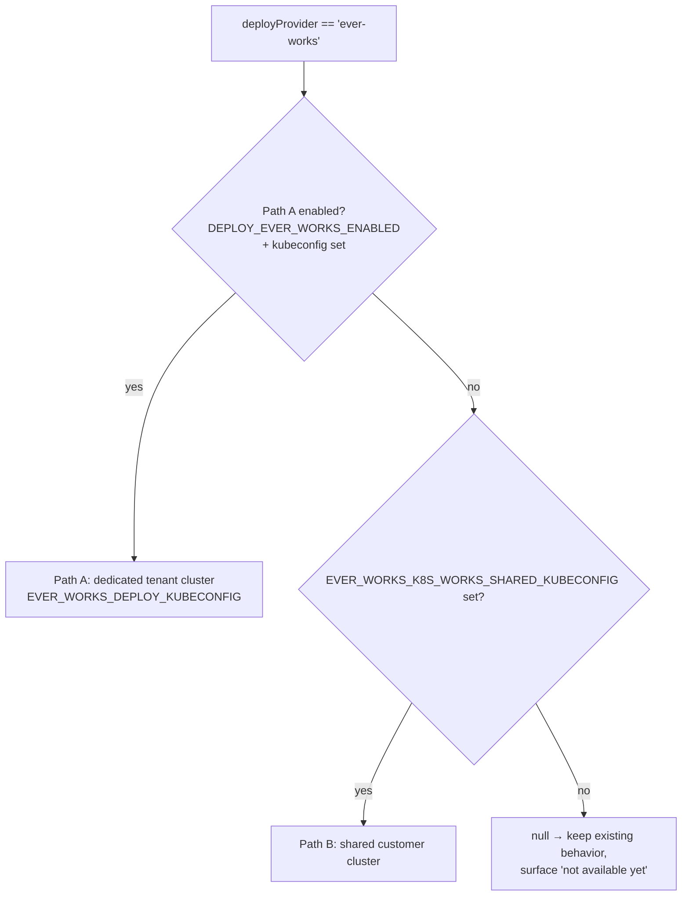
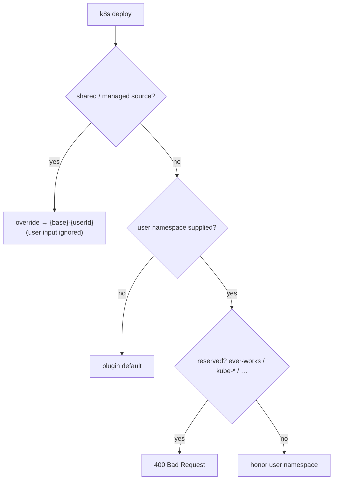

# Managed Deployment & Cluster Sources

Ever Works can publish a Work's website to several targets. Beyond the
provider-agnostic [Deployment API](/api/deployment) and the
bring-your-own-cluster [Kubernetes Deployment](/features/k8s-deployment)
provider, the platform offers a **managed "Ever Works" deploy** onto a
platform-owned cluster. This page documents the **cluster-source model**,
the two managed backends, and the **per-tenant namespace isolation** that
keeps customer deploys separated on a shared cluster.

:::note What this page does and doesn't cover
This documents the **model and behavior** — the decision matrix, the
env-var gates, and the isolation rules. It deliberately does **not**
contain internal IPs, kubeconfig contents, or cluster hostnames; those
are operator secrets, never documentation.
:::

**Key sources:**

- `apps/api/src/plugins-capabilities/deploy/cluster-source-matrix.ts` — the deploy-target matrix + reserved-namespace policy
- `apps/api/src/plugins-capabilities/deploy/deploy.service.ts` — `resolveDeployNamespace`, matrix enforcement
- `packages/agent/src/facades/deploy.facade.ts` — managed kubeconfig resolution (Path A / Path B)
- `packages/agent/src/ever-works-providers/ever-works-k8s-deploy.provider.ts` — the dedicated-cluster provider + namespace helper
- `packages/agent/src/config/index.ts` — `everWorks.deploy.*` env config
- `packages/plugins/k8s/` — the `k8s` deployment plugin the config is handed to

## Deploy targets at a glance

| Target                      | What it is                                            | Who can pick it                          |
| --------------------------- | ----------------------------------------------------- | ---------------------------------------- |
| **Vercel** (and other PaaS) | Provider-agnostic managed hosting via a deploy plugin | Anyone with the provider configured      |
| `k8s-works`                 | The Ever Works **internal** cluster                   | Platform admins, `ever-works` org only   |
| `k8s-works-shared`          | The Ever Works **shared customer** cluster (default)  | Everyone                                 |
| `custom-kubeconfig`         | The user's **own** cluster (paste a kubeconfig)       | Everyone _except_ Ever Works-shared orgs |

For Kubernetes deploys, the **cluster source** (`ClusterSource` union in
`cluster-source-matrix.ts`) selects which of the three k8s targets a Work
publishes to. The internal and shared sources are platform-managed; the
custom source is the BYO-cluster path documented in
[Kubernetes Deployment](/features/k8s-deployment).

## The cluster-source matrix

Three inputs decide where a Work may be published: whether the deploying
user is a platform admin (`User.isPlatformAdmin`), the **website repo
owner** (which GHCR namespace the image lives in), and the requested
**cluster source**. `cluster-source-matrix.ts` combines them:

| Website owner      | `k8s-works`       | `k8s-works-shared` | `custom-kubeconfig` |
| ------------------ | ----------------- | ------------------ | ------------------- |
| `ever-works`       | OK (admin only)   | OK                 | rejected (rule 2)   |
| `ever-works-cloud` | rejected (rule 1) | OK (default)       | rejected (rule 2)   |
| customer-owned     | rejected (rule 1) | OK (default)       | OK                  |

The rules (all fail closed):

1. **`k8s-works` is admin-only.** It requires **both**
   `isPlatformAdmin` **and** a website repo in the `ever-works` GitHub
   org. A real customer can never deploy onto the internal cluster, and a
   non-admin can't select it even via the API/CLI.
2. **`custom-kubeconfig` cannot be combined with an Ever Works-shared
   GHCR namespace** (`ever-works` or `ever-works-cloud`). The customer's
   cluster would receive an org-scoped image-pull PAT as an
   `imagePullSecret`; anyone with `kubectl` on that cluster could recover
   it and read every GHCR image in the shared org. To use your own
   cluster you must also bring your own GitHub org.
3. **`k8s-works-shared` is the default** and is allowed for every owner.
   If it isn't provisioned yet, credential resolution fails with a clear
   "not yet available" message rather than crashing.

`allowedClusterSourcesFor(isPlatformAdmin, websiteOwner?)` returns the
ordered list the UI dropdown offers (first entry = recommended default),
and `validateClusterSourceForOwner(...)` is the pure function the deploy
gate calls to reject an invalid `(owner, source)` pair with a typed
failure code (`K8S_WORKS_NOT_ALLOWED`,
`CUSTOM_KUBECONFIG_NOT_ALLOWED_FOR_SHARED_ORG`,
`CUSTOM_KUBECONFIG_MISSING_KUBECONFIG`).

:::info Legacy alias
An older naming used `k8s-gauzy` for the internal cluster; it is
normalized to `k8s-works` by `normalizeClusterSource`. A one-shot data
migration rewrote stored rows, so the alias only matters for in-flight
requests during a rolling deploy.
:::

## The managed "ever-works" provider: Path A vs. Path B

When a Work's `deployProvider` is the managed `ever-works` provider, the
deploy facade sources the cluster credential from **platform env vars**
instead of the user's Kubernetes plugin settings. The owner may provision
either (or both) of two backends; which one is live is decided purely by
which env var is set (`deploy.facade.ts` → `resolveEverWorksManagedKubeconfig`):

- **Path A — dedicated tenant cluster** (preferred when enabled):
  resolved by `EverWorksK8sDeployProvider` from
  `EVER_WORKS_DEPLOY_KUBECONFIG` (inline) or
  `EVER_WORKS_DEPLOY_KUBECONFIG_PATH` (from disk). This path is gated by
  the `DEPLOY_EVER_WORKS_ENABLED` feature flag **and** a configured
  kubeconfig source — `EverWorksK8sDeployProvider.isEnabled()` returns
  `true` only when both hold.
- **Path B — shared customer cluster** (fallback): read directly from
  `EVER_WORKS_K8S_WORKS_SHARED_KUBECONFIG`.

If neither is configured, `resolveEverWorksManagedKubeconfig()` returns
`null` and never throws, so a not-yet-provisioned managed cluster can't
crash deploy resolution — a downstream layer surfaces the clear "not
available yet" error instead.



The `everWorks.deploy` config block (`config/index.ts`) also supplies the
namespace base (`EVER_WORKS_DEPLOY_NAMESPACE`, default
`ever-works-tenants`), the ingress-host template
(`EVER_WORKS_DEPLOY_INGRESS_HOST_TEMPLATE`, default `{slug}.ever.works`),
ingress class, TLS issuer, registry, and a per-user Works cap
(`EVER_WORKS_DEPLOY_MAX_WORKS_PER_USER`, default 3). The platform
kubeconfig/PAT never leaves these services — they hand the `k8s` plugin a
config object, not the raw credential to the client.

## Per-tenant namespace isolation

On a **shared, platform-owned cluster**, a Work must never be able to
target the platform's own namespace, a Kubernetes system namespace, or
another tenant's space. The k8s `namespace` field is free-text, so the
API enforces namespace policy **server-side** in
`DeployService.resolveDeployNamespace` before the value ever reaches the
cluster.

Two behaviors, keyed on the cluster source:

1. **Shared / managed clusters** (`k8s-works-shared`, any source whose
   name contains `shared`, or the managed `ever-works` provider):
   the user's input is **ignored entirely** and replaced with a
   deterministic per-tenant namespace `{base}-{userId}`, produced by
   `buildEverWorksTenantNamespace` (DNS-label-sanitised, capped at the
   RFC-1123 63-char limit). This is the single source of truth shared
   between the API enforcement and the provider's `getNamespaceForUser`
   so the two can never drift.

2. **Non-shared clusters** (`custom-kubeconfig` = the user's own cluster,
   `k8s-works` = the admin internal cluster): the user's namespace is
   honored, **except** a platform-reserved namespace is rejected with a
   `400`. An empty namespace falls back to the plugin's own default.

The reserved-namespace blocklist (`RESERVED_DEPLOY_NAMESPACES` +
`isReservedDeployNamespace`) covers:

```
ever-works, default, argocd, cert-manager, ingress-nginx, monitoring,
kube-system, kube-public, kube-node-lease
```

…plus **any** `kube-*` namespace (so the whole Kubernetes system-namespace
family is covered even if a new one is introduced upstream).



Because the per-tenant namespace is derived from the Work owner's user ID,
it aligns with the account-level [Teams & Organizations](./teams-and-organizations.md)
tenant boundary: one tenant's deploys can never land in another tenant's
namespace on the shared cluster.

## Related pages

- [Kubernetes Deployment](/features/k8s-deployment) — the
  bring-your-own-cluster (`custom-kubeconfig`) provider, prerequisites,
  and registry/ingress options.
- [Deployment API](/api/deployment) and
  [Deploy Capability](/api/deploy-capability) — the REST surface.
- [Deployment Module](/agent-services/agent-deployment-module) — the
  `DeployFacadeService` / `GitFacadeService` internals.
- [Teams & Organizations](./teams-and-organizations.md) — the tenant
  boundary the per-tenant namespace derives from.
