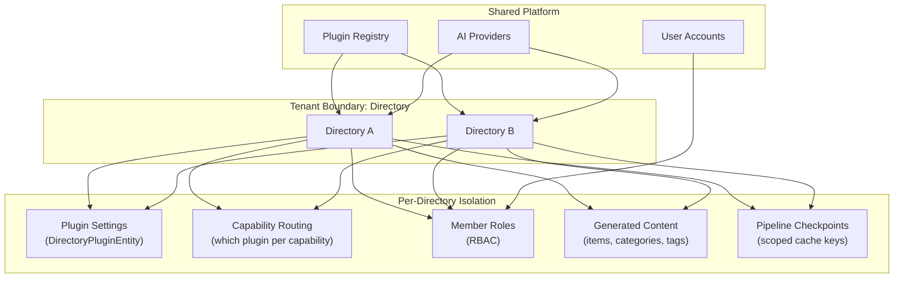
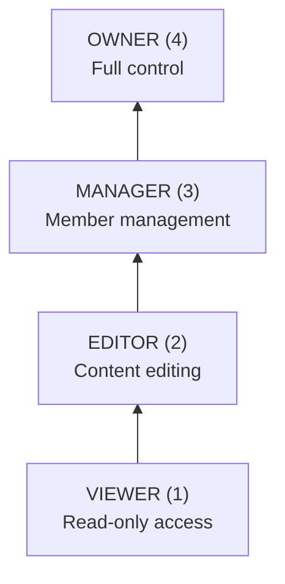
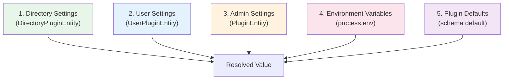
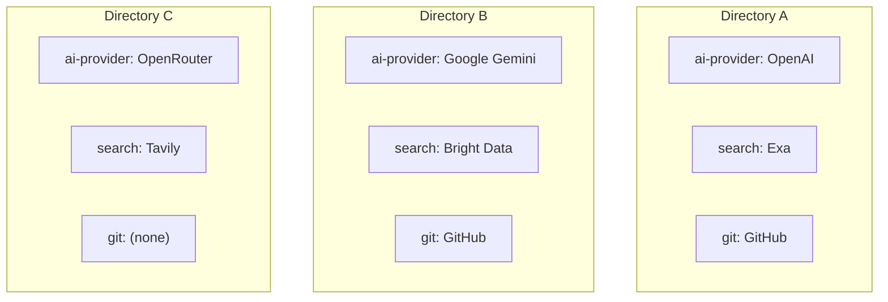
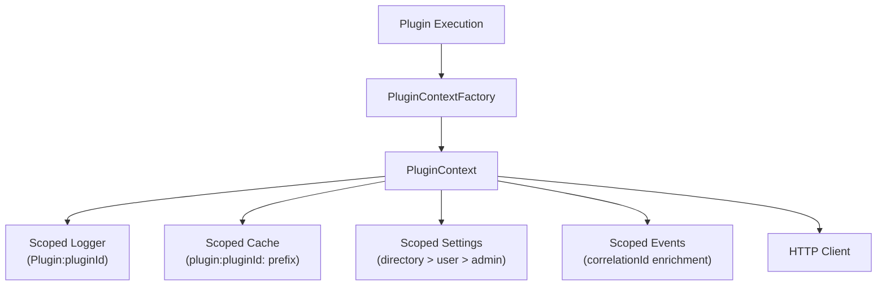
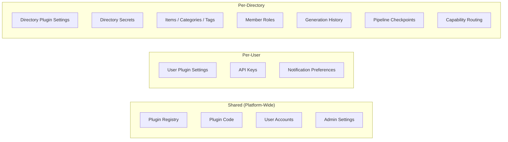

# Multi-Tenancy & Isolation

Ever Works isolates data and configuration at the directory level. Each directory acts as an independent workspace with its own plugin settings, capability routing, member permissions, and generated content. This page documents the isolation boundaries, role-based access control, and settings scoping that make multi-tenancy work.

**Key sources:**

- `packages/agent/src/services/directory-ownership.service.ts` -- Role-based access control
- `packages/agent/src/plugins/entities/directory-plugin.entity.ts` -- Per-directory plugin configuration
- `packages/agent/src/plugins/services/plugin-settings.service.ts` -- Multi-level settings resolution
- `packages/agent/src/plugins/services/plugin-context-factory.service.ts` -- Scoped plugin contexts

## Architecture



## Directory as Tenant

The directory is the primary isolation boundary in Ever Works. Each directory:

- Has its own set of items, categories, and tags
- Can override plugin settings at the directory level
- Routes capabilities independently (e.g., Directory A uses GitHub, Directory B uses GitLab)
- Has its own member list with role-based permissions
- Maintains separate pipeline checkpoints

| Aspect                      | Isolation Level | Mechanism                               |
| --------------------------- | --------------- | --------------------------------------- |
| Content (items, categories) | Full            | Foreign key to `directoryId`            |
| Plugin settings             | Layered         | `DirectoryPluginEntity` overrides       |
| Capability routing          | Independent     | `activeCapability` per directory-plugin |
| Access control              | Per-directory   | `DirectoryOwnershipService` + roles     |
| Cache / checkpoints         | Scoped          | Cache key includes `directoryId`        |
| Generation history          | Per-directory   | Scoped to directory                     |

## Role-Based Access Control

### Role Hierarchy

The `DirectoryOwnershipService` enforces a four-level role hierarchy:



| Role      | Level | Permissions                                  |
| --------- | ----- | -------------------------------------------- |
| `VIEWER`  | 1     | View directory content                       |
| `EDITOR`  | 2     | View + edit content, trigger generation      |
| `MANAGER` | 3     | View + edit + manage members                 |
| `OWNER`   | 4     | Full control including deletion and transfer |

### Access Check Methods

```typescript
// Check minimum role requirement
await ownershipService.ensureCanView(directoryId, userId); // VIEWER+
await ownershipService.ensureCanEdit(directoryId, userId); // EDITOR+
await ownershipService.ensureCanManageMembers(directoryId, userId); // MANAGER+
await ownershipService.ensureIsOwner(directoryId, userId); // OWNER only

// Non-throwing check
const hasAccess = await ownershipService.hasAccess(directoryId, userId);

// Get role without enforcing
const role = await ownershipService.getUserRole(directoryId, userId);
```

### Creator Privilege

The directory creator always has `OWNER` access, even without an explicit membership record:

```typescript
const isCreator = directory.userId === userId;

if (isCreator) {
	return {
		directory,
		member: null,
		role: DirectoryMemberRole.OWNER,
		isCreator: true
	};
}
```

### Access Result

Every access check returns a `DirectoryAccessResult` with full context:

```typescript
interface DirectoryAccessResult {
	directory: Directory; // The directory entity
	member: DirectoryMember | null; // Membership record (null for creator)
	role: DirectoryMemberRole; // Effective role
	isCreator: boolean; // Whether user is the original creator
}
```

## Settings Isolation

### Five-Level Resolution Hierarchy

Plugin settings resolve through five levels, with higher-priority levels overriding lower ones:



| Priority    | Source      | Storage                      | Scope         |
| ----------- | ----------- | ---------------------------- | ------------- |
| 1 (highest) | Directory   | `directory_plugins.settings` | Per directory |
| 2           | User        | `user_plugins.settings`      | Per user      |
| 3           | Admin       | `plugins.settings`           | Global        |
| 4           | Environment | `process.env[x-envVar]`      | Server-wide   |
| 5 (lowest)  | Default     | JSON Schema `default`        | Built-in      |

### How Resolution Works

```typescript
// Resolution order: directory > user > admin > env > default
async getResolvedSettings(pluginId: string, options?: SettingsResolutionOptions) {
    // 1. Check directory settings (if directoryId provided)
    if (options?.directoryId && sources.directory[key] !== undefined) {
        return { value, source: 'directory' };
    }

    // 2. Check user settings (if userId provided)
    if (options?.userId && sources.user[key] !== undefined) {
        return { value, source: 'user' };
    }

    // 3. Check admin settings
    if (sources.admin[key] !== undefined) {
        return { value, source: 'admin' };
    }

    // 4. Check environment variable
    if (envVar && process.env[envVar] !== undefined) {
        return { value: parseEnvValue(process.env[envVar]), source: 'env' };
    }

    // 5. Fall back to default
    return { value: defaultValue, source: 'default' };
}
```

Each resolved setting includes its source and whether it is a fallback:

```typescript
interface ResolvedSetting {
	key: string;
	value: unknown;
	source: 'directory' | 'user' | 'admin' | 'env' | 'default';
	isFallback: boolean; // true when source doesn't match setting's intended scope
}
```

### Configuration Modes

Plugins declare how their settings can be managed:

| Mode            | Directory Settings | User Settings  | Admin Settings | Use Case                            |
| --------------- | ------------------ | -------------- | -------------- | ----------------------------------- |
| `hybrid`        | Yes                | Yes            | Yes            | Most plugins (OpenRouter, Scrapfly) |
| `user-required` | Yes                | Yes (required) | No             | Per-user API keys (Mistral, Google) |
| `admin-only`    | No                 | No             | Yes            | System-level config                 |

When a plugin is `admin-only`, the settings service rejects user and directory level updates:

```typescript
if (configMode === 'admin-only') {
	throw new Error(`Plugin "${pluginId}" is admin-only and cannot be configured by users`);
}
```

### Scope Validation

Settings declare their intended scope via the `x-scope` schema extension. The service validates that updates happen at the correct level:

```typescript
// directory-scoped settings can only be set at directory level
if (settingScope === 'directory' && updateScope !== 'directory') {
	violations.push(`Setting "${key}" cannot be updated at "${updateScope}" level`);
}

// user-scoped settings cannot be set at global level
if (settingScope === 'user' && updateScope === 'global') {
	violations.push(`Setting "${key}" cannot be updated at "global" level`);
}
```

## Per-Directory Plugin Configuration

The `DirectoryPluginEntity` stores directory-specific plugin overrides:

```typescript
@Entity({ name: 'directory_plugins' })
@Unique(['directoryId', 'pluginId'])
class DirectoryPluginEntity {
	directoryId: string; // Which directory
	pluginId: string; // Which plugin
	enabled: boolean; // Plugin enabled for this directory
	activeCapability: string; // Active capability routing
	settings: Record<string, unknown>; // Directory-level settings
	secretSettings: Record<string, unknown>; // Directory-level secrets
	metadata: Record<string, unknown>; // Integration state
	priority: number; // Plugin priority in this directory
}
```

### Capability Routing

Each directory can independently choose which plugin serves each capability:



The `activeCapability` field on `DirectoryPluginEntity` determines which plugin is active for a given capability within a directory. Only one plugin can be active per capability per directory.

### Secret Isolation

Secrets (API keys, tokens) are stored separately from regular settings and are never included in API responses unless explicitly requested:

| Column           | Content                       | API Response         |
| ---------------- | ----------------------------- | -------------------- |
| `settings`       | Non-sensitive configuration   | Included             |
| `secretSettings` | API keys, tokens, credentials | Masked as `********` |

The settings service strips masked placeholders on write to prevent overwriting real secrets with mask values:

```typescript
if (propSchema?.['x-secret'] && value === MASKED_SECRET_PLACEHOLDER) {
	continue; // Don't save the placeholder
}
```

## Scoped Plugin Contexts

When a plugin executes, it receives a `PluginContext` scoped to the current directory and user:



The context factory injects the `userId` and `directoryId` into the settings resolution, ensuring each plugin operation uses the correct settings for the current scope:

```typescript
const settings = await this.settingsService.getSettings(pluginId, {
	directoryId: context.directoryId,
	userId: context.userId,
	includeSecrets: true
});
```

## Cache Key Scoping

All cache keys include the directory ID to prevent cross-directory data leakage:

| Cache Type          | Key Format                                       | Example                                        |
| ------------------- | ------------------------------------------------ | ---------------------------------------------- |
| Pipeline checkpoint | `pipeline-checkpoint-{directoryId}-{pipelineId}` | `pipeline-checkpoint-dir123-standard-pipeline` |
| Plugin cache        | `plugin:{pluginId}:{key}`                        | `plugin:openrouter:models-list`                |

Pipeline checkpoints are fully scoped to the directory, so resuming a failed generation in one directory never affects another.

## Data Isolation Summary



| Boundary  | What Is Isolated           | How                                         |
| --------- | -------------------------- | ------------------------------------------- |
| Platform  | Plugin code, registry      | Shared singleton services                   |
| User      | API keys, user settings    | `UserPluginEntity`, user-scoped resolution  |
| Directory | Content, settings, members | `DirectoryPluginEntity`, foreign keys, RBAC |
| Plugin    | Cache, logger, events      | Namespace-prefixed keys, scoped context     |

## Best Practices

1. **Always pass `directoryId` and `userId` to settings resolution**: Omitting these causes the service to skip higher-priority settings levels
2. **Use `ensureCanEdit` before mutations**: All content-changing operations should verify at least `EDITOR` role
3. **Never store secrets in `settings`**: Use `secretSettings` for API keys and tokens so they are masked in API responses
4. **Scope cache keys to directory**: When writing custom plugins that cache data, include the directory ID in cache keys to prevent cross-directory leakage
5. **Respect `configurationMode`**: Plugins that declare `admin-only` should not accept user-level or directory-level settings overrides
