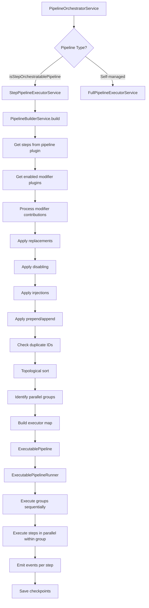

# Pipeline Customization & Step Management

## Overview

The Ever Works pipeline system is a plugin-driven execution engine for directory generation. Pipelines are compiled from step definitions contributed by a primary pipeline plugin and zero or more modifier plugins. The `PipelineBuilderService` compiles these contributions into an `ExecutablePipeline` by applying replacements, injections, disabling, topological sorting, and parallel group identification. The `PipelineOrchestratorService` then routes execution to either the step-based executor (engine-orchestrated) or the full executor (self-managed), depending on the pipeline plugin type.

## Architecture



## Source Files

| File                                                            | Purpose                                                                         |
| --------------------------------------------------------------- | ------------------------------------------------------------------------------- |
| `packages/agent/src/pipeline/pipeline-builder.service.ts`       | Compiles step definitions into an executable pipeline with sorting and grouping |
| `packages/agent/src/pipeline/pipeline-orchestrator.service.ts`  | Routes execution to step-based or full executor based on plugin type            |
| `packages/agent/src/pipeline/step-pipeline-executor.service.ts` | Engine-orchestrated execution with checkpointing, events, and concurrency       |
| `packages/agent/src/pipeline/full-pipeline-executor.service.ts` | Delegates execution entirely to a self-managed pipeline plugin                  |
| `packages/agent/src/pipeline/executable-pipeline.class.ts`      | Runtime state wrapper with step status tracking and event emission              |
| `packages/agent/src/pipeline/pipeline-facade.service.ts`        | Creates step execution contexts for facade access                               |
| `packages/agent/src/pipeline/pipeline.module.ts`                | NestJS module registering all pipeline services                                 |

## Key Classes

### PipelineBuilderService

Compiles an `ExecutablePipeline` from a pipeline plugin's step definitions and modifier plugin contributions. The build process follows this sequence:

```typescript
async build(
    pipeline: IPipelinePlugin,
    directoryId?: string,
    userId?: string,
): Promise<ExecutablePipeline> {
    // 1. Start with steps from the resolved pipeline plugin
    let steps = [...pipeline.getStepDefinitions()];

    // 2. Initialize build context (replacements, disables, injections, prepend, append)
    const buildContext: BuildContext = { /* ... */ };

    // 3. Get enabled modifier plugins (directory-scoped filtering)
    const modifiers = await this.getEnabledModifierPlugins(pipeline.id, directoryId, userId);

    // 4. Process each modifier's step contributions
    for (const { modifierPlugin } of modifiers) {
        this.processModifierSteps(modifierPlugin, pluginId, buildContext);
    }

    // 5. Apply modifications: replacements -> disabling -> injections -> prepend/append
    // 6. Check for duplicate step IDs
    // 7. Topological sort to respect dependencies
    // 8. Identify parallel groups
    // 9. Build executor map (builtin vs plugin steps)
    // 10. Return ExecutablePipeline
}
```

### Step Position Types

Modifier plugins declare where their steps should be placed using the `StepPosition` type:

```typescript
// Step positioning options
type StepPosition =
	| { type: 'replace'; stepId: string } // Replace an existing step
	| { type: 'before'; stepId: string } // Inject before a step
	| { type: 'after'; stepId: string } // Inject after a step
	| { type: 'disable'; stepId: string } // Remove a step
	| { type: 'first' } // Prepend to pipeline
	| { type: 'last' }; // Append to pipeline
```

### Topological Sort

Steps declare dependencies, and the builder topologically sorts them to ensure correct execution order:

```typescript
private topologicalSort(steps: PipelineStepDefinition[]): PipelineStepDefinition[] {
    // Build adjacency graph from step dependencies
    // Use Kahn's algorithm (in-degree counting + BFS)
    // Detect circular dependencies via DFS cycle detection
    // Throw CircularDependencyError or MissingDependencyError
}
```

Error classes for invalid pipelines:

```typescript
export class CircularDependencyError extends Error {
	constructor(public readonly cycle: string[]) {
		super(`Circular dependency detected: ${cycle.join(' -> ')}`);
	}
}

export class MissingDependencyError extends Error {
	constructor(
		public readonly stepId: string,
		public readonly missingDependency: string
	) {
		super(`Step "${stepId}" depends on missing step "${missingDependency}"`);
	}
}
```

### Parallel Group Identification

Steps marked as `parallelizable` with satisfied dependencies are grouped for concurrent execution:

```typescript
private identifyParallelGroups(steps: PipelineStepDefinition[]): ParallelGroup[] {
    // Sequential scan: group consecutive parallelizable steps
    // Each group has a maxConcurrent limit (default: 4)
    // Non-parallelizable steps become single-step groups
}
```

### PipelineOrchestratorService

Routes execution based on the pipeline plugin type:

```typescript
async execute(directory, request, existing, options?, onProgress?): Promise<PipelineResult> {
    const plugin = await this.resolvePipelinePlugin(pipelineId, directoryId, userId);

    // Routing: step-orchestratable -> StepPipelineExecutorService
    //          self-managed        -> FullPipelineExecutorService
    const mode = isStepOrchestratablePipeline(plugin) ? 'step' : 'full';

    if (mode === 'step') {
        return this.stepExecutor.execute(plugin, directory, request, existing, options, onProgress);
    }
    return this.fullExecutor.execute(plugin, directory, request, existing, options, onProgress);
}
```

Pipeline plugin resolution priority:

1. Explicit `pipelineId` from request
2. First enabled plugin with `defaultForCapabilities: ['pipeline']`
3. First loaded and enabled pipeline plugin

### ExecutablePipelineRunner

Wraps the compiled pipeline with runtime state management:

```typescript
export class ExecutablePipelineRunner {
	private state: PipelineState;
	private stepStates: Map<string, StepState>;

	constructor(pipeline: ExecutablePipeline, eventEmitter?: EventEmitter2) {
		/* ... */
	}

	startStep(stepId: string): void {
		/* sets status to 'running' */
	}
	markStepComplete(stepId: string, metrics?: StepMetrics): void {
		/* ... */
	}
	markStepFailed(stepId: string, error: Error): void {
		/* ... */
	}
	markStepSkipped(stepId: string, reason?: string): void {
		/* ... */
	}
}
```

Step status values: `'pending'`, `'running'`, `'completed'`, `'failed'`, `'skipped'`.

### Checkpoint Resume

The step executor saves checkpoints after each step completes, enabling resume on failure:

```typescript
interface CheckpointData {
	stepIndex: number;
	stepName: string;
	pipelineId: string;
	timestamp: string;
	context: unknown; // Serialized pipeline context
	completedSteps: string[];
	schemaVersion: number; // Currently version 4
}

// Resume flow:
// 1. Load checkpoint from cache
// 2. Validate schema version and viability
// 3. Reconstruct context via plugin.contextFromSnapshot()
// 4. Re-execute with completedSteps as skipSteps
```

## Configuration

### Execution Options

```typescript
interface PipelineExecutionOptions {
	signal?: AbortSignal; // Cancellation support
	timeout?: number; // Per-step timeout
	continueOnError?: boolean; // Continue after non-optional step failure
	skipSteps?: string[]; // Steps to skip
	onlySteps?: string[]; // Execute only these steps
	stepSettings?: Record<string, Record<string, unknown>>; // Per-step settings
}
```

### Pipeline Events

The step executor emits events at every stage via `EventEmitter2`:

| Event                     | Payload                        | When                                  |
| ------------------------- | ------------------------------ | ------------------------------------- |
| `pipeline:started`        | `PipelineEventPayload`         | Pipeline execution begins             |
| `pipeline:step-started`   | `PipelineStepEventPayload`     | A step begins executing               |
| `pipeline:step-completed` | `PipelineStepCompletedPayload` | A step finishes successfully          |
| `pipeline:step-failed`    | `PipelineStepFailedPayload`    | A step fails                          |
| `pipeline:step-skipped`   | `PipelineStepEventPayload`     | A step is skipped                     |
| `pipeline:completed`      | `PipelineCompletedPayload`     | Pipeline finishes successfully        |
| `pipeline:failed`         | `PipelineFailedPayload`        | Pipeline fails                        |
| `pipeline:cancelled`      | `PipelineEventPayload`         | Pipeline is cancelled via AbortSignal |

## Code Examples

### Creating a Pipeline Modifier Plugin

A modifier plugin injects, replaces, or disables steps in an existing pipeline:

```typescript
import type { IPipelineModifierPlugin, PipelineStepDefinition } from '@ever-works/plugin';

export default class MyModifierPlugin implements IPipelineModifierPlugin {
	id = 'my-modifier';
	name = 'My Pipeline Modifier';
	targetPipelines = ['standard-pipeline']; // or ['*'] for all

	getStepDefinitions(): PipelineStepDefinition[] {
		return [
			{
				id: 'custom-enrichment',
				name: 'Custom Data Enrichment',
				position: { type: 'after', stepId: 'generate-items' },
				parallelizable: false,
				estimatedDuration: 30,
				dependencies: [{ stepId: 'generate-items', required: true }]
			},
			{
				id: 'replace-taxonomy',
				name: 'Enhanced Taxonomy',
				position: { type: 'replace', stepId: 'generate-taxonomy' },
				parallelizable: true
			}
		];
	}

	async execute(context, options): Promise<void> {
		const stepId = options.settings?.stepId;
		if (stepId === 'custom-enrichment') {
			// Custom enrichment logic
		}
	}
}
```

### Executing a Pipeline with Options

```typescript
const result = await this.orchestrator.execute(
	directory,
	request,
	existingItems,
	{
		skipSteps: ['generate-screenshots'],
		continueOnError: true,
		stepSettings: {
			'generate-items': { maxItems: 50 }
		}
	},
	(progress) => {
		console.log(`${progress.percent}%: ${progress.currentStepName}`);
	}
);
```

### Resuming from Checkpoint

```typescript
const result = await this.orchestrator.resumeOrExecute(directory, request, existing, options, onProgress);
// Automatically resumes from last checkpoint if available,
// otherwise runs a fresh execution
```

## Best Practices

1. **Use modifier plugins for customization** -- never modify the core pipeline plugin directly. Use `IPipelineModifierPlugin` to inject, replace, or disable steps.

2. **Declare dependencies explicitly** -- set `dependencies` on step definitions so the topological sort produces correct execution order.

3. **Mark steps as parallelizable** -- set `parallelizable: true` on steps that do not depend on each other to enable concurrent execution within groups.

4. **Handle optional steps** -- set `optional: true` on steps that can fail without stopping the pipeline.

5. **Use `targetPipelines`** -- specify which pipelines your modifier targets. Use `['*']` only when the modifier applies universally.

6. **Implement checkpoint support** -- pipeline plugins should implement `contextToSnapshot()` and `contextFromSnapshot()` to enable resume after failures.

7. **Respect cancellation signals** -- check `options.signal.aborted` and propagate the `AbortSignal` to long-running operations.

8. **Use progress callbacks** -- pass `onProgress` to provide real-time status updates to the UI during generation.
