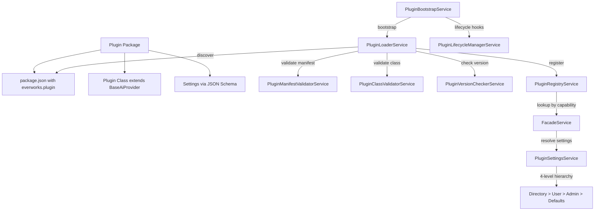

# Plugin Development Guide

## Overview

Ever Works has a modular plugin system that allows extending the platform with new AI providers, search engines, content extractors, screenshot services, Git integrations, deploy targets, and pipeline steps. Each plugin is a standalone ESM package that declares its metadata in `package.json`, extends a base class from `@ever-works/plugin`, and defines user-configurable settings via JSON Schema.

This guide walks through creating a new plugin from scratch, using the actual platform plugin infrastructure.

## Architecture



## Source Files

| File | Purpose |
|------|---------|
| `packages/agent/src/plugins/plugins.module.ts` | Global plugin module with `forRoot()` / `forRootAsync()` |
| `packages/agent/src/plugins/services/plugin-bootstrap.service.ts` | Entry point: discover, load, call `onLoad` |
| `packages/agent/src/plugins/services/plugin-loader.service.ts` | File system scanning, manifest extraction, module loading |
| `packages/agent/src/plugins/services/plugin-registry.service.ts` | In-memory registry with category/capability indexes |
| `packages/agent/src/plugins/services/plugin-manifest-validator.service.ts` | Validates `everworks.plugin` manifest in `package.json` |
| `packages/agent/src/plugins/services/plugin-class-validator.service.ts` | Validates plugin class implements required interface |
| `packages/agent/src/plugins/services/plugin-version-checker.service.ts` | Checks version compatibility with platform |
| `packages/agent/src/plugins/services/plugin-lifecycle-manager.service.ts` | Calls `onLoad`, `onUnload` lifecycle hooks |
| `packages/agent/src/plugins/services/plugin-settings.service.ts` | 4-level settings resolution |
| `packages/agent/src/plugins/services/plugin-context-factory.service.ts` | Creates execution context for plugins |
| `packages/agent/src/plugins/entities/plugin.entity.ts` | Database entity for installed plugins |
| `packages/agent/src/plugins/entities/user-plugin.entity.ts` | Per-user plugin settings entity |
| `packages/agent/src/plugins/entities/directory-plugin.entity.ts` | Per-directory plugin settings entity |
| `packages/plugins/*/` | 21 built-in plugin implementations |

## Step-by-Step: Creating a New AI Provider Plugin

### Step 1: Scaffold the Package

Create a new directory in `packages/plugins/`:

```
packages/plugins/my-provider/
  package.json
  src/
    my-provider.ts
    my-provider.spec.ts
  tsconfig.json
  tsup.config.ts
  vitest.config.ts
```

### Step 2: Define the Manifest in package.json

The `everworks.plugin` key in `package.json` is the plugin manifest. The `PluginManifestValidatorService` extracts and validates this during discovery:

```json
{
    "name": "@ever-works/plugin-my-provider",
    "version": "1.0.0",
    "type": "module",
    "main": "dist/index.js",
    "types": "dist/index.d.ts",
    "everworks": {
        "plugin": {
            "id": "my-provider",
            "name": "My AI Provider",
            "version": "1.0.0",
            "description": "Custom AI provider integration",
            "category": "ai-provider",
            "capabilities": ["ai-provider"],
            "builtIn": true,
            "autoEnable": false,
            "settingsSchema": {
                "type": "object",
                "properties": {
                    "apiKey": {
                        "type": "string",
                        "title": "API Key",
                        "x-secret": true,
                        "x-envVar": "MY_PROVIDER_API_KEY",
                        "x-widget": "password"
                    },
                    "defaultModel": {
                        "type": "string",
                        "title": "Default Model",
                        "default": "my-model-v1"
                    },
                    "simpleModel": {
                        "type": "string",
                        "title": "Simple Task Model"
                    },
                    "mediumModel": {
                        "type": "string",
                        "title": "Medium Task Model"
                    },
                    "complexModel": {
                        "type": "string",
                        "title": "Complex Task Model"
                    }
                },
                "required": ["apiKey"]
            }
        }
    },
    "dependencies": {
        "@ever-works/plugin": "workspace:*"
    },
    "devDependencies": {
        "tsup": "^8.0.0",
        "vitest": "^2.0.0"
    }
}
```

### Step 3: Implement the Plugin Class

Extend `BaseAiProvider` from `@ever-works/plugin/abstract`:

```typescript
import { BaseAiProvider } from '@ever-works/plugin/abstract';
import { AiOperations } from '@ever-works/plugin/ai';
import type {
    ChatCompletionOptions,
    ChatCompletionResponse,
    ChatCompletionChunk,
    AiModel,
    AskJsonCompletionResponse,
    PluginManifest,
} from '@ever-works/plugin';

export default class MyProviderPlugin extends BaseAiProvider {
    id = 'my-provider';
    name = 'My AI Provider';
    version = '1.0.0';
    category = 'ai-provider' as const;
    capabilities = ['ai-provider'];
    providerName = 'MyProvider';

    async isAvailable(settings?: Record<string, unknown>): Promise<boolean> {
        const apiKey = settings?.apiKey as string;
        return !!apiKey;
    }

    async createChatCompletion(
        options: ChatCompletionOptions,
    ): Promise<ChatCompletionResponse> {
        const ops = new AiOperations({
            provider: 'openai-compatible',
            apiKey: options.settings?.apiKey as string,
            baseUrl: 'https://api.myprovider.com/v1',
            model: options.model || 'my-model-v1',
        });

        return ops.chatCompletion(options);
    }

    async *createStreamingChatCompletion(
        options: ChatCompletionOptions,
    ): AsyncGenerator<ChatCompletionChunk> {
        const ops = new AiOperations({
            provider: 'openai-compatible',
            apiKey: options.settings?.apiKey as string,
            baseUrl: 'https://api.myprovider.com/v1',
            model: options.model || 'my-model-v1',
        });

        yield* ops.streamingChatCompletion(options);
    }

    async listModels(
        settings?: Record<string, unknown>,
    ): Promise<readonly AiModel[]> {
        return [
            {
                id: 'my-model-v1',
                name: 'My Model V1',
                contextLength: 128000,
                inputCostPer1k: 0.001,
                outputCostPer1k: 0.002,
            },
        ];
    }
}
```

### Step 4: Build Configuration

`tsup.config.ts`:

```typescript
import { defineConfig } from 'tsup';

export default defineConfig({
    entry: ['src/my-provider.ts'],
    format: ['esm'],
    dts: true,
    clean: true,
});
```

### Step 5: Write Tests

```typescript
import { describe, it, expect } from 'vitest';
import MyProviderPlugin from './my-provider';

describe('MyProviderPlugin', () => {
    const plugin = new MyProviderPlugin();

    it('should have correct metadata', () => {
        expect(plugin.id).toBe('my-provider');
        expect(plugin.capabilities).toContain('ai-provider');
    });

    it('should check availability', async () => {
        expect(await plugin.isAvailable({})).toBe(false);
        expect(await plugin.isAvailable({ apiKey: 'test' })).toBe(true);
    });
});
```

## Plugin Categories

| Category | Capability | Base Class | Examples |
|----------|-----------|------------|----------|
| `ai-provider` | `ai-provider` | `BaseAiProvider` | openai, anthropic, google, groq, ollama |
| `search` | `search` | -- | exa, tavily, serpapi, brave |
| `content-extraction` | `content-extraction` | -- | local-content-extractor, notion-extractor |
| `screenshot` | `screenshot` | -- | screenshotone, urlbox |
| `git` | `git` | -- | github |
| `infrastructure` | `deploy` | -- | vercel, apify |
| `pipeline` | `pipeline` | -- | standard-pipeline, agent-pipeline |
| `ai-tools` | varies | -- | claude-code, vercel-ai-gateway |

## Plugin Enable/Disable Resolution

The `resolvePluginEnabled()` function determines whether a plugin is active for a given scope:

```
1. System plugins -> always enabled
2. User-level DISABLE -> cascades globally (plugin off everywhere)
3. Directory explicit record -> use its enabled value
4. User autoEnableForDirectories -> true (in directory context)
5. User record exists -> enabled outside directory
6. Fallback to manifest autoEnable (default false)
```

## Settings JSON Schema Extensions

| Extension | Purpose | Example |
|-----------|---------|---------|
| `x-secret` | Marks field as sensitive (encrypted at rest) | `"x-secret": true` |
| `x-envVar` | Environment variable fallback | `"x-envVar": "OPENAI_API_KEY"` |
| `x-widget` | UI widget hint | `"x-widget": "password"` |

## Best Practices

1. **Use `AiOperations` from `@ever-works/plugin/ai`** -- this wraps LangChain and provides a consistent interface across all AI providers.

2. **Declare settings schema** -- every configurable value should be in the `settingsSchema` so the UI can generate settings forms.

3. **Mark API keys with `x-secret`** -- secrets are encrypted in the database and never exposed in API responses.

4. **Provide `x-envVar` fallbacks** -- allow server admins to set credentials via environment variables instead of the UI.

5. **Implement `isAvailable()`** -- the facade checks availability before routing requests; return `false` if required settings are missing.

6. **Support model routing** -- define `simpleModel`, `mediumModel`, and `complexModel` settings for complexity-based routing.

7. **Build with tsup, test with Vitest** -- follow the standard plugin toolchain for consistency.

8. **Export as default** -- the `PluginLoaderService` looks for `module.default` first when loading plugins.
