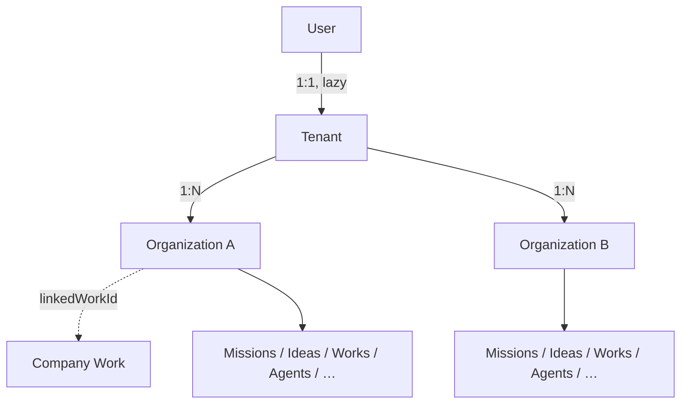
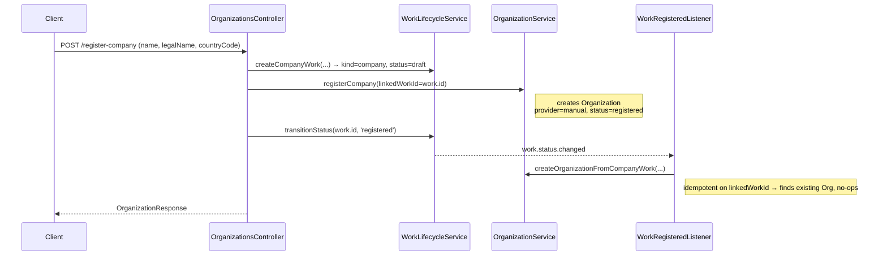

# Teams & Organizations

Ever Works groups a user's work under two scope primitives: an internal
**Tenant** and one or more user-facing **Organizations**. Together they
form the account-level boundary that every business row (Missions, Ideas,
Works, Agents, Skills, Tasks, …) is eventually scoped to. This page
documents that model — what an Organization is, how membership and
ownership are enforced, the register-company flow, slug rules, and how
Organizations relate to platform admins and per-work isolation.

:::note Two isolation layers
This page covers the **account/Tenant/Organization** scope. A separate,
finer-grained layer scopes content _inside_ a single Work via
role-based access control (`WorkMemberRole`) — see
[Multi-Tenancy & Isolation](./multi-tenancy.md). The two are
complementary: an Organization owns Works; a Work has its own members
and roles.
:::

**Key sources:**

- `packages/agent/src/entities/tenant.entity.ts` — the internal `Tenant`
- `packages/agent/src/entities/organization.entity.ts` — the user-facing `Organization`
- `apps/api/src/organizations/organization.service.ts` — CRUD, lazy Tenant bootstrap, backfill
- `apps/api/src/organizations/organization-membership.service.ts` — tenant-ownership authorization
- `apps/api/src/organizations/guards/organization-ownership.guard.ts` — declarative object-level guard
- `apps/api/src/organizations/organizations.controller.ts` — REST surface (`/api/organizations`)
- `apps/api/src/organizations/work-registered.listener.ts` — Company Work → Organization

## Tenant vs. Organization

There are two rows, with different purposes and visibility.

| Concept          | Row             | Visibility             | Cardinality          |
| ---------------- | --------------- | ---------------------- | -------------------- |
| **Tenant**       | `tenants`       | Internal — never in UI | 1 User : 1 Tenant    |
| **Organization** | `organizations` | User-facing            | 1 Tenant : 0..N Orgs |

The **Tenant** is the always-present default container. It is created
**lazily** — a fresh user has `users.tenantId = NULL` and no Tenant at
all until the first Organization is created. Its slug mirrors the user's
slug so the bare-Tenant URL view (`/{userSlug}/…`) resolves before any
Organization exists (`Tenant` entity docblock).

The **Organization** is what the product surfaces. Its UI label varies by
surface but the DB row is the same either way:

- **"Organization"** — in Settings and the Workspace Switcher.
- **"Company"** — on the `+ New` page chip and the register-company flow.

The wording split is intentional: "Company" reads naturally to founders,
while "Organization" is the internal name across the API and DB
(`Organization` entity docblock).

### Organization fields

The `Organization` entity carries (see `organization.entity.ts`):

| Field                  | Notes                                                                                |
| ---------------------- | ------------------------------------------------------------------------------------ |
| `id`                   | UUID primary key                                                                     |
| `tenantId`             | FK to `tenants.id` (cascade delete via migration constraint)                         |
| `slug`                 | URL-safe, **globally unique** across `organizations` (see [Slug rules](#slug-rules)) |
| `displayName`          | Human-friendly name shown in the Switcher / Settings (NOT NULL)                      |
| `legalName`            | Registered legal name, e.g. `"Acme, Inc."` — nullable                                |
| `countryCode`          | ISO 3166-1 alpha-2 (`"US"`, `"DE"`) — nullable                                       |
| `registrationProvider` | `manual` \| `stripe-atlas` \| other (open string) — nullable                         |
| `registrationStatus`   | `draft` \| `pending` \| `registered` (defaults `draft`)                              |
| `linkedWorkId`         | Optional pointer to the Company Work that produced this Org — nullable               |

## Membership & roles

Authorization for raw `/api/organizations/:orgId/…` routes is **tenant
ownership**: a caller is authorized for an Organization when the caller's
`User.tenantId` equals the Organization's `tenantId`. This is enforced by
`OrganizationMembershipService.ensureMember` /
`ensureAdmin`.

:::caution No per-organization role enum yet
Ever Works does **not** currently have a per-Organization
owner/admin/member role column. Membership is a single tenant-ownership
check. `ensureAdmin` exists as a distinct method and there is an
`@OrgAdmin()` decorator seam, but **today both resolve to the exact same
tenant-ownership check** — a true org-admin role is a deferred schema +
product decision (`organization-membership.service.ts` docblock). The
role enum that _does_ exist, `WorkMemberRole`
(`owner`/`manager`/`editor`/`viewer`), governs membership _inside a
Work_, not the Organization — see
[Multi-Tenancy & Isolation](./multi-tenancy.md#role-based-access-control).
:::

### The ownership guard

`OrganizationOwnershipGuard` makes the tenant-ownership check
**declarative and default-on**. Decorate a route with
`@UseGuards(OrganizationOwnershipGuard)` (plus `@OrgAdmin()` for writes)
and the `:orgId` (or `?orgId`) param is authorized before the handler
runs. It exists because the platform-wide scope guards do **not**
authorize an attacker-supplied `:orgId`: the un-prefixed
`/api/organizations/:orgId/…` shape yields an empty scope, so the generic
scope guard passes trivially. Before this guard, every such route had to
remember an inline check, and a new route that forgot it shipped
unprotected (`organization-ownership.guard.ts` docblock).

**Existence-leak contract (404, not 403).** On _any_ failure — no user,
no Tenant, missing Organization, or a cross-tenant Organization — the
guard and service throw `NotFoundException` with the same
`Organization <id> not found` message. Returning 404 rather than 403
means a probe cannot distinguish "doesn't exist" from "exists but isn't
mine", so Organization IDs in other Tenants stay opaque.

### Platform admin

Organization/Tenant scoping is orthogonal to the platform-admin flag.
`User.isPlatformAdmin` is a self-hosted cross-user admin capability
(enforced by `IsPlatformAdminGuard`), used for platform-wide operations
such as admin usage reporting and — relevant here — unlocking the
internal deploy cluster (see
[Managed Deployment & Cluster Sources](./managed-deployment.md)). It is
not an Organization role and does not bypass the tenant-ownership check
on Organization routes.

## REST API

All routes live under `/api/organizations` (JWT-authenticated except
where noted). Verified against `organizations.controller.ts`.

| Method  | Path                                          | Description                                                                              |
| ------- | --------------------------------------------- | ---------------------------------------------------------------------------------------- |
| `POST`  | `/api/organizations`                          | Create an Organization (lazy-creates the Tenant, allocates a slug, backfills `tenantId`) |
| `POST`  | `/api/organizations/register-company`         | Register a Company (lands a backing Work, then creates the Org — see below)              |
| `GET`   | `/api/organizations`                          | List Organizations for the current user's Tenant (newest first; `[]` if no Tenant)       |
| `GET`   | `/api/organizations/check-slug?value=`        | **Public**, throttled (30/min) slug-availability check                                   |
| `GET`   | `/api/organizations/:slug`                    | Fetch one Organization by slug (used by the slug-resolver middleware)                    |
| `PATCH` | `/api/organizations/:id`                      | Partial update of `displayName` / `legalName` / `countryCode`                            |
| `POST`  | `/api/organizations/:id/upgrade-from-account` | Pull the user's bare-Tenant rows into this Org (first-Org guard — see below)             |

### Create

`POST /api/organizations` (`CreateOrganizationDto`: `name` 1–200 chars,
optional `slug` 1–64) runs a single transaction that:

1. Lazy-creates the Tenant via `TenantBootstrapService.ensureTenant`.
2. Allocates the Organization slug with `UsernameAllocatorService`.
3. Inserts the `organizations` row.
4. Pins the new Org as the user's `lastScopeOrganizationId` (so the next
   login lands on it), when the user hasn't already picked a landing scope.
5. **Backfills `tenantId`** — walks every user-owned table and stamps
   `tenantId` on rows where it was still `NULL`. Idempotent.

## The register-company flow

The **Company** chip on the `+ New` page opens a Register-Company modal.
`POST /api/organizations/register-company` (`RegisterCompanyDto`: `name`
required, optional `legalName`, `countryCode` as ISO alpha-2, `slug`)
drives a Work through a real lifecycle transition rather than creating an
Org directly:

Key properties (verified in `organizations.controller.ts` and
`work-registered.listener.ts`):

- The backing Work is created with `kind = 'company'`, `status = 'draft'`.
- The Organization is created with `registrationProvider = 'manual'` and
  `registrationStatus = 'registered'` — the Stripe Atlas SDK integration
  is **deferred**, so v1 lands the Org as `manual`/`registered`
  regardless of what the client passes.
- `linkedWorkId` on the Organization points back at the Work.
- Both the direct create path and the `work.status.changed` listener are
  **idempotent on `linkedWorkId`**, so at most one Organization is ever
  created per Work even if the listener fires twice. The listener also
  swallows and logs errors (it runs detached from the originating
  request), so a failed Org create never fails the status transition.
- The name is trim-validated in the controller _before_ the backing Work
  is created, so a whitespace-only name can't leave an orphan draft Work.

## Slug rules

Slugs are allocated by the shared `UsernameAllocatorService`, which
enforces a **single global namespace** across three tables:

- The Organization slug is unique across `organizations` **and** must not
  collide with `users.slug` or `tenants.slug`.
- The check runs at write time (not only via DB constraints), so the
  `check-slug` endpoint and the collision guard use the same allocator.
- `GET /api/organizations/check-slug` is **public and throttled** and
  returns `{ available, normalized, suggestion? }`. The input DTO
  (`CheckSlugQueryDto`) allows letters, digits, dot, underscore, at-sign,
  apostrophe, hyphen, and space, and the value is normalized to URL-safe
  form server-side.

The slug is the URL path segment used by the routing layer
(`/{slug}/…`), which is why it must be globally unique.

## Org-scoped resources & the upgrade flow

Every business row is eventually scoped by `tenantId` (+ `organizationId`
for the tiers that carry it). New rows get their scope automatically from
the scope-stamping subscriber; historical rows are handled by two
backfill paths in `OrganizationService`:

- **On create** — an unconditional `tenantId` backfill across the
  user-owned Tier A + Tier B tables.
- **On `upgrade-from-account`** — additionally stamps `organizationId`
  on the user's Tier A rows and walks Tier C + indirect child tables
  (joining through their user-keyed parent) so no scopable row is left
  behind.

`POST /api/organizations/:id/upgrade-from-account` is gated by the
**first-Org guard**: it is only callable while the user has exactly one
Organization, and `:id` is that Organization. Otherwise it returns
`409 Conflict` with code `UPGRADE_NOT_AVAILABLE_AFTER_MULTIPLE_ORGS`.
This prevents a user from retroactively pulling all their content into a
_later_ Organization once they've created several. It is idempotent on
the same first Org (a second call updates zero rows). The response
reports `tierARowsUpdated`, `tierBRowsUpdated`, and `tierCRowsUpdated`.

:::info The one deliberately-unscoped table
`github_app_installations` is intentionally left unscoped: it is a shared
GitHub-side resource (one row per App installation, mappable to many
users). Per-user ownership is expressed via the `github_app_user_links`
table, which _is_ backfilled (`organization.service.ts` docblock).
:::

## Related pages

- [Multi-Tenancy & Isolation](./multi-tenancy.md) — per-Work RBAC
  (`WorkMemberRole`) and settings/cache scoping _inside_ a Work.
- [Managed Deployment & Cluster Sources](./managed-deployment.md) — how
  per-tenant namespace isolation applies the same tenant boundary to
  Kubernetes deploys.
- [Work Members](/features/work-members) — the in-Work membership UX.
