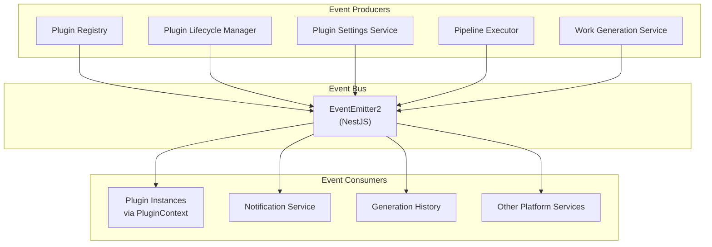
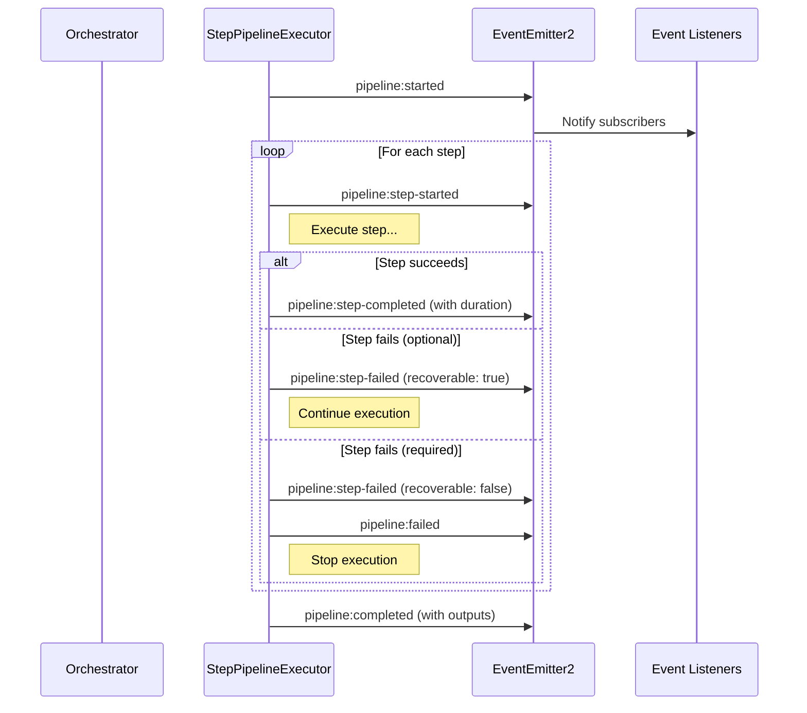
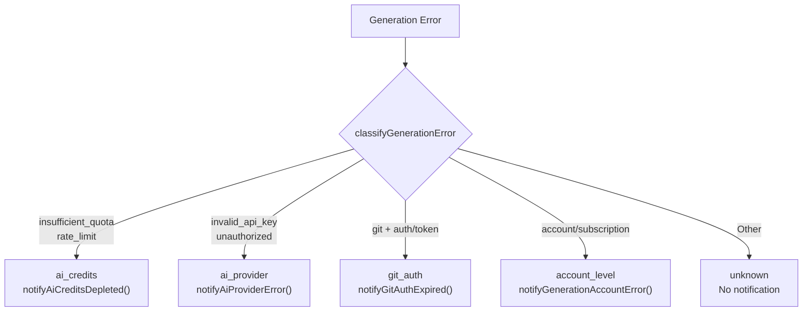

# Event & Notification System

Ever Works uses an internal event-driven architecture powered by NestJS `EventEmitter2`. Events flow through the platform to coordinate plugin lifecycle, pipeline execution, work generation, and system-level notifications. Plugins can subscribe to and emit events through the `PluginContext` interface.

**Key sources:**

- `packages/plugin/src/events/event-types.ts` -- Event type definitions
- `packages/agent/src/plugins/plugins.constants.ts` -- Plugin event constants
- `packages/agent/src/pipeline/step-pipeline-executor.service.ts` -- Pipeline event emission
- `packages/agent/src/plugins/services/plugin-context-factory.service.ts` -- Plugin event wiring

## Architecture



## Event Categories

The platform defines five categories of events, all type-safe through the `PluginEventPayloads` mapped type.

### Plugin Lifecycle Events

Emitted by the plugin registry and lifecycle manager when plugins change state.

| Event Name                | Payload                        | Emitter                         |
| ------------------------- | ------------------------------ | ------------------------------- |
| `plugin:loaded`           | `PluginLoadedPayload`          | `PluginLifecycleManagerService` |
| `plugin:unloaded`         | `PluginLoadedPayload`          | `PluginLifecycleManagerService` |
| `plugin:enabled`          | `PluginLoadedPayload`          | Plugin system                   |
| `plugin:disabled`         | `PluginLoadedPayload`          | Plugin system                   |
| `plugin:error`            | `PluginErrorPayload`           | `PluginLifecycleManagerService` |
| `plugin:settings-changed` | `PluginSettingsChangedPayload` | `PluginSettingsService`         |
| `plugin:state-changed`    | --                             | `PluginRegistryService`         |
| `plugin:registered`       | --                             | `PluginRegistryService`         |
| `plugin:unregistered`     | --                             | `PluginRegistryService`         |

```typescript
// PluginLoadedPayload
{
    pluginId: string;
    version: string;
    timestamp: string;
    correlationId?: string;
}

// PluginSettingsChangedPayload
{
    pluginId: string;
    changedKeys: readonly string[];
    scope: 'global' | 'work' | 'user';
    requiresRestart?: boolean;
    userId?: string;
    workId?: string;
    timestamp: string;
}
```

### Work Events

Emitted during work lifecycle operations.

| Event Name                  | Payload                          |
| --------------------------- | -------------------------------- |
| `work:created`              | `WorkEventPayload`               |
| `work:updated`              | `WorkEventPayload`               |
| `work:deleted`              | `WorkEventPayload`               |
| `work:deployed`             | `WorkEventPayload`               |
| `work:generation-started`   | `WorkGenerationStartedPayload`   |
| `work:generation-completed` | `WorkGenerationCompletedPayload` |
| `work:generation-failed`    | `WorkGenerationFailedPayload`    |

```typescript
// WorkGenerationCompletedPayload
{
    workId: string;
    workName?: string;
    itemsGenerated: number;
    categoriesGenerated: number;
    tagsGenerated: number;
    duration: number;
    timestamp: string;
}
```

### Item Events

Emitted when work items are created, updated, or validated.

| Event Name       | Payload                |
| ---------------- | ---------------------- |
| `item:created`   | `ItemEventPayload`     |
| `item:updated`   | `ItemEventPayload`     |
| `item:deleted`   | `ItemEventPayload`     |
| `item:extracted` | `ItemEventPayload`     |
| `item:validated` | `ItemValidatedPayload` |

### Pipeline Events

Emitted by `StepPipelineExecutorService` during pipeline execution. These provide granular progress tracking.

| Event Name                | Payload                        |
| ------------------------- | ------------------------------ |
| `pipeline:started`        | `PipelineEventPayload`         |
| `pipeline:step-started`   | `PipelineStepEventPayload`     |
| `pipeline:step-completed` | `PipelineStepCompletedPayload` |
| `pipeline:step-failed`    | `PipelineStepFailedPayload`    |
| `pipeline:completed`      | `PipelineCompletedPayload`     |
| `pipeline:failed`         | `PipelineFailedPayload`        |
| `pipeline:cancelled`      | `PipelineEventPayload`         |

```typescript
// PipelineStepFailedPayload
{
    workId: string;
    pipelineId?: string;
    stepId: string;
    stepName: string;
    stepIndex: number;
    totalSteps: number;
    error: Error | string;
    recoverable: boolean;  // true if step is optional
    timestamp: string;
}
```

### System Events

| Event Name            | Payload              |
| --------------------- | -------------------- |
| `system:startup`      | `SystemEventPayload` |
| `system:shutdown`     | `SystemEventPayload` |
| `system:health-check` | `SystemEventPayload` |

## Plugin Event Subscription

Plugins receive event access through `PluginContext`:

```typescript
// Subscribe to events
const subscription = context.onEvent('work:generation-completed', (payload) => {
	context.logger.log(`Generation completed for ${payload.workId}: ${payload.itemsGenerated} items`);
});

// Unsubscribe later
subscription.unsubscribe();

// Emit events (for plugin-to-plugin communication)
context.emitEvent('item:created', {
	workId: 'dir-123',
	item: itemData,
	timestamp: new Date().toISOString()
});
```

### Event Enrichment

When plugins emit events through `PluginContext.emitEvent()`, the platform automatically adds metadata:

```typescript
emitEvent: <T extends PluginEventName>(event: T, payload: unknown): void => {
	const enrichedPayload = {
		...(payload as object),
		timestamp: Date.now(),
		correlationId: this.generateCorrelationId()
	};
	this.eventEmitter.emit(event, enrichedPayload);
};
```

## Pipeline Event Flow



## Error Notification System

The platform classifies generation errors and sends targeted notifications:



Error classification checks error messages against known patterns:

| Classification  | Pattern Keywords                                                           |
| --------------- | -------------------------------------------------------------------------- |
| `ai_credits`    | `insufficient_quota`, `rate_limit`, `quota exceeded`, `credits`, `billing` |
| `ai_provider`   | `invalid_api_key`, `authentication`, `unauthorized`, `api key`             |
| `git_auth`      | `git`/`github`/`gitlab` + `authentication`/`token`/`expired`               |
| `account_level` | `account`, `subscription`, `plan limit`, `not configured`                  |

The provider is auto-detected from the error message (OpenAI, Anthropic, Google, Groq, Ollama, OpenRouter).

## Event Type Safety

All events are fully typed through the `PluginEventPayloads` mapped type:

```typescript
export type PluginEventName = PluginLifecycleEvent | WorkEvent | ItemEvent | PipelineEvent | SystemEvent;

export interface PluginEventPayloads {
	'plugin:loaded': PluginLoadedPayload;
	'work:generation-completed': WorkGenerationCompletedPayload;
	'pipeline:step-failed': PipelineStepFailedPayload;
	// ... all events mapped to their payload types
}

// Type-safe handler
export type EventHandler<T extends PluginEventName> = (payload: PluginEventPayloads[T]) => void | Promise<void>;
```

This ensures that when you subscribe to `pipeline:step-failed`, your handler receives `PipelineStepFailedPayload` with the correct fields.

## Best Practices

1. **Always unsubscribe**: Store the `EventSubscription` and call `unsubscribe()` in your plugin's `onUnload()` method
2. **Handle errors in handlers**: Wrap handler logic in try/catch -- uncaught exceptions in handlers are logged but may affect other subscribers
3. **Use correlation IDs**: When emitting events in response to other events, pass along the `correlationId` for tracing
4. **Keep handlers fast**: Long-running work should be offloaded to background jobs rather than blocking the event bus
