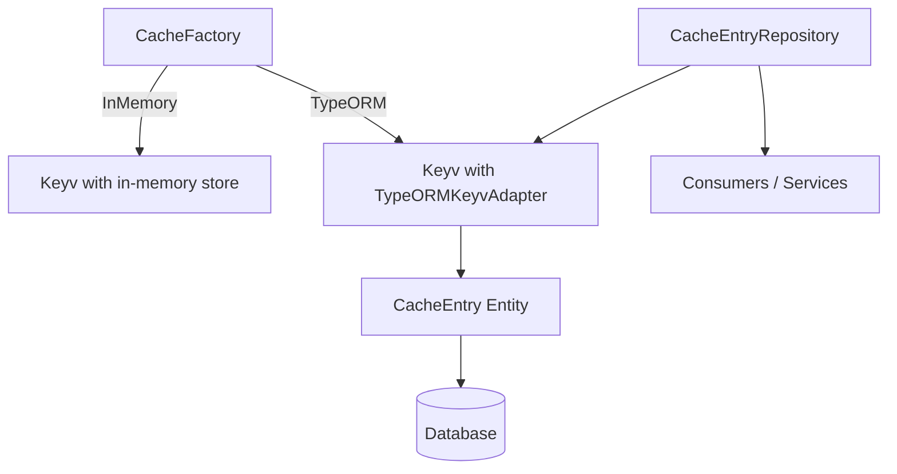

# Cache Module

The Cache Module (`@ever-works/agent/cache`) provides a persistent caching layer backed by TypeORM. It wraps a custom Keyv-compatible adapter that stores cache entries in the database, supporting TTL expiration, namespace isolation, and batch operations.

## Module Structure

```
packages/agent/src/cache/
├── index.ts                   # Barrel exports (re-exports @nestjs/cache-manager + local modules)
├── cache.factory.ts           # CacheFactory with InMemory and TypeORM strategies
├── repository.ts              # CacheEntryRepository injectable wrapper
└── typeorm-keyv.adapter.ts    # TypeORMKeyvAdapter (core implementation)
```

## Architecture



## Key Components

### CacheFactory

A static factory that creates Keyv cache instances in two modes:

```typescript
import { CacheFactory } from '@ever-works/agent/cache';

// In-memory cache (default, no persistence)
const memoryCache = CacheFactory.InMemory();

// TypeORM-backed cache (persistent, uses database)
const dbCache = CacheFactory.TypeORM({
	dataSource, // TypeORM DataSource
	namespace: 'ai', // Optional namespace prefix
	ttl: 3600000 // Default TTL in milliseconds
});
```

| Method             | Description                                                                                   |
| ------------------ | --------------------------------------------------------------------------------------------- |
| `InMemory()`       | Creates a Keyv instance backed by an in-memory Map. Suitable for testing or ephemeral caches. |
| `TypeORM(options)` | Creates a Keyv instance backed by the `TypeORMKeyvAdapter`. Data persists across restarts.    |

### TypeORMKeyvAdapter

The core adapter class that implements Keyv's store interface using TypeORM's `CacheEntry` entity. It extends `EventEmitter` and provides:

| Method                      | Signature                                                      | Description                                                                                      |
| --------------------------- | -------------------------------------------------------------- | ------------------------------------------------------------------------------------------------ |
| `get`                       | `get(key: string): Promise<string \| undefined>`               | Retrieves a value by key. Returns `undefined` if expired or missing.                             |
| `set`                       | `set(key: string, value: string, ttl?: number): Promise<void>` | Stores a value with optional TTL (milliseconds). Uses upsert for idempotency.                    |
| `delete`                    | `delete(key: string): Promise<boolean>`                        | Deletes a single cache entry by key.                                                             |
| `deleteMany`                | `deleteMany(keys: string[]): Promise<boolean>`                 | Batch-deletes multiple keys efficiently.                                                         |
| `clear`                     | `clear(): Promise<void>`                                       | Clears all entries in the current namespace.                                                     |
| `has`                       | `has(key: string): Promise<boolean>`                           | Checks existence without returning the value.                                                    |
| `cleanExpired`              | `cleanExpired(): Promise<number>`                              | Removes all expired entries. Returns the count of deleted rows.                                  |
| `deleteUnscopedEntriesLike` | `deleteUnscopedEntriesLike(pattern: string): Promise<number>`  | Deletes entries matching a LIKE pattern (without namespace prefix).                              |
| `wrap`                      | `wrap<T>(key, fetcher, ttl?): Promise<T>`                      | Cache-aside pattern: returns cached value or calls `fetcher`, caches the result, and returns it. |

**Namespace isolation**: All keys are prefixed with the configured namespace (e.g., `ai:myKey`). This prevents collisions when multiple subsystems share the same database table.

**TTL handling**: Expiration timestamps are stored as `bigint` columns. The `get` method checks expiration at read time and deletes stale entries lazily.

### CacheEntryRepository

An `@Injectable()` NestJS service that wraps the `TypeORMKeyvAdapter` for dependency injection:

```typescript
import { CacheEntryRepository } from '@ever-works/agent/cache';

@Injectable()
export class MyService {
	constructor(private readonly cache: CacheEntryRepository) {}

	async getCachedResult(key: string): Promise<string | undefined> {
		return this.cache.get(key);
	}
}
```

### CacheEntry Entity

The database entity backing the cache (defined in `entities/cache.entity.ts`):

| Column      | Type                | Description                          |
| ----------- | ------------------- | ------------------------------------ |
| `key`       | `varchar` (PK)      | Namespaced cache key                 |
| `value`     | `text`              | Serialized cache value               |
| `expiresAt` | `bigint` (nullable) | Expiration timestamp in milliseconds |

## Usage Examples

### Cache-Aside Pattern

```typescript
// Automatically fetches and caches expensive computations
const result = await cache.wrap(
	'expensive-computation-key',
	async () => {
		// This only runs on cache miss
		return await performExpensiveOperation();
	},
	60 * 60 * 1000 // 1 hour TTL
);
```

### Periodic Cleanup

```typescript
// Clean up expired entries (e.g., in a cron job)
const deletedCount = await adapter.cleanExpired();
logger.log(`Cleaned ${deletedCount} expired cache entries`);
```

### Pattern-Based Deletion

```typescript
// Delete all cache entries matching a pattern
const deleted = await adapter.deleteUnscopedEntriesLike('directory:%');
```

## Exports

The module re-exports everything from `@nestjs/cache-manager` alongside its own components:

- `CacheFactory` -- Static factory for creating cache instances
- `CacheEntryRepository` -- Injectable repository for DI consumers
- `TypeORMKeyvAdapter` -- Low-level adapter (rarely used directly)
- All exports from `@nestjs/cache-manager` (`CacheModule`, `CACHE_MANAGER`, etc.)
