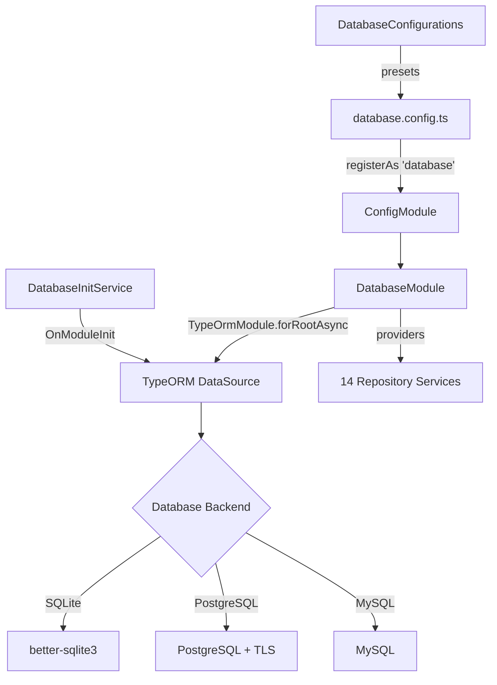

# Database Module

The Database Module (`@ever-works/agent/database`) provides the core data access layer for the Ever Works platform. It configures TypeORM, registers all entity repositories, and supports multiple database backends (SQLite, PostgreSQL, MySQL) with environment-driven configuration.

## Module Structure

```
packages/agent/src/database/
├── index.ts                      # Barrel exports
├── database.config.ts            # DatabaseConfig interface, ENTITIES array, config factory
├── database.module.ts            # NestJS DatabaseModule with repository providers
├── database-config.factory.ts    # Preset configurations (CLI, API dev/prod, test)
├── database-init.service.ts      # OnModuleInit service for schema sync
├── utils/
│   ├── index.ts                  # Barrel exports for utils
│   ├── db.utils.ts               # SQL sanitization helpers
│   └── helper.ts                 # TLS and URL parsing utilities
└── repositories/                 # 14 TypeORM repository wrappers
    ├── api-key.repository.ts
    ├── directory.repository.ts
    ├── directory-advanced-prompts.repository.ts
    ├── directory-custom-domain.repository.ts
    ├── directory-generation-history.repository.ts
    ├── directory-member.repository.ts
    ├── directory-schedule.repository.ts
    ├── notification.repository.ts
    ├── oauth-token.repository.ts
    ├── refresh-token.repository.ts
    ├── subscription-plan.repository.ts
    ├── usage-ledger.repository.ts
    ├── user.repository.ts
    └── user-subscription.repository.ts
```

## Architecture



## Key Components

### DatabaseConfig

The `database.config.ts` file defines the configuration interface and a NestJS `registerAs` factory:

```typescript
export type DatabaseType = 'better-sqlite3' | 'postgres' | 'mysql';

export interface DatabaseConfig {
	type: DatabaseType;
	host?: string;
	port?: number;
	username?: string;
	password?: string;
	database: string;
	synchronize: boolean;
	logging: boolean;
	ssl?: boolean;
	entities: EntityTarget<unknown>[];
}
```

**ENTITIES array**: A centralized list of all 18 TypeORM entities registered with the DataSource:

| Entity                       | Table                          |
| ---------------------------- | ------------------------------ |
| `User`                       | `users`                        |
| `Directory`                  | `directories`                  |
| `DirectoryAdvancedPrompts`   | `directory_advanced_prompts`   |
| `DirectoryCustomDomain`      | `directory_custom_domains`     |
| `DirectoryMember`            | `directory_members`            |
| `DirectoryGenerationHistory` | `directory_generation_history` |
| `DirectorySchedule`          | `directory_schedules`          |
| `ApiKey`                     | `api_keys`                     |
| `RefreshToken`               | `refresh_tokens`               |
| `OAuthToken`                 | `oauth_tokens`                 |
| `SubscriptionPlan`           | `subscription_plans`           |
| `UserSubscription`           | `user_subscriptions`           |
| `UsageLedgerEntry`           | `usage_ledger`                 |
| `Notification`               | `notifications`                |
| `CacheEntry`                 | `cache_entries`                |
| `PluginEntity`               | `plugins`                      |
| `UserPluginEntity`           | `user_plugins`                 |
| `DirectoryPluginEntity`      | `directory_plugins`            |

The factory reads environment variables to determine the database type:

- `DATABASE_TYPE` -- Explicit type (`better-sqlite3`, `postgres`, `mysql`)
- `DATABASE_URL` -- If set, auto-detects PostgreSQL and parses the connection URL
- `DATABASE_HOST`, `DATABASE_PORT`, `DATABASE_USERNAME`, `DATABASE_PASSWORD`, `DATABASE_NAME` -- Individual connection parameters
- `DATABASE_SSL` -- Enables TLS (reads `DATABASE_CA_CERT` for base64-encoded CA certificate)

### DatabaseModule

The NestJS module that wires TypeORM and all repositories:

```typescript
@Module({
	imports: [
		ConfigModule,
		TypeOrmModule.forRootAsync({
			imports: [ConfigModule],
			inject: [ConfigService],
			useFactory: (configService: ConfigService) => ({
				...configService.get<DatabaseConfig>('database')
			})
		}),
		TypeOrmModule.forFeature(ENTITIES)
	],
	providers: [
		// 14 repository services
		DirectoryRepository,
		UserRepository,
		ApiKeyRepository
		// ... etc.
	],
	exports: [
		TypeOrmModule
		// All 14 repositories exported
	]
})
export class DatabaseModule {}
```

### DatabaseConfigurations

A helper object in `database-config.factory.ts` providing preset TypeORM configurations:

| Preset           | Database                         | Synchronize | Use Case                   |
| ---------------- | -------------------------------- | ----------- | -------------------------- |
| `cli`            | SQLite (`~/.ever-works/data.db`) | `true`      | CLI tool local storage     |
| `apiDevelopment` | SQLite (`./data/dev.db`)         | `true`      | API local development      |
| `apiProduction`  | From environment                 | `false`     | Production API             |
| `test`           | SQLite (`:memory:`)              | `true`      | Unit/integration tests     |
| `postgres`       | PostgreSQL (from env)            | `false`     | Explicit PostgreSQL config |
| `mysql`          | MySQL (from env)                 | `false`     | Explicit MySQL config      |

```typescript
import { DatabaseConfigurations } from '@ever-works/agent/database';

// Use in a NestJS module
TypeOrmModule.forRoot(DatabaseConfigurations.test);
```

There is also a `createDatabaseModuleWithEnv` helper that auto-selects the appropriate preset based on `NODE_ENV` and `DATABASE_URL`.

### DatabaseInitService

An `OnModuleInit` service that force-synchronizes the database schema when running in CLI mode. This ensures the SQLite database is always up-to-date without requiring explicit migrations:

```typescript
@Injectable()
export class DatabaseInitService implements OnModuleInit {
	async onModuleInit() {
		if (this.isCli) {
			await this.dataSource.synchronize();
		}
	}
}
```

### Utility Functions

#### db.utils.ts

| Function                | Signature                   | Description                                                                                           |
| ----------------------- | --------------------------- | ----------------------------------------------------------------------------------------------------- |
| `sanitizeLikePattern`   | `(input: string) => string` | Escapes `%`, `_`, and `\` characters in LIKE query patterns to prevent SQL injection in search terms. |
| `prepareLikeSearchTerm` | `(term: string) => string`  | Sanitizes and wraps a search term with `%` wildcards for use in LIKE clauses.                         |

#### helper.ts

| Function           | Signature                       | Description                                                                                                                  |
| ------------------ | ------------------------------- | ---------------------------------------------------------------------------------------------------------------------------- |
| `getTlsOptions`    | `() => TlsOptions \| undefined` | Reads `DATABASE_CA_CERT` (base64) from environment and returns Node.js TLS options for SSL database connections.             |
| `parseDatabaseUrl` | `(url: string) => ParsedDbUrl`  | Parses a `postgresql://` or `mysql://` connection URL into individual components (host, port, username, password, database). |

## Repository Pattern

Each repository in `database/repositories/` is an `@Injectable()` service that wraps TypeORM's `Repository<T>` with domain-specific query methods. They are registered as providers in `DatabaseModule` and exported for use throughout the application.

Typical repository pattern:

```typescript
@Injectable()
export class DirectoryRepository {
	constructor(
		@InjectRepository(Directory)
		private readonly repo: Repository<Directory>
	) {}

	async findBySlug(slug: string): Promise<Directory | null> {
		return this.repo.findOne({
			where: { slug },
			relations: ['user', 'members']
		});
	}

	async findByUserId(userId: string): Promise<Directory[]> {
		return this.repo.find({
			where: { userId },
			order: { createdAt: 'DESC' }
		});
	}
}
```

## Usage

### Importing the Module

```typescript
import { DatabaseModule } from '@ever-works/agent/database';

@Module({
	imports: [DatabaseModule]
})
export class AppModule {}
```

### Injecting Repositories

```typescript
import { DirectoryRepository } from '@ever-works/agent/database';

@Injectable()
export class MyService {
	constructor(private readonly directoryRepo: DirectoryRepository) {}

	async getDirectory(slug: string) {
		return this.directoryRepo.findBySlug(slug);
	}
}
```

### Using Search Utilities

```typescript
import { prepareLikeSearchTerm } from '@ever-works/agent/database';

// Safely build a LIKE query
const term = prepareLikeSearchTerm(userInput);
const results = await repo.createQueryBuilder('d').where('d.name LIKE :term', { term }).getMany();
```
