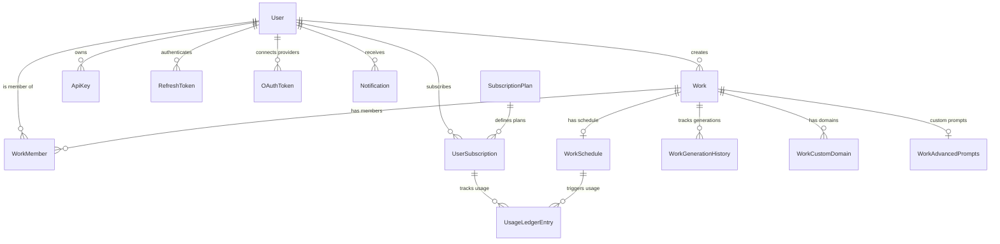

# Entities Module

The Entities Module (`@ever-works/agent/entities`) defines all TypeORM entity classes, enums, types, and supporting interfaces used across the Ever Works platform. These entities map directly to database tables and form the core domain model.

## Module Structure

```
packages/agent/src/entities/
├── index.ts                              # Barrel exports for all entities and types
├── _types.ts                             # TimestampColumn custom decorator
├── types.ts                              # Shared enums, types, and re-exports
├── notification.types.ts                 # Notification-specific enums and DTOs
├── user.entity.ts                        # User entity
├── work.entity.ts                   # Work entity (core domain)
├── work-member.entity.ts            # Work member with role-based access
├── work-advanced-prompts.entity.ts  # Custom AI prompt overrides
├── work-custom-domain.entity.ts     # Custom domain mapping
├── work-generation-history.entity.ts # Generation run tracking
├── work-schedule.entity.ts          # Scheduled update configuration
├── api-key.entity.ts                     # API key management
├── refresh-token.entity.ts              # JWT refresh token rotation
├── oauth-token.entity.ts                # OAuth provider tokens
├── subscription-plan.entity.ts          # Subscription plan definitions
├── user-subscription.entity.ts          # User-plan associations
├── usage-ledger-entry.entity.ts         # Usage-based billing ledger
├── notification.entity.ts              # User notifications
└── cache.entity.ts                      # Cache storage entries
```

## Entity Relationship Diagram



## Core Entities

### User

The `User` entity (`users` table) represents an authenticated platform user.

| Column                   | Type                   | Description                                 |
| ------------------------ | ---------------------- | ------------------------------------------- |
| `id`                     | `uuid` (PK)            | Auto-generated UUID                         |
| `email`                  | `varchar`              | Unique email address                        |
| `password`               | `varchar` (nullable)   | Hashed password (null for OAuth-only users) |
| `username`               | `varchar`              | Display name / GitHub username              |
| `emailVerified`          | `boolean`              | Whether email is confirmed                  |
| `emailVerificationToken` | `varchar` (nullable)   | Pending verification token                  |
| `passwordResetToken`     | `varchar` (nullable)   | Pending password reset token                |
| `passwordResetExpiresAt` | `timestamp` (nullable) | Reset token expiry                          |
| `lastLoginAt`            | `timestamp` (nullable) | Last successful login                       |
| `defaultPlan`            | `varchar`              | Default subscription plan code              |
| `createdAt`              | `timestamp`            | Account creation date                       |
| `updatedAt`              | `timestamp`            | Last update date                            |

**Relations**: `works` (OneToMany), `generationHistory` (OneToMany), `subscriptions` (OneToMany), `schedules` (OneToMany), `memberships` (OneToMany).

**Helper method**: `asCommitter()` returns a `{ name, email }` object for git commit authoring.

### Work

The `Work` entity (`works` table) is the central domain object representing a generated work/listing site.

**Core fields**:

| Column           | Type                 | Description                              |
| ---------------- | -------------------- | ---------------------------------------- |
| `id`             | `uuid` (PK)          | Auto-generated UUID                      |
| `name`           | `varchar`            | Display name                             |
| `slug`           | `varchar`            | URL-safe identifier, used for repo names |
| `userId`         | `uuid` (FK)          | Creator's user ID                        |
| `owner`          | `varchar` (nullable) | GitHub org/user override for repos       |
| `description`    | `varchar`            | Work description                         |
| `gitProvider`    | `varchar`            | Git provider (`github`)                  |
| `deployProvider` | `varchar` (nullable) | Deploy provider (`vercel`)               |
| `website`        | `varchar` (nullable) | Published website URL                    |
| `companyName`    | `varchar` (nullable) | Associated company                       |
| `organization`   | `boolean`            | Whether repos use org scope              |

**Generation fields**: `generateStatus` (JSON), `generationStartedAt`, `generationProgressedAt`, `generationFinishedAt`.

**Domain type fields** (for smart image routing): `domainType` (`software` / `ecommerce` / `services` / `general`), `domainTypeConfidence`, `domainTypeManuallySet`.

**Deployment fields**: `deployProjectId`, `deploymentState`, `deploymentStartedAt`.

**Repository fields**: `lastPullRequest` (JSON with main/data PR info), `repoVisibility` (JSON), `itemsCount`.

**Community PR fields**: `communityPrEnabled`, `communityPrAutoClose`, `communityPrState` (JSON).

**Website template fields**: `websiteTemplateAutoUpdate`, `websiteTemplateUseBeta`, `websiteTemplateLastCommit`, `websiteTemplateLastError`, `websiteTemplateLastUpdatedAt`, `websiteTemplateLastCheckedAt`.

**Helper methods**:

| Method                | Return Type               | Description                        |
| --------------------- | ------------------------- | ---------------------------------- |
| `getDataRepo()`       | `string`                  | Returns `{slug}-data`              |
| `getWebsiteRepo()`    | `string`                  | Returns `{slug}-website`           |
| `getMainRepo()`       | `string`                  | Returns `slug`                     |
| `getRepoOwner()`      | `string`                  | Returns `owner` or `user.username` |
| `isCreator(userId)`   | `boolean`                 | Checks if user is the work creator |
| `getMember(userId)`   | `WorkMember \| undefined` | Finds member entry                 |
| `hasAccess(userId)`   | `boolean`                 | Creator or member check            |
| `getUserRole(userId)` | `WorkMemberRole \| null`  | Returns role (owner for creator)   |

### WorkMember

Represents a user's membership in a work with role-based access control.

| Column            | Type              | Description                      |
| ----------------- | ----------------- | -------------------------------- |
| `id`              | `uuid` (PK)       | Auto-generated UUID              |
| `workId`          | `uuid` (FK)       | Work reference                   |
| `userId`          | `uuid` (FK)       | User reference                   |
| `role`            | `enum`            | `manager`, `editor`, or `viewer` |
| `invitedByUserId` | `uuid` (nullable) | Who sent the invite              |
| `createdAt`       | `timestamp`       | Membership creation date         |

**Role hierarchy** (highest to lowest): `owner` > `manager` > `editor` > `viewer`.

**Helper methods**:

- `hasRoleOrHigher(requiredRole)` -- Checks if member's role meets the minimum
- `canManageMembers()` -- Returns `true` for manager and above
- `canEdit()` -- Returns `true` for editor and above

### WorkSchedule

Configures recurring work updates with scheduling, billing, and failure tracking.

| Column                | Type                   | Description                              |
| --------------------- | ---------------------- | ---------------------------------------- |
| `workId`              | `uuid` (PK, FK)        | One-to-one with Work                     |
| `cadence`             | `enum`                 | `daily`, `weekly`, `biweekly`, `monthly` |
| `billingMode`         | `enum`                 | `included` or `usage`                    |
| `status`              | `enum`                 | `active`, `paused`, `failed`             |
| `nextRunAt`           | `timestamp` (nullable) | Next scheduled execution                 |
| `lastRunAt`           | `timestamp` (nullable) | Last execution time                      |
| `consecutiveFailures` | `int`                  | Failure count for auto-pause logic       |
| `lastFailureReason`   | `varchar` (nullable)   | Last error description                   |
| `providerOverrides`   | `json` (nullable)      | Per-schedule plugin provider overrides   |

### WorkGenerationHistory

Tracks each generation run with metrics and status.

| Column         | Type                   | Description                                         |
| -------------- | ---------------------- | --------------------------------------------------- |
| `id`           | `uuid` (PK)            | Auto-generated UUID                                 |
| `workId`       | `uuid` (FK)            | Work reference                                      |
| `userId`       | `uuid` (FK)            | User who triggered it                               |
| `method`       | `varchar`              | Generation method used                              |
| `status`       | `varchar`              | `completed`, `failed`, `cancelled`                  |
| `startedAt`    | `timestamp`            | Run start time                                      |
| `completedAt`  | `timestamp` (nullable) | Run end time                                        |
| `metrics`      | `json` (nullable)      | `GenerationMetrics` (items, tokens, cost, duration) |
| `triggeredBy`  | `varchar`              | `manual`, `schedule`, `api`                         |
| `errorMessage` | `varchar` (nullable)   | Error details on failure                            |

**GenerationMetrics type**:

```typescript
interface GenerationMetrics {
	itemsGenerated?: number;
	itemsUpdated?: number;
	totalTokensUsed?: number;
	estimatedCost?: number;
	durationMs?: number;
	stepsCompleted?: number;
	totalSteps?: number;
}
```

## Shared Types and Enums

### types.ts

| Export                    | Kind             | Values / Description                                                |
| ------------------------- | ---------------- | ------------------------------------------------------------------- |
| `GenerateStatusType`      | enum (re-export) | From `@ever-works/contracts/api`                                    |
| `WorkScheduleCadence`     | enum (re-export) | `daily`, `weekly`, `biweekly`, `monthly`                            |
| `WorkScheduleStatus`      | enum (re-export) | `active`, `paused`, `failed`                                        |
| `WorkScheduleBillingMode` | enum (re-export) | `included`, `usage`                                                 |
| `SubscriptionPlanCode`    | enum             | `free`, `standard`, `premium`                                       |
| `WorkMemberRole`          | enum             | `owner`, `manager`, `editor`, `viewer`                              |
| `DomainEnvironment`       | enum             | `production`, `staging`, `development`                              |
| `GenerateStatus`          | type             | Status object with step, progress, errors, warnings                 |
| `CommunityPrState`        | interface        | PR processing state (`processedPrNumbers`, `lastProcessedAt`, etc.) |
| `ClassToObject<T>`        | utility type     | Converts class to plain object type                                 |
| `ASSIGNABLE_MEMBER_ROLES` | const array      | `[manager, editor, viewer]` (excludes owner)                        |

### notification.types.ts

| Export                     | Kind      | Values                                                           |
| -------------------------- | --------- | ---------------------------------------------------------------- |
| `NotificationType`         | enum      | `info`, `warning`, `error`, `success`                            |
| `NotificationCategory`     | enum      | `ai_credits`, `subscription`, `generation`, `system`, `security` |
| `CreateNotificationDto`    | interface | Fields for creating a notification                               |
| `NotificationQueryOptions` | interface | Pagination, filtering, category options                          |

## Supporting Entities

### ApiKey

API key management with hashed storage and prefix-based lookup.

| Column       | Type                   | Description                           |
| ------------ | ---------------------- | ------------------------------------- |
| `id`         | `uuid` (PK)            | Auto-generated UUID                   |
| `userId`     | `uuid` (FK)            | Owner                                 |
| `name`       | `varchar`              | Display name                          |
| `keyHash`    | `varchar`              | SHA-256 hash of the full key          |
| `keyPrefix`  | `varchar`              | First 8 characters for identification |
| `expiresAt`  | `timestamp` (nullable) | Optional expiry                       |
| `lastUsedAt` | `timestamp` (nullable) | Usage tracking                        |

### RefreshToken

JWT refresh token with family-based rotation and revocation tracking.

| Column              | Type                   | Description                         |
| ------------------- | ---------------------- | ----------------------------------- |
| `id`                | `uuid` (PK)            | Auto-generated UUID                 |
| `userId`            | `uuid` (FK)            | Token owner                         |
| `tokenHash`         | `varchar`              | Hashed token value                  |
| `family`            | `varchar`              | Token family for rotation detection |
| `expiresAt`         | `timestamp`            | Token expiry                        |
| `revokedAt`         | `timestamp` (nullable) | When revoked                        |
| `replacedByTokenId` | `uuid` (nullable)      | Points to the replacement token     |

### OAuthToken

Stores OAuth tokens from external providers (e.g., GitHub).

| Column         | Type                   | Description              |
| -------------- | ---------------------- | ------------------------ |
| `id`           | `uuid` (PK)            | Auto-generated UUID      |
| `userId`       | `uuid` (FK)            | Token owner              |
| `provider`     | `varchar`              | OAuth provider name      |
| `accessToken`  | `varchar`              | Encrypted access token   |
| `refreshToken` | `varchar` (nullable)   | Encrypted refresh token  |
| `scope`        | `varchar` (nullable)   | Granted scopes           |
| `expiresAt`    | `timestamp` (nullable) | Token expiry             |
| `metadata`     | `json` (nullable)      | Additional provider data |

### Custom Decorator: TimestampColumn

The `_types.ts` file exports a `TimestampColumn` decorator that stores timestamps as `bigint` values in the database and transforms them to/from JavaScript `Date` objects:

```typescript
import { TimestampColumn } from '@ever-works/agent/entities';

@Entity()
class MyEntity {
	@TimestampColumn({ nullable: true })
	processedAt?: Date;
}
```

This ensures consistent timestamp handling across all database backends (SQLite stores dates differently from PostgreSQL).
