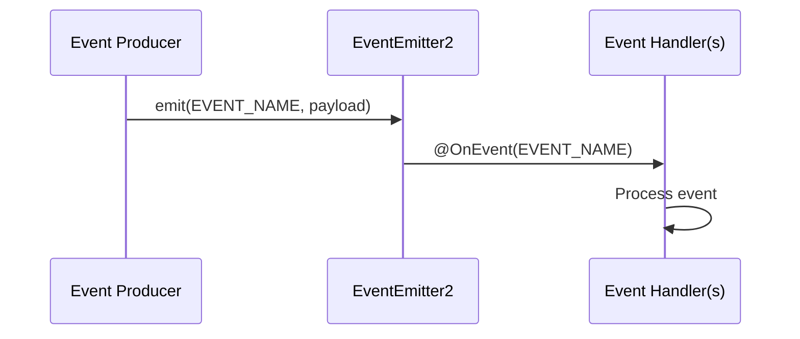

# Events Module

The Events Module (`@ever-works/agent/events`) defines the domain event classes used for cross-module communication within the agent package. Events follow the NestJS `@nestjs/event-emitter` pattern with a typed `BaseEvent` abstract class.

## Module Structure

```
packages/agent/src/events/
├── index.ts                                  # Barrel exports
├── base.ts                                   # BaseEvent abstract class
├── work-created.event.ts                # WorkCreatedEvent
└── work-generation-completed.event.ts   # WorkGenerationCompletedEvent
```

## Architecture



Events decouple producers from consumers. A service emits an event without knowing which handlers will process it. Multiple handlers can subscribe to the same event.

## Key Components

### BaseEvent

The abstract base class that all domain events extend:

```typescript
export abstract class BaseEvent {
	static EVENT_NAME: string;
}
```

Every concrete event class must define a static `EVENT_NAME` string that identifies the event type. This string is used with `EventEmitter2.emit()` and the `@OnEvent()` decorator.

### WorkCreatedEvent

Emitted when a new work is created.

```typescript
export class WorkCreatedEvent extends BaseEvent {
	static EVENT_NAME = 'work.created';

	constructor(
		public readonly workId: string,
		public readonly userId: string,
		public readonly slug: string
	) {
		super();
	}
}
```

| Property | Type     | Description                     |
| -------- | -------- | ------------------------------- |
| `workId` | `string` | UUID of the newly created work  |
| `userId` | `string` | UUID of the user who created it |
| `slug`   | `string` | URL slug of the work            |

**Typical subscribers**: Notification services, analytics, default setup workflows.

### WorkGenerationCompletedEvent

Emitted when a work generation run finishes (successfully or with an error).

```typescript
export class WorkGenerationCompletedEvent extends BaseEvent {
	static EVENT_NAME = 'work.generation.completed';

	constructor(
		public readonly workId: string,
		public readonly userId: string,
		public readonly success: boolean,
		public readonly error?: string
	) {
		super();
	}
}
```

| Property  | Type                | Description                                 |
| --------- | ------------------- | ------------------------------------------- |
| `workId`  | `string`            | UUID of the work                            |
| `userId`  | `string`            | UUID of the user who triggered generation   |
| `success` | `boolean`           | Whether generation completed without errors |
| `error`   | `string` (optional) | Error message if `success` is `false`       |

**Typical subscribers**: Notification services, history recording, schedule advancement, deployment triggers.

## Usage

### Emitting Events

```typescript
import { EventEmitter2 } from '@nestjs/event-emitter';
import { WorkCreatedEvent } from '@ever-works/agent/events';

@Injectable()
export class WorkService {
	constructor(private readonly eventEmitter: EventEmitter2) {}

	async createWork(dto: CreateWorkDto, userId: string) {
		const work = await this.save(dto);

		this.eventEmitter.emit(WorkCreatedEvent.EVENT_NAME, new WorkCreatedEvent(work.id, userId, work.slug));

		return work;
	}
}
```

### Handling Events

```typescript
import { OnEvent } from '@nestjs/event-emitter';
import { WorkGenerationCompletedEvent } from '@ever-works/agent/events';

@Injectable()
export class NotificationHandler {
	@OnEvent(WorkGenerationCompletedEvent.EVENT_NAME)
	async handleGenerationCompleted(event: WorkGenerationCompletedEvent) {
		if (!event.success) {
			await this.notifyUser(event.userId, `Generation failed: ${event.error}`);
		}
	}
}
```

## Design Conventions

1. **Static EVENT_NAME**: Each event class has a static string property following the pattern `domain.action` (e.g., `work.created`). This enables type-safe event registration.

2. **Immutable payloads**: All event properties are `readonly` to prevent handlers from mutating shared state.

3. **Flat hierarchy**: Events extend `BaseEvent` directly rather than forming deep inheritance chains. Each event is self-contained with all necessary context.

4. **Naming convention**: Event files are named `{subject}-{action}.event.ts` and classes are named `{Subject}{Action}Event`.
