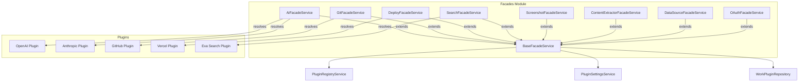
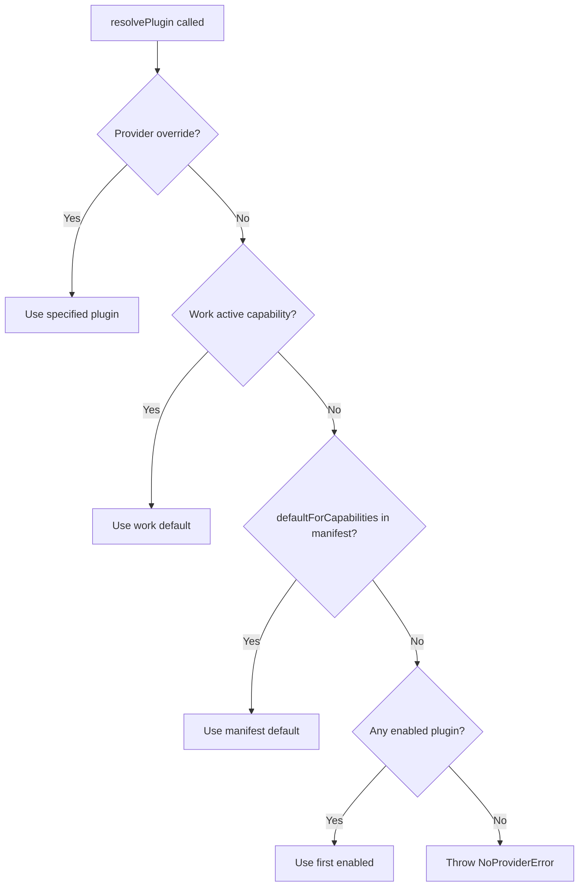
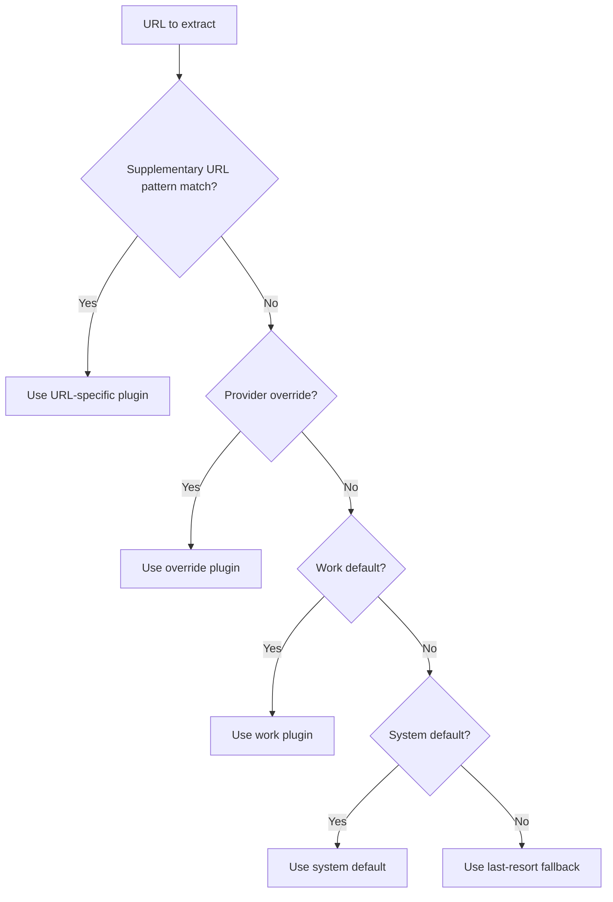

# Facades Module

The Facades Module (`@ever-works/agent/facades`) implements the **Facade pattern** to provide unified interfaces over the plugin system. Each facade abstracts away plugin discovery, settings resolution, and capability-based routing, giving consuming services a stable API regardless of which plugin implementation is active.

## Module Structure

```
packages/agent/src/facades/
├── index.ts                         # Barrel exports
├── facades.module.ts                # FacadesModule NestJS module
├── base.facade.ts                   # BaseFacadeService abstract class + error classes
├── ai.facade.ts                     # AiFacadeService (AI provider operations)
├── content-extractor.facade.ts      # ContentExtractorFacadeService
├── data-source.facade.ts            # DataSourceFacadeService
├── deploy.facade.ts                 # DeployFacadeService (deployment + domains)
├── git.facade.ts                    # GitFacadeService (repository operations)
├── oauth.facade.ts                  # OAuthFacadeService (OAuth flows)
├── search.facade.ts                 # SearchFacadeService (web search)
└── screenshot.facade.ts             # ScreenshotFacadeService (page screenshots)
```

## Architecture



## BaseFacadeService

The abstract base class that all facades extend. It provides:

### Plugin Resolution

The `resolvePlugin<T>()` method finds the appropriate plugin implementation using a priority chain:



**Resolution priority** (highest to lowest):

1. **Explicit override** -- `facadeOptions.providerOverride` specifies a plugin ID directly
2. **Work active capability** -- A `WorkPluginEntity` is set as the active plugin for this capability
3. **Manifest default** -- Plugin declares itself as default via `defaultForCapabilities`
4. **First enabled** -- Falls back to any loaded plugin with the required capability

### Settings Resolution

The `getResolvedSettings()` method merges settings from multiple scopes:

| Priority    | Source                | Description                           |
| ----------- | --------------------- | ------------------------------------- |
| 1 (highest) | Work settings         | Per-work plugin configuration         |
| 2           | User settings         | Per-user plugin configuration         |
| 3           | Admin settings        | Global admin configuration            |
| 4           | Environment variables | `x-envVar` annotated schema fields    |
| 5 (lowest)  | Plugin defaults       | `default` values from settings schema |

### Helper Methods

| Method                                               | Description                                                     |
| ---------------------------------------------------- | --------------------------------------------------------------- |
| `getSettingTyped<T>(settings, key)`                  | Type-safe setting retrieval                                     |
| `getSettingRequired(settings, key)`                  | Throws if setting is missing                                    |
| `getSettingWithDefault(settings, key, defaultValue)` | Returns default if missing                                      |
| `isConfigured()`                                     | Returns `true` if at least one loaded plugin has the capability |

### Error Classes

| Class                   | Description                                        |
| ----------------------- | -------------------------------------------------- |
| `FacadeError`           | Base error with `operation` and `provider` context |
| `NoProviderError`       | No plugin found for the required capability        |
| `ProviderNotFoundError` | A specific plugin ID was requested but not found   |

## Facade Services

### AiFacadeService

The primary interface for all AI operations. Implements `IAiFacade`.

**Key methods**:

| Method                                                   | Description                                                                                                                 |
| -------------------------------------------------------- | --------------------------------------------------------------------------------------------------------------------------- |
| `askJson(prompt, schema, options, facadeOptions)`        | Sends a prompt and validates the response against a Zod schema. Supports retry with auto-escalation to more capable models. |
| `createChatCompletion(messages, options, facadeOptions)` | Standard chat completion with configurable model, temperature, and max tokens.                                              |
| `streamChatCompletion(messages, options, facadeOptions)` | Returns an async iterable of streaming chunks.                                                                              |

**Model routing**: The facade supports complexity-based model selection:

| Complexity | Typical Models               | Use Case                                       |
| ---------- | ---------------------------- | ---------------------------------------------- |
| `simple`   | GPT-4o-mini, Claude Haiku    | Fast, cheap tasks (classification, extraction) |
| `medium`   | GPT-4o, Claude Sonnet        | Standard generation tasks                      |
| `complex`  | GPT-4o (latest), Claude Opus | Complex reasoning, long context                |

**Auto-escalation**: If `askJson` fails validation with the initial model, it automatically retries with the next complexity tier. This handles cases where simpler models produce malformed JSON.

**Cost tracking**: Every AI call tracks token usage and estimated cost, which feeds into the usage ledger for billing.

### GitFacadeService

Wraps all git operations with dual authentication support.

**Authentication resolution**:

1. **OAuth token** -- Fetched from the `OAuthToken` entity for the user/provider
2. **Personal Access Token (PAT)** -- Read from plugin settings (`token` setting key)

**Key methods**:

| Method                                             | Description                             |
| -------------------------------------------------- | --------------------------------------- |
| `clone(options, facadeOptions)`                    | Clones a repository with authentication |
| `push(options, facadeOptions)`                     | Pushes commits with auth headers        |
| `createBranch(repo, branch, facadeOptions)`        | Creates a new branch                    |
| `createPullRequest(options, facadeOptions)`        | Opens a PR via the git provider API     |
| `getDefaultBranch(owner, repo, facadeOptions)`     | Fetches the default branch name         |
| `createRepository(options, facadeOptions)`         | Creates a new repository                |
| `deleteRepository(owner, repo, facadeOptions)`     | Deletes a repository                    |
| `getFileContent(owner, repo, path, facadeOptions)` | Reads a single file from the repo       |

### DeployFacadeService

Manages deployment operations and custom domain lifecycle.

**Key methods**:

| Method                                          | Description                                |
| ----------------------------------------------- | ------------------------------------------ |
| `createProject(options, facadeOptions)`         | Creates a new deployment project           |
| `deploy(options, facadeOptions)`                | Triggers a deployment                      |
| `getDeploymentStatus(projectId, facadeOptions)` | Polls deployment state                     |
| `addDomain(options, facadeOptions)`             | Adds a custom domain (syncs DB + provider) |
| `removeDomain(options, facadeOptions)`          | Removes a custom domain                    |
| `verifyDomain(options, facadeOptions)`          | Verifies domain DNS configuration          |

**Domain management**: The facade uses the database `WorkCustomDomain` entity as the source of truth for domain state. When adding/removing domains, it synchronizes both the database record and the deployment provider (e.g., Vercel).

### SearchFacadeService

Web search abstraction over search plugins (Exa, Tavily, SerpAPI, Brave).

```typescript
const results = await searchFacade.search(
	'best React component libraries 2025',
	{ maxResults: 10, includeDomains: ['github.com'] },
	{ userId, workId }
);
// Returns: SearchFacadeResult[] with title, url, score, publishedDate
```

### ScreenshotFacadeService

Captures webpage screenshots via screenshot plugins (ScreenshotOne, Urlbox).

**Key methods**:

| Method                                     | Description                                                            |
| ------------------------------------------ | ---------------------------------------------------------------------- |
| `capture(options, facadeOptions)`          | Full screenshot capture with viewport, format, and blocking options    |
| `getSmartImage(options, facadeOptions)`    | Simplified screenshot for work item images (1280x800, PNG, ad-blocked) |
| `getScreenshotUrl(options, facadeOptions)` | Returns a URL to the screenshot without downloading                    |
| `isAvailable()`                            | Checks if any screenshot plugin is configured                          |

### ContentExtractorFacadeService

Extracts content from web pages with a 5-tier resolution strategy:



This allows specialized extractors for specific URL patterns (e.g., Notion extractor for `notion.so` URLs) while falling back to general-purpose extractors for everything else.

### DataSourceFacadeService

Aggregates data from multiple data source plugins.

The `queryAll()` method queries all enabled data source plugins and merges their results. This is used when a work needs to pull items from multiple external sources.

### OAuthFacadeService

Manages OAuth authentication flows with external providers.

| Method                                         | Description                             |
| ---------------------------------------------- | --------------------------------------- |
| `getAuthorizationUrl(provider, options)`       | Generates the OAuth authorization URL   |
| `exchangeCode(provider, code, options)`        | Exchanges authorization code for tokens |
| `validateCredentials(provider, facadeOptions)` | Tests if stored credentials are valid   |
| `revokeToken(provider, facadeOptions)`         | Revokes stored OAuth tokens             |

## FacadesModule

The NestJS module that registers all facade services:

```typescript
@Module({
	imports: [PluginsModule, DatabaseModule],
	providers: [
		AiFacadeService,
		GitFacadeService,
		DeployFacadeService,
		SearchFacadeService,
		ScreenshotFacadeService,
		ContentExtractorFacadeService,
		DataSourceFacadeService,
		OAuthFacadeService
	],
	exports: [
		/* all facade services */
	]
})
export class FacadesModule {}
```

## Usage

### Injecting a Facade

```typescript
import { AiFacadeService } from '@ever-works/agent/facades';

@Injectable()
export class ItemGeneratorService {
	constructor(private readonly aiFacade: AiFacadeService) {}

	async generateDescription(item: Item, userId: string, workId: string) {
		const result = await this.aiFacade.askJson(
			`Generate a description for: ${item.name}`,
			descriptionSchema, // Zod schema
			{ complexity: 'simple' },
			{ userId, workId }
		);
		return result;
	}
}
```

### Using FacadeOptions

Every facade method accepts a `FacadeOptions` object as its last parameter:

```typescript
interface FacadeOptions {
	userId?: string; // For user-level settings resolution
	workId?: string; // For work-level settings resolution
	providerOverride?: string; // Force a specific plugin by ID
}
```

This allows the same facade to resolve different plugins and settings depending on the calling context (which user, which work).
