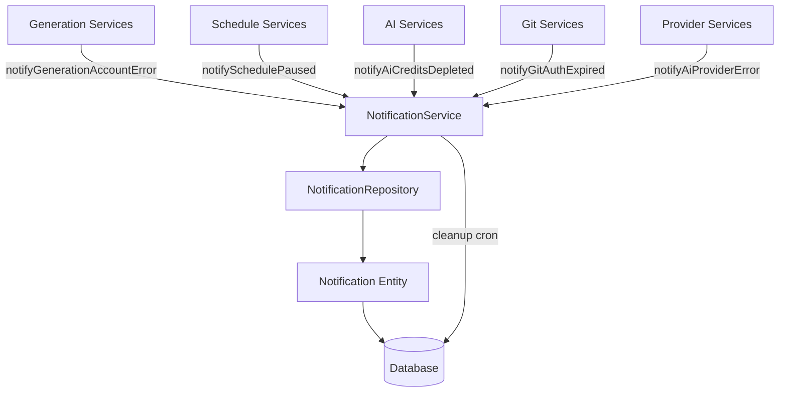
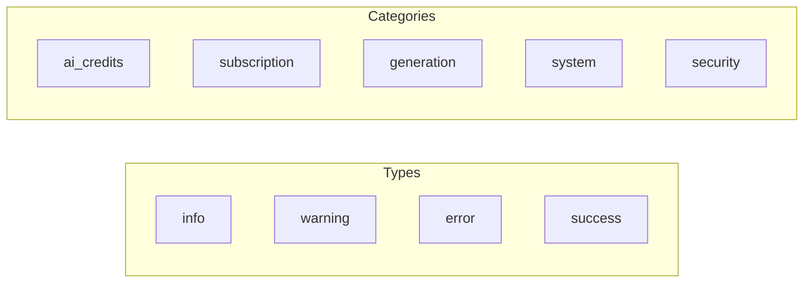

# Notifications Module

The Notifications Module (`@ever-works/agent/notifications`) provides a complete notification system for delivering in-app messages to users. It supports notification creation with deduplication, read/dismiss tracking, persistent notifications, and automated cleanup.

## Module Structure

```
packages/agent/src/notifications/
├── index.ts                    # Barrel exports
├── notifications.module.ts     # NestJS module definition
└── notification.service.ts     # NotificationService (core logic)
```

## Architecture



## NotificationService

The `@Injectable()` service that manages the full notification lifecycle.

### Creating Notifications

```typescript
async create(dto: CreateNotificationDto): Promise<Notification>
```

Creates a notification with optional deduplication. When a `deduplicationKey` is provided, the service checks for an existing active notification with the same key:

- If found and not dismissed: updates the existing notification (refreshes `updatedAt`)
- If none found: creates a new notification
- Race conditions are handled with a try-catch fallback to fetch-existing

**CreateNotificationDto fields**:

| Field | Type | Required | Description |
|-------|------|----------|-------------|
| `userId` | `string` | Yes | Target user |
| `title` | `string` | Yes | Notification title |
| `message` | `string` | Yes | Notification body |
| `type` | `NotificationType` | Yes | `info`, `warning`, `error`, `success` |
| `category` | `NotificationCategory` | Yes | `ai_credits`, `subscription`, `generation`, `system`, `security` |
| `deduplicationKey` | `string` | No | Prevents duplicate notifications |
| `persistent` | `boolean` | No | Survives read/dismiss until explicitly cleared |
| `expiresAt` | `Date` | No | Auto-expiration timestamp |
| `actionUrl` | `string` | No | Link to relevant page |
| `metadata` | `Record<string, unknown>` | No | Arbitrary structured data |

### Querying Notifications

| Method | Signature | Description |
|--------|-----------|-------------|
| `getNotifications` | `(userId, options?) => Promise<{ items, total }>` | Paginated notification list with optional category/type filtering |
| `getUnreadCount` | `(userId) => Promise<number>` | Count of unread notifications |
| `getPersistentNotifications` | `(userId, category?) => Promise<Notification[]>` | Active persistent notifications (not dismissed, not expired) |

**NotificationQueryOptions**:

```typescript
interface NotificationQueryOptions {
    page?: number;           // Default: 1
    limit?: number;          // Default: 20
    category?: NotificationCategory;
    type?: NotificationType;
    isRead?: boolean;
}
```

### Managing Notification State

| Method | Description |
|--------|-------------|
| `markAsRead(notificationId, userId)` | Marks a single notification as read |
| `markAllAsRead(userId)` | Marks all unread notifications as read |
| `dismiss(notificationId, userId)` | Permanently dismisses a notification (hides it, sets `dismissedAt`) |
| `clearByDeduplicationKey(userId, key)` | Removes notifications by deduplication key |

### Convenience Methods

Pre-configured notification creators for common platform events:

| Method | Category | Type | Dedup Key Pattern |
|--------|----------|------|-------------------|
| `notifyAiCreditsDepleted(userId)` | `ai_credits` | `warning` | `ai-credits-depleted` |
| `notifyAiProviderError(userId, provider, error)` | `ai_credits` | `error` | `ai-provider-error-{provider}` |
| `notifyGenerationAccountError(userId, directoryId, error)` | `generation` | `error` | `gen-account-error-{directoryId}` |
| `notifySchedulePaused(userId, directoryId, reason)` | `generation` | `warning` | `schedule-paused-{directoryId}` |
| `notifyGitAuthExpired(userId)` | `security` | `warning` | `git-auth-expired` |

All convenience methods use deduplication to prevent notification flooding. For example, if a user's AI credits are depleted and generation runs multiple times, only one `ai-credits-depleted` notification will be active at a time.

### Automated Cleanup

```typescript
async cleanup(): Promise<{ expired: number; dismissed: number; old: number }>
```

Removes stale notifications in three passes:

1. **Expired**: Notifications past their `expiresAt` timestamp
2. **Dismissed**: Notifications dismissed more than 7 days ago
3. **Old**: Non-persistent notifications older than 30 days

This method is designed to be called from a scheduled job (cron).

## NotificationsModule

```typescript
@Module({
    imports: [DatabaseModule],
    providers: [NotificationService],
    exports: [NotificationService],
})
export class NotificationsModule {}
```

## Usage

### Sending a Notification

```typescript
import { NotificationService } from '@ever-works/agent/notifications';
import { NotificationType, NotificationCategory } from '@ever-works/agent/entities';

@Injectable()
export class MyService {
    constructor(private readonly notifications: NotificationService) {}

    async onScheduleFailed(userId: string, directoryId: string) {
        // Uses convenience method with built-in deduplication
        await this.notifications.notifySchedulePaused(
            userId,
            directoryId,
            'Too many consecutive failures',
        );
    }

    async sendCustomNotification(userId: string) {
        // Custom notification with all options
        await this.notifications.create({
            userId,
            title: 'Import Complete',
            message: 'Your directory has been imported from the awesome list.',
            type: NotificationType.SUCCESS,
            category: NotificationCategory.GENERATION,
            actionUrl: '/dashboard/my-directory',
            metadata: { itemCount: 42 },
        });
    }
}
```

### Querying User Notifications

```typescript
// Get paginated notifications
const { items, total } = await notifications.getNotifications(userId, {
    page: 1,
    limit: 10,
    category: NotificationCategory.GENERATION,
});

// Get unread count for badge display
const unreadCount = await notifications.getUnreadCount(userId);

// Get persistent warnings (displayed as banners)
const banners = await notifications.getPersistentNotifications(
    userId,
    NotificationCategory.AI_CREDITS,
);
```

## Notification Types and Categories



**Types** control visual presentation (icon, color). **Categories** enable filtering and grouping in the UI. A notification has exactly one type and one category.
