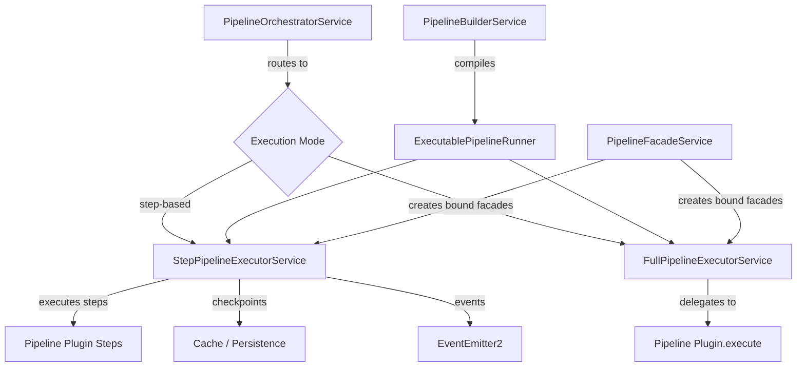
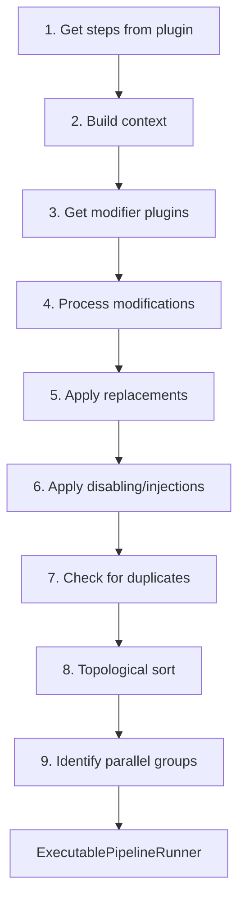
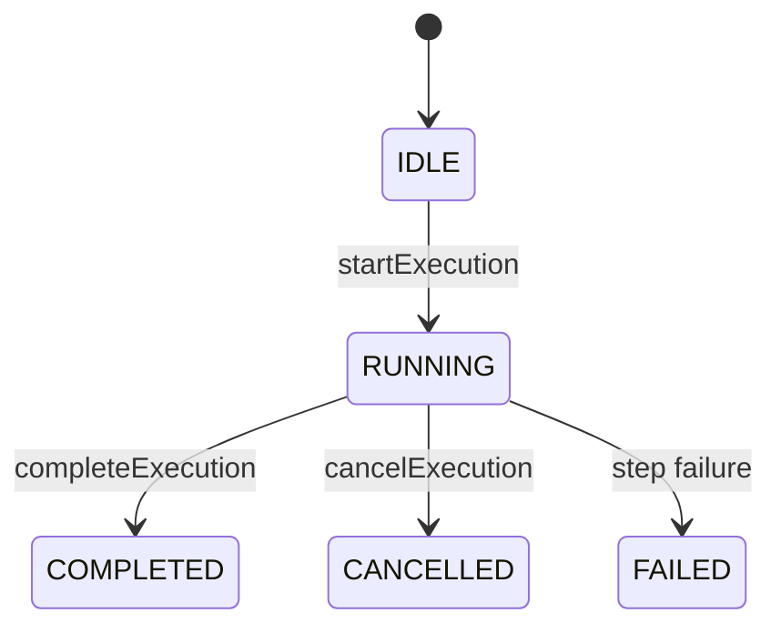

# Pipeline Module

The Pipeline Module (`@ever-works/agent/pipeline`) orchestrates multi-step directory generation workflows. It compiles pipeline definitions from plugins, resolves step dependencies using topological sorting, supports parallel execution groups, checkpointing for resume, and two execution modes (step-based and self-managed).

## Module Structure

```
packages/agent/src/pipeline/
├── index.ts                              # Barrel exports
├── pipeline.module.ts                    # PipelineModule NestJS module
├── executable-pipeline.class.ts          # ExecutablePipelineRunner (runtime state)
├── pipeline-builder.service.ts           # PipelineBuilderService (compilation)
├── pipeline-orchestrator.service.ts      # PipelineOrchestratorService (entry point)
├── pipeline-facade.service.ts            # PipelineFacadeService (bound facade creation)
├── full-pipeline-executor.service.ts     # FullPipelineExecutorService (self-managed)
└── step-pipeline-executor.service.ts     # StepPipelineExecutorService (step-by-step)
```

## Architecture



## Execution Modes

The pipeline system supports two distinct execution modes:

### Step-Based Execution

The default mode where the platform controls step ordering and execution. Pipeline plugins define individual steps, and the `StepPipelineExecutorService` executes them in topological order.

**Features**:

- Platform-managed step ordering via topological sort
- Parallel execution of independent steps
- Checkpointing between steps for crash recovery
- Step-level progress reporting
- Skip/only step filtering
- Concurrency limiting

### Self-Managed (Full) Execution

An alternative mode where a pipeline plugin takes full control. The `FullPipelineExecutorService` delegates the entire execution to the plugin's `execute()` method.

**Features**:

- Plugin controls all execution logic
- Suitable for pipelines that need custom ordering or complex branching
- Result validation by the platform
- Cancellation support via abort signals

## Key Components

### PipelineOrchestratorService

The entry point that routes pipeline execution to the appropriate executor.

```typescript
interface PipelineExecutionOptions {
	directoryId: string;
	userId: string;
	pipelinePluginId?: string; // Explicit plugin override
	skipSteps?: string[]; // Steps to skip
	onlySteps?: string[]; // Run only these steps
	resumeFromCheckpoint?: boolean; // Resume from last checkpoint
}
```

**Plugin resolution priority**:

1. Explicit plugin ID from options
2. Plugin marked as `defaultForCapabilities` for the `pipeline` capability
3. First enabled pipeline plugin

### PipelineBuilderService

Compiles a pipeline definition from a plugin into an executable form. The build process has 9 steps:



**Step modification positions**: Modifier plugins can alter the pipeline using these position directives:

| Position  | Description                         |
| --------- | ----------------------------------- |
| `replace` | Replaces an existing step entirely  |
| `before`  | Injects a step before a target step |
| `after`   | Injects a step after a target step  |
| `disable` | Removes a step from the pipeline    |
| `first`   | Prepends a step to the beginning    |
| `last`    | Appends a step to the end           |

**Dependency resolution**: Steps declare dependencies on other steps. The builder performs a topological sort to determine execution order and detects circular dependencies (`CircularDependencyError`) and missing dependencies (`MissingDependencyError`).

**Parallel groups**: After sorting, the builder identifies groups of steps with no mutual dependencies that can run concurrently.

### ExecutablePipelineRunner

The runtime representation of a compiled pipeline. Manages state transitions and step tracking.

**State machine**:



**Events emitted** (`PipelineRuntimeEvents`):

| Event                 | Payload                         | When              |
| --------------------- | ------------------------------- | ----------------- |
| `execution:started`   | `{ directoryId, totalSteps }`   | Pipeline begins   |
| `execution:completed` | `{ directoryId, result }`       | Pipeline finishes |
| `execution:cancelled` | `{ directoryId, reason }`       | User cancels      |
| `step:started`        | `{ stepId, stepIndex }`         | Step begins       |
| `step:completed`      | `{ stepId, stepIndex, result }` | Step finishes     |
| `step:failed`         | `{ stepId, stepIndex, error }`  | Step errors       |
| `step:skipped`        | `{ stepId, reason }`            | Step skipped      |
| `state:changed`       | `{ from, to }`                  | State transition  |

### StepPipelineExecutorService

Executes pipeline steps one by one (or in parallel groups) with checkpointing.

**Checkpoint system**:

```typescript
interface CheckpointData {
	directoryId: string;
	pipelinePluginId: string;
	completedStepIds: string[];
	stepResults: Record<string, unknown>;
	savedAt: string; // ISO timestamp
	schemaVersion: number; // For migration compatibility
}
```

Checkpoints are serialized with `superjson` (supporting Maps, Sets, Dates, etc.) and stored via the cache system. When resuming from a checkpoint:

1. Completed steps are skipped
2. Previous step results are restored
3. Execution continues from the next incomplete step

**Step filtering**:

- `skipSteps`: Array of step IDs to skip
- `onlySteps`: Array of step IDs to exclusively run (all others are skipped)
- `canSkipStep()`: Per-step flag from the pipeline definition

**Concurrency**: Parallel step groups are executed with concurrency limits to avoid overwhelming external APIs.

### PipelineFacadeService

Creates pre-bound facade instances for use within pipeline steps. Each facade is automatically configured with the current directory and user context.

```typescript
interface FacadeBindingContext {
	directoryId: string;
	userId: string;
	providerOverrides?: Record<string, string>;
}
```

**Bound facades created**:

| Facade                   | Purpose                                     |
| ------------------------ | ------------------------------------------- |
| AI Facade                | AI operations (generate, classify, extract) |
| Search Facade            | Web search during generation                |
| Screenshot Facade        | Capture item screenshots                    |
| Content Extractor Facade | Extract content from URLs                   |
| Data Source Facade       | Query external data sources                 |

Pipeline steps receive these bound facades so they never need to manually pass `userId` and `directoryId` on every call.

### FullPipelineExecutorService

Handles self-managed pipeline execution by delegating to the plugin's `execute()` method.

```typescript
// The plugin receives full control
await pipelinePlugin.execute({
	directory,
	facades: boundFacades,
	abortSignal,
	onProgress: (progress) => {
		/* update status */
	}
});
```

The executor validates the result after the plugin returns and emits completion events.

## PipelineModule

```typescript
@Module({
	imports: [PluginsModule, FacadesModule, DatabaseModule, CacheModule],
	providers: [
		PipelineOrchestratorService,
		PipelineBuilderService,
		PipelineFacadeService,
		StepPipelineExecutorService,
		FullPipelineExecutorService
	],
	exports: [PipelineOrchestratorService]
})
export class PipelineModule {}
```

## Usage

### Running a Pipeline

```typescript
import { PipelineOrchestratorService } from '@ever-works/agent/pipeline';

@Injectable()
export class GenerationService {
	constructor(private readonly orchestrator: PipelineOrchestratorService) {}

	async generateDirectory(directoryId: string, userId: string) {
		const result = await this.orchestrator.execute({
			directoryId,
			userId
		});
		return result;
	}

	async resumeGeneration(directoryId: string, userId: string) {
		const result = await this.orchestrator.execute({
			directoryId,
			userId,
			resumeFromCheckpoint: true
		});
		return result;
	}

	async runSpecificSteps(directoryId: string, userId: string) {
		const result = await this.orchestrator.execute({
			directoryId,
			userId,
			onlySteps: ['search', 'extract', 'generate-items']
		});
		return result;
	}
}
```

### Pipeline Plugin Contract

Pipeline plugins implement the `IPipelinePlugin` interface from `@ever-works/plugin`:

```typescript
interface IPipelinePlugin {
	// Step-based mode
	getSteps(context: PipelineContext): PipelineStep[];

	// Self-managed mode (optional)
	execute?(context: PipelineExecutionContext): Promise<PipelineResult>;

	// Result extraction from step outputs
	extractResult?(stepResults: Record<string, unknown>): PipelineResult;

	// Execution mode declaration
	getExecutionMode?(): 'step' | 'full';
}
```
