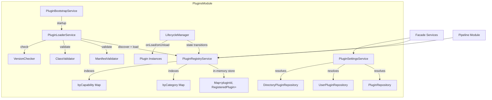
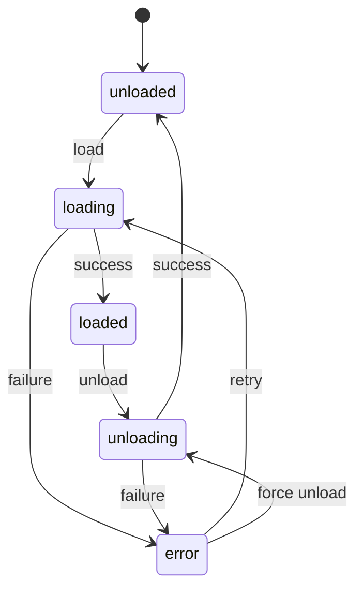
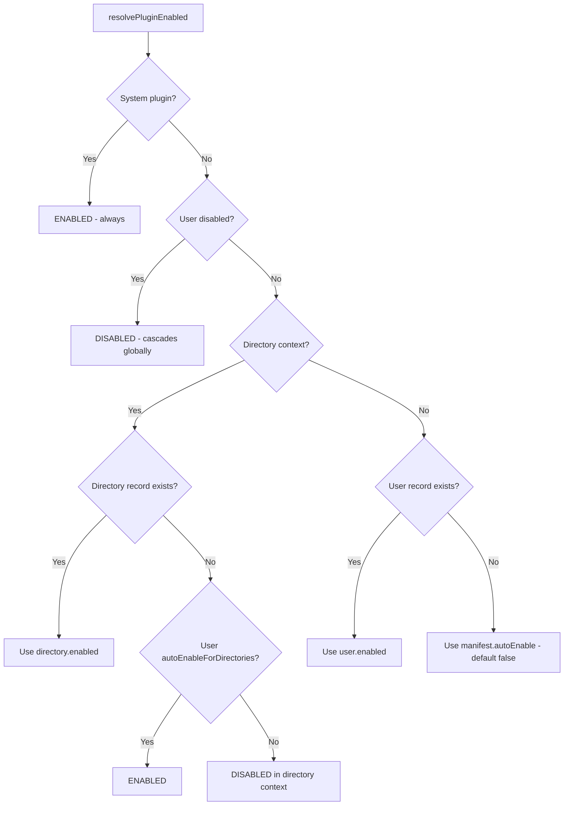

# Plugins Module

The Plugins Module (`@ever-works/agent/plugins`) is the core plugin infrastructure for the Ever Works platform. It handles plugin discovery, loading, lifecycle management, settings resolution, and enable/disable scoping. This module is `@Global()` and provides the foundation upon which all facades and pipeline operations depend.

## Module Structure

```
packages/agent/src/plugins/
├── index.ts                                    # Barrel exports
├── plugins.module.ts                           # PluginsModule (Global, dynamic)
├── plugins.constants.ts                        # Constants, state machine, events
├── interfaces/
│   └── plugins-module-options.interface.ts      # Module configuration interfaces
├── entities/
│   ├── plugin.entity.ts                        # PluginEntity (admin-level)
│   ├── user-plugin.entity.ts                   # UserPluginEntity (user-level)
│   └── directory-plugin.entity.ts              # DirectoryPluginEntity (directory-level)
├── repositories/
│   ├── plugin.repository.ts                    # PluginRepository
│   ├── user-plugin.repository.ts               # UserPluginRepository
│   └── directory-plugin.repository.ts          # DirectoryPluginRepository
└── services/
    ├── plugin-registry.service.ts              # In-memory registry with fast lookups
    ├── plugin-loader.service.ts                # Discovery and loading from filesystem
    ├── plugin-lifecycle-manager.service.ts      # State machine and lifecycle hooks
    ├── plugin-settings.service.ts              # 4-level settings resolution
    ├── plugin-manifest-validator.service.ts     # Manifest validation
    ├── plugin-version-checker.service.ts        # Version compatibility checks
    ├── plugin-class-validator.service.ts        # Plugin class interface validation
    ├── plugin-context-factory.service.ts        # PluginContext creation
    ├── plugin-bootstrap.service.ts              # Startup orchestration
    ├── custom-capability-registry.service.ts    # Dynamic capability registration
    ├── plugin-operations.service.ts             # High-level plugin operations
    └── settings-schema-validator.service.ts     # JSON Schema validation for settings
```

## Architecture



## Plugin State Machine

Plugins transition through well-defined states:



**Valid state transitions** (defined in `plugins.constants.ts`):

| From        | To                     |
| ----------- | ---------------------- |
| `unloaded`  | `loading`              |
| `loading`   | `loaded`, `error`      |
| `loaded`    | `unloading`            |
| `unloading` | `unloaded`, `error`    |
| `error`     | `loading`, `unloading` |

## Key Components

### PluginsModule (Dynamic Module)

A `@Global()` NestJS module with `forRoot()` and `forRootAsync()` static methods:

```typescript
// Synchronous configuration
PluginsModule.forRoot({
	pluginPaths: ['./plugins'],
	builtInPlugins: [{ plugin: MyPlugin, manifest: myManifest }],
	platformVersion: '1.0.0'
});

// Async configuration (factory pattern)
PluginsModule.forRootAsync({
	imports: [ConfigModule],
	useFactory: (config: ConfigService) => ({
		pluginPaths: config.get('PLUGIN_PATHS')
	}),
	inject: [ConfigService]
});
```

**PluginsModuleOptions** (17 properties):

| Property              | Type             | Description                           |
| --------------------- | ---------------- | ------------------------------------- |
| `pluginPaths`         | `string[]`       | Filesystem paths to scan for plugins  |
| `builtInPlugins`      | `PluginModule[]` | Programmatically registered plugins   |
| `platformVersion`     | `string`         | For version compatibility checks      |
| `autoDiscover`        | `boolean`        | Enable filesystem scanning            |
| `autoLoad`            | `boolean`        | Automatically load discovered plugins |
| `loadTimeout`         | `number`         | Plugin load timeout (ms)              |
| `enableWatcher`       | `boolean`        | Watch for plugin file changes         |
| `secretEncryptionKey` | `string`         | Key for encrypting secret settings    |

**PLUGIN_ENTITIES**: The module exports `[PluginEntity, UserPluginEntity, DirectoryPluginEntity]` for TypeORM registration.

### PluginRegistryService

An in-memory registry providing O(1) lookups by plugin ID and fast filtering by category or capability.

**Data structures**:

- `plugins: Map<string, RegisteredPlugin>` -- Primary store
- `byCategory: Map<PluginCategory, Set<string>>` -- Category index
- `byCapability: Map<string, Set<string>>` -- Capability index

**Key methods**:

| Method                                                | Description                                     |
| ----------------------------------------------------- | ----------------------------------------------- |
| `register(plugin, manifest, options)`                 | Registers a plugin and builds indexes           |
| `unregister(pluginId)`                                | Removes a plugin and cleans up indexes          |
| `get(pluginId)`                                       | Returns `RegisteredPlugin` or `undefined`       |
| `getByCategory(category)`                             | All plugins in a category                       |
| `getByCapability(capability)`                         | All plugins with a capability                   |
| `getDefaultForCapability(capability)`                 | First loaded plugin declaring itself as default |
| `getReady()`                                          | All plugins in `loaded` state                   |
| `updateState(pluginId, newState, error?)`             | Transitions state and records history           |
| `getDefaultForCapabilityScoped(cap, dirId?, userId?)` | Scoped default with DB lookups                  |
| `getEnabledPluginsScoped(cap?, dirId?, userId?)`      | All enabled plugins for scope                   |
| `isPluginEnabledForScope(pluginId, dirId?, userId?)`  | Checks enable status with scope resolution      |

**RegisteredPlugin interface**:

```typescript
interface RegisteredPlugin {
	plugin: IPlugin; // Plugin instance
	manifest: PluginManifest; // Validated manifest
	state: PluginState; // Current state
	builtIn: boolean; // Built-in vs. discovered
	installPath?: string; // Filesystem path
	registeredAt: number; // Registration timestamp
	loadedAt?: number; // Load completion timestamp
	stateHistory: PluginStateTransition[]; // Full state transition log
	error?: Error | string; // Last error
}
```

### Enable Resolution Algorithm

The `resolvePluginEnabled()` function is the single source of truth for determining if a plugin is active:



### PluginLoaderService

Discovers plugins on the filesystem and loads them into the registry.

**Discovery flow**:

1. Scans configured `pluginPaths` directories
2. Reads `package.json` from each subdirectory
3. Validates `everworks.plugin` manifest section
4. Returns `DiscoveredPlugin[]`

**Loading flow**:

1. Checks version compatibility
2. Dynamic-imports the plugin module
3. Finds the plugin class (default export, named export, or class scan)
4. Validates the plugin class against the manifest
5. Merges runtime manifest (from `plugin.getManifest()`) with package.json manifest
6. Registers in the in-memory registry
7. Persists to the database via `PluginRepository`

**Dependency resolution**: The loader performs a topological sort across all plugins (built-in + discovered) based on declared dependencies. Circular dependencies are detected and reported.

**Default plugin paths** (searched in order):

```typescript
const DEFAULT_PLUGIN_PATHS = [
	'./plugins',
	'./node_modules/@ever-works/plugins',
	'../plugins',
	'../../packages/plugins',
	'./packages/plugins'
];
```

### PluginLifecycleManagerService

Manages plugin state transitions and lifecycle hooks.

| Method                        | Description                                                           |
| ----------------------------- | --------------------------------------------------------------------- |
| `callOnLoad(pluginId)`        | Calls `plugin.onLoad(context)` with a `PluginContext`                 |
| `unload(pluginId)`            | Calls `plugin.onUnload()`, unregisters custom capabilities, cleans up |
| `shutdownAll()`               | Gracefully unloads all plugins (used during module destruction)       |
| `isValidTransition(from, to)` | Validates state transitions against the state machine                 |
| `getValidTransitions(from)`   | Returns valid target states from a given state                        |

### PluginSettingsService

The 4-level settings resolution engine. See [Facades Module](./facades-module.md) for how facades consume resolved settings.

**Resolution hierarchy** (highest to lowest priority):

| Level | Source                | When Used                                             |
| ----- | --------------------- | ----------------------------------------------------- |
| 1     | Directory settings    | `directoryId` provided, `configMode !== 'admin-only'` |
| 2     | User settings         | `userId` provided, `configMode !== 'admin-only'`      |
| 3     | Admin settings        | Always checked                                        |
| 4     | Environment variables | `x-envVar` schema annotation maps to `process.env`    |
| 5     | Plugin defaults       | `default` values from JSON Schema                     |

**Configuration modes**:

| Mode               | Description                                                             |
| ------------------ | ----------------------------------------------------------------------- |
| `hybrid` (default) | Users and directories can override admin settings                       |
| `admin-only`       | Only admin-level settings are used; user/directory settings are ignored |

**Security features**:

- `x-envVar` fields are never stored in the database; they are read exclusively from environment variables
- `x-secret` fields are stored in separate `secretSettings` columns
- Masked placeholder values (`********`) are stripped during updates to prevent accidental overwrite

**Scope validation**: Settings with `x-scope: 'directory'` can only be updated at the directory level. Settings with `x-scope: 'user'` cannot be updated at the global level.

**Key methods**:

| Method                                               | Description                               |
| ---------------------------------------------------- | ----------------------------------------- |
| `getResolvedSettings(pluginId, options)`             | Full resolution with source tracking      |
| `getSettings(pluginId, options)`                     | Plain key-value settings (no source info) |
| `updateAdminSettings(pluginId, settings)`            | Update global settings                    |
| `updateUserSettings(pluginId, userId, settings)`     | Update user-level settings                |
| `updateDirectorySettings(pluginId, dirId, settings)` | Update directory-level settings           |
| `getSettingsSchema(pluginId)`                        | Raw JSON Schema                           |
| `getSettingsSchemaForContext(pluginId, context)`     | Schema filtered by scope context          |
| `validateSettings(pluginId, settings, options)`      | Validate against schema and scope         |

## Plugin Entities

### PluginEntity (Admin Level)

| Column              | Type               | Description                     |
| ------------------- | ------------------ | ------------------------------- |
| `id`                | `uuid` (PK)        | Auto-generated                  |
| `pluginId`          | `varchar` (unique) | Plugin identifier               |
| `name`              | `varchar`          | Display name                    |
| `version`           | `varchar`          | Installed version               |
| `category`          | `varchar`          | Plugin category                 |
| `capabilities`      | `json`             | Array of capability strings     |
| `manifest`          | `json`             | Full manifest snapshot          |
| `state`             | `varchar`          | Current state                   |
| `builtIn`           | `boolean`          | Whether built-in                |
| `settings`          | `json`             | Admin-level settings            |
| `secretSettings`    | `json`             | Admin-level secrets (encrypted) |
| `configurationMode` | `varchar`          | `hybrid` or `admin-only`        |

### UserPluginEntity (User Level)

| Column                     | Type        | Description                    |
| -------------------------- | ----------- | ------------------------------ |
| `id`                       | `uuid` (PK) | Auto-generated                 |
| `userId`                   | `varchar`   | Loose coupling (no FK)         |
| `pluginId`                 | `varchar`   | Plugin identifier              |
| `pluginEntityId`           | `uuid` (FK) | References PluginEntity        |
| `enabled`                  | `boolean`   | User-level enable toggle       |
| `autoEnableForDirectories` | `boolean`   | Auto-enable in new directories |
| `settings`                 | `json`      | User-level settings            |
| `secretSettings`           | `json`      | User-level secrets             |
| `metadata`                 | `json`      | User-specific metadata         |

### DirectoryPluginEntity (Directory Level)

| Column             | Type                 | Description                                  |
| ------------------ | -------------------- | -------------------------------------------- |
| `id`               | `uuid` (PK)          | Auto-generated                               |
| `directoryId`      | `varchar`            | Loose coupling (no FK)                       |
| `pluginId`         | `varchar`            | Plugin identifier                            |
| `pluginEntityId`   | `uuid` (FK)          | References PluginEntity                      |
| `enabled`          | `boolean`            | Directory-level enable toggle                |
| `activeCapability` | `varchar` (nullable) | Marks this plugin as active for a capability |
| `settings`         | `json`               | Directory-level settings                     |
| `secretSettings`   | `json`               | Directory-level secrets                      |
| `metadata`         | `json`               | Directory-specific metadata                  |
| `priority`         | `int`                | Ordering priority                            |

## Plugin Events

Constants defined in `plugins.constants.ts`:

| Event                     | Description                   |
| ------------------------- | ----------------------------- |
| `plugin.registered`       | Plugin added to registry      |
| `plugin.unregistered`     | Plugin removed from registry  |
| `plugin.loaded`           | Plugin `onLoad` completed     |
| `plugin.unloaded`         | Plugin `onUnload` completed   |
| `plugin.state_changed`    | Any state transition          |
| `plugin.error`            | Plugin error occurred         |
| `plugin.settings_changed` | Settings updated at any scope |

## Setting Source Priority

```typescript
const SETTING_SOURCE_PRIORITY: Record<SettingSource, number> = {
	directory: 1, // Highest
	user: 2,
	admin: 3,
	env: 4,
	default: 5 // Lowest
};
```

## Usage

### Checking Plugin Availability

```typescript
import { PluginRegistryService } from '@ever-works/agent/plugins';

@Injectable()
export class MyService {
	constructor(private readonly registry: PluginRegistryService) {}

	isSearchAvailable(): boolean {
		return this.registry.getByCapability('search').some((p) => p.state === 'loaded');
	}

	getAvailableAiProviders(): string[] {
		return this.registry
			.getByCapability('ai')
			.filter((p) => p.state === 'loaded')
			.map((p) => p.manifest.name);
	}
}
```

### Managing Plugin Settings

```typescript
import { PluginSettingsService } from '@ever-works/agent/plugins';

@Injectable()
export class SettingsController {
	constructor(private readonly settings: PluginSettingsService) {}

	async updateUserApiKey(userId: string, pluginId: string, apiKey: string) {
		await this.settings.updateUserSettings(
			pluginId,
			userId,
			{
				apiKey
			},
			{
				secretKeys: ['apiKey']
			}
		);
	}

	async getDirectorySettings(pluginId: string, directoryId: string, userId: string) {
		return this.settings.getResolvedSettings(pluginId, {
			directoryId,
			userId,
			includeSecrets: false
		});
	}
}
```
