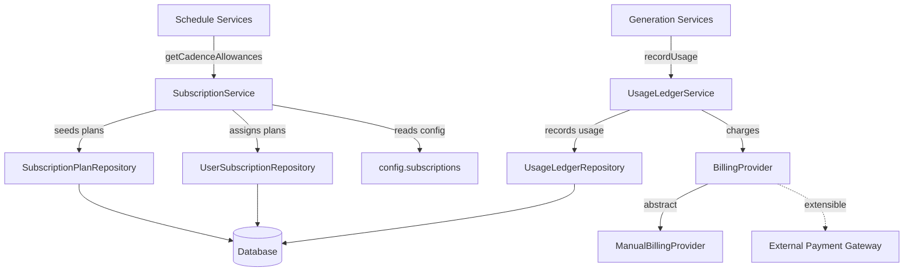

# Subscriptions Module

The Subscriptions Module (`@ever-works/agent/subscriptions`) manages subscription plans, usage-based billing, and the billing provider abstraction. It handles plan seeding, user plan assignment, cadence allowance resolution, and usage ledger recording.

## Module Structure

```
packages/agent/src/subscriptions/
├── index.ts                    # Barrel exports
├── subscriptions.module.ts     # NestJS module definition
├── subscription.service.ts     # SubscriptionService (plan management)
├── usage-ledger.service.ts     # UsageLedgerService (usage recording)
└── billing/
    └── billing.provider.ts     # BillingProvider abstract class + ManualBillingProvider
```

## Architecture



## Key Components

### SubscriptionService

The `@Injectable()` service implementing `OnModuleInit` for automatic plan seeding at startup.

#### Plan Seeding

On module initialization, the service seeds the database with the three default plans if they do not already exist:

| Plan         | Code       | Description                                 |
| ------------ | ---------- | ------------------------------------------- |
| **Free**     | `free`     | Basic access with limited features          |
| **Standard** | `standard` | Standard features with more generous limits |
| **Premium**  | `premium`  | Full access to all features                 |

```typescript
private readonly PLAN_SEED_DATA: Array<{
    code: SubscriptionPlanCode;
    name: string;
    description: string;
    monthlyPriceCents: number;
    yearlyPriceCents: number;
    allowedCadences: WorkScheduleCadence[];
}>;
```

Each plan defines which schedule cadences it allows. For example, the Free plan might only allow `monthly` updates, while Premium allows `daily`.

#### Key Methods

| Method                 | Signature                                                   | Description                                                                                          |
| ---------------------- | ----------------------------------------------------------- | ---------------------------------------------------------------------------------------------------- |
| `seedPlans`            | `() => Promise<void>`                                       | Creates default plans if they do not exist (called on module init)                                   |
| `resolvePlanForUser`   | `(userId: string) => Promise<SubscriptionPlan>`             | Resolves the active plan for a user. Falls back to the free plan if no active subscription is found. |
| `getCadenceAllowances` | `(userId: string) => Promise<CadenceAllowances>`            | Returns which schedule cadences the user's plan permits, used by the scheduling UI.                  |
| `assignPlanToUser`     | `(userId, planCode, options?) => Promise<UserSubscription>` | Creates or updates a user's subscription to a specific plan.                                         |
| `requiresUsageBilling` | `(userId: string) => Promise<boolean>`                      | Checks if the user's plan requires pay-per-use billing for scheduled updates.                        |

#### Cadence Allowances

The `getCadenceAllowances` method returns an object mapping each cadence to whether it is allowed under the user's current plan:

```typescript
interface CadenceAllowances {
	daily: boolean;
	weekly: boolean;
	biweekly: boolean;
	monthly: boolean;
}
```

This is used by the frontend to enable/disable cadence options in the schedule configuration UI.

### UsageLedgerService

Records usage-based billing events when subscriptions are configured for pay-per-use.

```typescript
type RecordUsageOptions = {
	userId: string;
	workId: string;
	schedule?: WorkSchedule | null;
	triggerType: UsageLedgerTriggerType;
	billingMode: WorkScheduleBillingMode;
	generationHistoryId?: string;
};
```

**Key behavior**:

1. **Guard check**: If subscriptions are disabled globally (`config.subscriptions.isEnabled() === false`) or the billing mode is not `usage`, the method returns `null` (no-op).
2. **Record creation**: Creates a `UsageLedgerEntry` with the configured price per use (`config.subscriptions.getPayPerUsePriceCents()`).
3. **Billing provider call**: Delegates to `billingProvider.recordUsageCharge(entry)` for external payment processing.

```typescript
const entry = await usageLedger.recordUsage({
	userId,
	workId,
	schedule,
	triggerType: UsageLedgerTriggerType.SCHEDULED,
	billingMode: WorkScheduleBillingMode.USAGE,
	generationHistoryId: history.id
});
```

### BillingProvider

An abstract class defining the billing provider contract:

```typescript
abstract class BillingProvider {
	abstract getDefaultCurrency(): string;

	// Optional hook for forwarding charges to an external gateway
	async recordUsageCharge(_entry: UsageLedgerEntry): Promise<void> {
		return; // No-op by default
	}
}
```

#### ManualBillingProvider

The default implementation that reads currency from configuration without connecting to any external payment system:

```typescript
@Injectable()
class ManualBillingProvider extends BillingProvider {
	getDefaultCurrency(): string {
		return config.billing.getDefaultCurrency(); // e.g., 'usd'
	}
}
```

To integrate with an external payment gateway (e.g., Stripe), create a new class extending `BillingProvider` that implements `recordUsageCharge()` and register it in the module.

## SubscriptionsModule

```typescript
@Module({
	imports: [DatabaseModule],
	providers: [
		SubscriptionService,
		UsageLedgerService,
		{
			provide: BillingProvider,
			useClass: ManualBillingProvider
		}
	],
	exports: [SubscriptionService, UsageLedgerService]
})
export class SubscriptionsModule {}
```

The `BillingProvider` token is bound to `ManualBillingProvider` by default. Override this binding to plug in a real payment provider.

## Related Entities

### SubscriptionPlan Entity

| Column              | Type               | Description                                         |
| ------------------- | ------------------ | --------------------------------------------------- |
| `id`                | `uuid` (PK)        | Auto-generated                                      |
| `code`              | `varchar` (unique) | Plan identifier (`free`, `standard`, `premium`)     |
| `name`              | `varchar`          | Display name                                        |
| `description`       | `varchar`          | Plan description                                    |
| `monthlyPriceCents` | `int`              | Monthly price in cents                              |
| `yearlyPriceCents`  | `int`              | Yearly price in cents                               |
| `allowedCadences`   | `json`             | Array of allowed `WorkScheduleCadence` values  |
| `isActive`          | `boolean`          | Whether the plan is available for new subscriptions |

### UserSubscription Entity

| Column                   | Type                 | Description                                  |
| ------------------------ | -------------------- | -------------------------------------------- |
| `id`                     | `uuid` (PK)          | Auto-generated                               |
| `userId`                 | `uuid` (FK)          | Subscriber                                   |
| `planId`                 | `uuid` (FK)          | References SubscriptionPlan                  |
| `status`                 | `enum`               | `active`, `cancelled`, `expired`, `past_due` |
| `billingProvider`        | `enum`               | `manual`, `stripe`, `paddle`                 |
| `currentPeriodStart`     | `timestamp`          | Billing period start                         |
| `currentPeriodEnd`       | `timestamp`          | Billing period end                           |
| `externalSubscriptionId` | `varchar` (nullable) | External provider reference                  |

### UsageLedgerEntry Entity

| Column                | Type                 | Description                                |
| --------------------- | -------------------- | ------------------------------------------ |
| `id`                  | `uuid` (PK)          | Auto-generated                             |
| `userId`              | `varchar`            | User reference                             |
| `workId`         | `varchar`            | Work reference                        |
| `scheduleId`          | `varchar` (nullable) | Schedule reference                         |
| `triggerType`         | `enum`               | `manual`, `scheduled`, `api`               |
| `billingMode`         | `enum`               | `included`, `usage`                        |
| `units`               | `int`                | Number of units consumed                   |
| `amountCents`         | `int`                | Charge amount in cents                     |
| `currency`            | `varchar`            | Currency code (e.g., `usd`)                |
| `status`              | `enum`               | `pending`, `charged`, `failed`, `refunded` |
| `generationHistoryId` | `varchar` (nullable) | Links to generation run                    |
| `metadata`            | `json` (nullable)    | Additional data (e.g., cadence)            |

## Usage

### Checking Plan Allowances

```typescript
import { SubscriptionService } from '@ever-works/agent/subscriptions';

@Injectable()
export class ScheduleService {
	constructor(private readonly subscriptions: SubscriptionService) {}

	async canUseCadence(userId: string, cadence: WorkScheduleCadence) {
		const allowances = await this.subscriptions.getCadenceAllowances(userId);
		return allowances[cadence] === true;
	}
}
```

### Recording Usage

```typescript
import { UsageLedgerService } from '@ever-works/agent/subscriptions';

@Injectable()
export class GenerationService {
	constructor(private readonly usageLedger: UsageLedgerService) {}

	async afterGeneration(options: {
		userId: string;
		workId: string;
		schedule: WorkSchedule;
		historyId: string;
	}) {
		await this.usageLedger.recordUsage({
			userId: options.userId,
			workId: options.workId,
			schedule: options.schedule,
			triggerType: UsageLedgerTriggerType.SCHEDULED,
			billingMode: options.schedule.billingMode,
			generationHistoryId: options.historyId
		});
	}
}
```

### Extending the Billing Provider

```typescript
import { BillingProvider } from '@ever-works/agent/subscriptions';

@Injectable()
export class StripeBillingProvider extends BillingProvider {
    constructor(private readonly stripe: StripeClient) {
        super();
    }

    getDefaultCurrency(): string {
        return 'usd';
    }

    async recordUsageCharge(entry: UsageLedgerEntry): Promise<void> {
        await this.stripe.invoiceItems.create({
            customer: entry.userId, // Resolve to Stripe customer ID
            amount: entry.amountCents,
            currency: entry.currency,
            description: `Work update: ${entry.workId}`,
        });
    }
}

// In your module:
{
    provide: BillingProvider,
    useClass: StripeBillingProvider,
}
```
