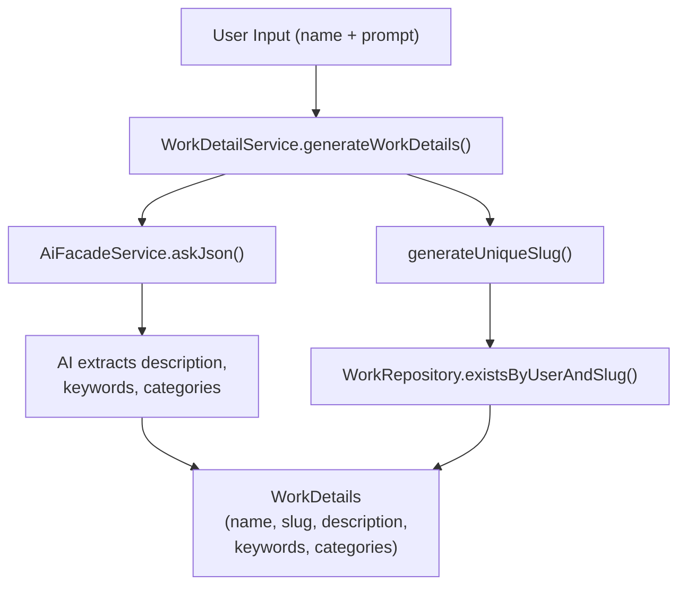

# WorkDetailService Deep Dive

## Overview

The `WorkDetailService` is responsible for extracting structured metadata from a work name and user prompt using AI. It generates descriptions, keywords, categories, and unique slugs for new works, providing the foundational metadata that drives the rest of the work creation pipeline.

## Architecture

This service sits at the beginning of the work creation flow. When a user creates a new work by providing a name and prompt, the `WorkDetailService` calls the AI facade to extract semantically meaningful details and then ensures the resulting slug is unique per user. It acts as a pure extraction service with no side effects beyond slug uniqueness checks.



## API Reference

### Methods

#### `generateWorkDetails(name, prompt, user, aiProvider?)`

Extracts work details from a name and prompt using AI, then generates a unique slug.

| Parameter    | Type                | Description                                        |
| ------------ | ------------------- | -------------------------------------------------- |
| `name`       | `string`            | The work name provided by the user            |
| `prompt`     | `string`            | The user prompt describing the work's purpose |
| `user`       | `User`              | The user entity creating the work             |
| `aiProvider` | `string` (optional) | Override for the AI provider to use                |

**Returns:** `Promise<WorkDetails>`

```typescript
interface WorkDetails {
	name: string;
	slug: string;
	description: string;
	keywords: string[];
	categories: string[];
}
```

## Implementation Details

### AI Prompt Design

The service uses a carefully crafted prompt (`DIRECTORY_DETAIL_PROMPT`) that instructs the AI to:

- Generate a clear 1-2 sentence description without filler phrases like "This work is about..."
- Extract relevant, specific keywords
- Identify high-level category names
- Avoid marketing language in favor of factual descriptions

### Zod Schema Validation

The AI output is validated against `workDetailSchema`, a Zod schema ensuring:

- `description` is a string
- `keywords` is an array of strings
- `categories` is a nullable array of strings

### Slug Generation

The `generateUniqueSlug` method ensures no two works for the same user share a slug:

1. Slugifies the work name using `slugifyText()`
2. Checks `WorkRepository.existsByUserAndSlug()`
3. If a conflict exists, appends incrementing numbers (`-1`, `-2`, etc.) until a unique slug is found

### Output Sanitization

All AI-generated content passes through sanitization utilities (`sanitizeDescription`, `sanitizeStringArray`) to strip newlines and control characters. This is critical for downstream GitHub API compatibility where multiline strings in metadata fields can cause failures.

## Database Interactions

| Repository            | Method                              | Purpose                                                |
| --------------------- | ----------------------------------- | ------------------------------------------------------ |
| `WorkRepository` | `existsByUserAndSlug(userId, slug)` | Check for slug conflicts during unique slug generation |

## Event System

This service does not emit or consume any events. It is a stateless extraction service.

## Error Handling

The service implements a **graceful fallback strategy**:

- If the AI extraction call fails for any reason, the service falls back to basic details:
    - Description: `"Work for {name}"`
    - Keywords: the work name lowercased
    - Categories: empty array
- All errors are logged with full stack traces via the NestJS `Logger`
- The slug generation still runs normally even in fallback mode

## Usage Examples

```typescript
// Inject the service
constructor(private readonly detailService: WorkDetailService) {}

// Extract details for a new work
const details = await this.detailService.generateWorkDetails(
    'AI Developer Tools',
    'A curated collection of AI-powered tools for software developers',
    currentUser,
);

// Result:
// {
//     name: 'AI Developer Tools',
//     slug: 'ai-developer-tools',
//     description: 'AI-powered tools designed for software developers...',
//     keywords: ['ai', 'developer-tools', 'coding', 'automation'],
//     categories: ['Developer Tools', 'Artificial Intelligence'],
// }

// With AI provider override
const details = await this.detailService.generateWorkDetails(
    'Best CRMs',
    'Top CRM platforms for small businesses',
    currentUser,
    'anthropic',
);
```

## Configuration

| Setting            | Description                                                                                  |
| ------------------ | -------------------------------------------------------------------------------------------- |
| AI Provider        | Configured via `AiFacadeService`; can be overridden per call with the `aiProvider` parameter |
| Temperature        | Hardcoded to `0` for deterministic, consistent output                                        |
| Routing Complexity | Set to `'simple'` to use cost-efficient models for this straightforward extraction task      |

## Related Services

- [Work Lifecycle](/agent-services/work-lifecycle) -- consumes `WorkDetails` during work creation
- [Work Import Service](/agent-services/work-import-service) -- alternative path that bypasses detail extraction for imported works
- [Generator Form Schema](/agent-services/generator-form-schema) -- validates AI provider configuration before generation
