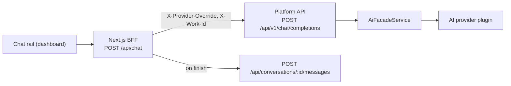

# AI Conversation API

The AI Conversation API provides a stateless, streaming chat endpoint for interacting with the platform's AI. It can be scoped to a specific work for context-aware responses.

All endpoints require JWT authentication.

:::caution `POST /api/ai-conversations/chat/stream` is not present in the current API

The NDJSON route documented under **[Endpoint](#endpoint)** and **[Chat Stream](#chat-stream)** further down was replaced and no longer exists. `apps/api/src/ai-conversation/` registers exactly two controllers — `ConversationController` (`@Controller('api/conversations')`) and `OpenAiCompatController` (`@Controller('api/v1')`) — so a request to `/api/ai-conversations/chat/stream` gets a `404`.

The shipped surfaces are documented first, below:

- **[Chat completions](#chat-completions)** — `POST /api/v1/chat/completions`, the OpenAI-compatible engine the dashboard chat itself runs on.
- **[Conversations](#conversations)** — `/api/conversations`, the persisted threads and their messages.

The original NDJSON sections are kept after them, unchanged, for anyone migrating off that shape.

:::

## Shipped endpoints

| Method   | Endpoint                          | Description                                                                 |
| -------- | --------------------------------- | --------------------------------------------------------------------------- |
| `POST`   | `/api/v1/chat/completions`        | OpenAI-compatible chat completion. Streaming (SSE) or single JSON response. |
| `GET`    | `/api/conversations`              | List your conversations, newest activity first.                             |
| `POST`   | `/api/conversations`              | Create a conversation.                                                      |
| `GET`    | `/api/conversations/:id`          | Get one conversation with its messages.                                     |
| `PATCH`  | `/api/conversations/:id`          | Update the title and/or the pinned model. Returns `204`.                    |
| `POST`   | `/api/conversations/:id/messages` | Append messages to a conversation.                                          |
| `DELETE` | `/api/conversations/:id`          | Delete one conversation. Returns `204`.                                     |
| `DELETE` | `/api/conversations`              | Delete every conversation you own. Returns `{ "deleted": n }`.              |

Every route is `@CurrentUser()`-scoped and requires `Authorization: Bearer <token>`. See [Authentication](./authentication.md) for how to obtain a token and [API Keys](../features/api-keys.md) for long-lived programmatic access.

## How a chat turn reaches the API

The dashboard chat rail does not call the API directly — it posts to a Next.js BFF route, which speaks the OpenAI-compatible protocol to the platform API and persists the finished turn separately.



The completion endpoint is stateless: it never writes a message row. Persistence is a separate call to `/api/conversations/:id/messages`, which is why an external client can use one without the other.

## Chat completions

`POST /api/v1/chat/completions` accepts the OpenAI wire format, so an existing OpenAI-style SDK works by pointing its `baseURL` at `<api>/v1` and passing your platform token as the API key.

### Headers

| Header                | Required | Description                                                                                                                  |
| --------------------- | -------- | ---------------------------------------------------------------------------------------------------------------------------- |
| `Authorization`       | Yes      | `Bearer <token>`.                                                                                                            |
| `x-work-id`           | No       | Scope the completion to one Work: per-Work AI settings apply and `@kb:` mentions resolve against that Work's Knowledge Base. |
| `x-provider-override` | No       | Route the request to a specific AI-provider plugin id (for example `openrouter`, `anthropic`).                               |

Omit `x-work-id` and the service resolves your **first Work** as the context; if you own no Works, the request runs without Work scope.

### Request body

| Field               | Type    | Required | Description                                                                                                    |
| ------------------- | ------- | -------- | -------------------------------------------------------------------------------------------------------------- |
| `messages`          | array   | Yes      | OpenAI messages. `content` may be `null` on tool-call turns; `tool_calls` / `tool_call_id` are passed through. |
| `model`             | string  | No       | Model id. The sentinel `"auto"` means "resolve the model from the plugin's settings".                          |
| `stream`            | boolean | No       | `true` switches the response to Server-Sent Events.                                                            |
| `temperature`       | number  | No       | Sampling temperature.                                                                                          |
| `max_tokens`        | number  | No       | Output cap.                                                                                                    |
| `top_p`             | number  | No       | Nucleus sampling.                                                                                              |
| `frequency_penalty` | number  | No       | Frequency penalty.                                                                                             |
| `presence_penalty`  | number  | No       | Presence penalty.                                                                                              |
| `stop`              | array   | No       | Stop sequences.                                                                                                |
| `tools`             | array   | No       | OpenAI tool definitions (`{ type: "function", function: { name, description, parameters } }`).                 |
| `tool_choice`       | mixed   | No       | `none` / `auto` / `required` / `{ type: "function", function: { name } }`.                                     |
| `response_format`   | object  | No       | `{ "type": "text" }` or `{ "type": "json_object" }`.                                                           |
| `stream_options`    | object  | No       | Accepted and passed through, so AI SDK clients are not rejected.                                               |
| `user`              | string  | No       | Opaque end-user identifier.                                                                                    |

This route uses a **permissive** validation pipe (`whitelist: true` without `forbidNonWhitelisted`), so unknown extra fields sent by OpenAI-style clients are stripped rather than rejected with a `400`.

### Non-streaming call

```bash
curl -X POST http://localhost:3100/api/v1/chat/completions \
  -H "Authorization: Bearer <token>" \
  -H "x-work-id: <work-id>" \
  -H "Content-Type: application/json" \
  -d '{
    "model": "auto",
    "messages": [
      { "role": "user", "content": "What categories should I use for a design tools work?" }
    ]
  }'
```

The response is a standard `chat.completion` object:

```json
{
	"id": "chatcmpl-abc123",
	"object": "chat.completion",
	"created": 1735689600,
	"model": "gpt-4o-mini",
	"choices": [
		{
			"index": 0,
			"message": { "role": "assistant", "content": "Start with five: ..." },
			"finish_reason": "stop"
		}
	],
	"usage": { "prompt_tokens": 412, "completion_tokens": 96, "total_tokens": 508 }
}
```

`created` is emitted in **seconds**, and `usage` appears only when the provider reported it.

### Streaming

Send `"stream": true` and the response switches to `text/event-stream` with `Cache-Control: no-cache`, `Connection: keep-alive` and `X-Accel-Buffering: no` (so an intermediate proxy cannot buffer the stream). Each frame is a `chat.completion.chunk`, and the stream ends with a literal `[DONE]` frame:

```
data: {"id":"chatcmpl-abc123","object":"chat.completion.chunk","created":1735689600,"model":"gpt-4o-mini","choices":[{"index":0,"delta":{"role":"assistant"},"finish_reason":null}]}

data: {"id":"chatcmpl-abc123","object":"chat.completion.chunk","created":1735689600,"model":"gpt-4o-mini","choices":[{"index":0,"delta":{"content":"Start"},"finish_reason":null}]}

data: {"id":"chatcmpl-abc123","object":"chat.completion.chunk","created":1735689600,"model":"gpt-4o-mini","choices":[{"index":0,"delta":{},"finish_reason":"stop"}]}

data: [DONE]
```

Each chunk carries exactly one choice. Tool-call deltas follow the OpenAI continuation convention: `id`, `type` and `function.name` appear only on the **first** chunk of a given tool call, and later chunks carry `index` plus `function.arguments` only.

### Work scope and Knowledge Base grounding

When the request resolves to a Work, the service scans the **latest user message** for `@kb:{class}/{slug}` mentions, resolves them through the Knowledge Base, and prepends a `<kb>…</kb>` system message holding those documents plus an instruction to cite them inline as `kb:{class}/{slug}`. That token is what the dashboard turns back into a citation chip.

Injection is best-effort by design: with no Work scope, no mentions, or a failed lookup, the request continues **without** the KB block instead of failing. See [Knowledge Base](../features/knowledge-base.md).

```bash
curl -X POST http://localhost:3100/api/v1/chat/completions \
  -H "Authorization: Bearer <token>" \
  -H "x-work-id: <work-id>" \
  -H "Content-Type: application/json" \
  -d '{
    "model": "auto",
    "messages": [
      { "role": "user", "content": "Summarize @kb:brand/voice in three bullets." }
    ]
  }'
```

### Tools

`tools` are forwarded to the model and any calls come back as `tool_calls` on the assistant message (or as tool-call deltas when streaming). **Executing a tool is the caller's job** — the endpoint runs none itself. The dashboard rail is simply one such caller: its tool loop lives in the web app on top of this endpoint. See [Platform Chat](../features/platform-chat.md).

### Errors

| Status | Body                                                                                | When                                                                                      |
| ------ | ----------------------------------------------------------------------------------- | ----------------------------------------------------------------------------------------- |
| `422`  | `{ "error": { "message", "type": "provider_unavailable" } }`                        | No AI provider configured, or the call failed before any bytes were written.              |
| `502`  | `{ "error": { "message", "type": "provider_error", "code": "ai_provider_error" } }` | A streaming request failed before the SSE headers were flushed.                           |
| —      | Connection destroyed                                                                | A streaming request failed **after** the first frame; the socket is torn down mid-stream. |

The route writes its own response object, so it maps provider failures itself rather than relying on the global exception filter. Error text is sanitized before it is returned — status codes, model names and messages such as "invalid key" or "rate limit" survive, provider credentials do not. A missing provider is deliberately a `4xx`, never a `5xx`. See [Error Handling](./error-handling.md).

## Conversations

`/api/conversations` is the persisted thread store behind the chat rail's **History** view. A conversation row holds a title, the provider it was created against, an optional pinned model, and its messages.

| Method   | Endpoint                          | Behaviour                                                                                                                     |
| -------- | --------------------------------- | ----------------------------------------------------------------------------------------------------------------------------- |
| `GET`    | `/api/conversations`              | `{ conversations, total }`, ordered by `updatedAt` descending. Query: `limit` (default `50`, clamped to `1`–`200`), `offset`. |
| `POST`   | `/api/conversations`              | Body: optional `title` (≤ 200), `providerId` (≤ 100), `model` (≤ 100). Returns the created row.                               |
| `GET`    | `/api/conversations/:id`          | The conversation plus `messages`, oldest first, each with its own `model` and token `usage`. `404` if it is not yours.        |
| `PATCH`  | `/api/conversations/:id`          | Body: `title` and/or `model`. `204 No Content` on success.                                                                    |
| `POST`   | `/api/conversations/:id/messages` | Body: `{ messages: [...] }`, at most 500 per call. Returns `{ "success": true }`.                                             |
| `DELETE` | `/api/conversations/:id`          | `204 No Content`. `404` if it is not yours.                                                                                   |
| `DELETE` | `/api/conversations`              | Deletes all of your conversations and returns `{ "deleted": n }`.                                                             |

### Appending messages

```bash
curl -X POST http://localhost:3100/api/conversations/<conversation-id>/messages \
  -H "Authorization: Bearer <token>" \
  -H "Content-Type: application/json" \
  -d '{
    "messages": [
      { "role": "user", "content": "What categories should I use?" },
      {
        "role": "assistant",
        "content": "Start with five: ...",
        "model": "gpt-4o-mini",
        "usage": { "promptTokens": 412, "completionTokens": 96, "totalTokens": 508 }
      }
    ]
  }'
```

| Field     | Type   | Required | Description                                                             |
| --------- | ------ | -------- | ----------------------------------------------------------------------- |
| `role`    | string | Yes      | One of `user`, `assistant`, `system`, `tool`. Anything else is a `400`. |
| `content` | string | Yes      | Message text.                                                           |
| `id`      | string | No       | Client-side message id, ≤ 200 characters.                               |
| `parts`   | array  | No       | Structured message parts, stored verbatim.                              |
| `model`   | string | No       | Model that produced this message, ≤ 100 characters.                     |
| `usage`   | object | No       | `{ promptTokens, completionTokens, totalTokens }` for this message.     |

### Titles

Titles are filled in for you, in two stages:

1. **On the first append to an untitled thread**, the first `user` message becomes the title — whitespace collapsed, truncated to 60 characters (57 plus `...`).
2. **Once the thread reaches four messages**, a fire-and-forget call (not a queued job) asks the AI for a better title and stamps `metadata.aiTitle` so it runs only once. The append handler starts it and never awaits it, so it never blocks the append response — and because nothing durable is holding it, a process restart mid-flight simply drops that attempt. So does a failed provider call: neither stamps `metadata.aiTitle`, so the next append retries.

A `PATCH` you send yourself always wins over stage 1 — the first-message title only ever fills a thread that is still untitled. It does **not** block stage 2. Only the AI titler stamps `metadata.aiTitle`; a `PATCH` writes the title alone and leaves that flag unset, so a title you set by hand while the flag is still missing can be replaced the next time the AI titler runs — typically the first append that leaves the thread at four or more messages. Once the stamp exists the AI titler never runs again, and your `PATCH` is final.

In practice: if you want a hand-picked title to stick on a young thread, re-send the `PATCH` after the thread has passed four messages and the AI titler has had its one run.

### Field rules worth knowing

- **`providerId` is immutable.** It is accepted on `POST` and deliberately absent from the `PATCH` whitelist, so sending it in an update is a hard `400` rather than a silent no-op — the provider is the thread's identity.
- **`model` is a dial, not identity.** `PATCH` it to re-point the same provider at another model; send `"model": ""` to clear the pin and fall back to the provider's configured default.
- **A `PATCH` only writes what it carries.** A model-only update does not blank the title, and a title-only update does not clear the model pin. `null` is rejected with a `400` for both fields.
- **`:id` must be a UUID** (`ParseUUIDPipe`); anything else is a `400` before the handler runs.
- **Conversations are private.** Another user's id is a `404`, not a `403`.

## How to call the chat API from your own client

1. Configure an AI provider first — **Settings → Plugins → AI Providers** (`/settings/plugins`, which opens on `/settings/plugins/ai-provider`). Without one, every completion answers `422 provider_unavailable`.
2. Get a token: sign in for a JWT (see [Authentication](./authentication.md)), or mint a long-lived key under **Settings → API Keys** (`/settings/api-keys`, see [API Keys](../features/api-keys.md)).
3. Point your OpenAI-compatible SDK at `<api-base>/v1` — for local development, `http://localhost:3100/api/v1` — and pass the token as the API key.
4. Add `x-work-id: <work-id>` when the answer should use one Work's AI settings and Knowledge Base. Copy the id from the Work's dashboard URL (`/works/:id`).
5. Send `"model": "auto"` unless you want to pin a specific model, and set `"stream": true` when you want tokens as they arrive.
6. Handle the two terminal cases: `data: [DONE]` ends a stream, and a `422` or `502` `error` envelope means the provider — not your request — is the problem.

## How to keep a thread across calls

The completion endpoint stores nothing, so persistence is explicit:

1. `POST /api/conversations` with an optional `title`, `providerId` and `model`. Keep the returned `id`.
2. Run the turn against `POST /api/v1/chat/completions` as usual.
3. `POST /api/conversations/:id/messages` with the user message and the assistant reply, including `model` and `usage` so the thread carries its own cost record.
4. Re-open it later with `GET /api/conversations/:id`, which returns the messages oldest first — feed them straight back as `messages` on the next completion.
5. List threads with `GET /api/conversations?limit=20`, rename one with `PATCH /api/conversations/:id`, and delete with `DELETE /api/conversations/:id`.

In the dashboard the same rows appear in the chat rail's **History** list, where hovering a thread offers **Delete**, and **New chat** starts a fresh one on the same model.

---

The two sections below describe the earlier NDJSON proxy shape. They are kept for readers migrating away from it — they do **not** describe a route you can call today.

## Endpoint

| Method | Endpoint                            | Description                                          | Status                                                                |
| ------ | ----------------------------------- | ---------------------------------------------------- | --------------------------------------------------------------------- |
| `POST` | `/api/ai-conversations/chat/stream` | Send a chat message and receive a streaming response | **Not present** — use [`/api/v1/chat/completions`](#chat-completions) |

## Chat Stream

_Historical._ The request and response shapes below belong to the removed NDJSON proxy; the live equivalent is [Chat completions](#chat-completions), which streams SSE rather than NDJSON.

Send a message and receive a streaming NDJSON response:

```bash
curl -X POST http://localhost:3100/api/ai-conversations/chat/stream \
  -H "Authorization: Bearer <token>" \
  -H "Content-Type: application/json" \
  -d '{
    "messages": [
      { "role": "user", "content": "What categories should I use for a design tools work?" }
    ],
    "workId": "optional-work-id"
  }'
```

### Request Body

| Field              | Type   | Required | Description                                  |
| ------------------ | ------ | -------- | -------------------------------------------- |
| `messages`         | array  | Yes      | Array of chat messages (`{ role, content }`) |
| `model`            | string | No       | Override the AI model                        |
| `temperature`      | number | No       | Override the temperature                     |
| `workId`           | string | No       | Scope the conversation to a specific work    |
| `providerOverride` | string | No       | Override the AI provider plugin              |

On the live endpoint the same knobs are `model` and `temperature` in the body, the `x-work-id` header, and the `x-provider-override` header.

### Response

The response is a stream of newline-delimited JSON (NDJSON). Each line is a JSON object:

```
{"content":"Here"}
{"content":" are"}
{"content":" some"}
{"content":" suggested"}
{"content":" categories"}
{"done":true}
```

| Field     | Type    | Description                           |
| --------- | ------- | ------------------------------------- |
| `content` | string  | A chunk of the AI response text       |
| `done`    | boolean | `true` when the response is complete  |
| `error`   | string  | Error message if something went wrong |

On the live endpoint the equivalents are one `chat.completion.chunk` frame per token, the `data: [DONE]` sentinel instead of `{"done":true}`, and an `error` envelope whose `type` is `provider_unavailable` or `provider_error`.

## Related

- [Platform Chat](../features/platform-chat.md) — the chat rail, the confirmation gate, Canvas, and the Slack and MCP entry points
- [Knowledge Base](../features/knowledge-base.md) — the documents `@kb:` mentions resolve against
- [API Keys](../features/api-keys.md) — long-lived keys for programmatic and MCP access
- [Authentication](./authentication.md) — obtaining and refreshing a JWT
- [Error Handling](./error-handling.md) — the platform-wide error envelope
- [Plugins API](./plugins-api.md) — enabling and configuring AI provider plugins
- [Tasks API](./tasks.md) — per-Task chat, a separate conversation surface
