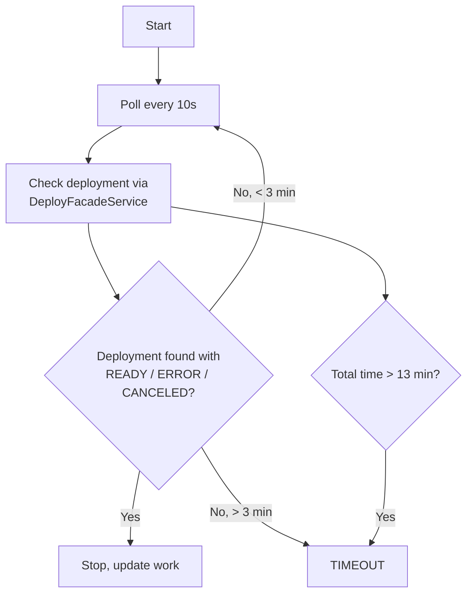

# Deploy Capability

The Deploy capability manages website deployments for works through the plugin system. It coordinates between deployment providers (Vercel, etc.), Git repositories, and the internal work model. The module handles single deployments, batch deployments, deployment verification, and status tracking.

Source: `apps/api/src/plugins-capabilities/deploy/`

## Architecture

```
DeployModule
  ├── DeployController              -- REST API endpoints
  ├── DeployService                 -- Deployment orchestration
  ├── DeploymentVerifierService     -- Async status polling
  ├── DeployFacadeService           -- Plugin provider resolution
  ├── GitFacadeService              -- Git operations
  ├── WorkOwnershipService     -- Authorization checks
  └── WebsiteUpdateService          -- Repository content updates
```

The module imports several dependencies:

```typescript
@Module({
    imports: [
        FacadesModule,           // Deploy and Git facades
        DatabaseModule,          // WorkRepository
        PluginsModule,           // Plugin registry
        WebsiteGeneratorModule,  // Website update service
        WorkModule,         // Ownership service
        AuthModule,              // JWT authentication
    ],
    controllers: [DeployController],
    providers: [DeployService, DeploymentVerifierService],
    exports: [DeployService, DeploymentVerifierService],
})
```

## API Endpoints

All endpoints require JWT authentication and use the `/api/deploy` prefix.

### List Providers

```
GET /api/deploy/providers
```

Returns all available deployment providers and their configuration status.

**Response:**

```json
{
	"status": "success",
	"providers": [{ "id": "vercel", "name": "Vercel", "enabled": true }]
}
```

### Check Provider Configuration

```
GET /api/deploy/providers/:providerId/configured
```

Checks if a specific provider is available and enabled.

### Deploy Work

```
POST /api/deploy/works/:id
```

Deploys a work to its configured deployment provider. This is the primary deployment endpoint.

**Request Body (DeployWorkDto):**

| Field       | Type     | Required | Description                       |
| ----------- | -------- | -------- | --------------------------------- |
| `teamScope` | `string` | No       | Team/org scope for the deployment |

**Deployment Flow:**

1. Verify user owns (or has edit access to) the work
2. Check if deployment credentials are configured via `DeployFacadeService`
3. Validate the deployment token
4. Execute deployment via `DeployService`
5. Start async verification via `DeploymentVerifierService`

**Response:**

```json
{
	"status": "pending",
	"slug": "my-work",
	"owner": "username",
	"repository": "username/my-work-website",
	"message": "Deployment started"
}
```

### Validate Token

```
POST /api/deploy/validate-token
```

Checks if the user has a valid deployment provider available.

### Get Teams for Work

```
POST /api/deploy/works/:id/teams
```

Fetches available teams/organizations from the deployment provider for a specific work.

### Check Deployment Capability

```
POST /api/deploy/works/:id/check
```

Returns detailed deployment capability status:

```json
{
	"status": "success",
	"canDeploy": true,
	"isShared": false,
	"ownerHasToken": true,
	"userHasToken": true
}
```

### Lookup Existing Deployment

```
POST /api/deploy/works/:id/lookup
```

Checks if a work has an existing deployment and returns its status.

### Batch Deploy

```
POST /api/deploy/batch
```

Deploy multiple works in a single request.

**Request Body (BatchDeployDto):**

```json
{
	"works": [{ "workId": "uuid-1", "teamScope": "team-slug" }, { "workId": "uuid-2" }],
	"teamScope": "default-team"
}
```

**Response (BatchDeployResponseDto):**

```json
{
	"status": "partial",
	"message": "Batch deployment: 2 started, 1 failed",
	"totalRequested": 3,
	"successfullyStarted": 2,
	"failed": 1,
	"results": [
		{ "workId": "uuid-1", "slug": "dir-1", "status": "pending", "message": "Deployment started" },
		{ "workId": "uuid-2", "slug": "dir-2", "status": "pending", "message": "Deployment started" },
		{ "workId": "uuid-3", "slug": "unknown", "status": "error", "message": "Work not found" }
	]
}
```

Batch status is `success` (0 failures), `partial` (some succeeded), or `error` (all failed). Batches process up to 5 works concurrently with a 2-second delay between batches.

## DeployService Internals

The `DeployService` orchestrates the full deployment pipeline:

### Deployment Pipeline

```
1. Get plugin and token via DeployFacadeService
2. Get Git access token via GitFacadeService
3. Create repository context (owner, repo, publicKey)
4. Enable GitHub Actions workflows
5. Set required secrets (DEPLOY_TOKEN, DATA_REPOSITORY, DEPLOY_PROVIDER)
6. Set optional secrets (DEPLOY_TEAM_SCOPE, GH_TOKEN)
7. Generate and set CRON_SECRET
8. Dispatch workflow with retry
```

### GitHub Actions Secrets

The service sets these secrets on the target repository:

| Secret              | Description                                         |
| ------------------- | --------------------------------------------------- |
| `DATA_REPOSITORY`   | Name of the data repository (e.g., `my-dir-data`)   |
| `{PROVIDER}_TOKEN`  | Provider-specific token (e.g., `VERCEL_TOKEN`)      |
| `DEPLOY_TOKEN`      | Generic deployment token                            |
| `DEPLOY_TEAM_SCOPE` | Team/org scope (optional)                           |
| `GH_TOKEN`          | GitHub token for repo operations (optional)         |
| `CRON_SECRET`       | Randomly generated 32-byte hex secret for cron jobs |

Additionally, a `DEPLOY_PROVIDER` repository **variable** is set (not a secret).

### Workflow Dispatch with Retry

The service attempts to dispatch GitHub Actions workflows in order:

1. Try `deploy_vercel.yaml`
2. Try `deploy_prod.yaml`
3. If both fail, update the repository via `WebsiteUpdateService`
4. Create a trigger commit (`.deployment-trigger` file)
5. Wait 3 seconds, then retry dispatch
6. If dispatch still fails, rely on the push-triggered workflow

## DeploymentVerifierService

Monitors deployment progress asynchronously after a deployment is initiated.

### Verification Process



### Deployment States

| State          | Description                         |
| -------------- | ----------------------------------- |
| `INITIALIZING` | Deployment just started             |
| `QUEUED`       | Waiting in provider queue           |
| `BUILDING`     | Build in progress                   |
| `READY`        | Deployment successful (terminal)    |
| `ERROR`        | Deployment failed (terminal)        |
| `CANCELED`     | Deployment was cancelled (terminal) |
| `TIMEOUT`      | Verification timed out (terminal)   |

### Timing Configuration

| Parameter       | Value       | Description                                   |
| --------------- | ----------- | --------------------------------------------- |
| `POLL_INTERVAL` | 10 seconds  | Time between status checks                    |
| `FETCH_LIMIT`   | 18 attempts | Max polls before marking not-found as timeout |
| `TIMEOUT`       | 13 minutes  | Absolute timeout for verification             |

### Queue Management

The verifier maintains an in-memory map of active verifications. Starting a new verification for a work automatically cancels any existing one:

```typescript
// Only one verification per work at a time
startVerification(work, userId, teamScope);
```

## DTOs

### DeployWorkDto

```typescript
class DeployWorkDto {
	@IsString()
	@IsOptional()
	teamScope?: string;
}
```

### BatchDeployDto

```typescript
class BatchDeployDto {
	@IsArray()
	@ValidateNested({ each: true })
	works: BatchDeployItemDto[];

	@IsString()
	@IsOptional()
	teamScope?: string; // Default for all items
}

class BatchDeployItemDto {
	@IsString()
	workId: string;

	@IsString()
	@IsOptional()
	teamScope?: string; // Override per-item
}
```

### BatchDeployResponseDto

```typescript
class BatchDeployResponseDto {
	status: 'success' | 'partial' | 'error';
	message: string;
	totalRequested: number;
	successfullyStarted: number;
	failed: number;
	results: BatchDeployItemResultDto[];
}
```

## Shared Work Handling

The deploy capability supports shared works. When a non-owner collaborator triggers deployment:

- The **owner's** deployment credentials are used (not the collaborator's)
- The `WorkOwnershipService` determines the `isCreator` flag
- Token validation runs against the owner's configuration

## Source Files

| File                                                                            | Purpose                  |
| ------------------------------------------------------------------------------- | ------------------------ |
| `apps/api/src/plugins-capabilities/deploy/deploy.module.ts`                     | Module definition        |
| `apps/api/src/plugins-capabilities/deploy/deploy.controller.ts`                 | REST API endpoints       |
| `apps/api/src/plugins-capabilities/deploy/deploy.service.ts`                    | Deployment orchestration |
| `apps/api/src/plugins-capabilities/deploy/tasks/deployment-verifier.service.ts` | Async polling            |
| `apps/api/src/plugins-capabilities/deploy/dto/deploy.dto.ts`                    | Single deploy DTOs       |
| `apps/api/src/plugins-capabilities/deploy/dto/batch-deploy.dto.ts`              | Batch deploy DTOs        |
