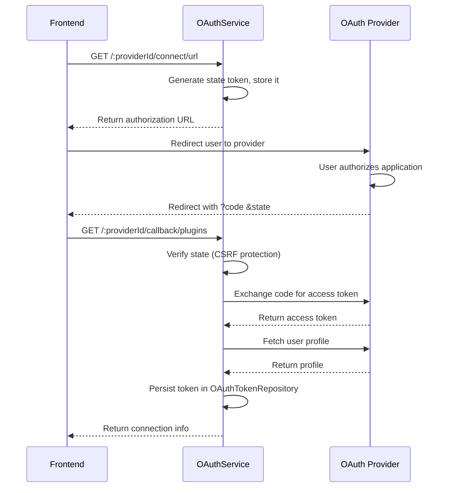

# OAuth Capability

The OAuth capability implements the OAuth 2.0 authorization code flow for connecting external services (GitHub, Google, etc.) to the Ever Works platform. It manages the full lifecycle: generating authorization URLs, handling callbacks, exchanging codes for tokens, storing credentials, and disconnecting providers.

Source: `apps/api/src/plugins-capabilities/oauth/`

## Architecture

```
OAuthModule
  ├── OAuthController           -- REST API endpoints
  ├── OAuthService              -- OAuth flow orchestration
  ├── OAuthFacadeService        -- Plugin OAuth operations
  ├── OAuthTokenRepository      -- Token persistence (TypeORM)
  └── PluginSettingsService     -- OAuth client credentials
```

```typescript
@Module({
    imports: [FacadesModule, DatabaseModule],
    controllers: [OAuthController],
    providers: [OAuthService],
    exports: [OAuthService],
})
export class OAuthModule {}
```

The module relies on `PluginsModule` being registered globally via `forRoot()` at the application root level for access to `PluginSettingsService`.

## OAuth 2.0 Flow



## API Endpoints

All endpoints are under `/api/oauth` and require JWT authentication.

### List Providers

```
GET /api/oauth/providers
Authorization: Bearer <jwt-token>
```

Returns all available OAuth providers and configuration status.

**Response:**

```json
{
    "configured": true,
    "providers": [
        { "id": "github", "name": "GitHub", "enabled": true }
    ]
}
```

### Check Connection

```
GET /api/oauth/:providerId/connection
Authorization: Bearer <jwt-token>
```

Checks if the current user has a valid OAuth connection.

**Response (connected):**

```json
{
    "id": "github",
    "name": "GitHub",
    "enabled": true,
    "connected": true,
    "username": "octocat",
    "email": "octocat@example.com",
    "avatarUrl": "https://avatars.githubusercontent.com/..."
}
```

### Get Authorization URL

```
GET /api/oauth/:providerId/connect/url?callbackUrl=...&state=...&forceConsent=true
Authorization: Bearer <jwt-token>
```

Generates the OAuth authorization URL for the specified provider.

**Query Parameters:**

| Parameter | Type | Required | Description |
|---|---|---|---|
| `callbackUrl` | `string` | No | Custom redirect URI after authorization |
| `state` | `string` | No | Custom state parameter (auto-generated if omitted) |
| `forceConsent` | `string` | No | Set to `"true"` to force re-authorization |

**Response:**

```json
{
    "url": "https://github.com/login/oauth/authorize?client_id=...&state=abc123&scope=repo,user",
    "state": "abc123def456..."
}
```

### Handle Callback

```
GET /api/oauth/:providerId/callback/plugins?code=AUTH_CODE&state=STATE
Authorization: Bearer <jwt-token>
```

Processes the OAuth callback after user authorization.

**Query Parameters:**

| Parameter | Type | Required | Description |
|---|---|---|---|
| `code` | `string` | Yes | Authorization code from provider |
| `state` | `string` | No | State parameter for CSRF verification |

**Response:**

```json
{
    "id": "github",
    "name": "GitHub",
    "enabled": true,
    "connected": true,
    "username": "octocat",
    "email": "octocat@example.com",
    "avatarUrl": "https://avatars.githubusercontent.com/..."
}
```

### Get User Info

```
GET /api/oauth/:providerId/user
Authorization: Bearer <jwt-token>
```

Returns the authenticated user's profile from the OAuth provider.

### Disconnect Provider

```
DELETE /api/oauth/:providerId
Authorization: Bearer <jwt-token>
```

Revokes the OAuth token and removes the stored credentials. Returns `204 No Content`.

## OAuthService Internals

### State Management (CSRF Protection)

The service maintains an in-memory state store with expiration:

```typescript
private stateStore = new Map<string, { userId: string; expires: Date }>();
```

**State Lifecycle:**

1. **Generation**: `generateState(userId)` creates a random 16-byte hex string
2. **Storage**: `storeState(state, userId)` saves with a 10-minute expiration
3. **Verification**: `verifyState(state, userId)` checks existence, user match, and expiration
4. **Cleanup**: `cleanupExpiredStates()` runs on every store operation

```typescript
// State is valid only for the same user and within 10 minutes
verifyState(state: string, userId: string): boolean {
    const stored = this.stateStore.get(state);
    if (!stored || stored.userId !== userId || new Date() > stored.expires) {
        return false;
    }
    this.stateStore.delete(state); // One-time use
    return true;
}
```

### Token Exchange and Storage

When handling the callback, the service:

1. Exchanges the authorization code for tokens via `OAuthFacadeService`
2. Fetches the user profile using the new access token
3. Persists all token data via `OAuthTokenRepository.upsert()`:

```typescript
await this.oauthTokenRepository.upsert({
    userId,
    provider: providerId,
    accessToken: token.accessToken,
    refreshToken: token.refreshToken,
    tokenType: token.tokenType,
    scope: token.scope,
    expiresAt,                          // Computed from token.expiresIn
    email: user.email || null,
    username: user.username,
    metadata: {
        oauthUserId: user.id,
        name: user.name,
        avatarUrl: user.avatarUrl,
    },
});
```

### OAuth Configuration Resolution

Client credentials (`clientId`, `clientSecret`) are resolved from plugin settings:

```typescript
private async getOAuthConfig(providerId: string, redirectUri?: string) {
    const settings = await this.pluginSettingsService.getSettings(providerId, {
        includeSecrets: true,
    });

    return {
        clientId: settings?.clientId,
        clientSecret: settings?.clientSecret,
        redirectUri,
        scopes: settings?.scopes,
    };
}
```

This means OAuth credentials are configured as plugin settings, not hardcoded.

## Connection Info Interface

```typescript
interface OAuthConnectionInfo extends OAuthProviderInfo {
    connected: boolean;
    username?: string;
    email?: string;
    avatarUrl?: string;
}
```

## Error Handling

| Scenario | Exception | Message |
|---|---|---|
| Missing authorization code | `BadRequestException` | "Authorization code is required" |
| Invalid state parameter | `BadRequestException` | "Invalid state parameter" |
| Missing OAuth credentials | `BadRequestException` | "OAuth credentials not configured for provider: `{id}`" |
| No valid token | `BadRequestException` | "No valid token for provider `{id}`" |
| Provider not found | Graceful return | `{ connected: false }` |

## Configuration

OAuth providers require these plugin settings:

| Setting | Description |
|---|---|
| `clientId` | OAuth application client ID |
| `clientSecret` | OAuth application client secret |
| `scopes` | Requested permission scopes (array) |

These are configured per-provider through the plugin settings system, typically via environment variables prefixed with `PLUGIN_`.

## Supported Providers

| Plugin ID | Provider | Scopes |
|---|---|---|
| `github` | GitHub | `repo`, `user`, configurable |

Additional OAuth providers can be added by implementing the `IOAuthPlugin` interface from `@ever-works/plugin`.

## Source Files

| File | Purpose |
|---|---|
| `apps/api/src/plugins-capabilities/oauth/oauth.module.ts` | Module definition |
| `apps/api/src/plugins-capabilities/oauth/oauth.controller.ts` | REST API endpoints |
| `apps/api/src/plugins-capabilities/oauth/oauth.service.ts` | OAuth flow orchestration |
