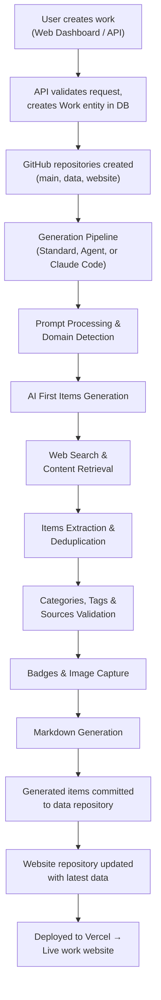

# Platform Architecture

The Ever Works Platform is organized as a Turborepo monorepo with pnpm workspaces.

## Work Structure

```
ever-works/
├── apps/
│   ├── api/              # NestJS REST API (port 3100)
│   ├── web/              # Next.js admin dashboard (port 3000)
│   ├── cli/              # Standalone CLI (Commander.js + esbuild)
│   ├── internal-cli/     # Internal CLI (nest-commander)
│   ├── admin/            # Admin interface
│   ├── mcp/              # MCP (Model Context Protocol) server (port 3200)
│   └── docs/             # Docusaurus 3 documentation site (port 3000 dev)
├── docs/                 # Markdown content rendered by apps/docs
├── packages/
│   ├── agent/            # Core business logic, plugins, pipeline, AI, database
│   ├── contracts/        # Shared TypeScript types
│   ├── plugin/           # Plugin SDK v1.0.0 (standalone, no NestJS deps)
│   ├── plugins/          # 39 plugins (AI, search, deploy, pipeline, prompt mgmt, etc.)
│   ├── monitoring/       # Sentry + PostHog integration
│   ├── tasks/            # Trigger.dev background jobs
│   └── cli-shared/       # Shared CLI utilities
├── .deploy/              # Dockerfiles & K8s manifests per app
├── compose.yaml          # Docker Compose for the full stack
├── turbo.json            # Turborepo pipeline configuration
├── pnpm-workspace.yaml   # pnpm workspace definition
└── package.json          # Root scripts and dev dependencies
```

## API Modules

The NestJS API (`apps/api/`) is composed of the following modules, registered in `api.module.ts`:

| Module                    | Description                                                                                                        |
| ------------------------- | ------------------------------------------------------------------------------------------------------------------ |
| **AuthModule**            | JWT authentication, OAuth (GitHub, Google), registration, email verification                                       |
| **WorksModule**           | Work CRUD, AI generation, items, categories, tags, collections, import, scheduled updates, community PR processing |
| **AiConversationModule**  | Stateless streaming AI chat (NDJSON)                                                                               |
| **ScreenshotModule**      | Provider-agnostic screenshot capture                                                                               |
| **MailModule**            | Email sending (SMTP, with provider abstraction)                                                                    |
| **SubscriptionsModule**   | Subscription plans, billing, usage tracking (Stripe)                                                               |
| **NotificationsModule**   | User notifications (in-app)                                                                                        |
| **TriggerInternalModule** | Trigger.dev webhook endpoints for background jobs                                                                  |
| **PluginsModule**         | Plugin system — bootstrap, registry, lifecycle, settings, facades                                                  |
| **TwentyCrmModule**       | Twenty CRM integration                                                                                             |
| **MonitoringModule**      | Sentry error tracking, PostHog analytics                                                                           |

Global guards and interceptors:

- **JwtAuthGuard** — Protects all routes by default (opt out with `@Public()`)
- **ThrottlerGuard** — Rate limiting (3 tiers)
- **LoggingInterceptor**, **SentryInterceptor**, **PostHogInterceptor**

## @packages/agent

The `@packages/agent` package is the core shared library. It exports 21 subpackage entry points:

| Export                                 | Purpose                                                                     |
| -------------------------------------- | --------------------------------------------------------------------------- |
| `@packages/agent/generators`           | Data generation and processing                                              |
| `@packages/agent/items-generator`      | Item submission, DTOs, and schemas                                          |
| `@packages/agent/pipeline`             | Pipeline orchestrator service                                               |
| `@packages/agent/database`             | TypeORM database configuration and connection                               |
| `@packages/agent/entities`             | All TypeORM entity definitions                                              |
| `@packages/agent/dto`                  | Shared DTOs and validation                                                  |
| `@packages/agent/git`                  | Git operations (isomorphic-git, Octokit)                                    |
| `@packages/agent/work-operations`      | Work business logic                                                         |
| `@packages/agent/import`               | Work import from existing repos                                             |
| `@packages/agent/subscriptions`        | Subscription and billing logic                                              |
| `@packages/agent/notifications`        | Notification creation                                                       |
| `@packages/agent/events`               | Event definitions and emitters                                              |
| `@packages/agent/tasks`                | Trigger.dev task definitions                                                |
| `@packages/agent/cache`                | Caching (TypeORM-backed)                                                    |
| `@packages/agent/config`               | Centralized configuration                                                   |
| `@packages/agent/services`             | Shared services                                                             |
| `@packages/agent/plugins`              | Plugin bootstrap, registry, loader, settings, lifecycle                     |
| `@packages/agent/community-pr`         | Community PR processing (discovery, AI extraction, data sync)               |
| `@packages/agent/comparison-generator` | A vs B comparison generation                                                |
| `@packages/agent/facades`              | Capability facades (AI, Git, Search, Deploy, Screenshot, Content Extractor) |
| `@packages/agent/utils`                | Shared utility functions                                                    |

## Data Flow



## Security

- All API routes are protected by JWT authentication by default
- Public endpoints are explicitly marked with `@Public()`
- Rate limiting is applied globally with three tiers (see [API Reference](/api))
- Helmet middleware for HTTP security headers
- CORS configured via `ALLOWED_ORIGINS` environment variable
- Input validation via class-validator DTOs with `whitelist` and `forbidNonWhitelisted`
