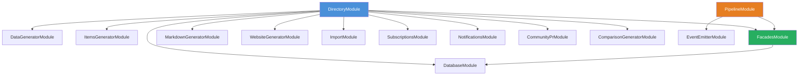

# Agent Package Architecture

The `@ever-works/agent` package is the core business logic layer of the Ever Works platform. It is a private NestJS package that encapsulates all directory generation, AI orchestration, plugin management, and data handling logic. The API application (`apps/api`) consumes this package as a workspace dependency.

## Package Overview

| Property           | Value                                                               |
| ------------------ | ------------------------------------------------------------------- |
| **Package name**   | `@ever-works/agent`                                                 |
| **Framework**      | NestJS 11 with SWC compiler                                         |
| **Build**          | `nest build -b swc` + `tsc -p tsconfig.types.json` for declarations |
| **Test framework** | Jest (26 suites, 719+ tests)                                        |
| **Workspace deps** | `@ever-works/contracts`, `@ever-works/plugin`                       |
| **Key libraries**  | TypeORM, Zod, LangChain, Ajv, superjson, isomorphic-git             |

## Module Areas

The agent package exposes **20 sub-module entry points** via the `exports` field in `package.json`. Each export maps to a distinct module area within `src/`:

| Export Path              | Source Directory            | Purpose                                                  |
| ------------------------ | --------------------------- | -------------------------------------------------------- |
| `./generators`           | `src/generators/`           | Three-stage content generation (data, markdown, website) |
| `./database`             | `src/database/`             | TypeORM entities, repositories, and database module      |
| `./dto`                  | `src/dto/`                  | Data Transfer Objects for API validation                 |
| `./entities`             | `src/entities/`             | TypeORM entity definitions (Directory, User, etc.)       |
| `./git`                  | `src/git/`                  | Git operations abstraction layer                         |
| `./directory-operations` | `src/directory-operations/` | Low-level directory CRUD operations                      |
| `./items-generator`      | `src/items-generator/`      | Item generation DTOs and utilities                       |
| `./tasks`                | `src/tasks/`                | Background task definitions                              |
| `./events`               | `src/events/`               | Domain event classes (NestJS EventEmitter)               |
| `./services`             | `src/services/`             | Directory service layer (14 services)                    |
| `./subscriptions`        | `src/subscriptions/`        | Subscription and billing logic                           |
| `./config`               | `src/config/`               | Configuration constants and helpers                      |
| `./cache`                | `src/cache/`                | Cache management utilities                               |
| `./notifications`        | `src/notifications/`        | Notification system                                      |
| `./import`               | `src/import/`               | Data import functionality                                |
| `./facades`              | `src/facades/`              | Facade services for plugin capabilities                  |
| `./plugins`              | `src/plugins/`              | Plugin registry, loader, and settings                    |
| `./pipeline`             | `src/pipeline/`             | Pipeline builder, orchestrator, and executors            |
| `./utils`                | `src/utils/`                | Shared utility functions                                 |
| `./community-pr`         | `src/community-pr/`         | Community pull request management                        |
| `./comparison-generator` | `src/comparison-generator/` | A-vs-B comparison page generation                        |

## Directory Structure

```
packages/agent/src/
├── cache/                    # Cache management
├── community-pr/             # Community PR handling
├── comparison-generator/     # Item comparison generation
├── config/                   # Configuration constants
├── constants/                # Shared constants
├── database/                 # TypeORM database module
├── directory-operations/     # Low-level directory ops
├── dto/                      # Data Transfer Objects
├── entities/                 # TypeORM entities
├── events/                   # Domain events
├── facades/                  # Capability facades (AI, Search, etc.)
├── generators/               # Content generation pipeline
│   ├── data-generator/       # Data generation (items, categories)
│   ├── markdown-generator/   # Markdown/README generation
│   └── website-generator/    # Website repo generation
├── import/                   # Data import logic
├── items-generator/          # Item generation DTOs
├── notifications/            # Notification system
├── pipeline/                 # Plugin-driven pipeline system
│   ├── validators/           # Pipeline result validation
│   └── __tests__/            # Pipeline test suite
├── plugins/                  # Plugin system core
│   ├── repositories/         # Plugin data repositories
│   └── services/             # Plugin registry, settings, loader
├── services/                 # Directory service layer
│   ├── types/                # Service type definitions
│   ├── utils/                # Service utilities
│   └── __tests__/            # Service tests
├── subscriptions/            # Subscription management
├── tasks/                    # Background task definitions
└── utils/                    # Shared utilities
```

## NestJS Module Structure

The agent package follows NestJS module composition. Each major area defines its own `Module` class that declares providers and exports:



### Key Module Relationships

- **DirectoryModule** is the primary service module, importing generators, facades, and infrastructure modules. It provides 14 directory-related services covering lifecycle, generation, scheduling, membership, taxonomy, and more.
- **PipelineModule** provides the pipeline builder, orchestrator, and executors. It imports `FacadesModule` to give pipeline steps access to AI, search, and other capabilities.
- **FacadesModule** provides 8 facade services that abstract plugin capabilities. It imports `DatabaseModule` for directory-plugin mappings.

## How the API Consumes the Agent Package

The API application (`apps/api`) imports agent modules into its own NestJS module tree:

```typescript
// apps/api imports agent modules
import { DirectoryModule } from '@ever-works/agent/services';
import { PipelineModule } from '@ever-works/agent/pipeline';
import { FacadesModule } from '@ever-works/agent/facades';
```

The API provides HTTP controllers that delegate to agent services. For example, the directories controller calls `DirectoryGenerationService` which in turn uses the `PipelineOrchestratorService` to execute the generation pipeline.

## Service Layer

The `services/` directory contains 14 specialized services that form the domain logic layer:

| Service                              | Responsibility                        |
| ------------------------------------ | ------------------------------------- |
| `DirectoryLifecycleService`          | Create, update, delete directories    |
| `DirectoryGenerationService`         | Orchestrate full generation flow      |
| `DirectoryQueryService`              | Query and list directories            |
| `DirectoryDetailService`             | Manage directory details and metadata |
| `DirectoryOwnershipService`          | Handle ownership and permissions      |
| `DirectoryMemberService`             | Manage directory members              |
| `DirectoryScheduleService`           | CRON-based scheduled regeneration     |
| `DirectoryScheduleDispatcherService` | Dispatch scheduled jobs               |
| `DirectoryImportService`             | Import data from external sources     |
| `DirectoryAdvancedPromptsService`    | Custom AI prompt management           |
| `DirectoryTaxonomyService`           | Category and tag management           |
| `RepositoryManagementService`        | Git repository lifecycle              |
| `GeneratorFormSchemaService`         | Dynamic form schema generation        |

## Dependencies

The agent package depends on two workspace packages:

- **`@ever-works/contracts`** -- Shared TypeScript types for items, domains, forms, and API DTOs. Used throughout the agent for type-safe data structures.
- **`@ever-works/plugin`** -- Plugin system contracts, abstract base classes, and AI operation wrappers. Defines interfaces like `IPipelinePlugin`, `IAiProviderPlugin`, and event types.

### External Dependencies

| Category       | Packages                                                                                  |
| -------------- | ----------------------------------------------------------------------------------------- |
| **Framework**  | `@nestjs/common`, `@nestjs/core`, `@nestjs/config`, `@nestjs/swagger`                     |
| **Database**   | `@nestjs/typeorm`, `typeorm`, `better-sqlite3`, `pg`, `mysql2`                            |
| **Validation** | `zod`, `zod-to-json-schema`, `ajv`, `ajv-formats`, `class-validator`, `class-transformer` |
| **AI**         | `@langchain/textsplitters`                                                                |
| **Caching**    | `@nestjs/cache-manager`, `cache-manager`                                                  |
| **Events**     | `@nestjs/event-emitter`                                                                   |
| **Utilities**  | `lodash`, `date-fns`, `github-slugger`, `semver`, `superjson`, `yaml`, `p-map`            |

## Build and Test

```bash
# Development (watch mode)
cd packages/agent && pnpm dev

# Production build
cd packages/agent && pnpm build

# Run all tests
cd packages/agent && pnpm test

# Run specific test pattern
cd packages/agent && npx jest --testPathPattern='pipeline'

# Coverage report
cd packages/agent && pnpm test:cov
```

The build produces two outputs: SWC-compiled JavaScript in `dist/` and TypeScript declaration files via `tsconfig.types.json`. This dual-build approach gives fast compilation with SWC while maintaining full type information for consumers.
