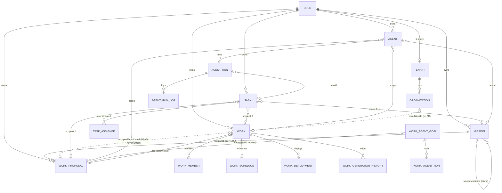
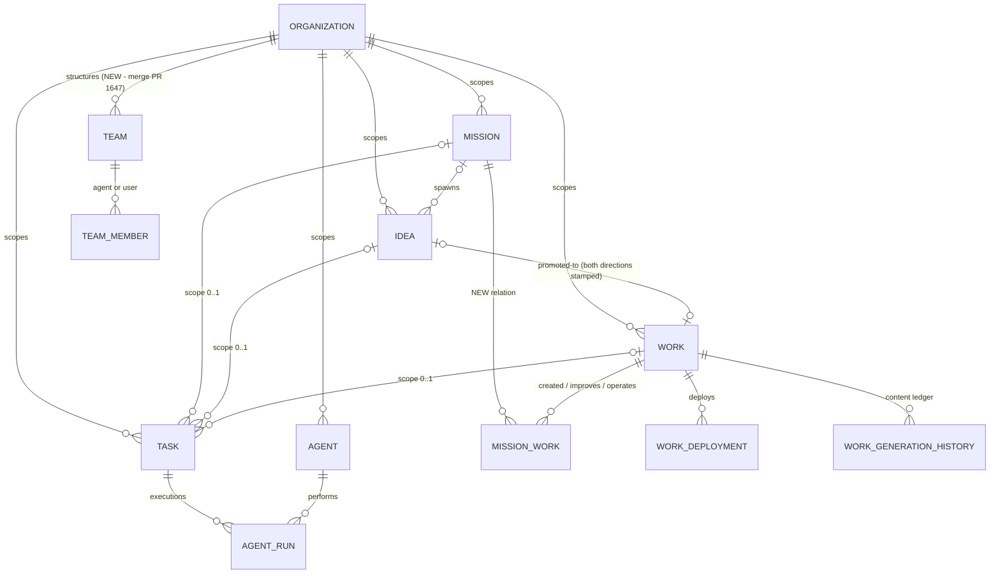
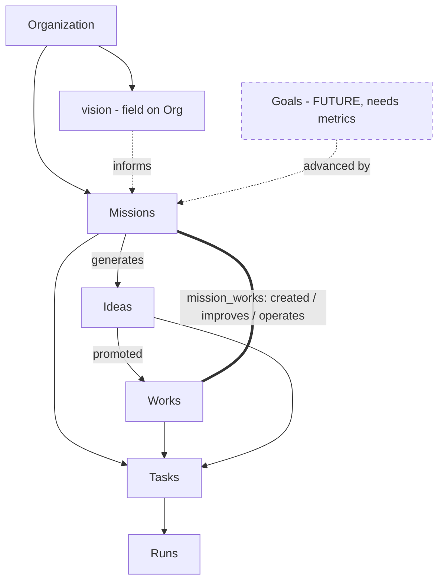
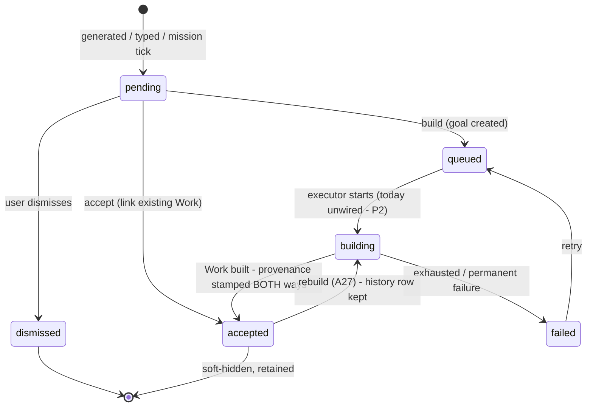
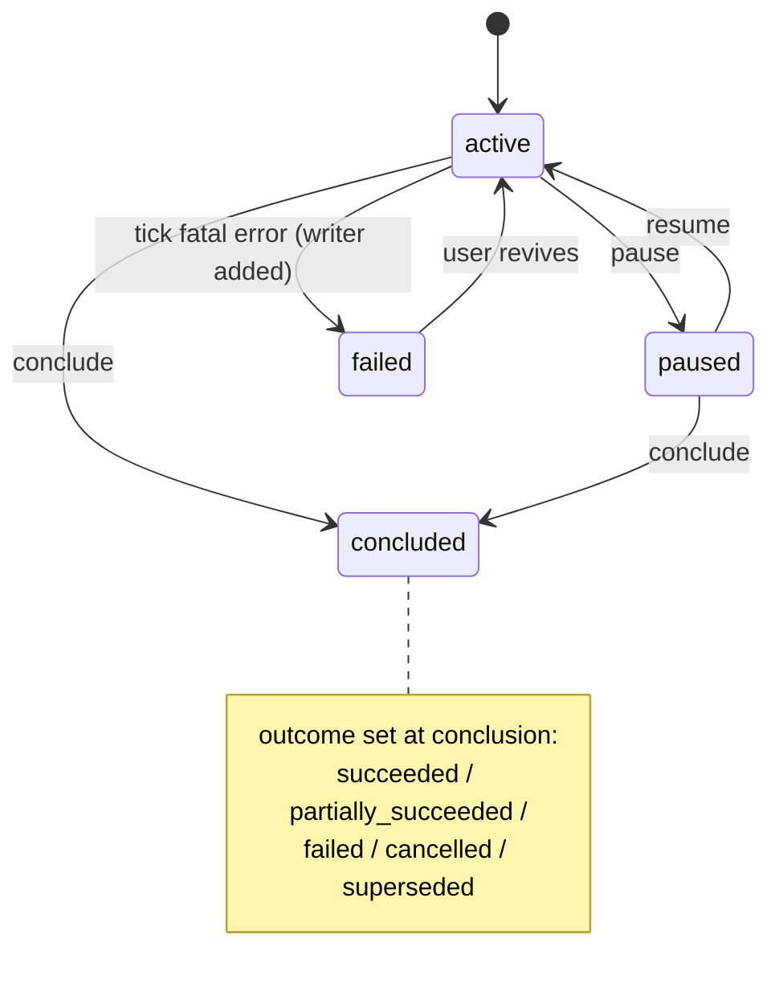
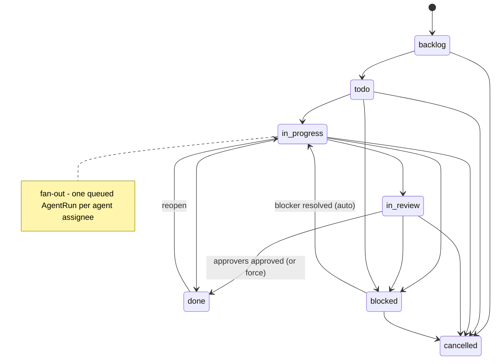

# Ever Works Domain Model Review

**Date:** 2026-07-19 · **Evidence base:** `develop` @ `8fb98c8d` (plus read-only inspection of unmerged branches `feat/ew-teams-and-companies` and `feat/ew-platform-fronts`, and the external catalog repo `ever-works/orgs`) · **Status:** Review / recommendation only — no product code was changed.

> **Scope.** This is an architecture and domain-model review of the Ever Works platform: what the ontology _is_ today (verified against entities, migrations, services, API, UI, runtime, specs, and git history), what it _should be_ long-term, and the smallest safe path between the two. Every load-bearing claim cites `path:line` evidence; claims that could not be established say so explicitly. A separate adversarial verification pass was run over the fourteen most load-bearing claims (see §2.1).

---

## 1. Executive recommendation

Ever Works already has the **right six first-class operational concepts** — Organization, Mission, Idea, Work, Task, Agent — and, crucially, the database already treats them as an **organization-scoped graph, not a tree**: Missions, Ideas, Works, Tasks and Agents are all flat, tenant/org-scoped collections joined by nullable references, and containment exists only in the UI. The recommendation is therefore **not a re-architecture**. It is:

1. **Keep the existing ontology and its names.** Mission, Idea, Work, Task, Agent, Organization are well-chosen, deliberately decided (spec §9 naming decisions), and consistently implemented. "Work" is the product's core noun and must not be renamed.
2. **Promote the Mission↔Work relationship from a fragile transitive chain to an explicit many-to-many relation** (`mission_works`, with a relation kind such as `created | improves | operates | researches`). Today a Mission reaches its Works only via `Mission ← WorkProposal.missionId` + `WorkProposal.acceptedWorkId`, cannot target an _existing_ Work at all, and the reverse pointer `works.acceptedFromIdeaId` is dead schema (never written — verified). This single change is what makes "many Missions evolve one Work / one Mission spawns many Works" real.
3. **Split Mission `status` (workflow) from a new nullable `outcome` (conclusion)** and give Mission an optional objective/success-criteria field. Missions stay _ongoing by default_ (that is their implemented and specced nature — they are idea-generating initiatives, not sprints), but gain the ability to be _concluded with a verdict_.
4. **Do not add Vision or Goal as first-class entities yet.** Vision v1 = a field on Organization. Goal-as-measurable-outcome is deferred until a metrics source exists (there is none today — verified: no metric/target/KR structure anywhere). The design reserves clean slots for both.
5. **Do not add an Attempt entity.** Infrastructure retries are owned by Trigger.dev and deliberately reuse the same DB record (spec FR-5); no code reads attempt numbers today. Record retry counts as columns, not rows. A new _user-requested_ execution is already a new Run — keep that.
6. **Converge execution records toward one canonical Run family** (`agent_runs` + logs). Finish or fold the half-wired `work_agent_goals` build pipeline (its completion handler has **zero production callers** — verified), and treat `work_generation_history` as what it actually is: the Work's content-pipeline ledger/changelog, not a second Run concept.
7. **Land Teams as org structure, not authorization** (PR #1647's shape is correct: polymorphic agent/user members, display-only roles), and keep the Work-member model as the permission boundary until Organization membership/roles are designed.
8. **Add no Routine entity.** Recurrence already exists in five well-implemented per-entity forms (Mission cron, WorkSchedule, Task recurrence templates, Agent heartbeats, user-research cadence); unify them with a read-model ("Schedules"), as the branch glossary already plans.
9. **Close the audit gap:** Mission and Idea lifecycle currently write **no** activity-log rows (verified). Extend `ActivityActionType` and log them; this is a precondition for any strategy layer being trustworthy.
10. **Repair the four broken/dead paths found during this review** before building anything on top of them: `acceptedFromIdeaId` never stamped; `handleGoalCompletion` never called; `Mission.autoBuildWorks` queues Ideas that nothing ever builds; `MissionStatus.FAILED` unreachable.

The first implementation slice (§22) is deliberately small: provenance repair, the `mission_works` relation, and the Mission status/outcome split — all additive, all backfillable, none blocking on product-owner strategy decisions.

---

## 2. What was inspected

### 2.1 Method

- **Direct reads** of the core entities (`mission`, `work-proposal`, `work`, `task`), the canonical specs (`docs/specs/features/missions-ideas-works/spec.md`, `docs/specs/features/task-tracking/spec.md`), and repo conventions.
- **Fourteen parallel inspection agents**, one per subsystem: entities/schema+migrations, Missions, Ideas, Works, Tasks, Agents, execution runtime, Organizations/Tenants, Teams/Companies catalog, recurring/triggers, web UI, API/MCP/CLI/contracts, docs/specs/ADRs/git-history, and artifacts/activity/budgets. Each was required to cite `path:line` for every fact and to label findings IMPLEMENTED / PARTIAL / SPEC-ONLY / NOT FOUND.
- **An adversarial verification pass** of fourteen load-bearing claims (each claim handed to an independent agent instructed to _refute_ it). Verdicts are folded into the text below; any claim that failed verification is not asserted.
- **Git history** for concept chronology and renames (`git log --diff-filter=A`, rename detection).

### 2.2 Repositories and surfaces inspected

| Surface                            | Where                                                                                                                                                                                                                                                 | Depth                                                                                    |
| ---------------------------------- | ----------------------------------------------------------------------------------------------------------------------------------------------------------------------------------------------------------------------------------------------------- | ---------------------------------------------------------------------------------------- |
| ORM entities + DataSource registry | `packages/agent/src/entities/*`, `packages/agent/src/database/database.config.ts`                                                                                                                                                                     | Full read of domain entities; ENTITIES array is authoritative (no `autoLoadEntities`)    |
| Migrations                         | `apps/api/src/migrations/*` (74 files)                                                                                                                                                                                                                | Key creates/alters read (missions, tasks×11, agents, tenants/orgs, tiers A/B/C, uploads) |
| Domain services                    | `packages/agent/src/{missions,user-research,tasks-domain,agents,work-agent,pipeline,budgets,…}`                                                                                                                                                       | Full read of the load-bearing services                                                   |
| API                                | `apps/api/src/{missions,work-proposals,works,tasks,agents,skills,work-agent,organizations,scope,activity-log,webhooks}`                                                                                                                               | Route tables extracted from controllers                                                  |
| Background runtime                 | `packages/tasks/src` (Trigger.dev tasks + dispatchers), `trigger.config.ts`                                                                                                                                                                           | All tasks enumerated; retry configs read                                                 |
| Web UI                             | `apps/web/src/app/[locale]/(dashboard)/*`, sidebar, i18n `messages/en.json`                                                                                                                                                                           | Route trees + main/detail pages read                                                     |
| MCP / CLI / contracts              | `apps/mcp/src` (whitelist), `apps/cli/src`, `packages/contracts/src`                                                                                                                                                                                  | Tool/command/type inventories                                                            |
| Specs & ADRs                       | `docs/specs/features/*` (esp. `missions-ideas-works`, `task-tracking`, `tenants-and-organizations`, `scheduled-updates`, `job-runtime-providers`), `docs/specs/decisions/*` (17 ADRs)                                                                 | Definitions + decision logs extracted                                                    |
| Unmerged branches                  | `feat/ew-teams-and-companies` (Team/TeamMember/company import, PR #1647), `feat/ew-platform-fronts` (`docs/specs/architecture/concepts-and-taxonomy.md`, commit `1094326a`)                                                                           | Read via git, clearly labeled branch-only below                                          |
| Related local repos                | `C:/Coding/Ever Works/Code/orgs` (36 prebuilt companies, `agentcompanies/v1` + `.works/company.yml` sidecar); Workspace notes (`2026-05-24-missions-ideas-works-*`, `2026-07-17-teams-and-companies-spec`, `2026-07-19-ever-works-concepts-taxonomy`) | Schema + sample packages read                                                            |

**Not inspected** (not locally available or out of scope): the deployed database contents, `ever-works/agents` and `ever-works/tasks` catalog repos (referenced by ADR-011/014 but not on disk), `directory-web-template` internals, and any Vercel/k8s runtime state. No claim below depends on them.

---

## 3. Current implemented ontology

### 3.1 The concept map as it actually exists

```text
User  ──1:1 (lazy)──  Tenant  ──1:N──  Organization        ← scope layer (EW-651/655/665)
  │
  ├── Mission        (missions)            ongoing AI idea-generator loop
  ├── Idea           (work_proposals)      atomic AI/user proposal to build a Work
  ├── Work           (works)               persistent asset: repos, deploys, schedule, KB, members
  ├── Task           (tasks)               unit of work; scope = 0-or-1 of {mission, idea, work}
  ├── Agent          (agents)              persistent scoped AI worker; heartbeats; runs
  ├── Skill          (skills)              MD capability doc; bound to agent/work/mission/idea/tenant
  └── WorkAgentGoal  (work_agent_goals)    misnamed: a build-request queue item (approval-gated)

Every arrow above is a nullable FK or userId ownership — NOT containment.
The only true 1:1 containments: Work↔WorkSchedule, Agent↔AgentBudget.
```

Chronology of concept birth (git-verified): **Directory** (2025-02-03) → renamed **Work** (2026-05-02, `b8a595e0`) → **WorkProposal** (2026-05-12, EW-584 "#710") → **Mission** (2026-05-25, "#1013") → **Task + Agent** (2026-05-26, "#1019") → **Organization + Tenant** (2026-05-27, "#1045") → **Team** (2026-07-17, `f40cb7b1`, unmerged).

### 3.2 Entity inventory

Status legend: ✅ implemented · 🟡 partial · 📄 spec-only · 🌿 branch-only · ⚫ dead schema.

#### Organization & Tenant — ✅ (thin)

| Aspect          | Evidence                                                                                                                                                                                                                                        |
| --------------- | ----------------------------------------------------------------------------------------------------------------------------------------------------------------------------------------------------------------------------------------------- |
| Tables          | `tenants`, `organizations` — `packages/agent/src/entities/tenant.entity.ts:32-80`, `organization.entity.ts:68-151`                                                                                                                              |
| Ownership       | `Tenant.ownerUserId` UNIQUE FK→users CASCADE — 1 User : 1 Tenant, created lazily on first Org (`tenant-bootstrap.service.ts:52-107`); Tenant is never shown in UI (`tenant.entity.ts:15-19`)                                                    |
| Org fields      | `slug` (unique), `legalName`, `displayName`, `countryCode`, `registrationProvider: 'manual' \| 'stripe-atlas'`, `registrationStatus: 'draft' \| 'pending' \| 'registered'`, `linkedWorkId` (uuid, **no FK** — `organization.entity.ts:137-144`) |
| Membership      | **None.** No org-member entity exists; `OrganizationMembershipService.ensureAdmin` ≡ `ensureMember` ≡ "same tenant owner" (`organization-membership.service.ts:37-88`) — verified                                                               |
| Scope machinery | `ScopeResolverMiddleware` (slug/header) → `SessionScopeGuard` → `ScopeOwnershipGuard`; `ScopeStampingSubscriber` stamps `tenantId`/`organizationId` on insert for entities declaring both columns (`apps/api/src/scope/*`)                      |
| Permission role | Scope affects **writes** (stamping) but not read authorization; all domain reads filter by `userId` (`missions.controller.ts:84-296` et al.)                                                                                                    |

#### Mission — ✅ (with dead states and broken auto-build)

| Aspect                    | Evidence                                                                                                                                                                                                                |
| ------------------------- | ----------------------------------------------------------------------------------------------------------------------------------------------------------------------------------------------------------------------- |
| Table                     | `missions` — `mission.entity.ts:77-238`; migration `1779978001000-CreateMissionsTable`                                                                                                                                  |
| Meaning                   | "A long-running Goal/Project that continuously drives Idea generation" (`mission.entity.ts:53-63`); **ongoing generator loop, not a time-bounded initiative**                                                           |
| Status                    | `active \| paused \| completed \| failed` (`:22-27`). Completion is **user-marked only** (`POST :id/complete`); **`failed` has no production writer** — verified dead state                                             |
| Type                      | `one-shot \| scheduled` (`:37-40`) + cron `schedule`; per-minute Trigger.dev tick `mission-tick` matches each Mission's cron in JS (`mission-tick.service.ts:209-226`)                                                  |
| Tick behavior             | Cap check (outstanding pending/queued/building Ideas; default 20, `-1`=unlimited) → `WorkProposalService.generate({source: MISSION, missionContext: {description}})`, ≤5 Ideas/tick (`mission-tick.service.ts:228-272`) |
| `autoBuildWorks`          | 🟡 **Broken end-to-end**: tick flips new Ideas to `queued` but never creates the `WorkAgentGoal` the build path requires, and no sweeper picks up queued-without-goal Ideas — verified (see §5.1)                       |
| Mission→Work              | **No direct relation.** Only transitive `Mission ← WorkProposal.missionId` + `WorkProposal.acceptedWorkId`. Attaching an existing Work to a Mission is impossible                                                       |
| Clone                     | Full-fork per Decision A25: metadata + non-dismissed Ideas re-created as `pending`; Works are NOT cloned; `sourceMissionId` back-link (`mission-clone.service.ts:116-247`)                                              |
| `missionRepo` / templates | ⚫ `missionRepo` never set non-null in production; `.works/mission.yml` parser (`mission-template-manifest.service.ts`) has no production caller — verified; catalog = 2 hardcoded starter templates                    |
| Staffing/budget           | Mission-scoped Agents (`Agent.scope='mission'`), Tasks via `Task.missionId`, budget via polymorphic `BudgetOwnerType.MISSION`; **no success criteria or evaluation fields**                                             |
| API/UI/AI                 | 15 REST routes under `api/me/missions`; 11 MCP tools; full chat-tool coverage; `/missions` list + detail (Overview/Tasks/Agents tabs)                                                                                   |

#### Idea (`WorkProposal`) — ✅ (with dead back-pointer)

| Aspect        | Evidence                                                                                                                                                                                                                                   |
| ------------- | ------------------------------------------------------------------------------------------------------------------------------------------------------------------------------------------------------------------------------------------ |
| Table         | `work_proposals` — `work-proposal.entity.ts:90-204`                                                                                                                                                                                        |
| Status        | `pending → queued → building → accepted \| failed`, plus `dismissed` (`:14-35`); UI groups actionable=[pending,queued,building,failed], done=[accepted]                                                                                    |
| Source        | `auto-signup \| user-refresh \| discover \| scheduled \| user-manual \| mission` (`:37-46`); `discover` has no production writer                                                                                                           |
| Generation    | Requires `user.inferredInterests` (the `user-research` module's web-research profile); AI-generated via `aiFacade.askJson`, deduped by slug/title fingerprints; four triggers: signup, manual refresh, per-user cadence cron, Mission tick |
| Accept        | `POST :id/accept {workId}` links an **existing** same-user Work: sets `acceptedWorkId`, status `accepted`; Idea row survives (soft-hidden "Done")                                                                                          |
| Build         | `POST :id/build` → status `queued` + creates `WorkAgentGoal {maxWorksPerRun:1, ideaId}` (`work-proposals.service.ts:127-151`) — but see §5.1: nothing completes the goal                                                                   |
| Rebuild       | Decision A27: `accepted → building`, then re-points `acceptedWorkId` at the **new** Work — serially many Works, only latest linked; prior link overwritten with no history                                                                 |
| Provenance    | ⚫ `works.acceptedFromIdeaId` (column + FK + index, `work.entity.ts:505-506`) is **never written** — verified; e2e documents it stays NULL (`apps/web/e2e/flow-idea-to-work-accept.spec.ts:36-39`)                                         |
| Failure model | `failureMessage` + `failureKind` (4 transient kinds eligible for auto-retry policy, 2 permanent) — classifier implemented; the auto-retry consumer is the uncalled goal-completion handler (§5.1)                                          |
| Type field    | None — Ideas propose Works only; no idea-type/kind exists                                                                                                                                                                                  |

#### Work — ✅ (the solid core)

| Aspect              | Evidence                                                                                                                                                                                                                                                       |
| ------------------- | -------------------------------------------------------------------------------------------------------------------------------------------------------------------------------------------------------------------------------------------------------------- |
| Table               | `works` — `work.entity.ts:75-513`                                                                                                                                                                                                                              |
| Meaning             | Persistent managed asset: 3 related repos (`data`/`work`/`website`), deployments (production/preview + rollback), 1:1 `WorkSchedule`, KB, members, custom domains, budgets, config cache                                                                       |
| Kind / status       | `kind: 'default' \| 'company'`; `status: 'draft' \| 'active' \| 'registered' \| 'archived'` — `archived` has **no production writer** ("reserved for a future archive flow", `work.entity.ts:71`); `draft` used by company flow only                           |
| Creation paths      | Standard create, quick-create (zero-friction), import (4 git-source types, Idea-independent), idea-build (via goal pipeline), company registration; no create-from-template path (templates enter as `websiteTemplateId`)                                      |
| Permission boundary | **Work is the real authz boundary**: `work.userId` + `work_members` roles `owner > manager > editor > viewer` (`work-ownership.service.ts:69-158`); org/tenant membership grants nothing — verified                                                            |
| Evolution record    | `work_generation_history` (status, triggeredBy `user\|schedule\|api`, structured changelog, per-run metrics incl. tokens/cost, logs) = the changelog; deployments table = deploy history; **no version/release entity**                                        |
| Deletion            | Hard delete + repo deletion, wide DB CASCADE; **nothing archives or deletes Works automatically** (Mission completion/deletion never touches Works) — verified                                                                                                 |
| Company works       | `kind='company'` Work reaching `registered` fires `work.status.changed` → `WorkRegisteredListener` → `createOrganizationFromCompanyWork`; the Work's own `organizationId` is **never back-stamped** to the new Org (spec §5.4 step 5 unimplemented) — verified |

#### Task — ✅ (the best-shaped entity in the system)

| Aspect     | Evidence                                                                                                                                                                                                                                                    |
| ---------- | ----------------------------------------------------------------------------------------------------------------------------------------------------------------------------------------------------------------------------------------------------------- |
| Tables     | `tasks` + 8 satellites (assignees/reviewers/approvers/watchers/blocks/relations/chat/attachments/kb-mentions) + `user_task_counter` — migration `1779978013000` (11 tables)                                                                                 |
| Status     | `backlog \| todo \| in_progress \| in_review \| blocked \| done \| cancelled` with an explicit allowed-transition map + CAS concurrency guard (`task-transition.service.ts:45-63,143-146`)                                                                  |
| Scope      | `missionId`/`ideaId`/`workId` all nullable, **no DB FKs** (deliberate — migration `1779978013000:22-27`), service-enforced "exactly zero or one" (`tasks.service.ts:603-643`); unscoped = tenant Inbox — verified                                           |
| Actors     | Polymorphic everywhere: `createdByType: 'user' \| 'agent'`; assignees/reviewers/approvers are `(actorType 'user'\|'agent', actorId)` triples; watchers user-only                                                                                            |
| Gates      | `task_blocks` = hard dependency wired into the state machine (auto-unblock cascade); approvers gate `→done` (`requireAllApprovers`); reviewers advisory; relations = `related \| duplicates \| follow-up` (navigation only)                                 |
| Execution  | `→in_progress` fans out one **queued `AgentRun` (`triggerKind:'task'`)** per agent assignee + Trigger.dev `agent-task-execute` (dedup-keyed); results land on AgentRun.summary + `agent_run_logs`; agent can flip status back via the task-finisher adapter |
| Recurrence | Template row (`isRecurring`) cloned per occurrence by a per-minute dispatcher; clone carries `parentRecurringTaskId`                                                                                                                                        |
| Known gaps | 🟡 approval-recording endpoint missing (`setState` has no callers — approver gate only passable via `force`); watcher add/remove API missing; `promotedToIdeaId` reserved v2                                                                                |

#### Agent — ✅ (instance, not definition)

| Aspect      | Evidence                                                                                                                                                                                                                                                                                                                     |
| ----------- | ---------------------------------------------------------------------------------------------------------------------------------------------------------------------------------------------------------------------------------------------------------------------------------------------------------------------------- |
| Table       | `agents` — `agent.entity.ts:151-364`                                                                                                                                                                                                                                                                                         |
| Meaning     | A **named persistent worker instance** with lifecycle (`draft \| active \| running \| paused \| error \| archived`), scope (`tenant \| mission \| idea \| work` + scope FK CASCADE), heartbeat cron + `idleBehavior`, error counters with auto-pause (`pauseAfterFailures`), avatar, git committer identity, email addresses |
| Persona     | Five canonical MD files (`SOUL.md`, `AGENTS.md`, `HEARTBEAT.md`, `TOOLS.md`, `agent.yml`) DB-inline for tenant scope (ADR-008)                                                                                                                                                                                               |
| Permissions | 8 boolean flags (default false): `canCreateAgents, canAssignTasks, canEditSkills, canEditAgentFiles, canSpend, canCommitToRepo, canOpenPullRequests, canCallExternalTools`                                                                                                                                                   |
| Versioning  | **None** — no version column, no definition/instance split; `contentHash` is optimistic concurrency only                                                                                                                                                                                                                     |
| Delegation  | `createSubAgent` tool (scope-inherited, DRAFT, zero permissions — no parent FK stored); `messageAgent` peer email; task assignment                                                                                                                                                                                           |
| Reach       | `agent_memberships` = tenant-scoped Agent's allowed targets (`mission \| idea \| work \| wildcard`) — an ACL mirror of `agents.targets` JSON, not a team                                                                                                                                                                     |
| Runs        | `agent_runs` (`triggerKind: heartbeat \| manual \| task \| chat \| event(v2)`; status `queued \| running \| completed \| failed \| cancelled`; `triggerRunId`; `memorySessionId`) + `agent_run_logs` (leveled, step-labeled)                                                                                                 |
| Budget      | 🟡 `agent_budgets` exists but per-run enforcement aggregates spend = 0 (explicit TODO, `agent-run.service.ts:939-945`); real spend attribution exists via `plugin_usage_events.agentId` (no FK, survives deletes)                                                                                                            |

#### Execution records — six parallel families, no Attempt anywhere

| Record                | Table                     | What it is                                                                                                        | Retry semantics                                                                                |
| --------------------- | ------------------------- | ----------------------------------------------------------------------------------------------------------------- | ---------------------------------------------------------------------------------------------- |
| AgentRun (+logs)      | `agent_runs`              | One Agent execution (heartbeat/task/chat)                                                                         | Agent-level `errorCount`→auto-ERROR; retry = new manual run; Trigger.dev retries reuse the row |
| WorkAgentRun (+logs)  | `work_agent_runs`         | 🟡 The "Work agent" goal-builder run — **stub**: created at `waiting-for-approval`, only cancel transitions exist | n/a (never executes in-repo)                                                                   |
| WorkAgentGoal         | `work_agent_goals`        | 🟡 Misnamed **build-request queue item** (instruction + approval gate + `ideaId`)                                 | Auto-retry policy fields exist on preferences; consumer uncalled                               |
| WorkGenerationHistory | `work_generation_history` | Per-Work content-pipeline run + activity ledger (changelog, metrics incl. tokens/cost, in-row logs)               | Trigger.dev retry writes to the **same** `historyId` row (job-runtime spec FR-5)               |
| WebhookDelivery       | `webhook_deliveries`      | Outbound webhook delivery                                                                                         | `attempts` int counter; per-attempt fields overwritten                                         |
| TemplateCustomization | `template_customizations` | Website-template fork/customize job                                                                               | `triggerRunId`; status enum                                                                    |

**No Attempt entity exists; no code reads Trigger.dev attempt numbers** (`grep ctx.attempt|attemptNumber` over `packages/tasks` = 0) — verified. `Conversation`/`ConversationMessage` are user AI-chat sessions (token usage per message), attached to User only — not agent transcripts.

#### Teams & Companies — 🌿 branch-only (PR #1647) + external catalog

- `Team` (`teams`): org-scoped unique slug, `parentTeamId` nesting (depth ≤ 10, cycle-checked), `managerAgentId`, importer provenance metadata. `TeamMember` (`team_members`): polymorphic `memberType: 'agent' \| 'user'`, `role: 'lead' \| 'member'` — **explicitly "not an authorization input"**. Plus `agents.reportsToAgentId` (descriptive only) and an org-chart endpoint. Verified NOT on `develop`.
- External catalog `ever-works/orgs`: 36 prebuilt companies in the open **`agentcompanies/v1`** package format (`COMPANY.md`, `teams/*/TEAM.md`, `agents/*/AGENTS.md` with `reportsTo`/`skills`, `projects/*/PROJECT.md` + `tasks/*/TASK.md`, `skills/*/SKILL.md`) with an Ever Works sidecar `.works/company.yml` (`schema: everworks/v1`). The branch importer maps: Company→Organization, AGENTS.md→paused tenant-scoped Agents, TEAM.md→Team+roster, SKILL.md→tenant Skills+bindings, PROJECT.md→**draft `kind:'default'` Works**, TASK.md→Tasks. The sidecar's `agents.*.template` hints are documented but unconsumed.
- On `develop`, the only "company" concepts are: `Work.kind='company'` → Organization (register-company flow) and a `TemplateKind` that includes `'company'` with no seed templates.

#### Recurrence — five mechanisms, no Routine entity — ✅/fragmented

| Mechanism              | Cron/cadence storage                                                                  | Each occurrence creates                     |
| ---------------------- | ------------------------------------------------------------------------------------- | ------------------------------------------- |
| Mission tick           | `missions.schedule` (cron string)                                                     | `work_proposals` rows (Ideas)               |
| Work scheduled updates | `work_schedules.cadence` enum + `nextRunAt`; auto-pause after `maxFailureBeforePause` | `work_generation_history` row               |
| Task recurrence        | `tasks.recurrenceRule` (RRULE) on a template row                                      | a new `tasks` row (clone)                   |
| Agent heartbeat        | `agents.heartbeatCadence` + `nextHeartbeatAt`                                         | `agent_runs` row                            |
| Idea auto-generate     | `work_agent_preferences.autoGenerateCadence` per user                                 | `work_proposals` rows (`source: scheduled`) |

Plus 9 Trigger.dev platform crons and 10 in-API `@Cron` services (2 are fallback twins). Inbound Composio triggers are received and **counted but start nothing** (fanout explicitly deferred — `composio-triggers.controller.ts:136-139`).

#### Supporting concepts

- **Skill / SkillBinding** ✅ — MD capability docs owned by `tenant|mission|idea|work|agent`, injected into agent prompts and/or Work generators by priority with a token budget.
- **Budgets** ✅/🟡 — polymorphic `BudgetOwnerType = 'work' \| 'idea' \| 'mission' \| 'agent'`; enforcement at the AI/Search/Screenshot/Extractor facades (`BudgetGuardService`); agent-cap enforcement stubbed.
- **Uploads/attachments** ✅ — first-class `user_uploads` (sha256, scope hints) + four parallel edge tables (`mission_attachments`, `work_proposal_attachments`, `agent_attachments` keyed by sha256 **without FK**; `task_attachments` keyed by uuid into the KB upload pipeline — two divergent shapes).
- **Activity log** ✅ — ~100 `ActivityActionType` values, per-user with optional `workId`; event-listener + service + website-push writers; mirrored to Jitsu. **Zero Mission/Idea lifecycle coverage** — verified.
- **Metering** ✅ — `plugin_usage_events` (per-call cost, `agentId`/`taskId` attribution without FKs so audit survives deletes) and `usage_ledger_entries` (billing, links spend to `generationHistoryId`).
- **Vision / Goal(outcome) / Routine / Artifact / Evaluation / Decision entities: none exist** — verified. `work_agent_goals` is an instruction queue, not a measurable goal. The nearest evaluation analogues are item-level AI verdicts stored in the Work's data repo (comparisons `verdict_winner`, source-validation `accuracy_status`) and the Idea failure classifier.

### 3.3 The branch-only canonical glossary

`docs/specs/architecture/concepts-and-taxonomy.md` (branch `feat/ew-platform-fronts`, commit `1094326a`, dated 2026-07-19 — verified absent from `develop`) pins: `Tenant (1:1 user) → Organization (UI "Company") → Mission → Idea → Work → Item(s)`; "a Work is never called a 'Project' internally"; Agent scope deliberately has no org level; Team as optional org-internal grouping with polymorphic `team_resources`; "Memory" (org-wide KB + RAG plugin category); "Schedules" as a **unified read-model** over Task recurrences, heartbeats, Work schedules and Mission ticks. This review's recommendation is aligned with that glossary and extends it; where they touch, nothing below contradicts it.

---

## 4. Current workflow traces

**Flow 1 — Organization creation.** Signup creates only the User (+auth rows); no Tenant, no Org, no seeded Missions/Agents/Ideas/Works — verified NOT FOUND for any seeding. First `POST /api/organizations`: lazy Tenant create (slug=username) → Org insert → `users.lastScopeOrganizationId` pin → unconditional tenantId backfill across Tier A/B tables (`organization.service.ts:487-546`). Root boundary = Tenant, which is operationally the User (1:1). The onboarding wizard auto-opens when `totalWorks===0`; `?newUser=true` auto-starts proposal research.

**Flow 2 — Idea generation.** Four writers: (a) signup listener (`user.confirmed` → research + generate, gated `USER_RESEARCH_ENABLED`); (b) `POST refresh` (throttled 3/min); (c) per-user cadence cron; (d) Mission tick. Generator = `WorkProposalService.generate` (AI JSON call) with context: web-researched `user.inferredInterests` (mandatory — no profile, no Ideas), existing Work names, up to 50 existing Ideas as exclusion signal, plugin allowlist, optional fenced `<untrusted_mission_context>`. Owner: the User (missionId stamped when Mission-spawned). Pending cap 6 (non-mission) / mission cap 20.

**Flow 3 — Idea → Work.** Two paths. _Accept_: user creates/has a Work, `POST :id/accept {workId}` links it (`acceptedWorkId`), Idea → `accepted`, row retained. _Build_: `POST :id/build` → `queued` + `WorkAgentGoal{maxWorksPerRun:1, ideaId}` at `waiting-for-approval` — **and there the trail ends in-repo** (§5.1). Provenance is one-directional only (`acceptedWorkId`); the Work-side pointer is never stamped; rebuild re-points and overwrites history. Tasks do NOT follow the Idea into the Work (operator decision F4-b). One Idea → one _linked_ Work at a time.

**Flow 4 — Mission creation.** Manual (`POST api/me/missions`), via chat AI tools, or via MCP — same endpoint; `+ New` page defaults its chip to Mission for users with none. Not created from Ideas; optionally references a template slug (stored, never read back). Mission relates to Works only transitively; completion is a user-marked status flip that stops ticking and touches nothing else.

**Flow 5 — Task creation and execution.** Creators: users (API/UI), agents (`createTask` tool, gated `canAssignTasks`, inherits agent scope), inbound email spawner, recurrence dispatcher, account import. Missions never create Tasks. Assignment: polymorphic assignees; `POST /agents/:id/assign-task` pre-creates a queued AgentRun. Execution: `→in_progress` fan-out → queued `AgentRun` + Trigger.dev `agent-task-execute` → prompt assembly (skills, task context) → tool loop → `markCompleted/markFailed`; results = run summary + leveled logs + optional chat-back + optional status flip. Retries: Trigger.dev global retry (env-gated) reusing the same run row; Agent-level error counters auto-pause the Agent.

**Flow 6 — Teams and Agents.** On `develop`: no Teams. Agents are user-owned, scoped to tenant/mission/idea/work; tenant Agents optionally restricted via `agent_memberships`. Humans and agents mix as Task actors, and as Work members (humans only). Delegation: `createSubAgent` (no lineage FK), `messageAgent` email. On the branch: persistent Teams with polymorphic members and display-only roles; staffing of Missions by Teams does not exist anywhere yet.

**Flow 7 — Recurring operation.** Five per-entity mechanisms (§3.2). Only Task recurrence creates Tasks per occurrence; Mission ticks create Ideas; Work schedules create generation-history rows; heartbeats create AgentRuns. History/failures surface per mechanism (schedule auto-pause + notification; run rows; Mission tick leaves **no** durable trace beyond created Ideas).

**Flow 8 — Work evolution.** Many Missions _cannot_ currently converge on one Work (no relation). Work history is preserved well: generation history w/ structured changelog + metrics, deployment rows + rollback, KB versioning via git. Works outlive everything: Mission completion/deletion and Idea deletion never delete a Work (FK `SET NULL` throughout). No environments beyond production/preview; no release entity.

---

## 5. Problems and inconsistencies

### 5.1 Broken or dead paths (fix before building on them)

| #   | Finding                                                                                                                                                            | Evidence                                           | Impact                                                                                                                                     |
| --- | ------------------------------------------------------------------------------------------------------------------------------------------------------------------ | -------------------------------------------------- | ------------------------------------------------------------------------------------------------------------------------------------------ |
| P1  | `works.acceptedFromIdeaId` never written (column+FK+index exist; entity comment claims it is set)                                                                  | verified; `flow-idea-to-work-accept.spec.ts:36-39` | Work→Idea provenance is dead; Mission detail "Related Works" rollup rests on the Idea-side link only                                       |
| P2  | `handleGoalCompletion` (accept/retry/fail decision) has **zero callers**; no code moves a `WorkAgentGoal`/`WorkAgentRun` past `waiting-for-approval` except cancel | verified                                           | The entire Idea _build_ pipeline (`queued→building→accepted`) has no in-repo executor; auto-retry policy + failure classifier are orphaned |
| P3  | `Mission.autoBuildWorks` queues Ideas but never creates goals; no sweeper                                                                                          | verified                                           | The headline Mission promise ("continuously builds Works") silently no-ops after `queued`                                                  |
| P4  | `MissionStatus.FAILED` unreachable (no writer)                                                                                                                     | verified                                           | Dead state; UI filter offers a status that cannot occur                                                                                    |
| P5  | Company Work never back-linked (`work.organizationId` not set to the created Org)                                                                                  | verified                                           | Org↔Work linkage is one-directional and FK-less                                                                                            |
| P6  | Task approval recording has no endpoint (`setState` uncalled) → approver gate passable only via `force`                                                            | `flow-task-approvers-gate.spec.ts:51`              | The `in_review→done` gate is theater today                                                                                                 |

### 5.2 Structural gaps

- **G1 — Mission↔Work relation missing.** One Mission affecting many Works, many Missions affecting one Work, and Missions over _imported_ Works are all impossible. This is the single biggest divergence between the implemented model and the product's stated ambitions.
- **G2 — No outcome anywhere.** Mission has no objective/success-criteria/outcome; nothing measures anything (no metric, target, baseline, KR structure — verified). `status='completed'` conflates "workflow ended" with "succeeded".
- **G3 — Mission/Idea audit hole.** Zero activity-log coverage for their lifecycle — verified; Mission ticks leave no run record.
- **G4 — Two half-overlapping run families** (`agent_runs` vs `work_agent_runs`) plus a misnamed queue (`work_agent_goals` — a build request, not a goal). "Goal" is the single worst name in the schema given the roadmap wants a real outcome-Goal concept.
- **G5 — Organization is a label, not an actor.** No membership, no roles (`ensureAdmin` ≡ `ensureMember`), Work access ignores org entirely. Fine for today's 1-user tenants; a hard wall for Teams/Companies.
- **G6 — Attachment model split** (sha256-keyed edges without FK vs uuid-keyed KB uploads).
- **G7 — Cardinality contradiction:** missions-ideas-works spec says "1 Idea → 1 Work. Always" (spec.md:93); ADR-009 and task-tracking spec say "1 Idea → 0..N Works"; the schema supports exactly one _current_ link and rebuild overwrites it. Needs a product ruling (§20).

### 5.3 Naming inconsistencies

- `WorkProposal` (entity/table/API `work-proposals`) vs **Ideas** (UI, MCP tools `*_idea`, `Task.ideaId`, `Agent.ideaId`, `WorkAgentGoal.ideaId`, `Work.acceptedFromIdeaId`). The code that talks to users says Idea; the storage layer says WorkProposal.
- `work_agent_goals` vs any future Goal concept (G4).
- Generator tab labeled "Worker" in Work UI; legacy "directory" survives in service names/variables.
- Event-name style split: dotted `work.created` vs snake `task_assigned` vs colon `pipeline:started`; Work delete is `POST works/:id/delete` while siblings use HTTP DELETE.

---

## 6. Semantic analysis of each concept

For each: what it means today → what it should mean → verdict.

**Organization.** Today: a slug-scoped sub-label under a 1:1 Tenant with no members and no authority; also the output of registering a "company" Work. Should be: the future multi-actor business context (the UI already calls it "Company" in places; the glossary endorses that). Persistent, strategic-and-operational container. Keep first-class; it needs membership/roles before it can carry any permission weight. **Keep; invest later.**

**Mission.** Today: an _ongoing, AI-driven initiative_ — a prompt that continuously spawns Ideas on a cadence, with policy overrides and a budget. Not organizational purpose; not a sprint. The name was chosen deliberately over Goals/Projects/Ventures (spec §9.1). It is temporary-_able_ (user completes it) but not time-bounded by nature, and it has no outcome semantics. Should be: **the initiative concept** — a coordinated effort that may create _and_ evolve Works, may be ongoing or bounded, and can be concluded with a verdict distinct from its workflow status. It is NOT a container: Ideas/Tasks/Agents reference it. Overloaded? Mildly (one-shot vs scheduled is execution mode, not boundedness) — resolved by the status/outcome split rather than a rename. **Keep name and first-class status; evolve additively.**

**Idea.** Today: an atomic AI/user proposal to build one Work, with a real lifecycle, droppability ("we can create an idea and drop it very easy"), dedup-aware generation, and provenance value after acceptance. Distinct from Task by explicit operator decision (ADR-009 table). It is _not_ merely an early Work state: most Ideas die (dismissed) or wait; merging would pollute the Works collection with uncommitted possibilities and destroy the possibility/commitment boundary the product deliberately draws. Should Ideas propose non-Work things (a Mission, a feature, a Task)? The reserved `Task.promotedToIdeaId` and the `+ New` chip design suggest the platform is comfortable keeping Idea Work-directed; a `type` field is a cheap future extension. **Keep first-class; fix provenance; defer types.**

**Work.** Today: exactly what the prompt calls a persistent Work — identity, lifecycle, repos, deployments, schedule, members, KB, budget. The name is load-bearing brand vocabulary. One real overload: `kind='company'` makes a Work double as an Organization seed — quirky but shipped and contained. **Keep unchanged conceptually.**

**Task.** Today: the concrete unit of work, human-or-agent actored, graph-scoped (0-or-1 of mission/idea/work, else inbox), with sub-tasks, blockers, relations, review/approval, chat, recurrence templates. This is the most complete and best-designed entity in the system and already embodies the "graph, not tree" principle. **Keep as-is.**

**Agent.** Today: a persistent scoped worker _instance_ (no definition/version split), with persona files, permission flags, heartbeats, runs, budget, email/git identity. Definition-vs-instance is currently collapsed — acceptable at this scale; templates (external catalog) act as definitions-by-copy. Delegation exists but lineage isn't recorded. **Keep; record sub-agent lineage; version later if marketplace/sharing demands it.**

**Team (branch).** Today (branch): org-structure grouping with polymorphic members and display-only roles, plus `reportsToAgentId`. That is the right v1: Teams as _organizational structure and staffing surface_, explicitly not a permission boundary or execution record. **Land it; resist making it an ACL.**

**WorkAgentGoal.** Today: an approval-gated build-request. It is neither a Goal (outcome) nor durable strategy — it is queue plumbing with the wrong name squatting on the roadmap's most valuable word. **Finish its pipeline, then rename/absorb (§16).**

**Runs.** `agent_runs` is the real Run concept and is well-shaped (trigger kind, status, logs, memory session, cancel). `work_generation_history` is a _content-pipeline ledger_ — keep separate. `work_agent_runs` is a stub twin that should converge into the AgentRun family. **One Run concept, several typed ledgers.**

**Vision / Goal.** Nothing exists. Vision is org-level direction — a field/document, changing rarely; nothing in the product reads it yet, so an entity is premature. Goal-as-measurable-outcome requires a measurement source (PostHog/Jitsu exist as sinks, not as queryable goal inputs); adding the entity before the measurement loop exists would guarantee the anti-pattern the brief warns about (goal progress ≈ task completion). **Field first (Vision); entity later (Goal), gated on metrics.**

---

## 7. Comparison of target-model options

### Option A — Strict strategy hierarchy

```text
Organization → Vision → Goal → Mission → Work → Task
```

_Benefits:_ one navigation spine; obvious rollups; easy to demo. _Problems:_ every layer is mandatory ceremony for a solo founder (the dominant persona today — 1:1 tenant); Works become owned by one Mission (directly contradicting long-lived Works evolved by many Missions, and contradicting today's schema where Work has no missionId at all); research Missions and imported Works don't fit; migration would have to invent Visions and Goals for every existing user. **Rejected** — it recreates as containment what the code deliberately built as references.

### Option B — Strategy tree + persistent Works to the side

```text
Vision → Goal → Mission → Task        Idea → Work        Mission N───N Work
```

_Benefits:_ separates temporary coordination from persistent assets; Mission-Work M:N is right. _Problems:_ imports the full Vision/Goal ceremony on day one with no measurement infrastructure behind Goals (they'd be labels, and Goal-by-label decays into folder); moves Task under Mission when today's Task deliberately scopes to mission _or_ idea _or_ work _or_ nothing — a regression; renames the operator's chosen "Mission = ambitious ongoing unit" into a sprint-like object, fighting shipped semantics and copy. **Rejected as a v1 target; its Mission↔Work relation and its strategy separation survive into the recommendation.**

### Option C — Work-centric

```text
Organization → Work → {Ideas, Goals, Missions, Tasks}
```

_Benefits:_ matches where users spend time (Work detail is the richest UI); trivially answers "what's happening to my site". _Problems:_ falsifies reality — Ideas exist before any Work; Missions span Works; research Missions produce none; tenant-inbox Tasks and tenant Agents are Work-less by design; nesting Missions under Works inverts the actual creation direction. **Rejected.**

### Option D — Organization-rooted graph with a light strategy layer (recommended)

Keep flat org-scoped collections (exactly today's Tier-A shape) joined by a small set of **typed relations**; add outcome semantics to Mission; defer Vision/Goal ceremony until they can be real. Detailed in §8.

| Criterion                             | A                      | B                       | C              | D                             |
| ------------------------------------- | ---------------------- | ----------------------- | -------------- | ----------------------------- |
| Conceptual clarity                    | ▲ simple but false     | ◆                       | ▲ false center | ● true to semantics           |
| Onboarding (solo founder)             | ✗ heavy                | ✗ heavy                 | ◆              | ● zero new ceremony           |
| UI simplicity                         | ●                      | ◆                       | ●              | ● (nav unchanged v1)          |
| DB complexity / migration             | ✗ re-parenting         | ✗ new spine + backfills | ✗ re-parenting | ● additive only               |
| Agent-runtime compatibility           | ✗ scope model breaks   | ◆                       | ✗              | ● (scope enums already match) |
| Long-lived Works, cross-Work Missions | ✗                      | ●                       | ✗              | ●                             |
| Recurring ops                         | ✗ forced into Missions | ◆                       | ◆              | ● (read-model)                |
| Permissions                           | ◆                      | ◆                       | ● Work-centric | ● unchanged path              |
| Auditability                          | ◆                      | ◆                       | ◆              | ● (adds mission/idea logging) |
| Extensibility to Vision/Goal          | ● built-in             | ●                       | ✗              | ● reserved slots              |
| Terminology risk                      | ◆                      | ✗ Mission redefinition  | ◆              | ● no renames                  |
| API/data compatibility                | ✗                      | ✗                       | ✗              | ●                             |

**Option D wins** on every axis that matters at this stage, chiefly because it is the only option whose migration is purely additive and whose semantics match what four separate operator-approved specs already say.

---

## 8. Recommended target model

**Name:** _Organization-rooted graph with a light strategy layer._

### 8.1 Shape

```text
Organization (scope container; Tenant behind it, invisible)
│
│   STRATEGY (light, additive)
├── vision            — field(s) on Organization now; versioned entity later if needed
├── Missions          — initiatives: ongoing by default, concludable with an outcome
│     └─ (future) primaryGoalId → Goal, once a measurable-Goal entity exists
│
│   PROPOSAL → ASSET
├── Ideas             — possibilities; promoted into / linked to Works, provenance retained
├── Works             — persistent assets; never owned by a Mission
│
│   EXECUTION
├── Tasks             — units of intended work (scope: 0-or-1 of mission/idea/work)
│     └── Runs        — agent_runs: actual executions (+ leveled logs); retries are columns
│
│   ACTORS
├── Agents            — persistent scoped AI workers
├── Teams             — org structure & staffing (branch PR #1647 shape)
└── Members (humans)  — org membership/roles (future); Work members (today's authz)

TYPED RELATIONS (the graph):
  mission_works   (missionId, workId, relation: created|improves|operates|markets|researches|retires)
  idea→work       (acceptedWorkId  +  repaired works.acceptedFromIdeaId; optional idea_works history)
  task scope      (missionId | ideaId | workId — exactly 0 or 1, as today)
  agent scope     (tenant | mission | idea | work — as today)
  skill bindings  (agent | work | mission | idea | tenant — as today)
  task_blocks / task_relations (related|duplicates|follow-up) — as today
  team_resources  (future, from the glossary: works/tasks/agents/missions/ideas → team)
```

### 8.2 What is deliberately NOT in the target model (v1)

| Excluded                     | Why                                                                                                                                                                                                                                                                        |
| ---------------------------- | -------------------------------------------------------------------------------------------------------------------------------------------------------------------------------------------------------------------------------------------------------------------------- |
| Vision entity                | One field serves the actual requirement (rarely-changing org direction); nothing consumes it yet. Reserve `organizations.vision`, `visionUpdatedAt`.                                                                                                                       |
| Goal entity                  | No measurement source exists; a Goal without measurement degenerates into a folder, and "progress = tasks done" is explicitly the anti-pattern to avoid. Reserved: `missions.primaryGoalId` slot documented, added only with the Goal entity.                              |
| Attempt entity               | Trigger.dev owns infra retries; retried runs intentionally reuse their DB row (job-runtime spec FR-5); nothing reads attempt numbers. Columns (`attemptCount`, `lastAttemptError`) suffice if visibility is wanted.                                                        |
| Routine entity               | Five shipped per-entity recurrence mechanisms already cover the use cases; unify with a "Schedules" read-model (glossary), not a sixth table.                                                                                                                              |
| Generic Artifact entity      | Outputs are already typed and durable (deployments, generation history + changelog, KB documents, uploads/attachments). A generic artifact table would add a join without adding meaning. Revisit if runs start producing first-class deliverables that fit none of these. |
| Decision/Evaluation entities | Premature; v1 = activity-log coverage (decisions appear as logged actions with actor + rationale metadata) and the existing task review/approval surface. Revisit with agent self-evaluation loops.                                                                        |
| Org-scoped Agent             | The branch glossary explicitly keeps agent scope at tenant/mission/idea/work; org reach comes via Teams later.                                                                                                                                                             |

### 8.3 Human-facing hierarchy vs database

The **UI keeps its flat sidebar** in v1 (Dashboard → Missions → Ideas → Works → Tasks → Agents → …) — it already matches the model. When Teams and the Schedules read-model land, group additively (nothing removed):

```text
Overview
Strategy      Missions            (Vision appears on the Organization/overview page)
Build         Ideas · Works · Tasks
People        Agents · Teams
Automation    Schedules · Activity
Platform      Templates · Plugins · Skills · Settings
```

The **database stays a graph**; navigation hierarchy is a UI concern and must not be re-encoded as FKs.

---

## 9. Canonical definitions

| Concept                       | Definition                                                                                                                                                                                                                               |
| ----------------------------- | ---------------------------------------------------------------------------------------------------------------------------------------------------------------------------------------------------------------------------------------- |
| **Organization**              | The business context in which everything happens: scope for data, future home of human membership and roles. Backed 1:1 today by an invisible Tenant.                                                                                    |
| **Vision**                    | The organization's long-term direction, stated as text on the Organization. Changes rarely; informs AI context; not a container.                                                                                                         |
| **Goal** _(future)_           | A measurable desired outcome (baseline → target by deadline, with a data source). Exists only once measurement exists; Missions advance Goals, and Goal progress is never computed from task counts.                                     |
| **Mission**                   | A coordinated initiative undertaken by agents (and humans) to pursue an objective — generating Ideas, creating and evolving Works. Ongoing by default; may be concluded, receiving an outcome verdict distinct from its workflow status. |
| **Idea**                      | A concrete possibility — an AI- or human-proposed brief for something buildable — that can be reviewed, dismissed, or promoted into a Work while remaining as provenance.                                                                |
| **Work**                      | A persistent digital asset the platform creates and operates: site, app, repository, campaign-as-code, company. Owns its repos, deployments, schedule, knowledge, members. Never owned by a Mission.                                     |
| **Task**                      | A tracked unit of intended work, assignable to humans or agents, optionally scoped to exactly one Mission, Idea, or Work.                                                                                                                |
| **Run**                       | One actual execution by an Agent (heartbeat, task, chat, manual), with status, logs, cost attribution, and cancelability. A new user-requested execution is a new Run.                                                                   |
| **Attempt** _(not an entity)_ | An infrastructure retry within a Run; owned by the job runtime, visible (if needed) as a counter on the Run.                                                                                                                             |
| **Agent**                     | A persistent, scoped AI worker with identity (persona files, email, git committer), permissions, schedule, budget, and run history.                                                                                                      |
| **Team**                      | A persistent organizational grouping of agents and humans, with managers and nesting — structure and staffing, not permissions.                                                                                                          |
| **Skill**                     | A markdown capability document injectable into agent prompts and generators via priority-ordered bindings.                                                                                                                               |
| **Schedule** _(read-model)_   | The unified view over all recurrence: Mission ticks, Work update schedules, recurring Tasks, Agent heartbeats.                                                                                                                           |

---

## 10. Relationship and cardinality matrix

Kind: **H** = hierarchical (ownership/containment), **R** = referential (graph edge). Behaviors are the _recommended_ target (→ marks changes from today).

| From               | To                                  | Card.  | Kind | Required | On delete of target    | Notes                                                                                                   |
| ------------------ | ----------------------------------- | ------ | ---- | -------- | ---------------------- | ------------------------------------------------------------------------------------------------------- |
| Tenant             | User                                | 1:1    | H    | yes      | CASCADE                | invisible; unchanged                                                                                    |
| Organization       | Tenant                              | N:1    | H    | yes      | CASCADE                | unchanged                                                                                               |
| Mission            | Organization                        | N:1    | H    | yes\*    | scope cols SET NULL    | \*after backfill; user-owned today                                                                      |
| Idea               | Mission                             | N:1    | R    | no       | SET NULL               | unchanged (`missionId`)                                                                                 |
| Work               | Idea                                | N:1    | R    | no       | SET NULL               | `acceptedFromIdeaId` → **actually stamped**                                                             |
| Idea               | Work                                | N:1    | R    | no       | SET NULL               | `acceptedWorkId`; rebuild re-points → history row recommended (`idea_works`)                            |
| Mission            | Work                                | N:N    | R    | no       | row deleted            | **NEW `mission_works`** with `relation` kind; replaces nothing (transitive chain remains as provenance) |
| Task               | Mission/Idea/Work                   | N:0..1 | R    | no       | orphan→inbox (service) | unchanged; DB FKs optional hardening                                                                    |
| Task               | Task (parent)                       | N:1    | R    | no       | service-guarded        | sub-tasks; unchanged                                                                                    |
| Task               | Task (blocks)                       | N:N    | R    | no       | row deleted            | hard gate; unchanged                                                                                    |
| Task               | Task (related/duplicates/follow-up) | N:N    | R    | no       | row deleted            | navigation; unchanged                                                                                   |
| Agent              | Tenant/Mission/Idea/Work (scope)    | N:1    | H    | yes      | CASCADE                | unchanged — an Agent dies with its scope                                                                |
| AgentRun           | Agent                               | N:1    | H    | yes      | CASCADE                | unchanged                                                                                               |
| AgentRun           | Task                                | N:1    | R    | no       | (no FK today)          | unchanged                                                                                               |
| Team               | Organization                        | N:1    | H    | yes      | SET NULL/archive       | branch shape                                                                                            |
| TeamMember         | Team                                | N:1    | H    | yes      | CASCADE                | polymorphic agent/user                                                                                  |
| Skill/SkillBinding | owner/target                        | N:1    | R    | yes      | CASCADE                | unchanged                                                                                               |
| Budget             | owner (work/idea/mission/agent)     | N:1    | R    | yes      | CASCADE via owner      | unchanged polymorphic                                                                                   |
| Upload/attachments | parent + user_uploads               | N:N    | R    | —        | edge CASCADE           | unify key shape (§16)                                                                                   |
| Anything           | anything cross-Organization         | —      | —    | —        | **forbidden**          | invariant I-11                                                                                          |

Archival: Missions and Works archive by status (`archived` gains a writer); archival never cascades. Deletion of a Mission continues to orphan (SET NULL) Ideas and now also deletes only the `mission_works` rows — never Works.

---

## 11. Mermaid diagrams

### 11.1 Current-state ER (develop, simplified to domain core)



### 11.2 Recommended ER (target; NEW marks additions)



### 11.3 Strategy layer (target; dashed = future)



### 11.4 Idea lifecycle (current statuses, target-annotated)



### 11.5 Mission lifecycle (target: status separate from outcome)



### 11.6 Task execution lifecycle (current, correct — unchanged)



### 11.7 End-to-end sequence (Scenario A shape, target model)

```mermaid
sequenceDiagram
    actor U as User
    participant M as Mission (tick)
    participant IG as Idea generator
    participant I as Idea
    participant BQ as Build request (work_agent_goals)
    participant EX as Executor (Trigger.dev)
    participant W as Work
    participant T as Task
    participant A as Agent
    participant R as AgentRun
    M->>IG: cron tick (cap check, missionContext)
    IG->>I: create Idea (source=mission, missionId)
    U->>I: approve / build
    I->>BQ: queued + build request (ideaId)
    EX->>BQ: execute (P2 fixed)
    EX->>W: create Work
    EX->>I: accepted; acceptedWorkId
    EX->>W: acceptedFromIdeaId stamped (P1 fixed)
    EX->>M: mission_works += created
    U->>T: create Tasks on Work
    T->>A: assignee agent, to in_progress
    A->>R: queued run, then running, then completed (logs, cost)
    R->>T: task-finisher: in_review
    U->>T: approve, then done
```

---

## 12. Lifecycle state machines (recommended)

| Entity         | Workflow status                                                                                 | Separate conclusion?                                                                                                                                                                                                                              |
| -------------- | ----------------------------------------------------------------------------------------------- | ------------------------------------------------------------------------------------------------------------------------------------------------------------------------------------------------------------------------------------------------- |
| Vision (field) | — (edited; keep `visionUpdatedAt`)                                                              | —                                                                                                                                                                                                                                                 |
| Goal (future)  | `draft → active → concluded`                                                                    | `achieved \| missed \| abandoned` + measured values                                                                                                                                                                                               |
| **Mission**    | `active ⇄ paused → concluded`, plus `failed` (writer added; revivable)                          | **yes — `outcome`:** `succeeded \| partially_succeeded \| failed \| cancelled \| superseded`, nullable until concluded. Existing `completed` rows keep status semantics with `outcome = NULL` (unknown) — do not invent verdicts during backfill. |
| Idea           | as today: `pending \| queued \| building \| accepted \| dismissed \| failed`                    | not needed — terminal statuses ARE the conclusion; add nothing                                                                                                                                                                                    |
| Work           | `draft \| active \| archived` (+ `registered` for company kind) — give `archived` a writer + UI | no; sub-state machines (generation/deploy/schedule) stay independent                                                                                                                                                                              |
| Task           | as today (7 states, transition map)                                                             | no — `done`/`cancelled` suffice; approvals record the verdict                                                                                                                                                                                     |
| Run (AgentRun) | as today: `queued \| running \| completed \| failed \| cancelled`                               | no; `summary`/`errorMessage` carry it                                                                                                                                                                                                             |
| Attempt        | — not an entity; optional `attemptCount` int on Run                                             | —                                                                                                                                                                                                                                                 |

**Status/outcome separation is recommended for Mission only.** Everywhere else the existing single status is honest because the entity's end states are unambiguous. Mission is the one object where "the work stopped" and "did it succeed" are different questions.

---

## 13. Domain invariants

Validated against the product; each is enforceable at service layer (SL) and/or DB (DB).

1. **I-1 Tenancy:** every domain row belongs to exactly one Tenant (post-backfill), and no relation may cross Tenants. (SL guards + Tier FKs. One deliberate, documented exception exists today: `work_members` may reference users from other tenants — cross-tenant collaboration on a Work.)
2. **I-2 Run parentage:** every AgentRun belongs to an Agent; task-triggered runs must reference a Task owned by the same user/tenant. (Exists: IDOR guards in `agent-task-execute`.)
3. **I-3 Mission objective:** a Mission must have a non-empty description (today's `description` _is_ the objective; DTO-enforced). A concluded Mission must carry an `outcome`.
4. **I-4 No task-derived outcomes:** Mission (and future Goal) outcome is set by judgment or measurement, never computed from Task/Idea completion counts. (Design rule — encode in code review + agent prompts.)
5. **I-5 Provenance is permanent:** promoting/linking an Idea never deletes the Idea; both direction pointers are stamped; rebuild appends history (`idea_works`), never erases.
6. **I-6 Works outlive Missions:** concluding, failing, or deleting a Mission never archives, deletes, or blocks its related Works. (True today; stays true — Mission deletion removes `mission_works` rows only.)
7. **I-7 Missions never own Works:** no `works.missionId` column may ever be added; the only Mission↔Work link is `mission_works`.
8. **I-8 Retry ≠ new intent:** an infrastructure retry reuses the Run record (or bumps its counter); a user-requested re-execution creates a new Run; neither creates a new Task.
9. **I-9 Teams are structure:** Team membership and roles confer no permissions; removing a Team never touches its members' entities. Teams survive Mission conclusions.
10. **I-10 Scope exclusivity:** a Task has at most one of `missionId`/`ideaId`/`workId` (SL-enforced today; optionally add a DB CHECK).
11. **I-11 No cross-Organization edges:** `mission_works`, task scopes, agent scopes, and skill bindings must join rows in the same Organization scope. (SL; DB partial where FKs exist.)
12. **I-12 Audit floor:** every lifecycle transition of Mission, Idea, Work, Task, Agent, and Run writes an activity-log row. (New for Mission/Idea — closes gap G3.)
13. **I-13 Budget attribution survives deletion:** usage rows keep `agentId`/`taskId` without FKs (already designed so — keep).
14. **I-14 Company backlink:** a `kind='company'` Work that spawned an Organization carries that Organization's id (fix P5), and `organizations.linkedWorkId` must agree.

---

## 14. Scenario walkthroughs

Each scenario is modeled in the recommended architecture; **[today]** notes what already works vs what the recommendation adds.

**A — AI-generated product idea.** Idea generator (or a Mission tick) creates Idea `pending`. Human approves → build request → executor creates Work, stamps `acceptedWorkId` + `acceptedFromIdeaId`, adds `mission_works(created)` if Mission-spawned. A Mission (the spawning one, or a new "Launch v1" Mission) carries Tasks executed by Agents as Runs. _[Today: everything up to `queued` works; the build executor is the P2/P3 repair; `mission_works` is new.]_

**B — Existing website imported.** `POST works/import` creates the Work from a git source; no Idea exists and none is fabricated. A new Mission "Improve conversion" adds `mission_works(improves, workId)` and its Tasks scope to the Work. _[Today: import works; a Mission cannot reference the imported Work at all — the new relation is exactly this scenario's enabler.]_

**C — Marketing campaign as code.** Idea proposes the campaign → promoted into a **Work** (a campaign is a persistent, deployable, scheduled asset — squarely a Work; no new object type needed; `domainType`/config distinguish it). Launch Mission relates `created`; later Missions relate `improves`/`markets`. _[Today: buildable as a Work; the Mission relations are new.]_

**D — Research-only Mission.** Mission "Research the market" with Tasks (research briefs) assigned to Agents; Runs produce summaries/logs; findings live as task chat, attachments, and KB documents. Zero Works involved — valid because `mission_works` has no minimum cardinality. Conclusion: `concluded / succeeded`. _[Today: fully possible except the outcome verdict.]_

**E — One Mission, several Works.** Mission spawns Ideas; three get built (website, docs site, campaign); a repo-only Work is imported. `mission_works` holds 4 rows with kinds `created`×3 + `operates`. The Mission page lists them directly instead of re-deriving the transitive join. _[Today: the first three appear via the Idea chain; the imported one cannot be attached.]_

**F — Several Missions, one Work.** "Build" (created) → "Launch" (operates) → "Harden security" (improves) → "Market" (markets) all reference the same Work across months. Work detail shows its Mission history; each Mission concludes with its own outcome. _[Today: impossible — the second Mission has no way to reference the Work.]_

**G — Recurring maintenance.** A recurring **Task template** on the Work ("weekly dependency vulnerability check", RRULE) clones an instance weekly; each instance assigned to an Agent → Run per occurrence; failures visible per instance + agent error counters. No Mission stays artificially open. _[Today: fully implemented — this is the existing recurrence system used as designed.]_

**H — Failed agent execution with evaluator rejection.** Task → `in_progress` → Run 1: infra fails twice, third try succeeds (same Run row, Trigger.dev retries; optional `attemptCount=3`). Agent finishes → `in_review`. Reviewer (human or agent-approver) rejects → back to `in_progress` → **Run 2** (new row — new intent). Second output approved → `done`. _[Today: works, minus the approval-recording endpoint (P6) and the attempt counter.]_

**I — Team-based execution.** Persistent Team "Growth" (manager agent, agent+human members) exists at org level. A Mission is staffed by scoping Agents to it (exists) and, later, `team_resources(mission)` (glossary). Tasks are assigned to individual Agents; one Agent delegates by `createSubAgent` (lineage recorded — recommended addition) or `messageAgent`. Team survives the Mission's conclusion (I-9). _[Today: branch-only Teams; delegation exists without lineage.]_

**J — All tasks done, goal not met.** Mission "Grow signups" concludes all Tasks `done`, but the (future) Goal metric hasn't moved. Under I-4, nothing auto-completes: the operator concludes the Mission `partially_succeeded` — or spawns a follow-up Mission. Task completion feeds _activity_, never _outcome_. _[Today: unrepresentable — status `completed` is the only vocabulary; the status/outcome split is what makes this honest.]_

---

## 15. Naming and UX recommendations

### 15.1 Term-by-term

| Term        | Likely user reading                           | Ever Works meaning                                | Risk                                                                                                                                | Verdict                                                                                                                                                                                                                                              |
| ----------- | --------------------------------------------- | ------------------------------------------------- | ----------------------------------------------------------------------------------------------------------------------------------- | ---------------------------------------------------------------------------------------------------------------------------------------------------------------------------------------------------------------------------------------------------- |
| **Work**    | vague noun                                    | persistent asset (site/app/repo/campaign/company) | Medium (generic) — but it is the brand's core noun ("The Workshop for AI"), consistently used, and explicitly protected by spec §9. | **Keep.** Never "Project" (glossary rule). Keep UI copy defining it on `+ New`.                                                                                                                                                                      |
| **Mission** | could read as company purpose _or_ bounded op | ongoing agent-driven initiative                   | Medium — the org-purpose reading is the real ambiguity.                                                                             | **Keep** + one-line product copy everywhere it's introduced: _"A Mission is an ongoing initiative your Agents pursue — generating Ideas and creating or improving Works — until you conclude it."_ Vision (org field) absorbs the "purpose" reading. |
| **Idea**    | informal note                                 | atomic proposal with lifecycle                    | Low.                                                                                                                                | **Keep** in UI/MCP. Accept the `WorkProposal` storage name as legacy; new code says Idea (`ideaId` already dominant). Renaming the table is optional cleanup (§17 P7), not worth churn now.                                                          |
| **Task**    | ticket                                        | exactly that                                      | None.                                                                                                                               | Keep.                                                                                                                                                                                                                                                |
| **Run**     | execution                                     | one agent execution                               | Low.                                                                                                                                | Keep; expose the word in UI (agent Activity already shows runs).                                                                                                                                                                                     |
| **Attempt** | retry                                         | infra retry within a Run                          | Low.                                                                                                                                | Keep as vocabulary only (counter), not entity.                                                                                                                                                                                                       |
| **Agent**   | AI worker                                     | persistent scoped worker                          | Low.                                                                                                                                | Keep. Don't split definition/instance in naming until versioning exists.                                                                                                                                                                             |
| **Team**    | group of people                               | mixed human/agent org structure                   | Low-medium ("teams of AIs" needs one line of copy).                                                                                 | Keep (branch).                                                                                                                                                                                                                                       |
| **Vision**  | strategy statement                            | org direction field                               | Low.                                                                                                                                | Use for the field; don't overload Mission with it.                                                                                                                                                                                                   |
| **Goal**    | measurable target                             | _(future entity)_                                 | High if introduced early — `work_agent_goals` already squats on the name.                                                           | **Do not surface "Goal" in UI** until the real entity ships; rename the build queue first (§16).                                                                                                                                                     |

### 15.2 Page-level recommendations

- **Organization overview**: vision, org chart (Teams, branch), companies/works summary, month spend. **Mission page**: objective + outcome banner, Related Works (from `mission_works`, editable), Ideas, Tasks kanban, staffed Agents, budget/spend, activity (new events). **Idea page**: keep; add provenance panel ("became Work X on …; rebuilt as Y on …"). **Work page**: keep tabs; add "Missions" panel (reverse of `mission_works`). **Task page**: keep; surface linked Runs (`agent_runs.taskId` already exists — UI missing); add assignee/approval UI (P6). **Agent page**: keep (runs feed is already the model's Run surface). **Teams page**: branch shape (roster + org chart). **Schedules** (later): unified read-model list with per-source drill-in.
- Kanban stays a Task-only view; metrics tiles stay on dashboard + Goal pages when Goals ship; execution logs stay on Runs; cost lives on Work/Mission/Agent budget panels (already true).

---

## 16. Database and API implications (no changes made — classification only)

### Required (repairs + the relation)

| Change                                      | Detail                                                                                                                                                                                                                                                                                                                             |
| ------------------------------------------- | ---------------------------------------------------------------------------------------------------------------------------------------------------------------------------------------------------------------------------------------------------------------------------------------------------------------------------------- |
| Stamp `works.acceptedFromIdeaId`            | Write it in `acceptInternal`/accept+build paths; **backfill migration** from `work_proposals.acceptedWorkId`. Fixes P1.                                                                                                                                                                                                            |
| `mission_works` table                       | `(id, missionId FK CASCADE, workId FK CASCADE, relation varchar(16), createdByType/Id, createdAt)`, unique `(missionId, workId, relation)`, indexes both ways, tenant/org denorm columns (Tier C pattern). API: `GET/POST/DELETE api/me/missions/:id/works`, reverse list under works. Backfill kind=`created` via the Idea chain. |
| Wire the Idea build executor                | Dispatch on goal create; drive `WorkAgentGoal/Run` statuses; call `handleGoalCompletion`. Fixes P2/P3 (and makes `autoBuildWorks` create goals per plan.md:459).                                                                                                                                                                   |
| `MissionStatus.FAILED` writer + revive path | Tick worker persists fatal failures; `resume` clears. Fixes P4.                                                                                                                                                                                                                                                                    |
| Mission/Idea activity logging               | New `ActivityActionType` values (`mission_created/paused/resumed/concluded/failed/cloned/tick_capped`, `idea_generated/dismissed/queued/built/accepted/failed/rebuilt`) + emit sites. Fixes G3/I-12.                                                                                                                               |
| Task approval endpoint + assignee UI        | `POST api/tasks/:id/approvals` recording `setState`; expose assignees in task detail. Fixes P6.                                                                                                                                                                                                                                    |

### Recommended

| Change                                      | Detail                                                                                                                                                                  |
| ------------------------------------------- | ----------------------------------------------------------------------------------------------------------------------------------------------------------------------- |
| Mission `outcome` column                    | `varchar(24) NULL` + `concludedAt`; `complete` endpoint gains optional outcome param (default endpoint behavior unchanged → API-compatible). Optional alias `conclude`. |
| Mission `objective`/`successCriteria`       | Nullable text columns (or fold into description conventions + a structured field later).                                                                                |
| `organizations.vision` (+`visionUpdatedAt`) | Field, editable via existing PATCH; injected into idea-generation context.                                                                                              |
| `idea_works` provenance history             | `(ideaId, workId, kind: built\|linked\|rebuilt, createdAt)` append-only; rebuild stops erasing history (A27 keeps current-pointer semantics).                           |
| Company Work backlink                       | Set `work.organizationId` on org creation from company Work (P5); FK on `organizations.linkedWorkId`.                                                                   |
| Rename `work_agent_goals` concept           | API/UI copy → "build requests"; table rename deferred to cleanup. Frees "Goal".                                                                                         |
| Sub-agent lineage                           | `agents.createdByAgentId` (SET NULL).                                                                                                                                   |

### Optional / future

- DB CHECK for task scope exclusivity; FKs for task scope columns (needs orphan strategy first).
- `attemptCount` on `agent_runs`; unify `work_agent_runs` into `agent_runs` (`triggerKind:'build'`).
- Attachment-edge unification onto `user_uploads` uuid keys (G6).
- Goal + GoalMetric entities (gated on a metrics source); Vision as versioned entity; `team_resources`; Schedules read-model endpoint; org membership/roles; MCP tools for tasks/agents/skills (parity gap); event-name style unification.

**Not implied:** no GraphQL surface exists (REST-only) — nothing to change there; SDK/type changes ride the contracts package as usual; search/analytics changes limited to new activity actions flowing to Jitsu automatically.

---

## 17. Migration and backfill plan

- **Phase 0 — Verify semantics (read-only).** Confirm on prod data: all `missions` rows are generator-loop missions (they must be — no other writer ever existed); count Ideas stranded `queued` without goals (P3 victims) and `accepted` Ideas whose `acceptedWorkId` points at deleted Works. No "mission-as-purpose-text" migration is needed — verified none can exist.
- **Phase 1 — Additive schema.** All Required/Recommended DDL above; nothing dropped, nothing renamed. Every migration paired with its entity change (repo NN #16).
- **Phase 2 — Backfill.** (a) `acceptedFromIdeaId` ← reverse of `acceptedWorkId`; (b) `mission_works(created)` ← `SELECT missionId, acceptedWorkId FROM work_proposals WHERE missionId IS NOT NULL AND acceptedWorkId IS NOT NULL`; (c) `idea_works` seeded from current links (`kind='built'` when source was build, else `linked` — if indistinguishable, use conservative `linked`); (d) Mission `outcome` stays NULL for existing `completed` rows — **do not invent verdicts**; (e) stranded `queued` Ideas: flip back to `pending` with an activity note, or create goals — needs operator choice (§20). Rollback: additive columns/tables can be dropped; backfills are idempotent inserts keyed on unique constraints.
- **Phase 3 — Compatibility.** All existing endpoints unchanged; `complete` keeps working (outcome optional); Mission detail keeps the transitive-chain fallback until `mission_works` is fully populated.
- **Phase 4 — UI.** Related-Works panel switches to `mission_works` + gains "attach existing Work"; outcome picker on conclude; provenance panel on Idea; Missions panel on Work. Grouped sidebar only when Teams/Schedules land (additive).
- **Phase 5 — Agent prompts & tools.** Chat/MCP tool descriptions updated: new `attach_work_to_mission`, `conclude_mission(outcome)`; vocabulary rules (never synonymize Mission; "build request" not "goal"); idea-generation prompt gains `organization.vision` context.
- **Phase 6 — Deprecation.** Only after clients migrate: deprecate reading Related Works via the transitive chain; deprecate `work-agent/goals` naming in favor of build-requests alias routes.
- **Phase 7 — Cleanup (separate release).** Optional: rename `work_agent_goals` table, drop denormalized `works.scheduled*` mirrors if by then unused, unify attachment edges. Each destructive step ships with a down-migration and a feature-flagged read path first.

---

## 18. Code impact matrix

| Package / app                                                   | Files (representative)                                                                                                                          | Current dependency        | Change                                                                    | Risk                                                                   | Order |
| --------------------------------------------------------------- | ----------------------------------------------------------------------------------------------------------------------------------------------- | ------------------------- | ------------------------------------------------------------------------- | ---------------------------------------------------------------------- | ----- |
| `packages/agent` entities                                       | `mission.entity.ts`, `work.entity.ts`, `work-proposal.entity.ts`, new `mission-work.entity.ts`, `idea-work.entity.ts`, `organization.entity.ts` | schema                    | outcome/objective cols; new relations; vision field                       | Low (additive)                                                         | 1     |
| `apps/api/src/migrations`                                       | new migrations + backfills                                                                                                                      | boot-time `migrationsRun` | as §17                                                                    | Medium (prod data) — idempotent + staged                               | 1     |
| `packages/agent/src/user-research`                              | `work-proposal.service.ts` (`acceptInternal`), `work-proposal.repository.ts`                                                                    | accept path               | stamp both pointers; append `idea_works`                                  | Low                                                                    | 2     |
| `packages/agent/src/work-agent` + `packages/tasks`              | `work-agent.service.ts`, new executor task                                                                                                      | goal queue stub           | wire executor → `handleGoalCompletion`                                    | **High** (turns on real builds + spend) — feature-flag + dry-run first | 3     |
| `packages/agent/src/missions`                                   | `missions.service.ts`, `mission-tick.service.ts`                                                                                                | tick, complete            | FAILED writer; conclude(outcome); autoBuild creates goals; activity emits | Medium                                                                 | 3     |
| `apps/api/src/missions`, `work-proposals`, `tasks`              | controllers/DTOs                                                                                                                                | REST                      | new sub-routes (`:id/works`, approvals); optional outcome param           | Low                                                                    | 4     |
| `apps/web`                                                      | Mission/Idea/Work/Task detail components                                                                                                        | transitive fetches        | panels per §15.2                                                          | Low                                                                    | 5     |
| `apps/web/src/lib/ai/tools` + `apps/mcp` whitelist              | mission/idea tools                                                                                                                              | tool defs                 | new verbs + vocabulary                                                    | Low                                                                    | 5     |
| `packages/agent/src/entities/activity-log.types.ts` + listeners | activity                                                                                                                                        | enum + emit sites         | new actions                                                               | Low                                                                    | 2     |
| `packages/contracts`                                            | new shared types (mission-work relation, outcome)                                                                                               | types                     | additive                                                                  | Low                                                                    | 4     |

Teams (PR #1647) merges on its own track; nothing above depends on it, and it depends on nothing above.

---

## 19. Testing strategy

- **Unit (Jest, `packages/agent`):** transition maps (Mission conclude/outcome matrix incl. FAILED writer + revive; Idea provenance double-stamp; rebuild appends history); `mission_works` uniqueness + relation kinds; scope-exclusivity still holds; backfill functions (given fixture rows → expected links, idempotent on re-run).
- **Integration (API, Jest):** tenant isolation for every new route (cross-user 404, I-1/I-11); attach-existing-work authz (owner-only; cannot attach another tenant's Work); conclude with/without outcome; approvals endpoint gates `in_review→done` without `force`; activity rows written for each Mission/Idea transition (I-12).
- **Executor (flagged):** goal create → dispatch → status walk → `handleGoalCompletion` accept/retry/fail branches incl. transient-vs-permanent classification and the auto-retry policy; `autoBuildWorks` end-to-end produces a Work in dry-run mode; budget guard invoked per build.
- **E2E (Playwright, `apps/web/e2e`):** update `flow-idea-to-work-accept.spec.ts` — `acceptedFromIdeaId` now asserted non-null (it currently asserts the bug); Mission detail attach/detach Work; scenario-F journey (two Missions, one Work); scenario-H journey (fail→retry→review-reject→second run); recurrence unchanged (regression); migration-backfill smoke on a seeded snapshot.
- **Back-compat:** replay of existing e2e suite untouched except the two provenance assertions; old `complete` calls (no outcome) still 2xx; Related Works panel renders for pre-backfill Missions (fallback path).
- **Agent-prompt tests:** chat tool-selection snapshots — "add this website to my mission" → `attach_work_to_mission`; vocabulary check that AI replies never call the build queue a "Goal".
- **Rollback:** down-migrations executed in CI against a seeded DB; backfill idempotency (run twice, row counts equal).

---

## 20. Risks and unresolved questions

**Risks.** (R1) Wiring the build executor turns dormant queues live — stranded `queued` Ideas and `autoBuildWorks` Missions would begin spending money on deploy day; mitigate with a feature flag, dry-run mode, and Phase-0 audit of stranded rows. (R2) Backfill correctness on prod (rebuilt Ideas have overwritten pointers; deleted Works left `SET NULL` holes) — conservative rules + manual-review bucket. (R3) `mission_works` UI could be misread as ownership — copy must say "related", and I-6/I-7 enforced in review. (R4) Mission `outcome` semantics drift (agents auto-concluding) — keep conclude human-gated (or `canConcludeMissions` permission) initially. (R5) Organization-scope backfill (EW-655 Phase 6) is still pending; new relation tables must follow the same Tier C pattern or they widen the isolation debt. (R6) Teams PR #1647 merge may collide with any interim org-membership work — sequence deliberately.

**Unresolved questions** (see also §22.5): the Idea↔Work cardinality ruling (1:1-current-pointer vs true 0..N); what to do with stranded `queued` Ideas; whether `conclude` replaces or aliases `complete` in API naming; whether Vision should also exist per-Work (recommendation: no — Work descriptions/KB cover it); when Goal graduates from reserved slot to entity (trigger: first real metric source, e.g. PostHog-derived KPIs or website-analytics ingestion); whether `/discover` is retired or relinked (orphan route today).

---

## 21. Phased implementation roadmap

1. **Repair & relate** _(first slice, §22)_ — P1–P4 fixes, `mission_works` + backfills, Mission outcome split, activity coverage. Additive only.
2. **Trust & staffing** — Task approvals surface (P6), sub-agent lineage, Teams merge (PR #1647), company backlink (P5), org membership/roles design.
3. **Strategy-light** — `organizations.vision` + injection into generation context; Mission objective/success-criteria fields; build-request rename in copy; grouped sidebar with Teams.
4. **Unified operations** — Schedules read-model; Composio trigger fanout (→ create Task or start Run — decide per trigger type); `work_agent_runs` convergence into `agent_runs`; attempt counter if wanted.
5. **Measured goals** _(gated on metrics source)_ — Goal + GoalMetric entities, `missions.primaryGoalId` + linked goals, Goal pages with outcome metrics; only now does "Goal" appear in UI.
6. **Cleanup** — table renames, attachment-edge unification, deprecated read-path removal.

---

## 22. Recommended first implementation slice

**Slice = Roadmap phase 1**, chosen because it is: purely additive; independent of every open product decision; it repairs bugs that any future model would need fixed anyway; and it delivers immediate user value (Missions over existing/imported Works — scenario B/F — plus honest Mission conclusions). Explicitly _not_ in the slice: Vision, Goal, Teams, Routine, Artifact, Evaluation, renames.

### 22.1 The recommended ontology in fewer than 20 lines

```text
Organization (Tenant-backed; future members/roles; vision field)
├─ Mission   — initiative; status: active|paused|concluded|failed; outcome on conclusion
│    ├─ spawns → Ideas (missionId)
│    └─ relates → Works via mission_works (created|improves|operates|markets|researches|retires)
├─ Idea      — proposal; pending|queued|building|accepted|dismissed|failed;
│              promoted → Work with two-way provenance, history kept
├─ Work      — persistent asset; repos/deploys/schedule/KB/members; never Mission-owned
├─ Task      — unit of work; scope = 0-or-1 of {mission, idea, work}; humans+agents;
│              blockers, relations, approvals, recurrence templates
│    └─ Run  — agent_runs: one execution; infra retries reuse the Run (no Attempt entity)
├─ Agent     — persistent scoped worker (tenant|mission|idea|work); skills, permissions,
│              heartbeats, budget, email/git identity
└─ Team      — org structure of agents+humans; staffing, never authorization
Future, slots reserved: Vision→entity, Goal(+metrics)→missions.primaryGoalId,
Schedules read-model, team_resources, Evaluation/Decision records.
```

### 22.2 Five most important architectural decisions

1. **Mission↔Work becomes an explicit typed M:N relation; Works are never owned by Missions** (I-6/I-7). This is the load-bearing change.
2. **Mission workflow status and outcome verdict are separate fields**; outcome is never derived from task/idea counts (I-4).
3. **Vision and Goal are deferred** — Vision to an Organization field, Goal until a measurement source exists; the build queue must surrender the "Goal" name first.
4. **One Run concept (`agent_runs`), no Attempt entity** — infra retries stay in the job runtime; new intent = new Run.
5. **Teams are organizational structure, not permissions**; the Work-member model remains the authorization boundary until Organization roles are deliberately designed.

### 22.3 Five highest-risk migration issues

1. Activating the dormant build executor over stranded `queued` Ideas / `autoBuildWorks` Missions (unbounded spend) — flag + dry-run + Phase-0 audit.
2. Provenance backfill against rebuilt/deleted-Work rows — conservative rules, manual-review bucket, idempotency.
3. Tenant/org scope backfill (EW-655 Phase 6) still pending underneath every new table — must not fork a second scoping pattern.
4. UI/copy misreading `mission_works` as containment — regression to tree-thinking is a one-PR mistake; guard in review + invariants.
5. Future destructive phases (table renames, `work_agent_runs` convergence) colliding with in-flight branches (PR #1647, platform-fronts glossary) — sequence and rebase deliberately.

### 22.4 First three implementation pull requests

1. **PR-1 `fix(ideas): stamp Work↔Idea provenance both ways + backfill`** — write `acceptedFromIdeaId` in `acceptInternal`; backfill migration; new `idea_works` history table (append-only); flip the two e2e assertions that currently document the bug. Small, zero product-decision risk.
2. **PR-2 `feat(missions): mission_works relation + attach existing Work`** — entity + migration + backfill(created) + `GET/POST/DELETE api/me/missions/:id/works` + Mission "Related Works" panel reads it (fallback retained) + Work-side "Missions" panel + chat/MCP `attach_work_to_mission`.
3. **PR-3 `feat(missions): status/outcome split + FAILED writer + lifecycle activity log`** — `outcome`/`concludedAt` columns; conclude accepts optional outcome; tick persists FAILED (revivable); new ActivityActionType values emitted across Mission+Idea transitions.

(The build-executor repair (P2/P3) is PR-4 by risk order, behind a flag — it is required but should not gate the first three.)

### 22.5 Decisions that require product-owner input

1. **Idea↔Work cardinality ruling:** keep "one current Work per Idea, history in `idea_works`" (recommended) or implement true parallel 0..N per ADR-009? Affects PR-1's shape.
2. **Stranded `queued` Ideas** (pre-executor rows): revert to `pending` with a note, or auto-create build requests when the executor ships?
3. **Mission conclude semantics:** may agents conclude Missions (with which permission), or humans only? And is the API verb `complete` (compat) or `conclude` (clarity, aliased)?
4. **"Build request" rename** of `work_agent_goals` surfaces (UI copy now, table later) — approve freeing the "Goal" name?
5. **Goal entity trigger:** which metrics source makes Goals real (website analytics ingestion? PostHog-derived KPIs? manual check-ins as an interim)? Until chosen, Goals stay out of the UI.
6. **Teams merge timing** (PR #1647) relative to org membership/roles — structure-first (recommended) or wait for the permission design?
7. **`/discover` route:** retire or relink (currently orphaned).

---

_Review conducted 2026-07-19 against `develop` @ `8fb98c8d`. Fourteen-subsystem inspection + fourteen-claim adversarial verification; all claims marked "verified" survived refutation attempts. Where behavior could not be established from code, it is labeled "Not confirmed" in place._
