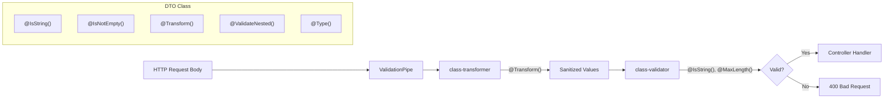

# DTO Validation & Transformation

## Overview

Ever Works uses the `class-validator` and `class-transformer` libraries to validate and sanitize all incoming API request data. Data Transfer Objects (DTOs) are plain TypeScript classes decorated with validation constraints and transformation rules. NestJS's `ValidationPipe` automatically applies these rules before the request reaches the controller handler, rejecting invalid input with structured error responses.

## Architecture



## Source Files

| File | Purpose |
|------|---------|
| `packages/agent/src/dto/create-directory.dto.ts` | Directory creation with slug validation, nested config |
| `packages/agent/src/dto/update-directory.dto.ts` | Partial update DTO with optional fields |
| `packages/agent/src/dto/generate-data.dto.ts` | Minimal DTO for generation requests |
| `packages/agent/src/dto/website-settings.dto.ts` | Deeply nested DTO with header, homepage, footer sections |
| `packages/agent/src/dto/directory-advanced-prompts.dto.ts` | Advanced prompt configuration |
| `packages/agent/src/dto/directory-schedule.dto.ts` | Schedule cadence configuration |
| `packages/agent/src/dto/taxonomy.dto.ts` | Category/collection/tag DTOs |
| `packages/agent/src/dto/import-directory.dto.ts` | Import source configuration |

## Key Classes

### CreateDirectoryDto -- Full Validation Example

Demonstrates slug regex validation, length limits, transforms, nested objects, and Swagger documentation:

```typescript
export class CreateDirectoryDto {
    @ApiProperty({
        description: 'URL-friendly identifier',
        example: 'my-awesome-directory',
    })
    @IsString()
    @IsNotEmpty()
    @Matches(/^[a-z0-9]+(?:-[a-z0-9]+)*$/, {
        message: 'Slug can only contain lowercase letters, numbers, and hyphens',
    })
    @Transform(({ value }) =>
        typeof value === 'string' ? value.trim().toLowerCase() : value,
    )
    slug: string;

    @ApiProperty({ maxLength: 100 })
    @IsString()
    @IsNotEmpty()
    @MaxLength(100)
    @Transform(({ value }) =>
        typeof value === 'string' ? sanitizeName(value, 100) : value,
    )
    name: string;

    @ApiProperty({ maxLength: 500 })
    @IsString()
    @IsNotEmpty()
    @MaxLength(500)
    @Transform(({ value }) =>
        typeof value === 'string' ? sanitizeDescription(value, 500) : value,
    )
    description: string;

    @IsBoolean()
    organization: boolean;

    @IsOptional()
    @ValidateNested()
    @Type(() => MarkdownReadmeConfigDto)
    readmeConfig?: MarkdownReadmeConfigDto;
}
```

### UpdateDirectoryDto -- Partial Updates

All fields are `@IsOptional()` for PATCH-style updates:

```typescript
export class UpdateDirectoryDto {
    @IsString()
    @IsOptional()
    @MaxLength(100)
    @Transform(({ value }) =>
        typeof value === 'string' ? sanitizeName(value, 100) : value,
    )
    name?: string;

    @IsOptional()
    @IsBoolean()
    websiteTemplateAutoUpdate?: boolean;

    @IsOptional()
    @ValidateNested()
    @Type(() => MarkdownReadmeConfigDto)
    readmeConfig?: MarkdownReadmeConfigDto;
}
```

### UpdateWebsiteSettingsDto -- Deep Nesting

Demonstrates multi-level nested validation with `@ValidateNested()` and `@Type()`:

```typescript
export class UpdateWebsiteSettingsDto {
    @IsOptional()
    @IsString()
    @MaxLength(100)
    company_name?: string;

    @IsOptional()
    @ValidateNested()
    @Type(() => SettingsHeaderDto)
    header?: SettingsHeaderDto;

    @IsOptional()
    @ValidateNested()
    @Type(() => SettingsHomepageDto)
    homepage?: SettingsHomepageDto;

    @IsOptional()
    @ValidateNested()
    @Type(() => CustomMenuDto)
    custom_menu?: CustomMenuDto;
}

export class CustomMenuDto {
    @IsOptional()
    @IsArray()
    @ValidateNested({ each: true })
    @Type(() => CustomMenuItemDto)
    @ArrayMaxSize(10)
    header?: CustomMenuItemDto[];
}

export class CustomMenuItemDto {
    @IsString()
    @MaxLength(50)
    label: string;

    @IsString()
    @MaxLength(200)
    path: string;

    @IsOptional()
    @IsIn(['_self', '_blank'])
    target?: '_self' | '_blank';
}
```

### Enum / Whitelist Validation

```typescript
export class SettingsHeaderDto {
    @IsOptional()
    @IsString()
    @IsIn(['light', 'dark', 'system'])
    theme_default?: string;

    @IsOptional()
    @IsString()
    @MaxLength(20)
    layout_default?: string;
}
```

## Configuration

### Global ValidationPipe

Configured in the API application bootstrap:

```typescript
app.useGlobalPipes(
    new ValidationPipe({
        whitelist: true,           // Strip unknown properties
        forbidNonWhitelisted: true, // Reject unknown properties
        transform: true,           // Auto-transform to DTO class instances
        transformOptions: {
            enableImplicitConversion: true,
        },
    }),
);
```

### Swagger Integration

DTOs use `@ApiProperty()` and `@ApiPropertyOptional()` to generate OpenAPI documentation:

```typescript
@ApiProperty({
    description: 'Display name for the directory',
    example: 'My Awesome Directory',
    maxLength: 100,
})
@IsString()
@IsNotEmpty()
@MaxLength(100)
name: string;
```

## Code Examples

### Input Sanitization with @Transform

The codebase uses custom sanitization functions in transforms to prevent XSS and normalize input:

```typescript
@Transform(({ value }) =>
    typeof value === 'string'
        ? sanitizeText(value, {
            removeNewlines: false,
            collapseSpaces: false,
            trim: true,
        })
        : value,
)
header?: string;
```

### Minimal DTO

For simple request validation:

```typescript
export class GenerateDataDto {
    @IsString()
    @IsNotEmpty()
    slug: string;

    @IsString()
    @IsNotEmpty()
    prompt: string;
}
```

### Nested DTO with Entity Interface Implementation

DTOs can implement entity interfaces to ensure consistency:

```typescript
export class MarkdownReadmeConfigDto implements MarkdownReadmeConfig {
    @IsOptional()
    @IsString()
    header?: string;

    @IsOptional()
    @IsBoolean()
    overwriteDefaultHeader?: boolean;
}
```

## Validation Decorators Used

| Decorator | Purpose |
|-----------|---------|
| `@IsString()` | Must be a string |
| `@IsNotEmpty()` | Cannot be empty string |
| `@IsOptional()` | Field may be omitted |
| `@IsBoolean()` | Must be boolean |
| `@IsArray()` | Must be an array |
| `@IsIn([...])` | Must be one of the listed values |
| `@Matches(regex)` | Must match regular expression |
| `@MaxLength(n)` | String max length |
| `@ArrayMaxSize(n)` | Array max items |
| `@ValidateNested()` | Validate nested object properties |
| `@Type(() => Cls)` | Transform plain object to class instance |
| `@Transform(fn)` | Custom transformation before validation |

## Best Practices

1. **Always use `@Type()`** with `@ValidateNested()` -- without it, `class-transformer` cannot instantiate the nested class and validation decorators on nested properties will not run.

2. **Apply transforms before validators** -- `@Transform()` runs during the transformation phase, before validation. Use it to trim, lowercase, or sanitize input.

3. **Use `whitelist: true`** in the global pipe -- this strips any properties not declared in the DTO, preventing mass-assignment vulnerabilities.

4. **Keep DTOs in dedicated files** -- DTOs live in `packages/agent/src/dto/` and are exported from the agent package for use by the API application.

5. **Use `@IsOptional()` for update DTOs** -- mark all fields optional so clients can send partial updates.

6. **Validate enum values with `@IsIn()`** -- use a whitelist approach rather than relying on TypeScript enums at runtime.

7. **Sanitize all text input** -- use `@Transform()` with sanitization functions (`sanitizeName`, `sanitizeDescription`, `sanitizeText`) to prevent injection attacks.

8. **Set sensible max lengths** -- always apply `@MaxLength()` to string fields and `@ArrayMaxSize()` to arrays to prevent abuse.

9. **Document with Swagger** -- pair validation decorators with `@ApiProperty()` / `@ApiPropertyOptional()` so the API docs accurately reflect constraints.
