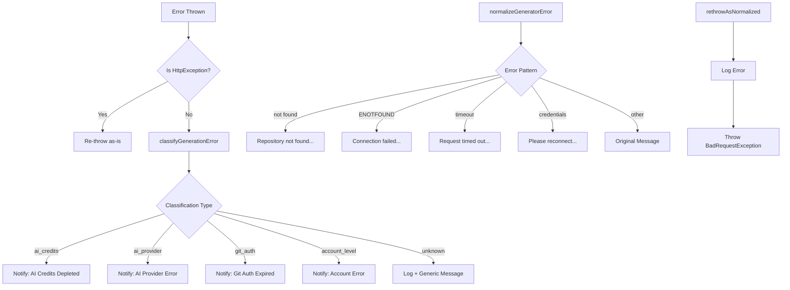

# Error Handling Patterns

## Overview

Ever Works implements a multi-layered error handling strategy that classifies, normalizes, and routes errors to appropriate handlers. The system distinguishes between HTTP exceptions (passed through directly), domain-specific classified errors (AI credits, provider auth, Git auth, account-level), and unknown errors (normalized to user-friendly messages). Classified errors trigger targeted user notifications to help users resolve issues.

## Architecture



## Source Files

| File | Purpose |
|------|---------|
| `packages/agent/src/services/utils/error-classification.utils.ts` | Error classification and notification routing |
| `packages/agent/src/services/utils/error.utils.ts` | Error normalization and re-throw helper |
| `packages/agent/src/utils/error.util.ts` | Safe error message/stack extraction |
| `packages/agent/src/facades/base.facade.ts` | Facade-level error classes (`FacadeError`, `NoProviderError`) |
| `packages/agent/src/facades/ai.facade.ts` | AI-specific error class (`AiFacadeError`) |
| `packages/agent/src/pipeline/pipeline-builder.service.ts` | Pipeline errors (`CircularDependencyError`, `MissingDependencyError`) |

## Key Classes

### Error Classification System

The classifier examines error messages using keyword matching and returns a typed classification:

```typescript
export type ErrorClassificationType =
    | 'ai_credits'
    | 'ai_provider'
    | 'git_auth'
    | 'account_level'
    | 'unknown';

export type ErrorClassification = {
    type: ErrorClassificationType;
    provider: string;
    message: string;
};

export function classifyGenerationError(error: unknown): ErrorClassification {
    const message = error instanceof Error ? error.message : String(error);
    const errorLower = message.toLowerCase();

    if (isAiCreditsError(errorLower)) {
        return { type: 'ai_credits', provider: detectAiProvider(errorLower), message };
    }
    if (isAiProviderError(errorLower)) {
        return { type: 'ai_provider', provider: detectAiProvider(errorLower), message };
    }
    if (isGitAuthError(errorLower)) {
        return { type: 'git_auth', provider: detectGitProvider(errorLower), message };
    }
    if (isAccountLevelError(errorLower)) {
        return { type: 'account_level', provider: '', message };
    }
    return { type: 'unknown', provider: '', message };
}
```

### Detection Functions

Each error type has a dedicated detector that checks for known error message patterns:

```typescript
function isAiCreditsError(error: string): boolean {
    return (
        error.includes('insufficient_quota') ||
        error.includes('rate_limit') ||
        error.includes('quota exceeded') ||
        error.includes('credits') ||
        error.includes('billing')
    );
}

function isAiProviderError(error: string): boolean {
    return (
        error.includes('invalid_api_key') ||
        error.includes('authentication') ||
        error.includes('unauthorized')
    );
}
```

### Provider Detection

The system auto-detects which AI or Git provider is involved:

```typescript
function detectAiProvider(error: string): string {
    if (error.includes('openai')) return 'OpenAI';
    if (error.includes('anthropic') || error.includes('claude')) return 'Anthropic';
    if (error.includes('google') || error.includes('gemini')) return 'Google';
    if (error.includes('groq')) return 'Groq';
    if (error.includes('ollama')) return 'Ollama';
    if (error.includes('openrouter')) return 'OpenRouter';
    return 'AI Provider';
}
```

### Error Normalization

Transforms raw errors into user-friendly messages:

```typescript
export function normalizeGeneratorError(error: any): string {
    let message = error?.message || error?.error || String(error);
    const lower = message.toLowerCase();

    if (lower.includes('not found')) {
        return 'Repository not found. Please verify the repository exists.';
    }
    if (lower.includes('enotfound') || lower.includes('getaddrinfo')) {
        return 'Connection failed. Please check your network.';
    }
    if (lower.includes('timeout') || lower.includes('timedout')) {
        return 'Request timed out. Please try again.';
    }
    if (lower.includes('could not read username')) {
        return 'Please reconnect your Git account to continue.';
    }
    return message;
}
```

### Re-throw as Normalized

A utility that preserves NestJS HttpExceptions and normalizes everything else to `BadRequestException`:

```typescript
export function rethrowAsNormalized(
    error: unknown,
    logger: Logger,
    context: string,
    extraFields?: Record<string, unknown>,
): never {
    if (error instanceof HttpException) {
        throw error; // Pass through as-is
    }
    logger.error(`Error ${context}:`, error);
    throw new BadRequestException({
        status: 'error',
        message: normalizeGeneratorError(error),
        ...extraFields,
    });
}
```

### Facade Error Hierarchy

```typescript
export class FacadeError extends Error {
    constructor(
        message: string,
        public readonly operation: string,
        public readonly provider?: string,
        public readonly cause?: Error,
    ) {
        super(message);
    }
}

export class NoProviderError extends FacadeError {
    constructor(capability: string) {
        super(`No ${capability} provider configured or available`, 'getPlugin');
    }
}

export class ProviderNotFoundError extends FacadeError {
    constructor(providerId: string, capability: string) {
        super(`${capability} provider not found: ${providerId}`, 'getPlugin', providerId);
    }
}

export class AiFacadeError extends FacadeError {
    // AI-specific errors with operation and provider context
}
```

### Pipeline Errors

```typescript
export class CircularDependencyError extends Error {
    constructor(public readonly cycle: string[]) {
        super(`Circular dependency detected: ${cycle.join(' -> ')}`);
    }
}

export class MissingDependencyError extends Error {
    constructor(
        public readonly stepId: string,
        public readonly missingDependency: string,
    ) {
        super(`Step "${stepId}" depends on missing step "${missingDependency}"`);
    }
}
```

### Safe Error Extraction

Type-safe utilities for extracting error information from `unknown` values:

```typescript
export function getErrorMessage(error: unknown): string {
    if (error instanceof Error) return error.message;
    return String(error);
}

export function getErrorStack(error: unknown): string | undefined {
    if (error instanceof Error) return error.stack;
    return undefined;
}
```

## Configuration

### Notification Integration

Classified errors route to the notification service, which creates user-visible alerts:

```typescript
export async function notifyForClassifiedError(
    notificationService: NotificationService,
    userId: string,
    directoryId: string,
    directoryName: string,
    classification: ErrorClassification,
): Promise<void> {
    switch (classification.type) {
        case 'ai_credits':
            await notificationService.notifyAiCreditsDepleted(
                userId, classification.provider, classification.message,
            );
            break;
        case 'git_auth':
            await notificationService.notifyGitAuthExpired(
                userId, classification.provider,
            );
            break;
        // ... other cases
    }
}
```

## Code Examples

### Using Error Classification in a Service

```typescript
try {
    await this.generateDirectory(directory, user);
} catch (error) {
    const classification = classifyGenerationError(error);

    await notifyForClassifiedError(
        this.notificationService,
        user.id,
        directory.id,
        directory.name,
        classification,
    );

    // Re-throw as normalized HTTP exception
    rethrowAsNormalized(error, this.logger, 'generating directory');
}
```

### Handling Facade Errors

```typescript
try {
    const result = await this.aiFacade.askJson(prompt, schema, options, facadeOptions);
} catch (error) {
    if (error instanceof NoProviderError) {
        throw new BadRequestException('No AI provider configured');
    }
    if (error instanceof AiFacadeError) {
        this.logger.warn(`AI error: ${error.operation} - ${error.message}`);
    }
    throw error;
}
```

## Best Practices

1. **Classify before notifying** -- always run `classifyGenerationError()` to categorize the error and provide actionable user notifications.

2. **Preserve HttpExceptions** -- use `rethrowAsNormalized()` which passes NestJS exceptions through untouched while normalizing everything else.

3. **Use typed error classes** -- prefer `FacadeError`, `AiFacadeError`, etc. over generic `Error` to carry operation and provider context.

4. **Never expose internal details** -- `normalizeGeneratorError()` maps internal messages (ENOTFOUND, timeouts) to user-friendly descriptions.

5. **Always use `getErrorMessage()`** -- when catching `unknown` errors, use the safe extraction utility instead of casting.

6. **Log before transforming** -- always `logger.error()` the original error before re-throwing a normalized version.

7. **Detect providers from error text** -- the `detectAiProvider()` and `detectGitProvider()` functions enable provider-specific notification messages.
