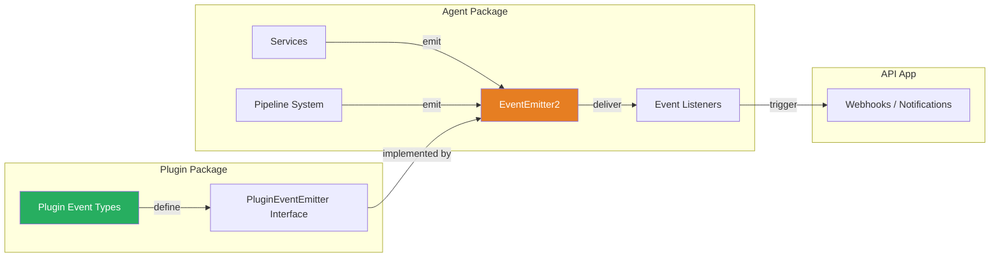
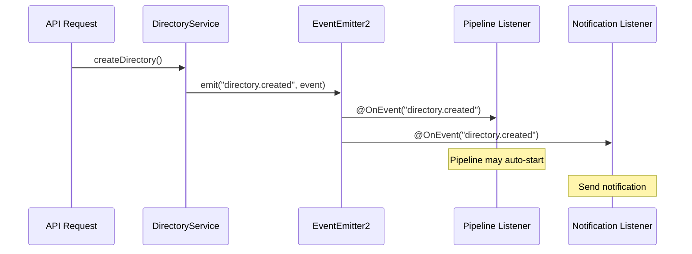

# Event System

The Ever Works platform uses a two-layer event system: **domain events** in the agent package built on NestJS `EventEmitter2`, and **typed plugin events** defined in the plugin package for cross-boundary communication.

## Architecture Overview



## Domain Events (Agent Package)

The agent package defines domain events in `packages/agent/src/events/`. These are lightweight event classes that extend a `BaseEvent` abstract class.

### BaseEvent

```typescript
export abstract class BaseEvent {
	static EVENT_NAME: string;
}
```

Every domain event declares a static `EVENT_NAME` string that serves as the event key for the NestJS event emitter.

### Defined Domain Events

| Event Class                         | Event Name                       | Payload                    | Emitted When                  |
| ----------------------------------- | -------------------------------- | -------------------------- | ----------------------------- |
| `DirectoryCreatedEvent`             | `directory.created`              | `{ directory: Directory }` | A new directory is created    |
| `DirectoryGenerationCompletedEvent` | `directory.generation.completed` | `{ directory: Directory }` | Directory generation finishes |

These events carry full TypeORM entity instances, allowing listeners to access all directory properties including relations.

### Emitting Domain Events

Services emit events using NestJS `EventEmitter2`:

```typescript
import { EventEmitter2 } from '@nestjs/event-emitter';
import { DirectoryCreatedEvent } from '../events';

@Injectable()
export class DirectoryLifecycleService {
	constructor(private readonly eventEmitter: EventEmitter2) {}

	async createDirectory(/* ... */): Promise<Directory> {
		const directory = await this.save(/* ... */);
		this.eventEmitter.emit(DirectoryCreatedEvent.EVENT_NAME, new DirectoryCreatedEvent(directory));
		return directory;
	}
}
```

### Listening to Domain Events

Listeners use the `@OnEvent` decorator from `@nestjs/event-emitter`:

```typescript
import { OnEvent } from '@nestjs/event-emitter';
import { DirectoryCreatedEvent } from '@ever-works/agent/events';

@Injectable()
export class DirectoryEventListener {
	@OnEvent(DirectoryCreatedEvent.EVENT_NAME)
	handleDirectoryCreated(event: DirectoryCreatedEvent) {
		// Handle the event
	}
}
```

## Plugin Event Types (Plugin Package)

The plugin package (`packages/plugin/src/events/`) defines a comprehensive typed event system for cross-plugin communication. This provides type-safe event names, payload interfaces, and handler types.

### Event Categories

Events are organized into five categories:

#### Plugin Lifecycle Events

| Event Name                | Payload                        | Description                 |
| ------------------------- | ------------------------------ | --------------------------- |
| `plugin:loaded`           | `PluginLoadedPayload`          | Plugin loaded successfully  |
| `plugin:enabled`          | `PluginLoadedPayload`          | Plugin enabled              |
| `plugin:disabled`         | `PluginLoadedPayload`          | Plugin disabled             |
| `plugin:unloaded`         | `PluginLoadedPayload`          | Plugin unloaded             |
| `plugin:error`            | `PluginErrorPayload`           | Plugin encountered an error |
| `plugin:settings-changed` | `PluginSettingsChangedPayload` | Plugin settings updated     |

#### Directory Events

| Event Name                       | Payload                               | Description          |
| -------------------------------- | ------------------------------------- | -------------------- |
| `directory:created`              | `DirectoryEventPayload`               | Directory created    |
| `directory:updated`              | `DirectoryEventPayload`               | Directory updated    |
| `directory:deleted`              | `DirectoryEventPayload`               | Directory deleted    |
| `directory:deployed`             | `DirectoryEventPayload`               | Directory deployed   |
| `directory:generation-started`   | `DirectoryGenerationStartedPayload`   | Generation started   |
| `directory:generation-completed` | `DirectoryGenerationCompletedPayload` | Generation completed |
| `directory:generation-failed`    | `DirectoryGenerationFailedPayload`    | Generation failed    |

#### Item Events

| Event Name       | Payload                | Description                     |
| ---------------- | ---------------------- | ------------------------------- |
| `item:created`   | `ItemEventPayload`     | Item created                    |
| `item:updated`   | `ItemEventPayload`     | Item updated                    |
| `item:deleted`   | `ItemEventPayload`     | Item deleted                    |
| `item:extracted` | `ItemEventPayload`     | Item data extracted from source |
| `item:validated` | `ItemValidatedPayload` | Item validation completed       |

#### Pipeline Events

| Event Name                | Payload                        | Description                |
| ------------------------- | ------------------------------ | -------------------------- |
| `pipeline:started`        | `PipelineEventPayload`         | Pipeline execution started |
| `pipeline:step-started`   | `PipelineStepEventPayload`     | Pipeline step started      |
| `pipeline:step-completed` | `PipelineStepCompletedPayload` | Pipeline step completed    |
| `pipeline:step-failed`    | `PipelineStepFailedPayload`    | Pipeline step failed       |
| `pipeline:completed`      | `PipelineCompletedPayload`     | Pipeline completed         |
| `pipeline:failed`         | `PipelineFailedPayload`        | Pipeline failed            |
| `pipeline:cancelled`      | `PipelineEventPayload`         | Pipeline cancelled         |

#### System Events

| Event Name            | Payload              | Description            |
| --------------------- | -------------------- | ---------------------- |
| `system:startup`      | `SystemEventPayload` | System started         |
| `system:shutdown`     | `SystemEventPayload` | System shutting down   |
| `system:health-check` | `SystemEventPayload` | Health check performed |

### Payload Hierarchy

All event payloads extend `BaseEventPayload`:

```typescript
interface BaseEventPayload {
	readonly timestamp: string; // ISO timestamp
	readonly correlationId?: string; // Optional trace ID
}
```

More specific payloads add context-relevant fields:

```typescript
interface PipelineStepCompletedPayload extends PipelineStepEventPayload {
	readonly duration: number;
	readonly result?: Record<string, unknown>;
}

interface PipelineStepEventPayload extends PipelineEventPayload {
	readonly stepId: string;
	readonly stepName: string;
	readonly stepIndex: number;
	readonly totalSteps: number;
}

interface PipelineEventPayload extends BaseEventPayload {
	readonly directoryId: string;
	readonly pipelineId?: string;
}
```

### Type-Safe Event Handler

The plugin package provides a typed `EventHandler` type and `PluginEventEmitter` interface:

```typescript
type EventHandler<T extends PluginEventName> = (payload: PluginEventPayloads[T]) => void | Promise<void>;

interface PluginEventEmitter {
	on<T extends PluginEventName>(event: T, handler: EventHandler<T>): EventSubscription;
	once<T extends PluginEventName>(event: T, handler: EventHandler<T>): EventSubscription;
	emit<T extends PluginEventName>(event: T, payload: PluginEventPayloads[T]): void;
}
```

The `PluginEventPayloads` interface provides a complete mapping from event names to their payload types, enabling full IntelliSense and compile-time safety.

### EventSubscription

Event subscriptions return an `EventSubscription` object for cleanup:

```typescript
interface EventSubscription {
	readonly unsubscribe: () => void;
}
```

## Integration: Agent and Plugin Events

The pipeline system in the agent package emits events using the plugin event types. The `StepPipelineExecutorService` and `FullPipelineExecutorService` both emit typed pipeline events through `EventEmitter2`:

```typescript
// Inside StepPipelineExecutorService
this.eventEmitter.emit(PipelineEvents.STEP_COMPLETED, {
	timestamp: new Date().toISOString(),
	stepId: step.id,
	stepName: step.name,
	stepIndex: index,
	totalSteps: total,
	duration
} as PipelineStepCompletedPayload);
```

The `PipelineEvents` constant maps to the same event names defined in the plugin package, ensuring consistency between the two layers.

## Event Flow Diagram


