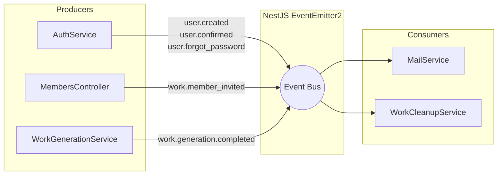
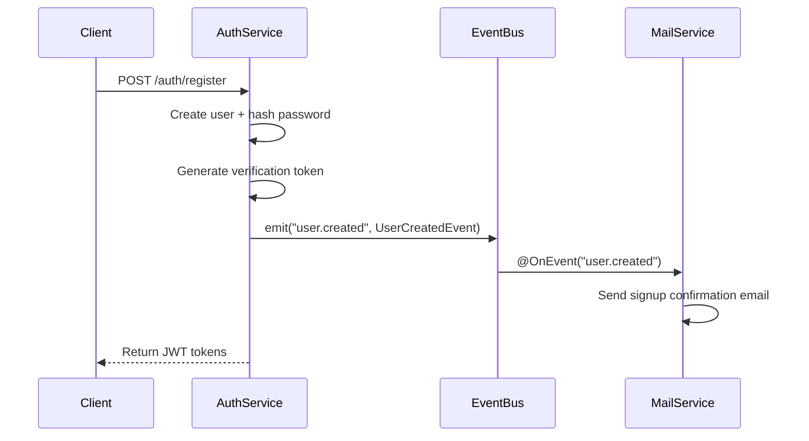
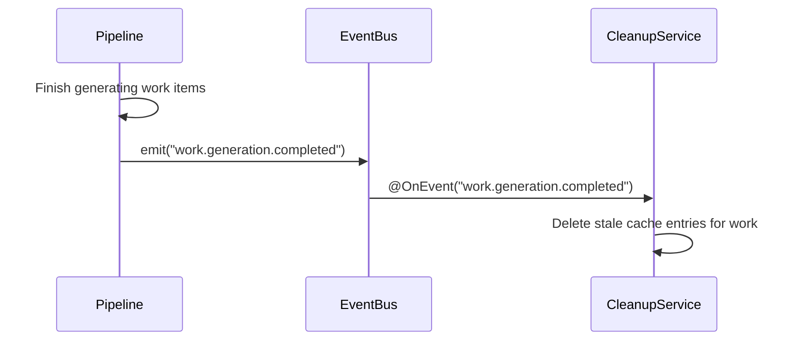

# Event System Deep Dive

Ever Works uses an event-driven architecture built on top of the NestJS `EventEmitterModule`. Events decouple producers (controllers, services) from consumers (mail service, cleanup tasks), keeping modules loosely coupled while enabling complex cross-cutting workflows such as transactional emails and post-generation cache invalidation.

## Architecture Overview



## Event Bus Setup

The event bus is initialized in `apps/api/src/api.module.ts` by importing the NestJS `EventEmitterModule`:

```typescript
// apps/api/src/api.module.ts
import { EventEmitterModule } from '@nestjs/event-emitter';

@Module({
	imports: [
		EventEmitterModule.forRoot()
		// ... other modules
	]
})
export class ApiModule {}
```

`EventEmitterModule.forRoot()` registers a global `EventEmitter2` instance that any service or controller can inject.

## Event Class Hierarchy

Events are defined in two locations based on their scope:

| Location                     | Scope                              | Events                                                                                                                                                                       |
| ---------------------------- | ---------------------------------- | ---------------------------------------------------------------------------------------------------------------------------------------------------------------------------- |
| `apps/api/src/events/`       | API-level (user and member events) | `UserCreatedEvent`, `UserForgotPasswordEvent`, `UserPasswordChangedEvent`, `UserConfirmedEvent`, `UserNewDeviceLoginEvent`, `UserAccountDeletionEvent`, `MemberInvitedEvent` |
| `packages/agent/src/events/` | Agent-level (work lifecycle)  | `WorkCreatedEvent`, `WorkGenerationCompletedEvent`                                                                                                                 |

### Base Event Classes

The agent package defines a minimal `BaseEvent` abstract class:

```typescript
// packages/agent/src/events/base.ts
export abstract class BaseEvent {
	static EVENT_NAME: string;
}
```

The API defines a `BaseUserEvent` that requires a `user` property:

```typescript
// apps/api/src/events/index.ts
export abstract class BaseUserEvent {
	public abstract user: User;
}
```

### Event Naming Convention

All events follow a dot-separated namespace pattern:

```
<domain>.<action>
<domain>.<sub-domain>.<action>
```

Examples:

- `user.created`
- `user.forgot_password`
- `work.member_invited`
- `work.generation.completed`

## Complete Event Reference

### User Events (API)

| Event Class                | `EVENT_NAME`            | Payload Properties                                                                                                |
| -------------------------- | ----------------------- | ----------------------------------------------------------------------------------------------------------------- |
| `UserCreatedEvent`         | `user.created`          | `user`, `confirmationToken`, `confirmationUrl`                                                                    |
| `UserForgotPasswordEvent`  | `user.forgot_password`  | `user`, `resetToken`, `resetUrl`, `expiresIn`                                                                     |
| `UserPasswordChangedEvent` | `user.password_changed` | `user`, `changedAt`, `ipAddress`, `location`, `device`, `browser`, `secureAccountUrl`                             |
| `UserConfirmedEvent`       | `user.confirmed`        | `user`, `dashboardUrl`                                                                                            |
| `UserNewDeviceLoginEvent`  | `user.new_device_login` | `user`, `loginTime`, `device`, `browser`, `location`, `ipAddress`, `verifyToken`, `verifyUrl`, `secureAccountUrl` |
| `UserAccountDeletionEvent` | `user.delete_account`   | `user`, `deleteToken`, `deleteUrl`, `keepAccountUrl`, `expiresIn`                                                 |

### Work Events

| Event Class                         | `EVENT_NAME`                     | Payload Properties                                        | Source |
| ----------------------------------- | -------------------------------- | --------------------------------------------------------- | ------ |
| `MemberInvitedEvent`                | `work.member_invited`       | `invitee`, `inviter`, `work`, `role`, `workUrl` | API    |
| `WorkCreatedEvent`             | `work.created`              | `work`                                               | Agent  |
| `WorkGenerationCompletedEvent` | `work.generation.completed` | `work`                                               | Agent  |

## Emitting Events

Events are dispatched by injecting `EventEmitter2` and calling `emit()` with the event name and an event class instance.

### Example: User Registration

```typescript
// apps/api/src/auth/services/auth.service.ts
import { EventEmitter2 } from '@nestjs/event-emitter';
import { UserCreatedEvent } from '../../events';

@Injectable()
export class AuthService {
	constructor(private eventEmitter: EventEmitter2) {}

	async sendVerificationEmail(userId: string) {
		const user = await this.userRepository.findById(userId);
		const verificationToken = randomBytes(32).toString('hex');

		// Emit event -- MailService picks it up
		this.eventEmitter.emit(UserCreatedEvent.EVENT_NAME, new UserCreatedEvent(user, verificationToken, callbackUrl));
	}
}
```

### Example: Member Invitation

```typescript
// apps/api/src/works/members.controller.ts
@Post()
async inviteMember(@CurrentUser() auth, @Param('workId') workId, @Body() dto) {
    const result = await this.memberService.inviteMember(workId, user.id, dto);

    this.eventEmitter.emit(
        MemberInvitedEvent.EVENT_NAME,
        new MemberInvitedEvent(
            result.invitee,
            result.inviter,
            result.work,
            dto.role,
            workUrl,
        ),
    );
}
```

## Subscribing to Events

Consumers use the `@OnEvent()` decorator on handler methods. NestJS automatically discovers annotated methods in any `@Injectable()` class registered in a module.

### MailService -- Email Notifications

The `MailService` (`apps/api/src/mail/mail.service.ts`) subscribes to all user and member events to send transactional emails:

```typescript
@Injectable()
export class MailService {
	constructor(private readonly mailerService: MailerService) {}

	@OnEvent(UserCreatedEvent.EVENT_NAME)
	async sendSignupConfirmation(data: UserCreatedEvent): Promise<void> {
		await this.mailerService.sendMail({
			to: data.user.email,
			subject: `Confirm your ${appName} account`,
			template: 'signup-confirmation',
			context: {
				firstName: data.user.username,
				confirmationUrl: data.confirmationUrl
			}
		});
	}

	@OnEvent(UserForgotPasswordEvent.EVENT_NAME)
	async sendForgotPassword(data: UserForgotPasswordEvent) {
		/* ... */
	}

	@OnEvent(UserPasswordChangedEvent.EVENT_NAME)
	async sendPasswordChanged(data: UserPasswordChangedEvent) {
		/* ... */
	}

	@OnEvent(UserConfirmedEvent.EVENT_NAME)
	async sendWelcomeEmail(data: UserConfirmedEvent) {
		/* ... */
	}

	@OnEvent(UserNewDeviceLoginEvent.EVENT_NAME)
	async sendNewDeviceAlert(data: UserNewDeviceLoginEvent) {
		/* ... */
	}

	@OnEvent(UserAccountDeletionEvent.EVENT_NAME)
	async sendAccountDeletionConfirmation(data: UserAccountDeletionEvent) {
		/* ... */
	}

	@OnEvent(MemberInvitedEvent.EVENT_NAME)
	async sendMemberInvitation(data: MemberInvitedEvent) {
		/* ... */
	}
}
```

### WorkCleanupService -- Cache Invalidation

The cleanup service listens for generation completion to clear stale cache entries:

```typescript
// apps/api/src/works/tasks/work-cleanup.service.ts
@Injectable()
export class WorkCleanupService {
	@OnEvent(WorkGenerationCompletedEvent.EVENT_NAME)
	clearWorkCache(data: WorkGenerationCompletedEvent) {
		this.cacheRepository.typeormAdapter.deleteUnscopedEntriesLike(data.work.id);
	}
}
```

## Event Flow Diagrams

### User Registration Flow



### Work Generation Completed Flow



## Error Handling

All event handlers wrap their logic in try/catch blocks and log failures without re-throwing. This is critical because event emission is fire-and-forget -- a failing handler must not crash the emitting service:

```typescript
@OnEvent(UserCreatedEvent.EVENT_NAME)
async sendSignupConfirmation(data: UserCreatedEvent): Promise<void> {
    try {
        await this.mailerService.sendMail({ /* ... */ });
    } catch (error) {
        this.logger.error(
            `Failed to send signup confirmation to ${data.user.email}`,
            error?.stack ?? error,
        );
    }
}
```

## Adding a New Event

To add a new event to the system:

1. **Define the event class** in the appropriate location:
    - User/API scope: `apps/api/src/events/index.ts`
    - Work/agent scope: `packages/agent/src/events/`

2. **Follow the naming convention**: `<domain>.<action>`

3. **Extend the correct base class**: `BaseUserEvent` for user events, `BaseEvent` for agent events.

4. **Emit the event** from the relevant service or controller using `EventEmitter2.emit()`.

5. **Subscribe in a consumer** by adding an `@OnEvent()` decorated method to an `@Injectable()` class.

```typescript
// 1. Define the event
export class WorkPublishedEvent extends BaseEvent {
    static EVENT_NAME = 'work.published';

    constructor(
        public readonly work: Work,
        public readonly publishedUrl: string,
    ) {
        super();
    }
}

// 2. Emit it
this.eventEmitter.emit(
    WorkPublishedEvent.EVENT_NAME,
    new WorkPublishedEvent(work, url),
);

// 3. Subscribe to it
@OnEvent(WorkPublishedEvent.EVENT_NAME)
async handleWorkPublished(data: WorkPublishedEvent) {
    // React to the event
}
```

## Key Design Decisions

- **Synchronous by default**: `EventEmitter2` in NestJS runs handlers synchronously in the same process. For long-running work, handlers should offload to BullMQ or Trigger.dev.
- **No persistence**: Events are in-memory only. If the process crashes between emission and handling, the event is lost. For critical workflows, use a message queue instead.
- **Two-layer architecture**: API-level events live in `apps/api/src/events/`, while agent-level events live in `packages/agent/src/events/`. This mirrors the monorepo boundary between the HTTP layer and the business logic package.
- **Type-safe payloads**: Each event is a typed class with explicit constructor parameters, providing compile-time safety for both emitters and consumers.
