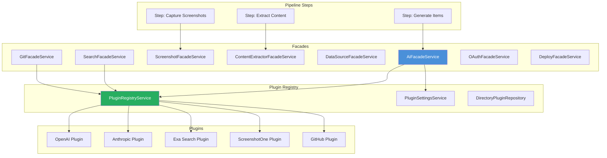

# Facade & Service Patterns

The Ever Works platform uses the **Facade pattern** to provide pipeline steps and services with a unified interface to plugin capabilities. Each facade abstracts provider resolution, settings hierarchy, and enable checks behind a simple API, decoupling business logic from the specifics of which plugin is active.

## Architecture Overview



## BaseFacadeService

All facades extend `BaseFacadeService`, which provides common provider resolution and settings management:

```typescript
abstract class BaseFacadeService {
    protected abstract readonly CAPABILITY: string;
    protected abstract readonly logger: Logger;

    constructor(
        protected readonly registry: PluginRegistryService,
        protected readonly settingsService: PluginSettingsService | undefined,
        protected readonly directoryPluginRepository?: DirectoryPluginRepository,
    ) {}
}
```

### Provider Resolution

The `resolvePlugin<T>()` method follows a four-level priority chain:

| Priority | Source | Description |
|----------|--------|-------------|
| 1 | `providerOverride` | Explicit provider ID from the request |
| 2 | Directory default | Active provider set for the specific directory |
| 3 | `defaultForCapabilities` | Plugin declaring itself as the default for a capability |
| 4 | First enabled | First loaded and enabled plugin with the required capability |

### Settings Hierarchy

Plugin settings are resolved through a four-level hierarchy via `PluginSettingsService`:

| Level | Scope | Description |
|-------|-------|-------------|
| 1 | Directory | Settings specific to a directory |
| 2 | User | Settings specific to a user |
| 3 | Admin | Global admin-configured settings |
| 4 | Plugin defaults | Default values from the plugin's JSON Schema |

### Setting Utilities

The base facade provides typed setting accessors:

| Method | Behavior |
|--------|----------|
| `getSettingTyped<T>(settings, key, type)` | Returns typed value or `undefined` |
| `getSettingRequired<T>(settings, key, type)` | Returns typed value or throws |
| `getSettingWithDefault<T>(settings, key, type, default)` | Returns typed value or default |

### Error Classes

| Error Class | Description |
|-------------|-------------|
| `FacadeError` | Base error with operation name and provider context |
| `NoProviderError` | No provider configured for the capability |
| `ProviderNotFoundError` | Requested provider ID not found in registry |

## Facade Services

The `FacadesModule` registers eight facade services:

### AiFacadeService

The most complex facade, providing AI completion and structured output capabilities.

**Key methods:**

| Method | Description |
|--------|-------------|
| `askJson<T>(prompt, schema, options, facadeOptions)` | Structured output with Zod validation |
| `createChatCompletion(options, facadeOptions)` | Standard chat completion |
| `createStreamingChatCompletion(options, facadeOptions)` | Streaming chat (AsyncGenerator) |
| `testConnection(facadeOptions)` | Verify provider availability |
| `getAvailableModels(facadeOptions)` | List models from the active provider |
| `getProviderConfig(facadeOptions)` | Get full provider configuration |
| `resolveModelContextLength(modelId, facadeOptions)` | Resolve context window size |

**Model routing:** The AI facade resolves models through a priority chain:
1. `modelOverride` from routing options
2. Complexity-based model (`simpleModel`, `mediumModel`, `complexModel` from settings)
3. `defaultModel` from settings
4. Plugin default model

**Auto-escalation:** When `autoEscalate` is enabled and a call fails, the facade automatically retries with a higher-complexity model tier (simple -> medium -> complex).

**Cost calculation:** After each call, the facade computes token costs using the provider's model pricing information.

### SearchFacadeService

Wraps web search provider plugins (Exa, Tavily, SerpAPI, Brave).

### ScreenshotFacadeService

Wraps screenshot capture plugins (ScreenshotOne, URLBox) for capturing website screenshots and smart images.

### ContentExtractorFacadeService

Wraps content extraction plugins for extracting text and metadata from web pages.

### DataSourceFacadeService

Wraps data source plugins for querying external data sources (e.g., Notion, Apify).

### GitFacadeService

Wraps Git provider plugins (GitHub) for repository operations: create, clone, push, branch management, pull requests.

### OAuthFacadeService

Wraps OAuth provider plugins for authentication token management.

### DeployFacadeService

Wraps deployment provider plugins (Vercel) for website deployment.

## FacadesModule

```typescript
@Module({
    imports: [DatabaseModule],
    providers: [
        AiFacadeService,
        SearchFacadeService,
        ScreenshotFacadeService,
        ContentExtractorFacadeService,
        DataSourceFacadeService,
        GitFacadeService,
        OAuthFacadeService,
        DeployFacadeService,
    ],
    exports: [/* all providers */],
})
export class FacadesModule {}
```

The module depends on `DatabaseModule` for the `DirectoryPluginRepository`. It relies on `PluginsModule` being registered globally at the application root level.

## Bound Facades (PipelineFacadeService)

Pipeline steps receive pre-bound facades through the `PipelineFacadeService`. Instead of passing `FacadeOptions` with every call, the bound facades capture the directory and user context at creation time:

```typescript
// Unbound (direct service call)
await aiFacade.askJson(prompt, schema, options, {
    directoryId: 'dir-123',
    userId: 'user-456',
    providerOverride: 'openai',
});

// Bound (inside pipeline step via StepExecutionContext)
await execContext.aiFacade.askJson(prompt, schema, options, facadeOptions);
// facadeOptions is ignored -- the bound context is used automatically
```

This pattern eliminates repetitive context passing and ensures consistent provider resolution throughout a pipeline execution.

## Service Layer Architecture

Beyond facades, the agent package employs a service layer pattern for directory domain logic. The `DirectoryModule` provides 14 specialized services that follow these patterns:

### Single Responsibility

Each service handles a specific domain concern:
- `DirectoryLifecycleService` for create/update/delete
- `DirectoryGenerationService` for orchestrating generation
- `DirectoryScheduleService` for scheduled regeneration

### Dependency Injection

All services use NestJS constructor injection:

```typescript
@Injectable()
export class DirectoryGenerationService {
    constructor(
        private readonly dataGenerator: DataGeneratorService,
        private readonly markdownGenerator: MarkdownGeneratorService,
        private readonly websiteGenerator: WebsiteGeneratorService,
        private readonly pipelineOrchestrator: PipelineOrchestratorService,
    ) {}
}
```

### Error Classification

The service layer includes error classification utilities (`services/utils/error-classification.utils.ts`) that categorize errors for appropriate handling:

- Retryable errors (network timeouts, rate limits)
- User-facing errors (invalid input, missing permissions)
- System errors (database failures, plugin crashes)
