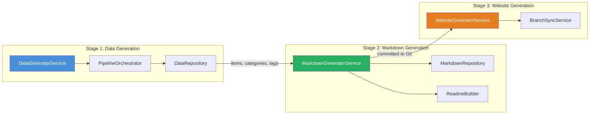
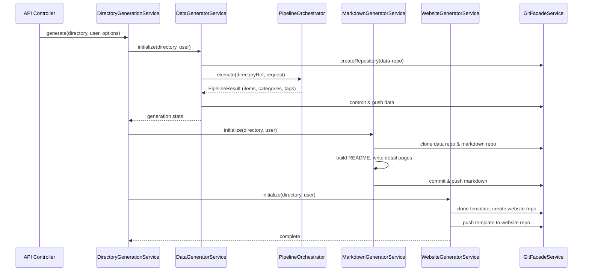

# Generator System

The Ever Works generator system is a three-stage content pipeline that transforms AI-generated data into Git-backed directory websites. Each stage handles a specific concern: data generation, markdown rendering, and website repository management.

## Three-Stage Architecture



## Stage 1: Data Generator

**Source:** `packages/agent/src/generators/data-generator/`

The `DataGeneratorService` is the primary entry point for directory content generation. It orchestrates the full lifecycle from initial repository setup through AI-powered item generation to Git persistence.

### Responsibilities

- Create and manage the data Git repository
- Delegate item generation to the pipeline system
- Write generated items, categories, tags, and collections to the data repository
- Handle generation modes: `RECREATE` (fresh) and incremental updates
- Manage pull request workflows for updates
- Track generation metrics and status

### Key Methods

| Method               | Purpose                                                               |
| -------------------- | --------------------------------------------------------------------- |
| `initialize()`       | Full directory generation: clone repo, run pipeline, write data, push |
| `addItems()`         | Add or update individual items                                        |
| `removeItem()`       | Remove an item from the data repository                               |
| `removeRepository()` | Delete the data Git repository                                        |

### Generation Flow

1. **Repository setup** -- Clone or create the data repository via `GitFacadeService`
2. **Pipeline execution** -- Delegate to `PipelineOrchestratorService` for item generation
3. **Data writing** -- Write items (as individual JSON files), categories, tags, collections, and config to the `DataRepository`
4. **Markdown integration** -- Generate default markdown for items when not provided by the pipeline
5. **Git operations** -- Stage, commit, and push changes; optionally create pull requests for updates
6. **Status tracking** -- Update directory generation status and metrics

### DataRepository

The `DataRepository` class manages the file-system structure of a directory's data:

```
data-repo/
├── data/
│   ├── {item-slug}/
│   │   ├── item.json        # Item data
│   │   └── details.md       # Item markdown content
│   └── ...
├── categories.json           # Category definitions
├── tags.json                 # Tag definitions
├── collections.json          # Collection definitions
├── config.json               # Directory configuration
├── template.md               # Markdown template (header/footer)
└── LICENSE                   # License file
```

### Pipeline Integration

The `DataGeneratorService` creates a `DirectoryReference` and `GenerationRequest` from the directory entity, then passes them to the `PipelineOrchestratorService`:

```typescript
const pipelineResult = await this.pipelineOrchestrator.execute(
	directoryRef,
	generationRequest,
	existingItems,
	{ signal },
	onProgress
);
```

The pipeline result contains generated `items`, `categories`, `tags`, `collections`, and `brands` that are then written to the data repository.

## Stage 2: Markdown Generator

**Source:** `packages/agent/src/generators/markdown-generator/`

The `MarkdownGeneratorService` transforms data repository content into a human-readable markdown repository with a curated README and individual item detail pages.

### Responsibilities

- Create and manage the markdown Git repository
- Read items and categories from the data repository
- Generate per-item detail markdown files
- Build a structured README.md with categorized item listings
- Handle PR-based workflows for incremental updates
- Manage branch switching for PR and recreate flows

### Key Components

| Component                  | Purpose                                                                |
| -------------------------- | ---------------------------------------------------------------------- |
| `MarkdownGeneratorService` | Orchestrates markdown generation and Git operations                    |
| `MarkdownRepository`       | File-system operations for the markdown repo                           |
| `ReadmeBuilder`            | Constructs the README.md with categories, items, and table of contents |

### README Structure

The `ReadmeBuilder` generates a README with:

1. **Header** -- Custom header from the data repository's template
2. **Table of Contents** -- Optional, configurable via `content_table` in config
3. **Category sections** -- Items grouped by category, sorted by:
    - Categories with featured items first
    - Category priority (lower number = higher)
    - Featured count descending
    - Alphabetical by category name
4. **Item listings** -- Within each category, items sorted by:
    - Featured items first
    - Explicit order (ascending)
    - Alphabetical by name
5. **Footer** -- Custom footer from the data repository's template

### Generation Modes

| Mode                 | Behavior                                                      |
| -------------------- | ------------------------------------------------------------- |
| **RECREATE**         | Switch to main branch, reset all files, regenerate everything |
| **Incremental (PR)** | Create a feature branch, make changes, create a pull request  |
| **Direct push**      | Commit and push changes directly to the main branch           |

## Stage 3: Website Generator

**Source:** `packages/agent/src/generators/website-generator/`

The `WebsiteGeneratorService` manages the website repository that renders the directory as a deployable website.

### Responsibilities

- Create website repositories from a template
- Sync template branches to keep websites up to date
- Handle two creation methods: duplicate and template-based
- Manage website repository lifecycle (create, sync, delete)

### Creation Methods

| Method        | Enum Value              | Behavior                                                                |
| ------------- | ----------------------- | ----------------------------------------------------------------------- |
| **Duplicate** | `DUPLICATE`             | Clone template repo, re-point remote to new repo, force push            |
| **Template**  | `CREATE_USING_TEMPLATE` | Use Git provider's template repository feature; falls back to duplicate |

### Website Template Configuration

The `WEBSITE_TEMPLATE_CONFIG` defines the source template:

```typescript
{
    owner: string,    // Template repository owner
    repo: string,     // Template repository name
    branch: string,   // Default branch to clone
}
```

### BranchSyncService

The `BranchSyncService` keeps website repositories synchronized with the template. When the template is updated (new features, bug fixes, theme changes), this service propagates those changes:

- Syncs all branches from the template repository
- Optionally cleans up extra branches not present in the template
- Handles merge conflicts during branch synchronization

### WebsiteUpdateService

The `WebsiteUpdateService` (in `website-update.service.ts`) handles configuration updates to the website repository, such as updating directory metadata, theme settings, or deployment configuration.

## Module Structure

Each generator stage has its own NestJS module:

```typescript
// DataGeneratorModule
@Module({
    imports: [DatabaseModule, FacadesModule, PipelineModule],
    providers: [DataGeneratorService],
    exports: [DataGeneratorService],
})

// MarkdownGeneratorModule
@Module({
    imports: [FacadesModule],
    providers: [MarkdownGeneratorService],
    exports: [MarkdownGeneratorService],
})

// WebsiteGeneratorModule
@Module({
    imports: [FacadesModule],
    providers: [WebsiteGeneratorService, BranchSyncService, WebsiteUpdateService],
    exports: [WebsiteGeneratorService, WebsiteUpdateService],
})
```

All three modules are imported by the `DirectoryModule`, which provides the `DirectoryGenerationService` that coordinates the full three-stage generation flow.

## End-to-End Generation Flow



## Error Handling

The data generator defines structured error types for initialization failures:

| Error Code           | Description                       |
| -------------------- | --------------------------------- |
| `CLONE_FAILED`       | Git clone operation failed        |
| `REPO_CREATE_FAILED` | Repository creation failed        |
| `DATA_REPO_FAILED`   | Data repository operations failed |
| `GENERATION_FAILED`  | Pipeline execution failed         |
| `PUSH_FAILED`        | Git push operation failed         |

Each generator stage catches errors independently and provides detailed logging. The `DirectoryGenerationService` tracks the overall generation status on the directory entity.
