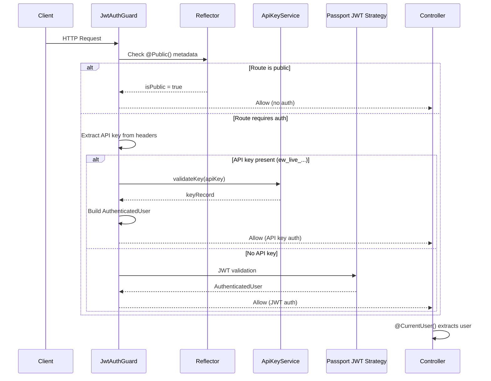

# Guards, Interceptors & Auth Decorators

## Overview

The Ever Works API uses NestJS guards, strategies, and custom decorators to handle authentication and authorization. The system supports dual authentication: JWT tokens (from user login) and API keys (for programmatic access). Public routes are marked with the `@Public()` decorator to bypass authentication entirely. The guard layer sits in front of all controllers, examining each request before it reaches the handler.

## Architecture



## Source Files

| File | Purpose |
|------|---------|
| `apps/api/src/auth/guards/jwt-auth.guard.ts` | Main authentication guard with dual JWT + API key support |
| `apps/api/src/auth/guards/local-auth.guard.ts` | Username/password authentication guard for login |
| `apps/api/src/auth/strategies/jwt.strategy.ts` | Passport JWT strategy for token validation |
| `apps/api/src/auth/strategies/local.strategy.ts` | Passport local strategy for login |
| `apps/api/src/auth/strategies/github.strategy.ts` | OAuth GitHub strategy |
| `apps/api/src/auth/strategies/google.strategy.ts` | OAuth Google strategy |
| `apps/api/src/auth/decorators/public.decorator.ts` | `@Public()` decorator to skip auth |
| `apps/api/src/auth/decorators/user.decorator.ts` | `@CurrentUser()` parameter decorator |

## Key Classes

### JwtAuthGuard

The primary guard applied globally. It checks three things in order:

1. Is the route marked `@Public()`? If so, allow.
2. Does the request carry an API key (`ew_live_` prefix)? If so, validate it.
3. Fall through to Passport JWT validation.

```typescript
@Injectable()
export class JwtAuthGuard extends AuthGuard('jwt') {
    constructor(
        private reflector: Reflector,
        private moduleRef: ModuleRef,
    ) {
        super();
    }

    async canActivate(context: ExecutionContext): Promise<boolean> {
        // 1. Check @Public() metadata
        const isPublic = this.reflector.getAllAndOverride<boolean>(
            IS_PUBLIC_KEY,
            [context.getHandler(), context.getClass()],
        );
        if (isPublic) return true;

        // 2. Try API key authentication
        const request = context.switchToHttp().getRequest();
        const apiKey = this.extractApiKey(request);
        if (apiKey) {
            const keyRecord = await this.apiKeyService.validateKey(apiKey);
            if (!keyRecord) {
                throw new UnauthorizedException('Invalid or expired API key');
            }
            // Build user object and attach to request
            request.user = authenticatedUser;
            return true;
        }

        // 3. Fall through to Passport JWT
        return super.canActivate(context) as Promise<boolean>;
    }
}
```

### API Key Extraction

API keys are accepted via two headers:

```typescript
private extractApiKey(request: any): string | null {
    // x-api-key header
    const headerKey = request.headers?.['x-api-key'];
    if (headerKey?.startsWith('ew_live_')) return headerKey;

    // Authorization: Bearer ew_live_...
    const authHeader = request.headers?.authorization;
    if (authHeader) {
        const [scheme, token] = authHeader.split(' ');
        if (scheme === 'Bearer' && token?.startsWith('ew_live_')) return token;
    }

    return null;
}
```

### @Public() Decorator

A simple metadata decorator that marks routes as publicly accessible:

```typescript
export const IS_PUBLIC_KEY = 'isPublic';
export const Public = () => SetMetadata(IS_PUBLIC_KEY, true);
```

### @CurrentUser() Decorator

A parameter decorator that extracts the authenticated user from the request:

```typescript
export const CurrentUser = createParamDecorator(
    (data: unknown, ctx: ExecutionContext) => {
        const request = ctx.switchToHttp().getRequest();
        return request.user;
    },
);
```

### JWT Strategy

Configures Passport to validate JWT tokens from the `Authorization: Bearer <token>` header:

```typescript
@Injectable()
export class JwtStrategy extends PassportStrategy(Strategy) {
    constructor() {
        super({
            jwtFromRequest: ExtractJwt.fromAuthHeaderAsBearerToken(),
            ignoreExpiration: jwtConstants.isTokenExpirationDisabled(),
            secretOrKey: jwtConstants.secret(),
        });
    }

    async validate(payload: JwtPayload): Promise<AuthenticatedUser> {
        return {
            userId: payload.sub,
            email: payload.email,
            username: payload.username,
            provider: payload.provider,
            emailVerified: payload.emailVerified,
            isActive: payload.isActive,
            avatar: payload.avatar,
        };
    }
}
```

## Configuration

### Global Guard Registration

The `JwtAuthGuard` is registered globally in the API module so all routes require authentication by default:

```typescript
@Module({
    providers: [
        {
            provide: APP_GUARD,
            useClass: JwtAuthGuard,
        },
    ],
})
export class AuthModule {}
```

### JWT Configuration

| Environment Variable | Purpose |
|---------------------|---------|
| `JWT_SECRET` | Secret key for signing JWT tokens |
| `JWT_EXPIRATION` | Token expiration time (e.g., `7d`) |
| `JWT_DISABLE_EXPIRATION` | Disable token expiration (development only) |

## Code Examples

### Public Route (No Auth)

```typescript
@Public()
@Get('api/health')
@ApiOperation({ summary: 'Health check' })
healthCheck() {
    return { status: 'success', message: 'API is running' };
}
```

### Protected Route with User Context

```typescript
@UseGuards(JwtAuthGuard)
@Get('api/directories')
@ApiBearerAuth()
async getDirectories(@CurrentUser() user: AuthenticatedUser) {
    return this.directoryService.findByUser(user.userId);
}
```

### Route Accepting Both JWT and API Key

No special configuration needed -- the `JwtAuthGuard` handles both automatically:

```typescript
@Post('api/directories/:slug/generate')
@ApiBearerAuth()
async generate(
    @Param('slug') slug: string,
    @CurrentUser() user: AuthenticatedUser,
) {
    // Works with both JWT token and API key (ew_live_...)
    return this.generationService.generate(slug, user.userId);
}
```

## Best Practices

1. **Default to authenticated** -- all routes require auth unless explicitly marked `@Public()`. This prevents accidental exposure.

2. **Use `@CurrentUser()`** -- never access `request.user` directly in controllers. The decorator provides type safety.

3. **Lazy-load services in guards** -- the `JwtAuthGuard` uses `ModuleRef.get()` to lazily resolve `ApiKeyService` and `UserRepository`, avoiding circular dependency issues.

4. **API key prefix convention** -- all API keys use the `ew_live_` prefix to distinguish them from JWT tokens in the `Authorization` header.

5. **Check user active status** -- after API key validation, always verify `user.isActive` before allowing access.

6. **Use Swagger decorators** -- pair `@ApiBearerAuth()` with auth-required routes so the OpenAPI docs show the lock icon.

7. **OAuth strategies are additive** -- GitHub and Google strategies handle OAuth flows for login/registration but the JWT guard handles all subsequent requests.
