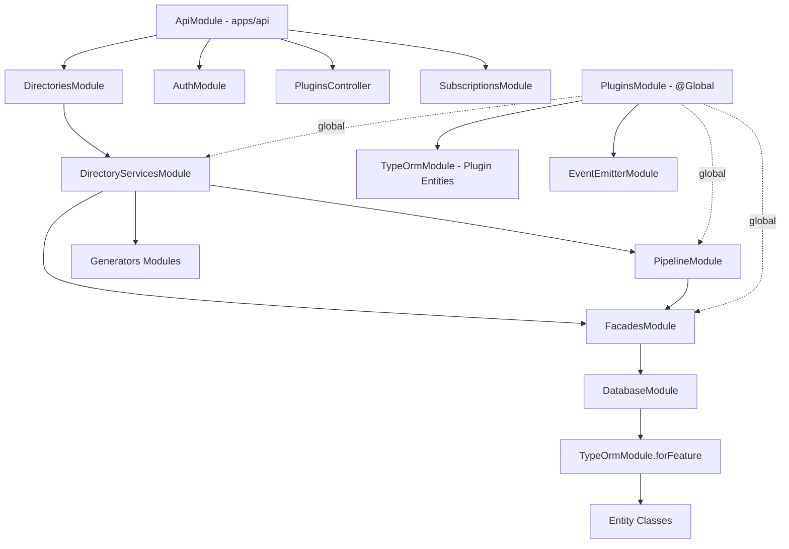

# NestJS Module Organization

## Overview

The Ever Works platform follows NestJS module conventions to organize the agent package and API application into cohesive, loosely-coupled units. Modules encapsulate providers (services, repositories), declare imports/exports, and define the dependency graph. The architecture uses a layered approach: **Database** at the bottom, **Plugins** as a global module, **Facades** as the abstraction layer, **Pipeline** for orchestration, and feature modules (generators, services) at the top.

## Architecture



## Source Files

| File | Purpose |
|------|---------|
| `packages/agent/src/database/database.module.ts` | Database layer with all entities and repositories |
| `packages/agent/src/plugins/plugins.module.ts` | Global plugin system with dynamic module pattern |
| `packages/agent/src/facades/facades.module.ts` | Facade services for AI, Search, Git, Deploy, etc. |
| `packages/agent/src/pipeline/pipeline.module.ts` | Pipeline builder, executors, orchestrator |
| `packages/agent/src/services/directory.module.ts` | Core directory business logic services |
| `packages/agent/src/generators/*/` | Generator modules (data, markdown, website) |
| `packages/agent/src/notifications/notifications.module.ts` | Notification system |
| `packages/agent/src/subscriptions/subscriptions.module.ts` | Subscription and billing |

## Key Classes

### DatabaseModule -- The Foundation

Registers all TypeORM entities and provides repository services. Every module that needs database access imports this module:

```typescript
@Module({
    imports: [
        ConfigModule.forFeature(databaseConfig),
        TypeOrmModule.forRootAsync({
            imports: [ConfigModule],
            useFactory: (configService: ConfigService) => configService.get('database'),
            inject: [ConfigService],
        }),
        TypeOrmModule.forFeature(ENTITIES),
    ],
    providers: [DirectoryRepository, UserRepository, /* ... */],
    exports: [TypeOrmModule, DirectoryRepository, UserRepository, /* ... */],
})
export class DatabaseModule {}
```

### PluginsModule -- Global Dynamic Module

The plugin system uses NestJS's `@Global()` and `DynamicModule` patterns so that plugin services are available everywhere without explicit imports:

```typescript
@Global()
@Module({})
export class PluginsModule implements OnModuleDestroy {
    static forRoot(options: PluginsModuleOptions = {}): DynamicModule {
        return {
            module: PluginsModule,
            imports: [
                TypeOrmModule.forFeature(PLUGIN_ENTITIES),
                EventEmitterModule.forRoot(),
            ],
            providers: [
                {
                    provide: PLUGINS_MODULE_OPTIONS,
                    useValue: { platformVersion: '1.0.0', ...options },
                },
                ...PROVIDERS,
            ],
            exports: [...EXPORTS, PLUGINS_MODULE_OPTIONS],
        };
    }

    static forRootAsync(options: PluginsModuleAsyncOptions): DynamicModule {
        // Supports useFactory, useClass, useExisting patterns
    }
}
```

### FacadesModule -- Abstraction Layer

Provides unified access to plugin capabilities without direct plugin imports. The comment in the source explains the design:

```typescript
/**
 * Facades module providing unified access to AI, Search, Screenshot etc. services.
 *
 * Resolution priority:
 * 1. Provider override (explicit request)
 * 2. Directory default provider
 * 3. User default provider
 * 4. First enabled provider
 *
 * Settings are resolved using the 4-level hierarchy:
 * 1. Directory settings
 * 2. User settings
 * 3. Admin settings
 * 4. Plugin defaults
 */
@Module({
    imports: [DatabaseModule],
    providers: FACADES,
    exports: FACADES,
})
export class FacadesModule {}
```

### PipelineModule -- Orchestration Layer

Builds and executes generation pipelines using plugin-contributed steps:

```typescript
@Module({
    imports: [FacadesModule, EventEmitterModule.forRoot()],
    providers: [
        PipelineBuilderService,
        StepPipelineExecutorService,
        FullPipelineExecutorService,
        PipelineOrchestratorService,
        PipelineFacadeService,
    ],
    exports: [/* all providers */],
})
export class PipelineModule {}
```

## Configuration

### Module Import Order

The NestJS dependency injection container resolves modules in import order. The recommended order in the root application module:

```typescript
@Module({
    imports: [
        // 1. Configuration
        ConfigModule.forRoot(),

        // 2. Database (foundation)
        DatabaseModule,

        // 3. Plugin system (global, must be before consumers)
        PluginsModule.forRoot(),

        // 4. Feature modules (consume plugins via facades)
        FacadesModule,
        PipelineModule,
        DirectoryServicesModule,
        // ...
    ],
})
export class ApiModule implements OnApplicationBootstrap {
    constructor(private readonly pluginBootstrap: PluginBootstrapService) {}

    async onApplicationBootstrap() {
        await this.pluginBootstrap.bootstrap();
    }
}
```

### Provider / Export Conventions

The codebase follows a consistent pattern of declaring `PROVIDERS` and `EXPORTS` arrays:

```typescript
const PROVIDERS = [
    PipelineBuilderService,
    StepPipelineExecutorService,
    FullPipelineExecutorService,
    PipelineOrchestratorService,
    PipelineFacadeService,
];

const EXPORTS = [...PROVIDERS]; // Export everything for consumer modules
```

## Code Examples

### Async Module Configuration

```typescript
PluginsModule.forRootAsync({
    imports: [ConfigModule],
    useFactory: async (configService: ConfigService) => ({
        platformVersion: configService.get('PLATFORM_VERSION'),
        environment: configService.get('NODE_ENV'),
        autoLoadBuiltIn: true,
    }),
    inject: [ConfigService],
});
```

### Module Lifecycle Hooks

```typescript
@Injectable()
export class DatabaseInitService implements OnModuleInit {
    constructor(@InjectDataSource() private dataSource: DataSource) {}

    async onModuleInit() {
        if (!this.dataSource.isInitialized) {
            await this.dataSource.initialize();
        }
    }
}
```

## Best Practices

1. **Keep modules focused** -- each module should own a single domain concern (database, plugins, pipeline, etc.).

2. **Use `@Global()` sparingly** -- only the PluginsModule is global. Other modules explicitly import their dependencies.

3. **Export what consumers need** -- export repository and service classes, not internal implementation details.

4. **Prefer `forRoot` / `forRootAsync`** -- for modules that need configuration, use the dynamic module pattern with options injection.

5. **Do not import PluginsModule in feature modules** -- since it is `@Global()`, it is automatically available. The facades module comment explicitly states this.

6. **Separate entity registration** -- entities are registered via `TypeOrmModule.forFeature()` in the module that owns them (DatabaseModule for core entities, PluginsModule for plugin entities).

7. **Use lifecycle hooks appropriately** -- `OnModuleInit` for database setup, `OnApplicationBootstrap` for plugin loading, `OnModuleDestroy` for cleanup.
