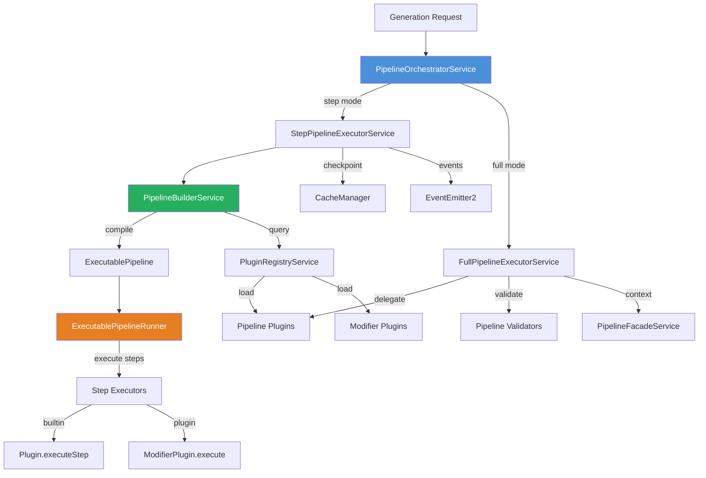
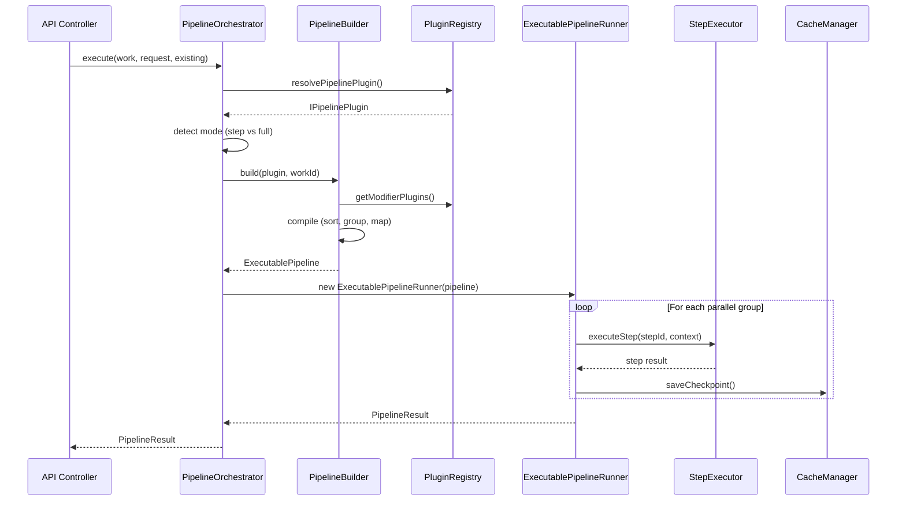

# Pipeline System

The pipeline system is the execution engine for work generation in Ever Works. It is a plugin-driven architecture that compiles step definitions from pipeline and modifier plugins into an executable pipeline, then orchestrates step-by-step or full execution with checkpointing, parallel groups, and cancellation support.

## Architecture Overview



## Core Components

### PipelineOrchestratorService

The main entry point for all pipeline execution. It resolves the correct pipeline plugin and routes execution to either the step-based or full executor.

**Execution mode routing:**

| Mode   | Condition                                        | Executor                      |
| ------ | ------------------------------------------------ | ----------------------------- |
| `step` | Plugin implements `isStepOrchestratablePipeline` | `StepPipelineExecutorService` |
| `full` | Plugin is self-managed (e.g., Claude Code)       | `FullPipelineExecutorService` |

**Plugin resolution priority:**

1. Explicit `pipelineId` from the generation request
2. First enabled pipeline with `defaultForCapabilities: ['pipeline']`
3. First loaded and enabled pipeline plugin

```typescript
type PipelineExecutionMode = 'step' | 'full';
```

Key methods:

- `execute()` -- Auto-detect mode and run pipeline
- `executeWithMode()` -- Force a specific execution mode
- `resumeOrExecute()` -- Resume from checkpoint or start fresh
- `resumeFromCheckpoint()` -- Resume a checkpointed pipeline
- `clearCheckpoint()` -- Remove stored checkpoint data

### PipelineBuilderService

Compiles an `ExecutablePipeline` from a pipeline plugin's step definitions and modifier plugin contributions. The build process follows a nine-step compilation sequence:

1. **Collect base steps** from the pipeline plugin via `getStepDefinitions()`
2. **Initialize build context** with empty replacement, injection, and disable maps
3. **Discover modifier plugins** that target this pipeline (filtered by work scope and enable status)
4. **Process modifier contributions** (replacements, injections, disables, prepend/append)
5. **Apply modifications** in order: replacements, disabling, injections, prepend/append
6. **Check for duplicate step IDs** to ensure uniqueness
7. **Topological sort** to respect step dependencies (detects circular dependencies)
8. **Identify parallel groups** for concurrent execution
9. **Build executor map** assigning builtin or plugin executors to each step

**Step position types supported by modifier plugins:**

| Position Type | Behavior                               |
| ------------- | -------------------------------------- |
| `replace`     | Replace an existing step entirely      |
| `before`      | Inject a new step before a target step |
| `after`       | Inject a new step after a target step  |
| `disable`     | Remove a step from the pipeline        |
| `first`       | Prepend a step to the beginning        |
| `last`        | Append a step to the end               |

**Error classes:**

- `CircularDependencyError` -- Thrown when dependency graph contains cycles
- `MissingDependencyError` -- Thrown when a required dependency step is missing

### ExecutablePipelineRunner

A runtime wrapper around the compiled `ExecutablePipeline` that manages execution state. It tracks:

- Per-step status (`pending`, `running`, `completed`, `failed`, `skipped`)
- Step start/completion timestamps and metrics
- Overall pipeline running/cancelled state
- Completed and failed step lists

The runner emits `PipelineRuntimeEvents` via NestJS `EventEmitter2`:

- `pipeline:state-changed` -- Overall pipeline state transitions
- `pipeline:step-status-changed` -- Individual step status updates

### StepPipelineExecutorService

The engine-orchestrated executor that iterates through pipeline groups, executing steps with concurrency control, skip logic, checkpointing, and event emission.

**Execution flow:**

1. Create pipeline context via `plugin.createContext()`
2. Build the executable pipeline via `PipelineBuilderService`
3. Create an `ExecutablePipelineRunner` for state tracking
4. Iterate through parallel groups
5. For each step: check skip conditions, execute via builtin or plugin executor, save checkpoint
6. Build final result via `plugin.extractResult()` or fallback

**Skip conditions (checked in order):**

1. Step is in `options.skipSteps` array
2. Step is not in `options.onlySteps` array (when specified)
3. Plugin's `canSkipStep()` returns true (data already provided)

**Concurrency control:** Groups with `maxConcurrent` set use a custom concurrency limiter. The default concurrency is 4 parallel steps.

### FullPipelineExecutorService

The executor for self-managed pipeline plugins that own their entire execution flow (e.g., the Claude Code plugin). It:

1. Creates a `StepExecutionContext` via `PipelineFacadeService`
2. Delegates to `plugin.execute()` with the context
3. Validates the returned `PipelineResult` using `validatePipelineResult()`
4. Emits pipeline started/completed/failed events

### PipelineFacadeService

Creates bound facade instances for pipeline step execution. This service bridges the gap between the pipeline system and the facade layer by pre-binding work and user context:

```typescript
createStepExecutionContext(
    work: WorkReference,
    providerOverrides?: GenerationRequest['providers'],
    signal?: AbortSignal,
): StepExecutionContext
```

The returned `StepExecutionContext` includes:

- `aiFacade` -- Bound AI facade (askJson, chat completion, streaming)
- `searchFacade` -- Bound web search facade
- `screenshotFacade` -- Bound screenshot capture facade
- `contentExtractorFacade` -- Bound content extraction facade
- `dataSourceFacade` -- Bound data source facade
- `logger` -- Scoped step logger with work context
- `work` -- The work reference
- `signal` -- Optional AbortSignal for cancellation

## Checkpointing

The `StepPipelineExecutorService` persists checkpoint data after each successful step using `cache-manager`. Checkpoints enable pipeline resumption after failures.

**Checkpoint data structure:**

```typescript
interface CheckpointData {
	stepIndex: number; // Index of last completed step
	stepName: string; // Name of last completed step
	pipelineId: string; // Pipeline plugin ID
	timestamp: string; // ISO timestamp
	context: unknown; // Serialized pipeline context (via plugin.contextToSnapshot)
	completedSteps: string[]; // IDs of all completed steps
	schemaVersion: number; // Currently version 4
}
```

- **TTL:** 24 hours
- **Serialization:** superjson (preserves Maps, Sets, Dates)
- **Cache key:** `pipeline-checkpoint-{workId}-{pipelineId}`
- **Version checking:** Checkpoints with mismatched `schemaVersion` are discarded
- **Viability check:** `plugin.isCheckpointViable()` validates whether a checkpoint can be resumed

## Pipeline Result Validation

The `validatePipelineResult()` function validates that plugin-returned results conform to the `PipelineResult` interface:

| Field                  | Type      | Required               |
| ---------------------- | --------- | ---------------------- |
| `success`              | `boolean` | Yes                    |
| `outputs.items`        | `array`   | Yes                    |
| `outputs.categories`   | `array`   | Yes                    |
| `outputs.tags`         | `array`   | Yes                    |
| `outputs.collections`  | `array`   | Yes                    |
| `outputs.brands`       | `array`   | Yes                    |
| `stepsCompleted`       | `number`  | Yes                    |
| `totalSteps`           | `number`  | Yes                    |
| `duration`             | `number`  | Yes                    |
| `state.isRunning`      | `boolean` | Yes (if state present) |
| `state.isCancelled`    | `boolean` | Yes (if state present) |
| `state.completedSteps` | `array`   | Yes (if state present) |
| `state.failedSteps`    | `array`   | Yes (if state present) |

## Pipeline Events

The pipeline system emits events at each stage of execution:

| Event                     | Payload                        | Emitted When                           |
| ------------------------- | ------------------------------ | -------------------------------------- |
| `pipeline:started`        | `PipelineEventPayload`         | Pipeline execution begins              |
| `pipeline:step-started`   | `PipelineStepEventPayload`     | A step begins executing                |
| `pipeline:step-completed` | `PipelineStepCompletedPayload` | A step completes successfully          |
| `pipeline:step-failed`    | `PipelineStepFailedPayload`    | A step fails (includes recoverability) |
| `pipeline:step-skipped`   | `PipelineStepEventPayload`     | A step is skipped                      |
| `pipeline:completed`      | `PipelineCompletedPayload`     | Pipeline finishes successfully         |
| `pipeline:failed`         | `PipelineFailedPayload`        | Pipeline fails                         |
| `pipeline:cancelled`      | `PipelineEventPayload`         | Pipeline is cancelled via AbortSignal  |

## NestJS Module

The `PipelineModule` registers all pipeline services and imports:

```typescript
@Module({
	imports: [FacadesModule, EventEmitterModule.forRoot()],
	providers: [
		PipelineBuilderService,
		StepPipelineExecutorService,
		FullPipelineExecutorService,
		PipelineOrchestratorService,
		PipelineFacadeService
	],
	exports: [
		/* all providers */
	]
})
export class PipelineModule {}
```

Pipeline plugins themselves are not NestJS providers. They are loaded through the plugin system and accessed via `PluginRegistryService.getByCapability('pipeline')`.

## Pipeline Execution Flow (Step Mode)


