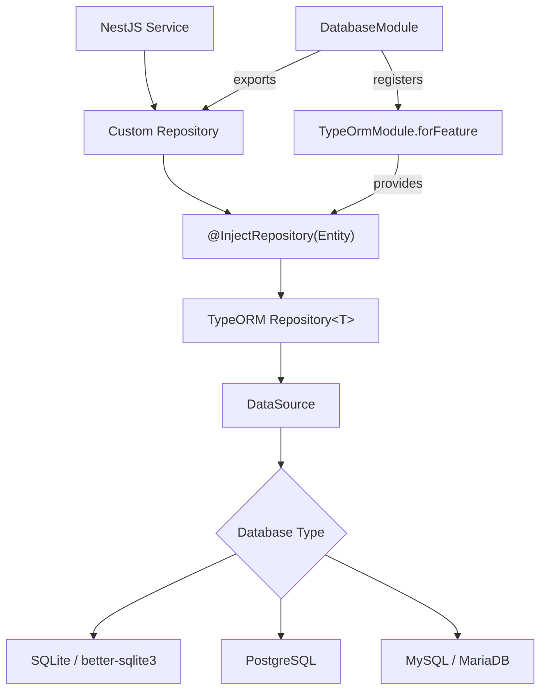

# TypeORM Patterns & Repository Layer

## Overview

Ever Works uses TypeORM as its ORM layer with a custom repository pattern that wraps TypeORM's built-in `Repository<T>` class. Rather than extending `Repository` directly (TypeORM 0.3.x deprecated custom repository classes), each repository is an `@Injectable()` NestJS service that receives a `Repository<T>` via `@InjectRepository()`. This approach provides clean separation of concerns, testability, and cross-database compatibility across SQLite, PostgreSQL, and MySQL.

## Architecture



## Source Files

| File | Purpose |
|------|---------|
| `packages/agent/src/database/database.module.ts` | Module registering all entities and repositories |
| `packages/agent/src/database/database.config.ts` | Multi-database configuration with environment-based selection |
| `packages/agent/src/database/database-config.factory.ts` | Predefined configurations for CLI, API, test, PostgreSQL, MySQL |
| `packages/agent/src/database/database-init.service.ts` | Module lifecycle hook for database initialization |
| `packages/agent/src/database/repositories/*.ts` | All custom repository classes |
| `packages/agent/src/database/utils/db.utils.ts` | TLS options helper, database URL parser |
| `packages/agent/src/database/utils/helper.ts` | SQL LIKE pattern sanitization utilities |
| `packages/agent/src/entities/*.ts` | All TypeORM entity definitions |

## Key Classes

### DatabaseModule

The central module that registers all entities via `TypeOrmModule.forFeature(ENTITIES)` and provides/exports all repository services:

```typescript
@Module({
    imports: [
        ConfigModule.forFeature(databaseConfig),
        TypeOrmModule.forRootAsync({
            imports: [ConfigModule],
            useFactory: (configService: ConfigService) => {
                const config = configService.get('database');
                return config;
            },
            inject: [ConfigService],
        }),
        TypeOrmModule.forFeature(ENTITIES),
    ],
    providers: [
        DirectoryRepository,
        UserRepository,
        ApiKeyRepository,
        // ... all repositories
    ],
    exports: [
        TypeOrmModule,
        DirectoryRepository,
        UserRepository,
        // ... all repositories
    ],
})
export class DatabaseModule {}
```

### Repository Pattern (Wrapper Style)

Every repository follows the same pattern -- an `@Injectable()` service wrapping the TypeORM repository:

```typescript
@Injectable()
export class UserRepository {
    constructor(
        @InjectRepository(User)
        private readonly repository: Repository<User>,
    ) {}

    async findByEmail(email: string): Promise<User | null> {
        return this.repository.findOne({ where: { email } });
    }

    async create(userData: Partial<User>): Promise<User> {
        const user = this.repository.create(userData);
        return this.repository.save(user);
    }
}
```

### Entity Definitions

Entities use standard TypeORM decorators with UUID primary keys and relationship decorators:

```typescript
@Entity({ name: 'directories' })
export class Directory {
    @PrimaryGeneratedColumn('uuid')
    id: string;

    @Column()
    name: string;

    @ManyToOne(() => User, (user) => user.directories, {
        onDelete: 'CASCADE',
        eager: true,
    })
    user: User;

    @OneToMany(() => DirectoryMember, (member) => member.directory)
    members?: DirectoryMember[];

    @Column('simple-json', { nullable: true })
    generateStatus?: GenerateStatus;

    @CreateDateColumn()
    createdAt: Date;

    @UpdateDateColumn()
    updatedAt: Date;
}
```

### Cross-Database Case-Insensitive Search

The `DirectoryRepository` implements a `caseInsensitiveLike` helper using `Raw()` that works across SQLite, PostgreSQL, and MySQL:

```typescript
function caseInsensitiveLike(search: string) {
    return Raw(
        (alias) => `LOWER(${alias}) LIKE LOWER(:search)`,
        { search: `%${search}%` },
    );
}
```

### QueryBuilder for Complex Queries

For queries requiring JOINs, OR conditions, or dynamic filtering, the repository uses TypeORM's `createQueryBuilder`:

```typescript
async findAllAccessible(options?: {
    userId: string;
    memberDirectoryIds?: string[];
    limit?: number;
    offset?: number;
    search?: string;
}): Promise<Directory[]> {
    const queryBuilder = this.repository
        .createQueryBuilder('directory')
        .leftJoinAndSelect('directory.user', 'user');

    if (memberDirectoryIds.length > 0) {
        queryBuilder.where(
            new Brackets((qb) => {
                qb.where('directory.userId = :userId', { userId })
                  .orWhere('directory.id IN (:...memberDirectoryIds)', {
                      memberDirectoryIds,
                  });
            }),
        );
    }

    if (search) {
        queryBuilder.andWhere(
            new Brackets((qb) => {
                qb.where('LOWER(directory.name) LIKE :search', { search: pattern })
                  .orWhere('LOWER(directory.description) LIKE :search', { search: pattern });
            }),
        );
    }

    return queryBuilder.orderBy('directory.updatedAt', 'DESC').getMany();
}
```

## Configuration

### Multi-Database Support

The `databaseConfig` function (registered via `@nestjs/config`) auto-detects the database type from environment variables:

| Environment Variable | Purpose | Default |
|---------------------|---------|---------|
| `DATABASE_TYPE` | `sqlite`, `postgres`, `mysql`, `mariadb` | `better-sqlite3` |
| `DATABASE_URL` | Full connection URL (PostgreSQL/MySQL) | -- |
| `DATABASE_HOST` | Database host | `localhost` |
| `DATABASE_PORT` | Database port | `5432` (PG) / `3306` (MySQL) |
| `DATABASE_USERNAME` | Username | `postgres` / `root` |
| `DATABASE_PASSWORD` | Password | -- |
| `DATABASE_NAME` | Database name | `ever_works` |
| `DATABASE_PATH` | SQLite file path | auto-detected |
| `DATABASE_IN_MEMORY` | Use in-memory SQLite | `false` |
| `DATABASE_LOGGING` | Enable SQL logging | `false` |
| `DATABASE_SSL_MODE` | Enable SSL/TLS | `false` |
| `DATABASE_AUTO_MIGRATE` | Auto-sync schema | `false` |

### Predefined Configurations

The `DatabaseConfigurations` factory provides ready-made setups:

```typescript
// CLI: persistent SQLite in ~/.ever-works/
DatabaseConfigurations.cli();

// API development: in-memory SQLite with logging
DatabaseConfigurations.apiDevelopment();

// Production PostgreSQL
DatabaseConfigurations.postgres({
    host: 'db.example.com',
    port: 5432,
    username: 'app',
    password: 'secret',
    databaseName: 'ever_works',
});

// Test: always in-memory
DatabaseConfigurations.test();
```

## Code Examples

### Batch Update with QueryBuilder

```typescript
async markQueued(ids: string[]): Promise<void> {
    if (!ids.length) return;

    await this.repository
        .createQueryBuilder()
        .update(UsageLedgerEntry)
        .set({ status: UsageLedgerStatus.QUEUED_FOR_SETTLEMENT })
        .whereInIds(ids)
        .execute();
}
```

### Aggregation Queries

```typescript
async getUsageSummary(
    userId: string,
    triggerType: UsageLedgerTriggerType,
): Promise<{ totalUnits: number; totalAmountCents: number }> {
    const entries = await this.repository.find({
        where: { userId, triggerType },
        select: ['units', 'amountCents'],
    });

    return entries.reduce(
        (acc, entry) => {
            acc.totalUnits += entry.units || 0;
            acc.totalAmountCents += entry.amountCents || 0;
            return acc;
        },
        { totalUnits: 0, totalAmountCents: 0 },
    );
}
```

### Compound WHERE with OR Conditions

```typescript
async countByUserId(userId: string): Promise<number> {
    return this.repository.count({
        where: [
            { userId, expiresAt: IsNull() },
            { userId, expiresAt: MoreThan(new Date()) },
        ],
    });
}
```

### SQL LIKE Pattern Sanitization

```typescript
// Escapes %, _, and \ to prevent SQL injection in LIKE queries
export function sanitizeLikePattern(search: string): string {
    return search.replace(/[%_\\]/g, '\\$&');
}

export function prepareLikeSearchTerm(search?: string): string | undefined {
    if (!search) return undefined;
    const trimmed = search.trim();
    if (!trimmed) return undefined;
    return sanitizeLikePattern(trimmed);
}
```

## Best Practices

1. **Always use the wrapper pattern** -- inject `Repository<T>` via `@InjectRepository()` rather than extending TypeORM's `Repository` class directly.

2. **Use `simple-json` for structured columns** -- store JSON objects using `@Column('simple-json')` which works identically across SQLite and PostgreSQL.

3. **Write cross-database queries** -- use `LOWER()` for case-insensitive search instead of database-specific operators like `ILIKE`.

4. **Sanitize LIKE patterns** -- always pass search terms through `prepareLikeSearchTerm()` to escape special SQL characters.

5. **Use parameterized queries** -- never interpolate user input into query strings; always use `:paramName` placeholders.

6. **Load relations explicitly** -- prefer explicit `relations: ['user']` in find options rather than `eager: true` on all relationships.

7. **Separate find and count methods** -- provide both `findAll()` and `countAll()` using the same `buildWhereConditions()` helper to keep logic consistent.

8. **Use UUID primary keys** -- all entities use `@PrimaryGeneratedColumn('uuid')` for globally unique, non-sequential identifiers.
