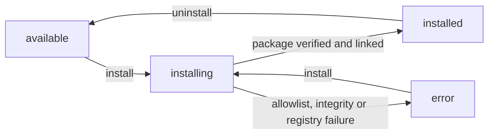

# CLI Command Reference

This page lists all available commands in the Ever Works CLI.

The binary is `ever-works` (npm package `ever-works-cli`). Four command groups are registered in `apps/cli/src/main.ts`:

| Group     | Entry point            | What it covers                                                                  |
| --------- | ---------------------- | ------------------------------------------------------------------------------- |
| `auth`    | `ever-works auth …`    | Browser (OAuth) or manual login, session status, logout                         |
| `work`    | `ever-works work …`    | The Work lifecycle, plus per-Work plugin management and repository registration |
| `plugins` | `ever-works plugins …` | Account-level plugin enable/configure, and catalog/install in dynamic mode      |
| `kb`      | `ever-works kb …`      | Knowledge Base documents on a Work: list, read, upload, lock, unlock            |

Every command except `work register` uses the session stored by `ever-works auth login`, and every request is sent to `<api-url>/api` — the HTTP client appends `/api` to the stored API URL when it is missing (`apps/cli/src/services/http-client.ts`). Dashboard routes referenced below are written without the locale prefix: the address bar shows `/en/works/:id/kb`, this page says `/works/:id/kb`.

## Authentication (`auth`)

Manage your session with the Ever Works Platform.

### Login

Log in to the platform. Supports both OAuth (browser-based) and manual token entry.

```bash
ever-works auth login [options]
```

**Options:**

- `--api-url <url>`: The API URL to connect to (default: `http://localhost:3100`)
- `--manual`: Skip the browser-based OAuth flow and manually enter an API token.

**Example:**

```bash
# Standard login (opens browser)
ever-works auth login

# Login to a remote production server
ever-works auth login --api-url https://api.ever.works

# Manual token entry (useful for CI/CD or headless environments)
ever-works auth login --manual
```

### Logout

Log out of the current session and remove stored credentials.

```bash
ever-works auth logout
```

### Status

Check the current authentication status and see who is logged in.

```bash
ever-works auth status
```

## Work Management (`work`)

Create, manage, and generate content for your works.

### Create

Create a new work project. This command is interactive and will prompt you for details like name, slug, description, and repository settings.

```bash
ever-works work create
```

**What it does:**

1. Checks for GitHub connection.
2. Prompts for work details.
3. Creates the work entry in the platform database.
4. Initializes the configuration for future generation.

### List

List all works you have access to.

```bash
ever-works work list
```

### Generate

Start the AI content generation pipeline for a work. This is the core command to populate your work with data.

```bash
ever-works work generate
```

**Interactive Flow:**

1. Select a work from the list.
2. Confirm or edit the prompt/topic.
3. (Optional) Configure advanced settings like company info, domain type, or custom configuration.
4. Triggers the generation pipeline on the server.

Use `work status` to track progress.

### Status

Check the status of a work, including the current state of any running generation pipeline.

```bash
ever-works work status
```

### Update

Update a work's configuration and synchronize changes with its GitHub repository.

```bash
ever-works work update
```

### Update Website

Update specifically the website repository for a work (e.g., to apply template updates).

```bash
ever-works work update-website
```

### Deploy

Trigger a deployment of the work's website to Vercel.

```bash
ever-works work deploy
```

### Submit Item

Manually submit a single item to a work.

```bash
ever-works work submit-item
```

### Remove Item

Remove an item from a work.

```bash
ever-works work remove-item
```

### Regenerate Markdown

Regenerate the `README.md` file for a work based on the latest data.

```bash
ever-works work regenerate-markdown
```

### Delete

Delete a work and its associated data.

```bash
ever-works work delete
```

### Plugins (per work)

Manage which plugins a single work runs, and with which settings.

```bash
ever-works work plugins
```

This is the terminal counterpart of the **Plugins** tab at `/works/:id/plugins`. The flow is fully interactive:

1. Select a work from the prompt (works shared with you are included, with their role badge).
2. If your role on the work is below **editor**, the command stops with `You do not have permission to perform this action.` followed by `Your role: <role>. Required: editor or higher.`
3. The CLI prints **Active Providers** — the capability to plugin map currently resolved for that work (for example `search → brave-search`).
4. Each plugin is listed with a filled dot when it is enabled for the work, a hollow dot when it is not, and its active capabilities in brackets.
5. Select a plugin to act on it.

**Actions:**

| Action                    | Offered when                                                              | What it does                                                                                            |
| ------------------------- | ------------------------------------------------------------------------- | ------------------------------------------------------------------------------------------------------- |
| `Enable for work`         | The plugin is not a system plugin and is not yet enabled for the work     | Enables it; if the plugin declares more than one capability, first asks which capability becomes active |
| `Disable for work`        | The plugin is not a system plugin and is enabled for the work             | Asks for confirmation, then disables it for this work only                                              |
| `Set active capability`   | The plugin declares more than one capability                              | Switches which capability this plugin serves for the work; the current one is marked `(current)`        |
| `Configure work settings` | The plugin is enabled for the work and has visible `global`/`work` fields | Prompts for work-level settings — leave a field blank to inherit the user-level value                   |

Secret fields are masked at the prompt and stored as secret settings. While a plugin is disabled for the work, the settings entry reads `Configure work settings (enable plugin first)` and does nothing.

### Register

Register a GitHub repository that carries a [`.works/works.yml`](../agent-services/works-yml-schema.md) manifest, creating an account if one does not exist yet, and queue the work. This is the CLI front door to [zero-friction onboarding](../agent-services/zero-friction-onboarding.md), and the only non-interactive way to go from a repository to a queued work in one call.

```bash
ever-works work register --repo <https-github-url> [options]
```

**Options:**

| Option                    | Required | Default                                           | Description                                                                    |
| ------------------------- | -------- | ------------------------------------------------- | ------------------------------------------------------------------------------ |
| `--repo <url>`            | yes      | —                                                 | HTTPS GitHub repository URL with `.works/works.yml` at the root                |
| `--github-token <token>`  | no       | `$GITHUB_TOKEN`                                   | GitHub PAT; the command exits `2` when neither the flag nor the env var is set |
| `--email <email>`         | no       | —                                                 | Contact email recorded with the onboarding                                     |
| `--agent-id <id>`         | no       | —                                                 | Opaque agent identifier for the caller's own bookkeeping                       |
| `--webhook-url <url>`     | no       | —                                                 | `https://` URL for signed terminal-status webhooks; rejected if not HTTPS      |
| `--subdomain <slug>`      | no       | —                                                 | DNS-safe slug for the assigned subdomain                                       |
| `--idempotency-key <key>` | no       | —                                                 | Sent as the `Idempotency-Key` header so a retry is provably a retry            |
| `--api-url <url>`         | no       | `$EVER_WORKS_API_URL` or `https://api.ever.works` | Override the API base URL                                                      |

**Example:**

```bash
export GITHUB_TOKEN=ghp_xxx

ever-works work register \
  --repo https://github.com/acme/awesome-observability \
  --email ops@acme.example \
  --subdomain awesome-observability \
  --idempotency-key 8f5c1c3e-2f0e-4f36-9a1e-0f9a1d9d4c11
```

**What it does:**

1. Resolves the GitHub token from `--github-token` or `$GITHUB_TOKEN` and exits `2` if there is none.
2. Validates the resolved API URL: the token is never sent over cleartext `http://` to anything but a loopback host.
3. Sends `POST <api-url>/api/register-work` with the token in the `X-GitHub-Token` header and `repo`, `email`, `agentId`, `webhookUrl` and `subdomain` in the body.
4. On success prints **Onboarding ID**, **Work ID**, **Status**, **Subdomain** and **Status URL**, plus any warnings, and exits `0`.
5. On rejection prints the server's `code`, `message` and any per-field errors, and exits `1`.

Poll the printed status URL (`GET /api/register-work/:id`, same `X-GitHub-Token` header) to follow the build, or pass `--webhook-url` and let the platform call you.

A failure at the transport layer — DNS, TLS, a refused connection — never reaches step 5: the command prints `Network error` plus the underlying message and returns without setting an exit code, so the process still ends at `0`. See [Exit Codes](#exit-codes).

Unlike every other command, `work register` authenticates with a **GitHub token** rather than your CLI session, and defaults to the hosted API instead of the URL compiled into the build — so it works on a fresh machine that has never run `ever-works auth login`.

## Plugin Management (`plugins`)

Browse, enable and configure the plugins available to your account. The dashboard equivalents are `/settings/plugins` and `/settings/plugins/:category`.

```bash
ever-works plugins [options]
```

**Options:**

- `-c, --category <category>`: Only load plugins in one category (for example `search`, `ai-provider`, `deployment`).

**Interactive flow:**

1. Plugins are grouped by category in a type-ahead search list; a filled dot marks enabled, a hollow dot disabled.
2. Selecting one prints its ID, version, category, status (`System`, `Enabled` or `Disabled`), description, capabilities and settings-field count.
3. **Enable** prompts for any required settings you have not filled yet, then asks `Auto-enable for all works?`.
4. **Disable** asks for confirmation. System plugins offer neither action.
5. **Configure settings** is only offered while the plugin is enabled; otherwise the entry reads `Configure settings (enable plugin first)`.

See [CLI Plugin Commands](./plugin-commands.md) for the full interactive reference, including the settings-prompt behaviour.

### Dynamic distribution subcommands

Deployments running with `PLUGIN_DISTRIBUTION_MODE=dynamic` install plugins from a registry at runtime instead of shipping them inside the image. Four non-interactive subcommands map one-to-one onto that REST surface (`apps/cli/src/commands/plugins/dynamic.command.ts`, `apps/api/src/plugins/plugins.controller.ts`):

| Command                             | Arguments  | Options                                                                         | Endpoint                                    |
| ----------------------------------- | ---------- | ------------------------------------------------------------------------------- | ------------------------------------------- |
| `plugins catalog`                   | —          | —                                                                               | `GET /api/plugins/catalog`                  |
| `plugins install <pluginId>`        | `pluginId` | `--version <semver>`, `--integrity <sha512>`, `--source <npm\|github-packages>` | `POST /api/plugins/:pluginId/install`       |
| `plugins uninstall <pluginId>`      | `pluginId` | —                                                                               | `DELETE /api/plugins/:pluginId/install`     |
| `plugins install-status <pluginId>` | `pluginId` | —                                                                               | `GET /api/plugins/:pluginId/install-status` |

`--source` defaults to `npm`. `--version` pins an exact release instead of taking the latest; `--integrity` enforces a `sha512-…` hash before the package is trusted.

```bash
ever-works plugins catalog
ever-works plugins install notion-extractor --version 1.2.0
ever-works plugins install-status notion-extractor
ever-works plugins uninstall notion-extractor
```

Every row prints the install state, the source and the installed version:



**Refusals to expect:**

| Status    | Meaning                                                                                  |
| --------- | ---------------------------------------------------------------------------------------- |
| `404`     | The deployment is not running in dynamic mode, or the plugin ID is unknown               |
| `409`     | On install: the plugin is not on the allowlist. On uninstall: it is a core/system plugin |
| `424`     | Integrity mismatch — the downloaded package does not match the expected hash             |
| `502/504` | The registry was unreachable or failed                                                   |

Installs are rate-limited to **5 per minute per user**. A bundled-mode deployment returns an **empty catalog** rather than an error, so `plugins catalog` is safe to call anywhere; when the catalog is degraded the CLI prints the reason before the rows.

:::caution The four dynamic subcommands are not usable from the CLI yet

They are registered and appear in `ever-works plugins --help`, but their handlers call raw `get`/`post`/`delete` verbs on the CLI's API service, which exposes only typed per-endpoint methods (`apps/cli/src/services/api.service.ts`). Each one therefore fails before a request leaves your machine and exits non-zero. Until that wiring lands, call the REST endpoints in the table above directly, or manage plugins from `/settings/plugins`.

:::

### How to install a distributable plugin

1. Confirm the platform runs in dynamic mode — `PLUGIN_DISTRIBUTION_MODE=dynamic` on the API. In bundled mode there is nothing to install and the catalog comes back empty.
2. Add the plugin to the allowlist at `/admin/plugins/allowlist`, otherwise the install is refused with `409`.
3. List what is installable: `GET /api/plugins/catalog`.
4. Install it: `POST /api/plugins/notion-extractor/install`, optionally with a `{"version": "1.2.0", "integrity": "sha512-...", "source": "npm"}` body.
5. Check the lifecycle row: `GET /api/plugins/notion-extractor/install-status` — wait for `installState: "installed"`, and read `installError` when it is `error`.
6. Enable the plugin for your account at `/settings/plugins`, then for a work with `ever-works work plugins` or the **Plugins** tab at `/works/:id/plugins`.

## Knowledge Base (`kb`)

Drive a work's [Knowledge Base](../features/knowledge-base.md) — the curated, versioned corpus your agents read before they write — from the terminal. The group is mounted at the **top level** (`ever-works kb ...`, not under `work`), and every subcommand takes the work's UUID as its first argument. Copy that UUID from the address bar on `/works/:id`; the browser equivalent of this group is the KB workbench at `/works/:id/kb`.

| Command                         | Arguments                        | Options                                                       | Endpoint                                         |
| ------------------------------- | -------------------------------- | ------------------------------------------------------------- | ------------------------------------------------ |
| `kb list <workId>`              | Work UUID                        | `--class`, `--tag`, `--q`, `--limit` (`20`), `--offset` (`0`) | `GET /api/works/:id/kb/documents`                |
| `kb get <workId> <idOrPath>`    | Work UUID, document UUID or path | `--json`                                                      | `GET /api/works/:id/kb/documents/:docIdOrPath`   |
| `kb upload <workId> <filePath>` | Work UUID, local file            | `--title`, `--class`                                          | `POST /api/works/:id/kb/uploads` (multipart)     |
| `kb lock <workId> <idOrPath>`   | Work UUID, document UUID or path | `--mode <mode>` (required)                                    | `POST /api/works/:id/kb/documents/:docId/lock`   |
| `kb unlock <workId> <idOrPath>` | Work UUID, document UUID or path | —                                                             | `POST /api/works/:id/kb/documents/:docId/unlock` |

**Example:**

```bash
WORK=5b2f8b1e-7c3a-4f0d-9a11-0f2c3d4e5f6a

ever-works kb list $WORK --class brand --limit 50
ever-works kb list $WORK --q "tone of voice"
ever-works kb get $WORK brand/voice
ever-works kb get $WORK brand/voice --json | jq '.tags'
ever-works kb upload $WORK ./brand-guide.md --class brand --title "Brand guide v3"
ever-works kb lock $WORK legal/disclaimer --mode full
ever-works kb unlock $WORK legal/disclaimer
```

### KB List

`kb list` prints a compact table — ID, class, status, lock marker, path and title, with the tag slugs on a second line — followed by the total and the pagination window that produced it.

`--class` is validated server-side against the document classes `brand`, `legal`, `seo`, `style`, `glossary`, `competitors`, `personas`, `research`, `output`, `freeform` and `decision`. Anything else comes back as a `400`, including the `note`, `runbook` and `brief` examples printed in the command's own `--help` text. `--q` is a blended lexical and semantic search over titles and descriptions (200 characters maximum). `--limit` must be at least `1` — the CLI accepts `0`, but the API rejects it.

### KB Get

`kb get` accepts either a document UUID or its slash-separated KB path (for example `brand/voice`); path segments are escaped individually so the slashes survive the round trip. It prints the title, ID, path, class, status, lock state, summary, tags and categories, then streams the raw markdown body to stdout — pipe it through `bat` or `glow` for highlighting. Add `--json` to emit the raw DTO instead, which is the shape to pipe into `jq`.

### KB Upload

`kb upload` posts one local file as multipart form data. The CLI infers the MIME type from the extension:

| Extension          | MIME type                                                                 |
| ------------------ | ------------------------------------------------------------------------- |
| `.md`, `.markdown` | `text/markdown`                                                           |
| `.txt`             | `text/plain`                                                              |
| `.json`            | `application/json`                                                        |
| `.html`, `.htm`    | `text/html`                                                               |
| `.pdf`             | `application/pdf`                                                         |
| `.docx`            | `application/vnd.openxmlformats-officedocument.wordprocessingml.document` |
| `.xlsx`            | `application/vnd.openxmlformats-officedocument.spreadsheetml.sheet`       |
| anything else      | `application/octet-stream`                                                |

`--title` overrides the resulting document's title and `--class` sets its target class (sent as `targetClass`). The server computes a SHA-256, deduplicates against existing uploads in the same work, stores the bytes through the configured storage plugin, and then runs its built-in buffer extractor **inside the same request** — there is no queue to wait on. Uploads are capped at 200 MB by default (`KB_UPLOAD_MAX_BYTES` on the API).

The extractor converts the uploaded bytes to Markdown in-process, so office and web formats become real KB documents on the first call, not just stored originals:

| Uploaded MIME type                                                         | What the server does                                               |
| -------------------------------------------------------------------------- | ------------------------------------------------------------------ |
| `text/markdown`, `text/x-markdown`, `application/x-markdown`, `text/plain` | Passed straight through as the document body                       |
| `text/html`, `application/xhtml+xml`                                       | Converted to Markdown with Turndown                                |
| `application/pdf`, `application/x-pdf`                                     | Text extracted with `pdf-parse`                                    |
| `.docx` (`…wordprocessingml.document`)                                     | Converted with `mammoth`, then to Markdown with Turndown           |
| `.xlsx` / `.xlsm` (`…spreadsheetml.sheet`, `…macroenabled.12`)             | Each sheet rendered as a Markdown table under its own `##` heading |
| `text/csv`, `text/tab-separated-values`, `text/tsv`                        | Parsed and rendered as one Markdown table                          |
| `.pptx` (`…presentationml.presentation`)                                   | One `## Slide N` section per slide, from the slide text            |
| Anything else                                                              | No route — the upload row is marked `extractionStatus: skipped`    |

Bodies are bounded: text passthrough (and HTML before conversion) is capped at 1 MiB and closed with a `<!-- truncated: original exceeded 1 MiB -->` marker, spreadsheets stop at 10,000 rows, and decks at 1,000 slides.

Two outcomes leave you without extracted text. A MIME with **no route** is marked `extractionStatus: skipped` with the reason on `extractionError`. A MIME whose route was selected but whose parse **failed** — a malformed PDF, a corrupt `.docx` — is marked `failed`; the bytes are already in storage, so `POST /api/works/:id/kb/uploads/:uploadId/retry-extraction` re-runs it. In both cases the platform still creates a **viewable stub document** when the original is one the workbench can render — PDF, `.docx`, `.xlsx`, or any `image/*`, `video/*` or `audio/*` — so the file stays reachable in the KB tree. Opaque types (`application/octet-stream`, `application/zip`, legacy `.doc`/`.xls`/`.ppt`, `application/json`) get no document at all, and that is when the CLI prints `No KB document was created — extractor route pending for this MIME.`

:::caution The MIME the CLI guesses is the MIME the server routes on

`kb upload` sends exactly what the sniffing table above produces. `.json` goes as `application/json` and every unlisted extension as `application/octet-stream` — neither has an extractor route nor a viewer. So a `.csv`, `.pptx` or `.png` uploaded through the CLI is skipped with no document, even though the server converts or renders those formats when the real MIME arrives. Either convert the file to `.md`, `.html`, `.pdf`, `.docx` or `.xlsx` first, or post it to `POST /api/works/:id/kb/uploads` yourself with the correct part `Content-Type`.

:::

The command prints the upload ID, filename, MIME type, size, SHA-256 and extraction status, plus the created document's ID, path and title when there is one.

### KB Lock and Unlock

Locking freezes a document so agent runs stop rewriting it. `kb lock` and `kb unlock` accept a path as well as a UUID: the CLI resolves the path to an ID through the get-by-path route before issuing the mutation, because the lock endpoints are pinned to a UUID.

:::note Lock modes differ by surface

The API accepts exactly two modes, `full` and `additions-only`. The CLI's own validator accepts `full` and `content`, so `ever-works kb lock ... --mode full` is the combination that works end to end today. For an additions-only lock, use the workbench toggle at `/works/:id/kb`, the `kb.lock` MCP tool, or `POST /api/works/:id/kb/documents/:docId/lock` directly.

:::

### How to load a work's Knowledge Base from your machine

1. Sign in against the right platform: `ever-works auth login --api-url https://api.ever.works`.
2. Copy the work's UUID from the address bar on `/works/:id` and keep it in a shell variable.
3. Upload your source material one file at a time: `ever-works kb upload $WORK ./brand-guide.md --class brand`.
4. Confirm what landed: `ever-works kb list $WORK --class brand`. Markdown, plain text, `.html`, `.pdf`, `.docx` and `.xlsx` files all produce a document on the upload call itself. An upload with **no** document means the MIME the CLI guessed has no extractor route — a legacy `.doc`, a `.json`, or any extension outside the sniffing table, all of which arrive as `application/octet-stream` or `application/json`. Convert it to `.docx`, `.pdf` or markdown and upload it again.
5. Read one back to check the agents will see what you intended: `ever-works kb get $WORK brand/voice`.
6. Freeze the wording you do not want rewritten: `ever-works kb lock $WORK legal/disclaimer --mode full`.
7. Review the same corpus in the browser at `/works/:id/kb`, where the review queue lives at `/works/:id/kb/review`.

## Exit Codes

| Code | When                                                                                                                                        |
| ---- | ------------------------------------------------------------------------------------------------------------------------------------------- |
| `0`  | The command completed. `work status` also exits `0` when you stop its polling with Ctrl+C — it traps `SIGINT` deliberately                  |
| `1`  | The command failed — the CLI prints `An error occurred:` followed by the API's message                                                      |
| `2`  | `work register` only: no GitHub token, an `--api-url` that would leak the token over cleartext HTTP, or a `--webhook-url` that is not HTTPS |

On a `401` the CLI adds `Authentication failed. Please login again.` and tells you to run `ever-works auth login`; on a `404` it adds a resource-not-found hint that names the work when the message mentions one. Argument validation failures (`--limit`, `--mode`) print their own message and exit `1`. Every interactive command routes its catch block through the same shared handler and then exits `1`, so a failure part-way through a prompt flow is reported the same way as a failed request.

:::note `work register` can fail without a non-zero exit

A transport-level failure — DNS, TLS, a refused connection — happens before any HTTP response arrives, so `work register` prints `Network error` followed by the underlying message and then returns **without** setting an exit code, leaving the process at `0`. Only an HTTP-level rejection exits `1`. Scripts that gate on this command should look for the printed **Onboarding ID**, or poll the status URL, rather than trusting `$?` on its own.

:::

## Related

- [CLI Overview](./index.md) — installation, configuration and prerequisites
- [CLI Quickstart](../guides/cli-quickstart.md) — the same commands as a walkthrough, from install to deploy
- [CLI Authentication Commands](./auth-commands.md) — OAuth flow, manual tokens, credential storage
- [CLI Work Commands](./work-commands.md) — every `work` subcommand in depth
- [CLI Plugin Commands](./plugin-commands.md) — the interactive plugin and work-plugin flows
- [CLI Generation Commands](./generation-commands.md) — the generation and status pipeline
- [Knowledge Base](../features/knowledge-base.md) — what the `kb` group writes into
- [Plugins](../features/plugins.md) — account-level and work-level plugin behaviour
- [Built-in Plugins](../plugin-system/built-in-plugins.md) — which plugins are core and which are distributable
- [Zero-Friction Onboarding](../agent-services/zero-friction-onboarding.md) — what `work register` triggers
- [Works Config Manifest](../features/works-config.md) — the `.works/works.yml` file `work register` reads
- [MCP and CLI Knowledge Base Reference](../kb/mcp-cli-reference.md) — the same KB surface from an MCP client
