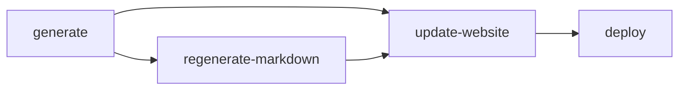
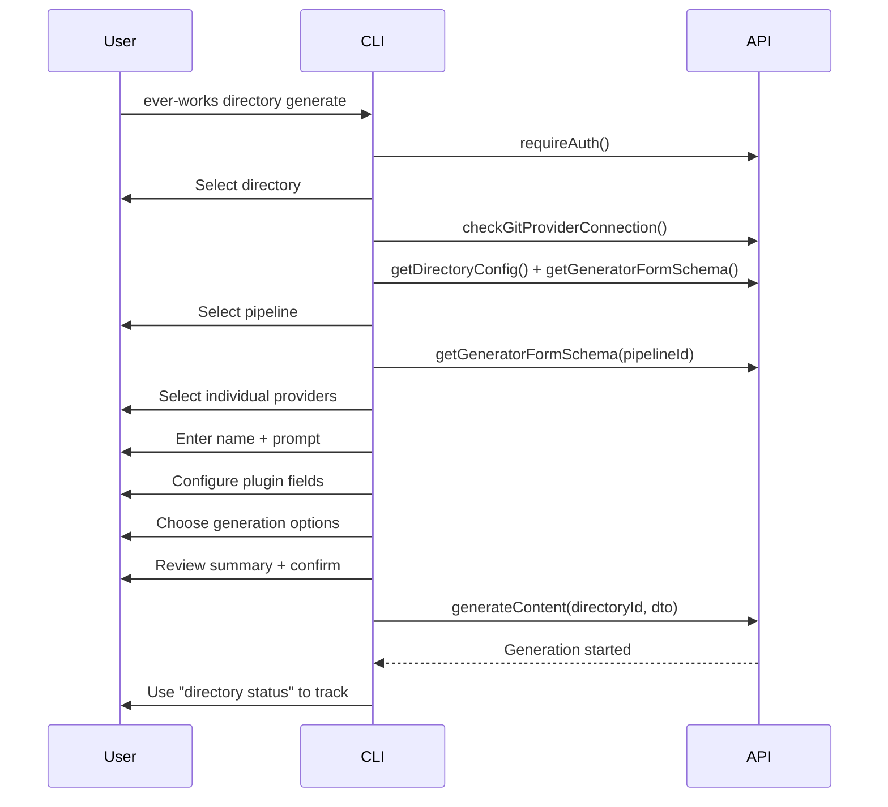
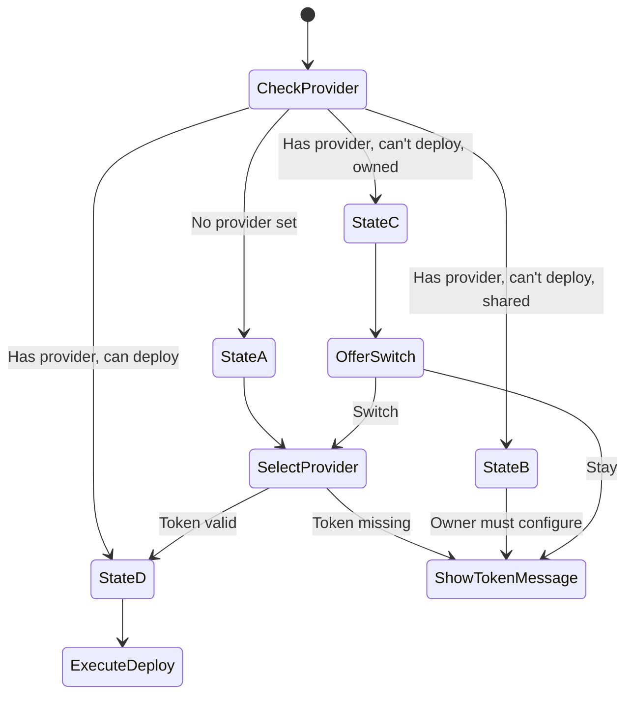
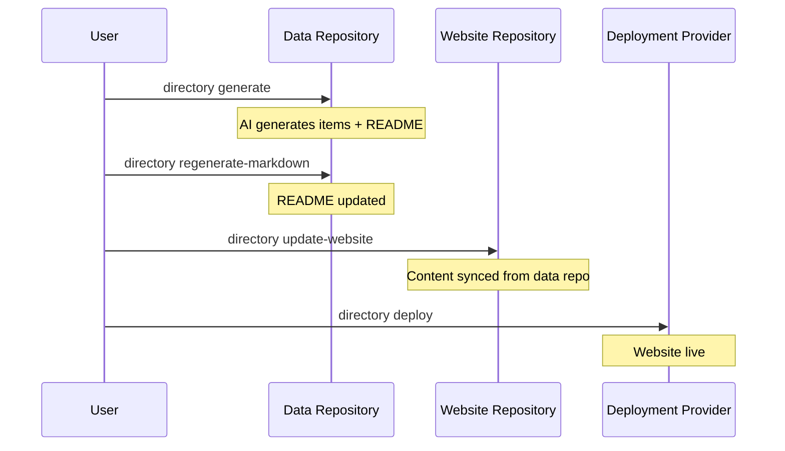

# CLI Generation Commands

The CLI provides four commands that cover the full content lifecycle: generating directory content, regenerating markdown, syncing the website repository, and deploying to production. Each command is a subcommand of `directory`.

**Source:** `apps/cli/src/commands/directory/`

## Command Overview

| Command | Description | Source File |
|---|---|---|
| `directory generate` | Generate items and create/update the data repository | `generate.ts` |
| `directory regenerate-markdown` | Regenerate the README.md from existing data | `regenerate-markdown.ts` |
| `directory update-website` | Sync data repository content to the website repository | `update-website.ts` |
| `directory deploy` | Deploy the website to the configured provider | `deploy.ts` |



## Generate Content

```bash
ever-works directory generate
```

The most complex CLI command. It guides the user through a multi-step configuration wizard, validates provider setup, and starts the generation pipeline.

### Prerequisites

- User must be authenticated.
- User must have `editor` role or higher on the selected directory.
- A git provider (GitHub) must be connected.
- No generation may already be in progress.

### Interactive Flow



### Step 1: Directory Selection

Prompts the user to select from their directories. Checks that generation is not already running:

```typescript
if (directory.generateStatus?.status === GenerateStatusType.GENERATING) {
  // Already in progress — show current step and exit
}
```

### Step 2: Git Provider Check

Iterates over all enabled git providers and tests their connection. If none is connected, directs the user to the web dashboard to authenticate.

### Step 3: Pipeline Selection

Loads the generator form schema and prompts the user to select a generation pipeline. The schema defines available pipelines and their provider requirements.

When a pipeline is selected, the schema is re-fetched with the pipeline ID to get filtered provider categories specific to that pipeline.

### Step 4: Provider Selection

For each provider category in the schema (e.g. `ai-provider`, `search`, `screenshot`), the user selects which plugin to use:

```typescript
const individualProviders = await generatePrompt.promptIndividualProviders(
  schema,
  lastRequestData?.providers
);
```

Previous selections from the last generation run are used as defaults.

### Step 5: Required Fields

Two fields are always collected:

| Field | Description |
|---|---|
| `name` | The directory name (read-only, pre-filled) |
| `prompt` | The generation prompt (pre-filled from last generation if available) |

### Step 6: Dynamic Plugin Fields

If the selected pipeline defines `pluginFields`, the CLI prompts for each one. Default values come from the schema's `defaultValues` merged with the last run's `pluginConfig` (only when the pipeline matches).

Plugin fields are organized into `pluginGroups` for logical grouping in the prompt interface.

### Step 7: Provider Validation

Before proceeding, the CLI validates that all selected providers are properly configured:

```typescript
const unconfigured = findUnconfiguredProviders(providerSelections, schema);
if (unconfigured.length > 0) {
  console.log(`Unconfigured providers: ${unconfigured.join(', ')}`);
  // Exit — user must configure in Settings > Plugins
}
```

### Step 8: Generation Options

For previously generated directories, the user chooses:

| Option | Values | Description |
|---|---|---|
| `generation_method` | `CREATE_UPDATE`, `RECREATE` | Whether to update existing items or start from scratch |
| `update_with_pull_request` | `true`, `false` | Whether updates go through a PR workflow |
| `website_repository_creation_method` | `CREATE_USING_TEMPLATE`, etc. | How the website repository is created |

Selecting `RECREATE` triggers an extra confirmation since it deletes existing items.

New directories always use `CREATE_UPDATE` without prompting.

### Step 9: Confirm and Start

The CLI displays a summary of all selections and asks for final confirmation. On confirmation, it calls `apiService.generateContent()` and directs the user to check progress with `directory status`.

### Plugin Config Sanitization

Before sending to the API, plugin config values are sanitized:

- `null` and `undefined` values are removed.
- String arrays are trimmed and cleaned of control characters.
- URL arrays are trimmed but not character-cleaned.

## Regenerate Markdown

```bash
ever-works directory regenerate-markdown
```

Regenerates the README.md file in the data repository without re-running the full generation pipeline. Useful for updating presentation while preserving existing data.

### Flow

1. Authenticate and select directory.
2. Check edit permissions.
3. Confirm the operation.
4. Call `apiService.regenerateMarkdown(directoryId)`.
5. Show status and next steps.

### What It Does

- Regenerates the `README.md` file for the directory's data repository.
- Preserves all existing item data.
- Updates only the presentation layer (markdown formatting).

### Next Steps After Success

The CLI suggests:

```
  - Check your data repository for the updated README.md
  - Review the changes and commit if satisfied
  - Use "directory update-website" to update the website
```

## Update Website

```bash
ever-works directory update-website
```

Syncs content from the data repository to the website repository. This prepares the website for deployment without triggering a deploy.

### Flow

1. Authenticate and select directory.
2. Check edit permissions.
3. Display the target repository (`{owner}/{slug}-website`).
4. Confirm the operation.
5. Call `apiService.updateWebsite(directoryId)`.
6. Show status, repository URL, and next steps.

### What It Does

- Copies generated content from the data repository to the website repository.
- Updates the website source files to reflect the latest data.
- Does not trigger a deployment.

### Next Steps After Success

```
  - Check the website repository for updates
  - Use "directory deploy" to deploy the website
  - Review the changes before deployment
```

## Deploy Website

```bash
ever-works directory deploy
```

Deploys the website to the configured deployment provider (e.g. Vercel). Handles provider selection, team scoping, and deployment status polling.

### Prerequisites

- Directory content must be generated (`generateStatus === GENERATED`).
- A deployment provider must be configured or selected during the command.
- The deployment provider's API token must be configured.

### State Machine

The deploy command implements a state machine with four states:



| State | Condition | Behavior |
|---|---|---|
| A | No `deployProvider` set | Prompt user to select a provider. If valid, proceed to deploy. |
| B | Has provider, `canDeploy=false`, shared directory | Tell user the owner must configure their token. |
| C | Has provider, `canDeploy=false`, owned directory | Tell user to configure their token. Offer to switch providers. |
| D | Has provider, `canDeploy=true` | Execute the deployment. |

### Deployment Execution

The `executeDeploy()` function handles the full deployment lifecycle:

1. **Lookup existing deployment** -- Checks if the directory already has a live deployment and shows its URL.
2. **Team selection** -- If the user's deployment account has teams, prompts for which team to deploy under.
3. **Confirmation** -- Shows the source repository and what will happen.
4. **Deploy** -- Calls `apiService.deployWebsite(directoryId, { teamScope })`.
5. **Poll for status** -- Polls the directory's `deploymentState` every 5 seconds.

### Deployment Status Polling

```typescript
const STOP_STATES = ['READY', 'ERROR', 'CANCELED', 'TIMEOUT'];

while (true) {
  const { directory } = await apiService.getDirectory(directoryId);

  if (STOP_STATES.includes(directory.deploymentState)) {
    // Show final status and website URL
    break;
  }

  // Update spinner text with current state
  await new Promise(resolve => setTimeout(resolve, 5000));
}
```

The `isDeploying()` helper prevents false positives by checking that the deployment was started within the last 10 minutes:

```typescript
function isDeploying(directory: Directory) {
  const hasDeploymentState = ['INITIALIZING', 'QUEUED', 'BUILDING']
    .includes(directory.deploymentState);
  const hasStartedAt = directory.deploymentStartedAt &&
    new Date(directory.deploymentStartedAt) > new Date(Date.now() - 10 * 60 * 1000);
  return Boolean(hasDeploymentState && hasStartedAt);
}
```

### Terminal States

| State | Spinner | Output |
|---|---|---|
| `READY` | Success | Website URL |
| `ERROR` | Fail | Error message if available |
| `CANCELED` | Warning | -- |
| `TIMEOUT` | Fail | -- |

## Common Patterns

All four commands share these patterns:

### Authentication Gate

```typescript
await requireAuth();
```

Every command requires an active session.

### Directory Selection

```typescript
const selection = await directoryPrompt.promptDirectorySelection();
if (selection.cancelled || !selection.directory) return;
```

Interactive directory picker with role and sharing information.

### Permission Check

```typescript
if (!canEdit(role)) {
  // Show error — requires editor or higher
  return;
}
```

### Error Handling

All commands wrap their logic in try/catch and use `handleCliError()` for consistent error formatting, followed by `process.exit(1)`.

## Full Lifecycle Example

A typical workflow using all four commands:

```bash
# 1. Generate directory content
ever-works directory generate
# Select directory, configure providers, set prompt, confirm

# 2. (Optional) Regenerate markdown if data format changes
ever-works directory regenerate-markdown

# 3. Sync to website repository
ever-works directory update-website

# 4. Deploy to production
ever-works directory deploy
# Select team (if applicable), confirm, wait for READY
```


