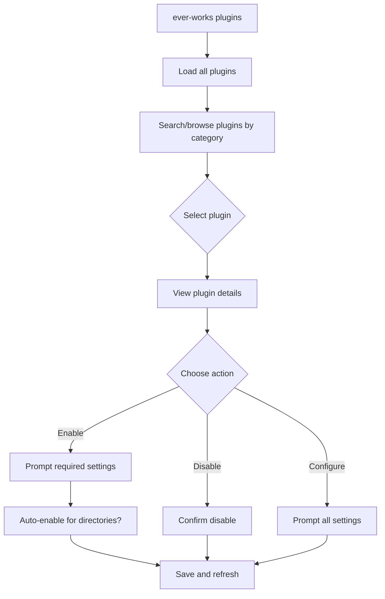
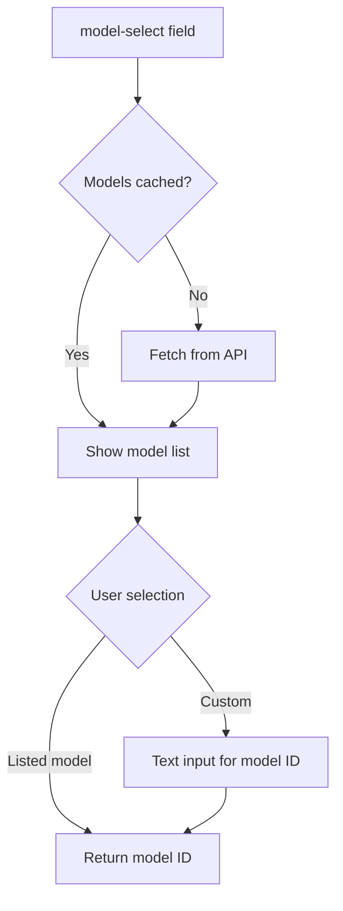
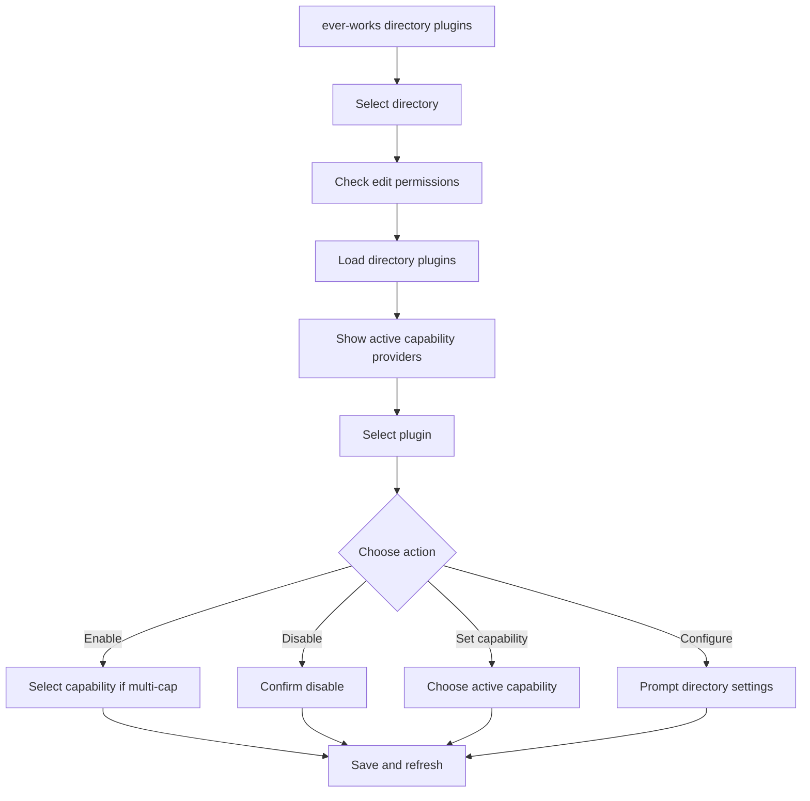

# CLI Plugin Commands

The CLI provides two levels of plugin management: global user-level plugin configuration (`plugins`) and directory-scoped plugin overrides (`directory plugins`). Both commands present interactive, searchable interfaces for browsing, enabling, and configuring plugins.

**Source:** `apps/cli/src/commands/plugins/` and `apps/cli/src/commands/directory/plugins.ts`

## Global Plugin Management

```bash
ever-works plugins [options]
```

### Options

| Option                      | Description                                                             |
| --------------------------- | ----------------------------------------------------------------------- |
| `-c, --category <category>` | Filter plugins by category (e.g. `search`, `ai-provider`, `deployment`) |

### Interactive Flow



The plugin list is grouped by category and supports type-ahead search. Each plugin shows its status (enabled/disabled/system), category, and description.

### Plugin Detail View

When a plugin is selected, the CLI displays:

| Field    | Description                                          |
| -------- | ---------------------------------------------------- |
| ID       | Plugin identifier                                    |
| Version  | Semantic version                                     |
| Category | Plugin category (e.g. `search`, `ai-provider`)       |
| Status   | `System`, `Enabled`, or `Disabled`                   |
| About    | Plugin description                                   |
| Provides | Capability list (e.g. `search`, `content-extractor`) |
| Settings | Field count and required count                       |

### Enable Flow

Enabling a plugin follows this sequence:

1. **Check required settings** -- Uses `getRequiredFields()` and `validateRequiredSettings()` from `@ever-works/plugin/api` to determine if mandatory fields are missing.
2. **Prompt missing settings** -- If required fields are missing, `PluginSettingsPromptService` collects them before enabling.
3. **Auto-enable for directories** -- Optionally enables the plugin for all existing directories.
4. **API call** -- Sends settings and secret settings to `apiService.enablePlugin()`.

```typescript
// Enable data structure
{
  settings?: Record<string, unknown>;
  secretSettings?: Record<string, unknown>;
  autoEnableForDirectories?: boolean;
}
```

System plugins cannot be enabled or disabled -- they are always active.

### Disable Flow

Disabling prompts for confirmation before calling `apiService.disablePlugin()`. System plugins do not show the disable option.

### Configure Settings

The settings flow:

1. Fetches full plugin details (to load current settings).
2. Splits settings into regular and secret using `splitSettingsBySecret()`.
3. Prompts for each visible field using `PluginSettingsPromptService`.
4. Validates required fields and constraints.
5. Saves with confirmation.

Settings can only be configured when the plugin is enabled.

## Settings Prompt Service

The `PluginSettingsPromptService` handles all interactive settings input. It extends `BasePromptService` from `@ever-works/cli-shared`.

**Source:** `apps/cli/src/commands/plugins/plugin-settings-prompt.service.ts`

### Field Type Handling

| Schema Type           | Widget         | Prompt Style                                                |
| --------------------- | -------------- | ----------------------------------------------------------- |
| `string` + `x-secret` | --             | Password input (masked)                                     |
| `string`              | `model-select` | Fetches models from API, presents as list with context size |
| `string` + `enum`     | --             | Select list from enum values                                |
| `boolean`             | --             | Yes/No confirmation                                         |
| `number`              | --             | Numeric input with `minimum`/`maximum` validation           |
| `string` (default)    | --             | Text input                                                  |

### Model Selection

When a field uses the `model-select` widget, the prompt service:

1. Calls `apiService.listPluginModels(pluginId)` to fetch available models.
2. Caches the result per plugin ID for the session.
3. Displays models sorted alphabetically with context window size (e.g. `128K ctx`, `1.0M ctx`).
4. Adds the current value if it is not in the fetched list (marked as `(current)`).
5. Offers a "Enter custom model ID" option for unlisted models.



If the API call fails, the prompt falls back to a plain text input.

### Conditional Fields

The service supports `showIf` conditions on schema properties:

```typescript
if (prop.showIf) {
	const refValue = settings[prop.showIf.field] ?? secretSettings[prop.showIf.field];
	if (refValue !== prop.showIf.value) continue; // skip this field
}
```

This allows plugins to show fields conditionally based on other setting values.

### Validation

After collecting all fields, two validations run:

| Validation                      | Source                   | Behavior on Failure                   |
| ------------------------------- | ------------------------ | ------------------------------------- |
| `validateRequiredSettings()`    | `@ever-works/plugin/api` | Lists missing fields, offers retry    |
| `validateSettingsConstraints()` | `@ever-works/plugin/api` | Lists constraint errors, offers retry |

Settings are sanitized with `sanitizeSettingsForSave()` before returning.

## Directory Plugin Management

```bash
ever-works directory plugins
```

This command manages plugins at the directory level. Directory-scoped settings override user-level settings, and plugins can be individually enabled or disabled per directory.

### Interactive Flow



### Capability Providers Display

Before the plugin list, the command shows the current active provider for each capability:

```
  Active Providers
  ──────────────────────────────────────────────────
  search → exa
  ai-provider → openai
  deployment → vercel
```

### Directory Plugin Actions

| Action                       | Description                                                                                                         |
| ---------------------------- | ------------------------------------------------------------------------------------------------------------------- |
| Enable for directory         | Enables the plugin at directory scope. If the plugin has multiple capabilities, prompts for which one to activate.  |
| Disable for directory        | Disables the plugin at directory scope with confirmation.                                                           |
| Set active capability        | Shown when a plugin provides more than one capability. Switches which capability is active.                         |
| Configure directory settings | Prompts for directory-scoped settings. Uses user-level settings as fallback defaults (shown as `Inherited: value`). |

### Settings Inheritance

Directory settings inherit from user-level settings. The prompt shows inherited values and allows overriding:

```typescript
const promptService = new PluginSettingsPromptService();
const result = await promptService.promptSettings({
	pluginId: plugin.pluginId,
	schema: plugin.settingsSchema,
	currentSettings: regular,
	currentSecretSettings: secret,
	scope: 'directory',
	scopes: ['global', 'directory'],
	fallbackSettings: userPlugin.settings // inherited defaults
});
```

When `scope` is `'directory'` and an inherited value exists, the prompt displays:

```
  Inherited: gpt-5.1
```

Leaving a field blank preserves the inherited value.

### Permission Check

Both plugin commands require the `editor` role or higher. The `canEdit()` function validates the user's role:

```typescript
if (!canEdit(role)) {
	console.log('You do not have permission to perform this action.');
	console.log(`Your role: ${role}. Required: editor or higher.`);
	return;
}
```

## API Methods Used

| Method                                                 | Command             | Description                                       |
| ------------------------------------------------------ | ------------------- | ------------------------------------------------- |
| `getPlugins(options?)`                                 | `plugins`           | List all plugins, optionally filtered by category |
| `getPlugin(pluginId)`                                  | `plugins`           | Get full plugin details with settings             |
| `enablePlugin(pluginId, data)`                         | `plugins`           | Enable a plugin with optional settings            |
| `disablePlugin(pluginId)`                              | `plugins`           | Disable a plugin                                  |
| `updatePluginSettings(pluginId, data)`                 | `plugins`           | Save plugin settings                              |
| `listPluginModels(pluginId)`                           | `plugins`           | Fetch available AI models for a plugin            |
| `getDirectoryPlugins(directoryId)`                     | `directory plugins` | List plugins for a specific directory             |
| `enableDirectoryPlugin(dirId, pluginId, data)`         | `directory plugins` | Enable a plugin at directory scope                |
| `disableDirectoryPlugin(dirId, pluginId)`              | `directory plugins` | Disable a plugin at directory scope               |
| `setDirectoryPluginCapability(dirId, pluginId, cap)`   | `directory plugins` | Set the active capability for a plugin            |
| `updateDirectoryPluginSettings(dirId, pluginId, data)` | `directory plugins` | Save directory-level plugin settings              |

## Utility Functions

The CLI plugin commands rely on shared utilities from `@ever-works/plugin/api`:

| Function                                                           | Purpose                                                                                           |
| ------------------------------------------------------------------ | ------------------------------------------------------------------------------------------------- |
| `getVisibleProperties(schema, scopes)`                             | Returns schema properties visible at the given scopes, filtering out hidden and admin-only fields |
| `getRequiredFields(schema, scopes)`                                | Returns field names that are required at the given scopes                                         |
| `validateRequiredSettings(regular, secret, schema, scopes, scope)` | Returns list of missing required field names                                                      |
| `splitSettingsBySecret(settings, schema, scopes)`                  | Splits a flat settings object into `{ regular, secret }` based on `x-secret` markers              |
| `sanitizeSettingsForSave(settings, scope)`                         | Removes undefined values and scope-irrelevant fields                                              |
| `validateSettingsConstraints(merged, props)`                       | Validates `minimum`, `maximum`, `pattern`, and other JSON Schema constraints                      |
