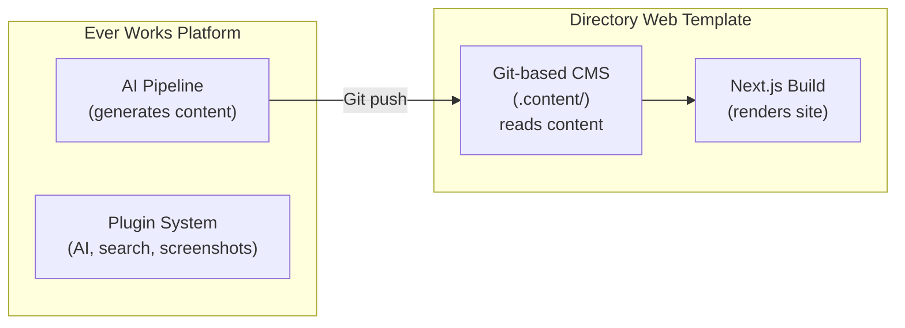
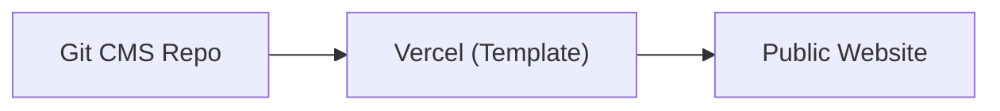
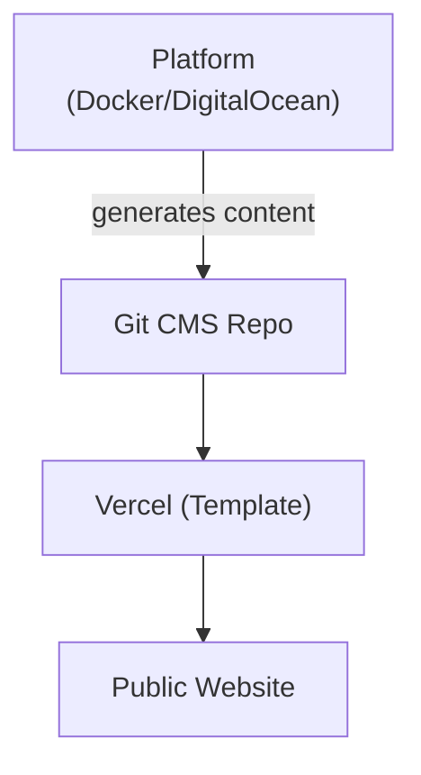
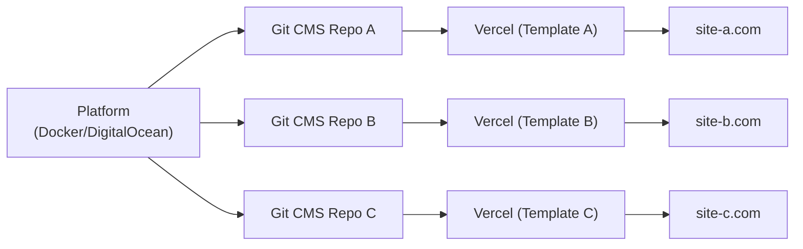

# Platform vs Template

Ever Works consists of two main products that serve different purposes but work together as a unified ecosystem. This page explains what each product does, how they differ, how they connect, and when to use which.

## Ever Works Platform

The **Ever Works Platform** is the backend infrastructure for building and managing directory websites at scale. It is organized as a **Turborepo + pnpm workspaces monorepo** containing multiple applications and shared packages.

### What It Does

- Provides a **REST API** (NestJS 11) for directory management, authentication, AI conversations, and deployment orchestration
- Includes a **Next.js Web Dashboard** for administrators to manage directories, configure pipelines, and monitor AI agents
- Ships with **CLI tools** (public CLI and internal CLI) for development, deployment, and automation tasks
- Runs **AI agents** powered by LangChain with support for 7 LLM providers (OpenAI, Anthropic, Google, Groq, OpenRouter, Ollama, and custom endpoints)
- Features a **plugin system** with 39 plugins across categories: AI providers, AI gateways, search engines, content extraction, screenshot services, Git integrations, deployment, pipeline generators (Standard, Agent, Claude Code, Claude Managed Agent, Codex, Gemini, OpenCode, Make.com, SIM AI, Zapier), and prompt management (Langfuse)
- Manages **background jobs** via Trigger.dev and BullMQ for scheduled updates, pipeline execution, and async processing
- Includes **monitoring** via Sentry (error tracking) and PostHog (product analytics)

### Tech Stack

- **Runtime:** Node.js 20+
- **Framework:** NestJS 11 (API), Next.js 16 (Web Dashboard)
- **Language:** TypeScript 5.9 (strict mode)
- **ORM:** TypeORM 0.3 (supports SQLite, PostgreSQL, MySQL)
- **AI:** LangChain with multi-provider support
- **Build:** Turborepo, tsup (plugins), SWC (NestJS)
- **Testing:** Jest (agent, API), Vitest (plugins)
- **Package Manager:** pnpm 10+
- **Deployment:** Docker, DigitalOcean

## Directory Web Template

The **Directory Web Template** is a production-ready, full-stack directory website that you can clone, customize, and deploy as a standalone application.

### What It Does

- Provides a complete **directory website** with item listings, search, filtering, categories, tags, and collections
- Includes **authentication** via NextAuth.js v5 with OAuth providers (Google, GitHub, Facebook, Twitter, Microsoft) and Supabase Auth
- Supports **payments** through Stripe, LemonSqueezy, and Polar with subscription management
- Features **internationalization** with multiple languages and RTL support via next-intl
- Uses a **Git-based CMS** to synchronize directory content from Git repositories
- Includes a **theming system** with built-in themes and dynamic color generation
- Provides **analytics and monitoring** through PostHog and Sentry
- Ships with **SEO optimization**, sitemap generation, and structured data (JSON-LD)
- Includes an **admin dashboard** with content management, user management, and analytics

### Tech Stack

- **Runtime:** Node.js 20+
- **Framework:** Next.js 15, React 19
- **Language:** TypeScript 5
- **ORM:** Drizzle ORM (PostgreSQL via `postgres` driver)
- **UI:** Tailwind CSS 4, HeroUI React, Radix UI
- **Auth:** NextAuth.js v5, Supabase Auth
- **Payments:** Stripe, LemonSqueezy, Polar
- **Testing:** Playwright (E2E)
- **Package Manager:** pnpm
- **Deployment:** Vercel (primary), Docker (alternative)

## Side-by-Side Comparison

| Aspect                  | Platform                                         | Template                             |
| ----------------------- | ------------------------------------------------ | ------------------------------------ |
| **Purpose**             | Backend infrastructure and AI pipeline           | Frontend directory website           |
| **Architecture**        | Monorepo (Turborepo + pnpm workspaces)           | Standalone Next.js application       |
| **Backend Framework**   | NestJS 11                                        | Next.js API routes                   |
| **Frontend Framework**  | Next.js 16 (admin dashboard)                     | Next.js 15 (public website + admin)  |
| **Database ORM**        | TypeORM                                          | Drizzle ORM                          |
| **Database Support**    | SQLite, PostgreSQL, MySQL                        | PostgreSQL (via Supabase or direct)  |
| **Authentication**      | JWT + OAuth (NestJS Guards)                      | NextAuth.js v5 + Supabase Auth       |
| **Payment Integration** | Not included (delegated to Template)             | Stripe, LemonSqueezy, Polar          |
| **AI Features**         | LangChain agents, 7 LLM providers, plugin system | None (consumes AI-generated content) |
| **Content Management**  | Generates content via AI pipelines               | Reads content from Git-based CMS     |
| **Deployment Target**   | Docker on DigitalOcean (or any VPS)              | Vercel (or Docker)                   |
| **Background Jobs**     | Trigger.dev, BullMQ                              | Vercel Cron (limited)                |
| **Monitoring**          | Sentry + PostHog                                 | Sentry + PostHog                     |
| **i18n**                | next-intl (admin dashboard)                      | next-intl (full site, RTL support)   |
| **Testing**             | Jest + Vitest                                    | Playwright                           |
| **Primary Audience**    | Platform operators, AI pipeline developers       | Website builders, directory creators |

## How They Connect

The Platform and Template are designed to work together through the **Git-based CMS** pattern:

### The Content Flow

1. **Platform generates content.** The AI pipeline discovers items, generates descriptions, captures screenshots, and produces structured data (YAML) and long-form content (Markdown).
2. **Platform commits to Git.** Generated content is committed and pushed to a Git repository (the CMS data repository, e.g., `ever-works/awesome-time-tracking-data`).
3. **Template reads from Git.** The Template clones the CMS repository into its `.content/` directory at build time (via `scripts/clone.cjs`).
4. **Template renders the website.** Next.js reads the structured files and renders the directory website with all items, categories, and content.
5. **Template deploys automatically.** Vercel detects changes in the CMS repository (via Git integration or webhooks) and triggers a rebuild.

### Independent Operation

While the Platform and Template are designed to work together, they can also operate independently:

- **Template without Platform:** Manually maintain the Git-based CMS repository. Add items, categories, and content by editing YAML and Markdown files directly. The Template works as a fully functional directory website without any AI generation.
- **Platform without Template:** Use the Platform API to generate directory data and export it to any frontend. The API provides REST endpoints for accessing all generated content.

## When to Use Which

### Use the Template When...

- You want to launch a directory website quickly with minimal backend setup
- Your directory content is manually curated or comes from a static data source
- You need a production-ready website with authentication, payments, and SEO out of the box
- You prefer deploying to Vercel with zero server management
- You are comfortable managing content through Git (editing YAML/Markdown files)

### Use the Platform When...

- You need AI-powered content generation for large directories (hundreds or thousands of items)
- You want automated pipelines that discover, enrich, and update directory items
- You need to manage multiple directories from a single backend
- You want to use the plugin system to integrate custom AI providers, search engines, or data sources
- You need background job processing for scheduled updates and async tasks

### Use Both When...

- You want the full Ever Works experience: AI-generated content flowing into a production website
- You are building a SaaS product on top of Ever Works (like [Pinler.com](https://pinler.com))
- You need automated content generation AND a polished frontend with authentication and payments
- You want to scale from a single directory to multiple directories managed by the same backend

## Deployment Architectures

### Template Only (Simplest)

- Manual content management via Git
- Single Vercel deployment
- No AI generation

### Platform + Template (Full Stack)

- Automated content generation via Platform
- Platform on Docker/DigitalOcean
- Template on Vercel
- Connected via Git repository

### Platform + Multiple Templates (Multi-Directory)

- Single Platform instance managing multiple directories
- Each directory has its own CMS repository and Template deployment
- Centralized AI pipeline and plugin configuration
