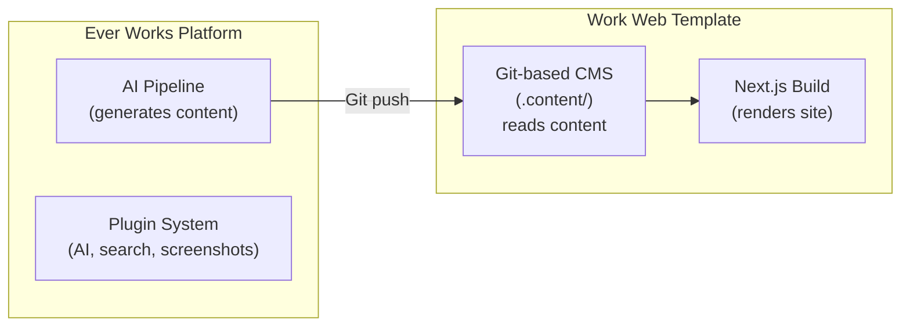
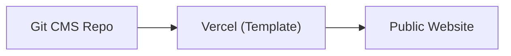
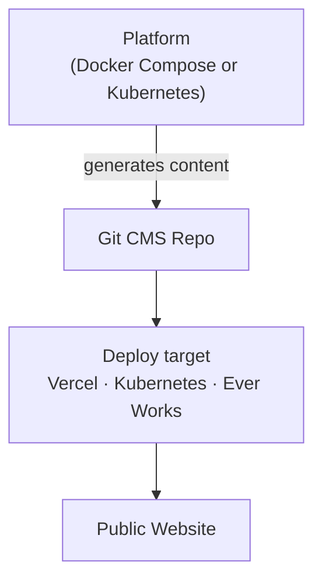
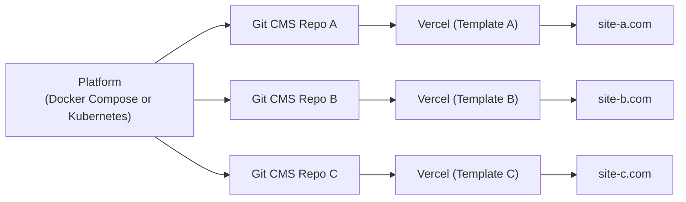

# Platform vs Template

Ever Works consists of two main products that serve different purposes but work together as a unified ecosystem. This page explains what each product does, how they differ, how they connect, and when to use which.

## Ever Works Platform

The **Ever Works Platform** is the backend infrastructure for building and managing work websites at scale. It is organized as a **Turborepo + pnpm workspaces monorepo** containing multiple applications and shared packages.

### What It Does

- Provides a **REST API** (NestJS 11) for work management, authentication, AI conversations, and deployment orchestration
- Includes a **Next.js Web Dashboard** for administrators to manage works, configure pipelines, and monitor AI agents
- Ships with **CLI tools** (public CLI and internal CLI) for development, deployment, and automation tasks
- Runs **AI agents** on **11 AI-provider plugins** — OpenAI, Anthropic, Google (Gemini), xAI (Grok), Groq, Mistral, Ollama, LM Studio, vLLM, plus the OpenRouter and Vercel AI Gateway routers — each usable with your own API key
- Features a **plugin system** with **102 plugins across 19 categories** — AI providers, pipelines, search, content extraction, screenshots, Git, deployment, job runtimes, secret stores, storage, databases, vector stores, DNS, email providers, notification channels, business connectors, metrics providers, data sources and utilities (see [Plugin categories](#plugin-categories) below)
- Manages **background jobs** through a swappable **job-runtime** capability — Trigger.dev (the default), Temporal, BullMQ, pg-boss, Inngest, or your own [Fleet](./features/fleet.md) nodes — chosen per deployment with `EVER_WORKS_JOB_RUNTIME`
- Includes **monitoring** via Sentry (error tracking) and PostHog (product analytics)

### Plugin categories

Every plugin declares its category in `everworks.plugin.category` inside its own `package.json`, so this table is the manifest count, not an estimate:

| Category                | Count | Examples                                                                                                                           |
| ----------------------- | ----- | ---------------------------------------------------------------------------------------------------------------------------------- |
| `pipeline`              | 14    | standard-pipeline (15-step), agent-pipeline, claude-code, codex, opencode, make                                                    |
| `ai-provider`           | 11    | openai, anthropic, google, grok, groq, mistral, ollama, lm-studio, vllm, openrouter, vercel-ai-gateway                             |
| `connector`             | 11    | slack-connector, discord-connector, linear-connector, notion-connector, jira-connector, hubspot-connector                          |
| `utility`               | 10    | comparison-generator, langfuse, everworks-skills, agentmemory, local-workspace                                                     |
| `search`                | 9     | tavily, brave, exa, perplexity, serpapi, firecrawl, linkup, valyu, brightdata                                                      |
| `secret-store-resolver` | 7     | secret-store-vault, secret-store-k8s, secret-store-aws-sm, secret-store-gcp-sm, secret-store-doppler                               |
| `job-runtime`           | 6     | job-runtime-trigger (default), job-runtime-temporal, job-runtime-bullmq, job-runtime-pgboss, job-runtime-inngest, job-runtime-node |
| `content-extractor`     | 6     | local-content-extractor, jina, notion-extractor, pdf-extractor, officecli-extractor, scrapfly                                      |
| `notification-channel`  | 5     | slack-channel, discord-channel, telegram-channel, whatsapp-channel, novu-channel                                                   |
| `email-provider`        | 5     | resend, sendgrid, postmark, mailgun, mailchimp-transactional                                                                       |
| `storage`               | 4     | local-fs, aws-s3, minio, github-storage                                                                                            |
| `metrics`               | 4     | stripe-metrics, google-analytics-metrics, posthog-metrics, custom-http-metrics                                                     |
| `deployment`            | 2     | vercel, k8s                                                                                                                        |
| `screenshot`            | 2     | screenshotone, urlbox                                                                                                              |
| `vector-store`          | 2     | pgvector, qdrant                                                                                                                   |
| `git-provider`          | 1     | github                                                                                                                             |
| `dns`                   | 1     | cloudflare-dns                                                                                                                     |
| `database`              | 1     | postgres-db                                                                                                                        |
| `data-source`           | 1     | apify                                                                                                                              |

Plugins are split into a **core** set that always ships in the image and a **distributable** set published as `@ever-works/<id>-plugin` on npm, which an operator can install at runtime when `PLUGIN_DISTRIBUTION_MODE=dynamic`. See [Plugin System](./plugin-system/index.md) and [Plugins](./features/plugins.md).

### Tech Stack

- **Runtime:** Node.js 22+
- **Framework:** NestJS 11 (API), Next.js 16 (Web Dashboard)
- **Language:** TypeScript 5.9 (strict mode)
- **ORM:** TypeORM 0.3 (supports SQLite, PostgreSQL, MySQL)
- **AI:** Vercel AI SDK (`ai` ^6) in the agent runtime and the `agent-pipeline` plugin; AI-provider plugins share the `AiOperations` helper in `@ever-works/plugin/ai`, which wraps LangChain's OpenAI-compatible chat and embedding clients
- **Build:** Turborepo, tsup (plugins), SWC (NestJS)
- **Testing:** Jest (agent, API), Vitest (plugins)
- **Package Manager:** pnpm 10+
- **Deployment:** Docker Compose (`docker-compose.yml` and the demo/infra/build/trigger overlays) or Kubernetes (`.deploy/k8s/k8s-manifest.{dev,stage,prod}.yaml`, plus separate manifests for the MCP server)

## Work Web Template

The **Work Web Template** is a production-ready, full-stack work website that you can clone, customize, and deploy as a standalone application.

### What It Does

- Provides a complete **work website** with item listings, search, filtering, categories, tags, and collections
- Includes **authentication** via NextAuth.js v5 with OAuth providers (Google, GitHub, Facebook, Twitter, Microsoft) and Supabase Auth
- Supports **payments** through Stripe, LemonSqueezy, and Polar with subscription management
- Features **internationalization** with multiple languages and RTL support via next-intl
- Uses a **Git-based CMS** to synchronize work content from Git repositories
- Includes a **theming system** with built-in themes and dynamic color generation
- Provides **analytics and monitoring** through PostHog and Sentry
- Ships with **SEO optimization**, sitemap generation, and structured data (JSON-LD)
- Includes an **admin dashboard** with content management, user management, and analytics

### Tech Stack

- **Runtime:** Node.js 20+
- **Framework:** Next.js 15, React 19
- **Language:** TypeScript 5
- **ORM:** Drizzle ORM (PostgreSQL via `postgres` driver)
- **UI:** Tailwind CSS 4, HeroUI React, Radix UI
- **Auth:** NextAuth.js v5, Supabase Auth
- **Payments:** Stripe, LemonSqueezy, Polar
- **Testing:** Playwright (E2E)
- **Package Manager:** pnpm
- **Deployment:** Vercel (primary), Docker (alternative)

## Side-by-Side Comparison

| Aspect                  | Platform                                          | Template                             |
| ----------------------- | ------------------------------------------------- | ------------------------------------ |
| **Purpose**             | Backend infrastructure and AI pipeline            | Frontend work website                |
| **Architecture**        | Monorepo (Turborepo + pnpm workspaces)            | Standalone Next.js application       |
| **Backend Framework**   | NestJS 11                                         | Next.js API routes                   |
| **Frontend Framework**  | Next.js 16 (admin dashboard)                      | Next.js 15 (public website + admin)  |
| **Database ORM**        | TypeORM                                           | Drizzle ORM                          |
| **Database Support**    | SQLite, PostgreSQL, MySQL                         | PostgreSQL (via Supabase or direct)  |
| **Authentication**      | JWT + OAuth (NestJS Guards)                       | NextAuth.js v5 + Supabase Auth       |
| **Payment Integration** | Not included (delegated to Template)              | Stripe, LemonSqueezy, Polar          |
| **AI Features**         | 11 AI providers, 14 pipeline plugins, 102 plugins | None (consumes AI-generated content) |
| **Content Management**  | Generates content via AI pipelines                | Reads content from Git-based CMS     |
| **Deployment Target**   | Docker Compose or Kubernetes (any cluster)        | Vercel (or Docker)                   |
| **Background Jobs**     | Six job runtimes, one active per deployment       | Vercel Cron (limited)                |
| **Monitoring**          | Sentry + PostHog                                  | Sentry + PostHog                     |
| **i18n**                | next-intl (admin dashboard)                       | next-intl (full site, RTL support)   |
| **Testing**             | Jest + Vitest                                     | Playwright                           |
| **Primary Audience**    | Platform operators, AI pipeline developers        | Website builders, work creators      |

## How They Connect

The Platform and Template are designed to work together through the **Git-based CMS** pattern:

```mermaid
flowchart LR
    subgraph Platform["Ever Works Platform"]
        AI["AI Pipeline<br/>(generates content)"]
        Plugins["Plugin System<br/>(AI, search, screenshots)"]
    end
    subgraph Template["Work Web Template"]
        CMS["Git-based CMS<br/>(.content/)<br/>reads content"]
        Next["Next.js Build<br/>(renders site)"]
        CMS --> Next
    end
    AI -- "Git push" --> CMS
```

### The Content Flow

1. **Platform generates content.** The AI pipeline discovers items, generates descriptions, captures screenshots, and produces structured data (YAML) and long-form content (Markdown).
2. **Platform commits to Git.** Generated content is committed and pushed to a Git repository (the CMS data repository, e.g., `ever-works/awesome-time-tracking-data`).
3. **Template reads from Git.** The Template clones the CMS repository into its `.content/` work at build time (via `scripts/clone.cjs`).
4. **Template renders the website.** Next.js reads the structured files and renders the work website with all items, categories, and content.
5. **Template deploys automatically.** Vercel detects changes in the CMS repository (via Git integration or webhooks) and triggers a rebuild.

### Independent Operation

While the Platform and Template are designed to work together, they can also operate independently:

- **Template without Platform:** Manually maintain the Git-based CMS repository. Add items, categories, and content by editing YAML and Markdown files directly. The Template works as a fully functional work website without any AI generation.
- **Platform without Template:** Use the Platform API to generate work data and export it to any frontend. The API provides REST endpoints for accessing all generated content.

## When to Use Which

### Use the Template When...

- You want to launch a work website quickly with minimal backend setup
- Your work content is manually curated or comes from a static data source
- You need a production-ready website with authentication, payments, and SEO out of the box
- You prefer deploying to Vercel with zero server management
- You are comfortable managing content through Git (editing YAML/Markdown files)

### Use the Platform When...

- You need AI-powered content generation for large works (hundreds or thousands of items)
- You want automated pipelines that discover, enrich, and update work items
- You need to manage multiple works from a single backend
- You want to use the plugin system to integrate custom AI providers, search engines, or data sources
- You need background job processing for scheduled updates and async tasks

### Use Both When...

- You want the full Ever Works experience: AI-generated content flowing into a production website
- You are building a SaaS product on top of Ever Works (like [Pinler.com](https://pinler.com))
- You need automated content generation AND a polished frontend with authentication and payments
- You want to scale from a single work to multiple works managed by the same backend

## Deployment Architectures

Two deployment questions are independent, and it is worth keeping them apart:

1. **Where the Platform itself runs** — Docker Compose on a single host, or Kubernetes.
2. **Where each generated Work is published** — Vercel, your own Kubernetes cluster, or Ever Works managed hosting.

### Where a Work is deployed

The deploy target is chosen in the [onboarding wizard](./features/onboarding.md) at **Step 5 — Your deployment**, and can be changed later on the Work's **Deploy** tab (`/works/:id/deploy`).

| Target                   | Provider id  | You supply                            | You get                                                                              |
| ------------------------ | ------------ | ------------------------------------- | ------------------------------------------------------------------------------------ |
| **Vercel**               | `vercel`     | A Vercel API token                    | The deploy workflow and domain sync on your own Vercel team                          |
| **Kubernetes**           | `k8s`        | A kubeconfig and registry credentials | An image build, plus `Deployment` / `Service` / `Ingress` applied to your namespace  |
| **Ever Works** (managed) | `ever-works` | Nothing                               | A `<slug>.ever.works` address, a Cloudflare DNS record, a per-Work Postgres database |

Notes worth reading before you commit to one:

- **Vercel is the default** and the fastest path to a public URL.
- **Kubernetes** can also target the platform-managed `k8s-works-shared` cluster instead of a cluster of your own — the **Target cluster** field in the plugin settings decides which.
- **Ever Works managed hosting** is env-gated (`DEPLOY_EVER_WORKS_ENABLED`) and capped per account (default 3 active managed Works, `EVER_WORKS_DEPLOY_MAX_WORKS_PER_USER`). Because it is a platform provider rather than a registered deploy plugin, it is picked at Work creation — the Deploy tab's provider dropdown lists only the installed deploy plugins.

To switch an existing Work between the two plugin providers:

1. Open **Settings → Plugins → Deployment** (`/settings/plugins/deployment`) and configure the provider you want (Vercel token, or kubeconfig + registry for Kubernetes).
2. Open the Work's **Deploy** tab at `/works/:id/deploy` and pick the provider — or set `deployProvider` in `.works/works.yml`.
3. Click **Deploy** and watch the rollout status; on Kubernetes the Work reports `ready` once the `Deployment` is `Available`.

See [Kubernetes Deployment](./features/k8s-deployment.md) and [Managed Hosting](./features/managed-hosting.md) for the full setup of each.

### Template Only (Simplest)

```mermaid
flowchart LR
    Git["Git CMS Repo"] --> Vercel["Vercel (Template)"]
    Vercel --> Site["Public Website"]
```

- Manual content management via Git
- Single Vercel deployment
- No AI generation

### Platform + Template (Full Stack)

```mermaid
flowchart TD
    Platform["Platform<br/>(Docker Compose or Kubernetes)"] -- "generates content" --> Git["Git CMS Repo"]
    Git --> Deploy["Deploy target<br/>Vercel · Kubernetes · Ever Works"]
    Deploy --> Site["Public Website"]
```

- Automated content generation via Platform
- Platform self-hosted with Docker Compose, or on a Kubernetes cluster
- Each Work published to Vercel, to your own Kubernetes cluster, or to Ever Works managed hosting
- Connected via Git repository

### Platform + Multiple Templates (Multi-Work)

```mermaid
flowchart LR
    Platform["Platform<br/>(Docker Compose or Kubernetes)"] --> GitA["Git CMS Repo A"]
    Platform --> GitB["Git CMS Repo B"]
    Platform --> GitC["Git CMS Repo C"]
    GitA --> VercelA["Vercel (Template A)"] --> SiteA["site-a.com"]
    GitB --> VercelB["Vercel (Template B)"] --> SiteB["site-b.com"]
    GitC --> VercelC["Vercel (Template C)"] --> SiteC["site-c.com"]
```

- Single Platform instance managing multiple works
- Each work has its own CMS repository and Template deployment
- Centralized AI pipeline and plugin configuration
- Works do not all have to share a target: one can sit on Vercel while the next runs on your Kubernetes cluster

## Related

- [Platform Architecture](./architecture.md) — the monorepo layout, apps and packages behind the Platform column
- [Plugin System](./plugin-system/index.md) · [Plugins](./features/plugins.md) — the 102 plugins and the capability interfaces they implement
- [Job Runtimes](./features/job-runtimes.md) — the six background-execution engines and the `EVER_WORKS_JOB_RUNTIME` selector
- [Kubernetes Deployment](./features/k8s-deployment.md) · [Managed Hosting](./features/managed-hosting.md) — the two non-Vercel deploy targets for a Work
- [Self-host with Docker or Kubernetes](./guides/self-host-docker-kubernetes.md) — running the Platform itself
- [Website Templates](./features/website-templates.md) · [Creating a Work](./features/creating-a-work.md) — what the Template column becomes in practice
