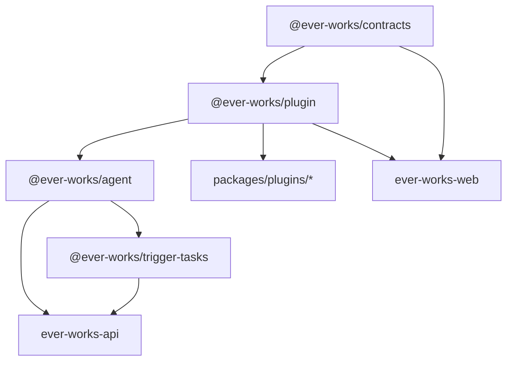

# Development Workflow

This guide covers day-to-day development commands, debugging strategies, and code quality practices for working on the Ever Works Platform.

## Development Commands

All commands are run from the **monorepo root** unless otherwise noted. Turborepo orchestrates task execution across all workspace packages.

### Starting Dev Servers

```bash
# Start everything (API + Web + packages in watch mode)
pnpm dev

# Start only the API (NestJS, port 3100)
pnpm dev:api

# Start only the Web dashboard (Next.js, port 3000)
pnpm dev:web

# Start individual apps
pnpm dev:apps          # All apps/* in parallel

# Start the Trigger.dev dev server (background jobs)
pnpm dev:trigger
```

Under the hood, these map to Turborepo filters:

| Command | Turborepo Equivalent |
|---------|---------------------|
| `pnpm dev:api` | `turbo dev --filter=ever-works-api` |
| `pnpm dev:web` | `turbo dev --filter=ever-works-web` |
| `pnpm dev:trigger` | `turbo dev:trigger --filter=@ever-works/trigger-tasks` |

### Building

```bash
# Build everything (Turborepo handles dependency order via ^build)
pnpm build

# Build only apps
pnpm build:apps

# Build only shared packages
pnpm build:packages

# Build the plugin system and all plugins
pnpm build:plugins

# Build a single package
turbo build --filter=ever-works-api
turbo build --filter=@ever-works/agent
turbo build --filter=@ever-works/plugin
```

The `build` task in `turbo.json` declares `"dependsOn": ["^build"]`, which means Turborepo automatically builds dependencies before their consumers. Output directories (`dist/`, `build/`, `.next/`) are cached.

### Build Order

Turborepo resolves the dependency graph automatically. A typical build proceeds as follows:



## Hot-Reloading Behavior

### API (NestJS + SWC)

The API uses `nest start -b swc --watch`, which provides fast recompilation via SWC:

- File changes in `apps/api/src/` trigger automatic restart
- SWC compilation is significantly faster than the default TypeScript compiler
- Changes to workspace dependencies (e.g., `@ever-works/agent`) require rebuilding that package separately or restarting the dev server

### Web (Next.js + Turbopack)

The Web app uses `next dev --turbopack` for development:

- React Fast Refresh preserves component state on save
- Turbopack provides near-instant hot module replacement
- Server components recompile on file changes automatically
- Changes to `@ever-works/contracts` or `@ever-works/plugin` are picked up if those packages are also in watch mode

### Cross-Package Changes

When editing a shared package (e.g., `@ever-works/contracts`) while apps are running:

1. **Option A** -- Rebuild the package manually:
   ```bash
   turbo build --filter=@ever-works/contracts
   ```
   Then restart the consuming app.

2. **Option B** -- Run everything with `pnpm dev`, which starts all packages in dev/watch mode simultaneously.

## Debugging with VS Code

### API Debugging

The API supports the `--debug` flag for Node.js inspector:

```bash
# From the monorepo root
cd apps/api && pnpm start:debug
```

This runs `nest start -b swc --debug --watch`, which enables the Node.js debugger on port `9229`.

Create or update `.vscode/launch.json`:

```json
{
  "version": "0.2.0",
  "configurations": [
    {
      "name": "Attach to API",
      "type": "node",
      "request": "attach",
      "port": 9229,
      "restart": true,
      "sourceMaps": true,
      "skipFiles": ["<node_internals>/**"]
    },
    {
      "name": "Debug API Tests",
      "type": "node",
      "request": "launch",
      "runtimeExecutable": "pnpm",
      "runtimeArgs": ["test:debug"],
      "cwd": "${workspaceFolder}/apps/api",
      "console": "integratedTerminal"
    },
    {
      "name": "Debug Agent Tests",
      "type": "node",
      "request": "launch",
      "runtimeExecutable": "npx",
      "runtimeArgs": ["jest", "--runInBand", "${relativeFile}"],
      "cwd": "${workspaceFolder}/packages/agent",
      "console": "integratedTerminal"
    }
  ]
}
```

### Web Debugging

Next.js debugging works through the browser DevTools or VS Code:

```json
{
  "name": "Debug Web (Chrome)",
  "type": "chrome",
  "request": "launch",
  "url": "http://localhost:3000",
  "webRoot": "${workspaceFolder}/apps/web/src"
}
```

## Environment Variable Management

Environment files are scoped per app:

| File | Purpose | Committed? |
|------|---------|-----------|
| `apps/api/.env.example` | API template with all variables | Yes |
| `apps/api/.env` | Active API configuration | No |
| `apps/web/.env.example` | Web template with all variables | Yes |
| `apps/web/.env.local` | Active Web configuration | No |
| `.env.compose` | Docker Compose shared config | Yes (template) |

### Variable Precedence

- **API**: Loaded by `@nestjs/config` via `dotenv`. System environment variables take precedence over `.env` file values.
- **Web**: Loaded by Next.js. Variables prefixed with `NEXT_PUBLIC_` are available in the browser. Server-only variables (no prefix) are only accessible in server components and API routes.

### Switching Environments

For testing with different configurations:

```bash
# Use a specific env file
cp apps/api/.env.production apps/api/.env

# Or set inline
DATABASE_TYPE=postgres pnpm dev:api
```

## Working with Multiple Packages

A common workflow involves editing a shared package and an app simultaneously.

### Example: Editing `@ever-works/agent` + API

```bash
# Terminal 1: Watch and rebuild the agent package
cd packages/agent && pnpm dev

# Terminal 2: Start the API (will pick up agent changes on restart)
pnpm dev:api
```

### Example: Editing a Plugin

```bash
# Build and test a single plugin
cd packages/plugins/openai
pnpm build
pnpm test

# Run a specific test file
npx vitest run src/openai.spec.ts
```

## Testing

### Running Tests

```bash
# All tests across the monorepo
pnpm test

# API tests (Jest)
cd apps/api && pnpm test

# Agent package tests (Jest, 26 suites, 719+ tests)
cd packages/agent && pnpm test
cd packages/agent && pnpm test:watch    # Watch mode
cd packages/agent && pnpm test:cov      # With coverage

# Run a specific test pattern
cd packages/agent && npx jest --testPathPattern='generators'

# Plugin tests (Vitest)
cd packages/plugins/openai && pnpm test
cd packages/plugins/openai && npx vitest run src/openai.spec.ts
```

### Test Frameworks by Package

| Package | Framework | Config |
|---------|-----------|--------|
| `apps/api` | Jest | `jest.config.js` |
| `packages/agent` | Jest | `jest.config.js` with module name mappings |
| `packages/plugins/*` | Vitest | `vitest.config.ts` |

:::note
Some packages require their workspace dependencies to be built first. If you get import resolution errors, run `pnpm build` from the root before testing.
:::

## Code Quality Commands

### Linting

```bash
# Lint all packages
pnpm lint

# Lint a specific app
turbo lint --filter=ever-works-api
turbo lint --filter=ever-works-web
```

### Type-Checking

```bash
# Type-check all packages
pnpm type-check
```

### Formatting

Prettier is configured in the root `package.json` with these settings:

- Print width: **120**
- Indentation: **tabs** (width 4), except SCSS and YAML which use spaces (width 2)
- Single quotes, semicolons always, no trailing commas

```bash
# Format all files
pnpm format

# Check formatting without changing files
pnpm format:check
```

### Commit Conventions

Commits are enforced by **commitlint** with the Conventional Commits standard via Husky git hooks:

```
feat: add new directory template engine
fix: resolve JWT refresh token race condition
docs: update environment variable reference
refactor: extract plugin loader into separate module
test: add missing generator edge case tests
chore: bump turbo to 2.8.12
```

## Database Migrations

When modifying TypeORM entities, generate and run migrations from the `apps/api/` directory:

```bash
cd apps/api

# Generate a migration from entity changes
pnpm migration:generate src/migrations/AddUserPreferences

# Apply pending migrations
pnpm migration:run

# Revert the last migration
pnpm migration:revert

# Show migration status
pnpm migration:show
```

## Trigger.dev (Background Jobs)

For developing background tasks:

```bash
# Start the Trigger.dev dev server
pnpm dev:trigger

# Deploy tasks to Trigger.dev Cloud
pnpm deploy:trigger
```

## Next Steps

- [Environment Variables Reference](/environment-variables) -- Complete variable reference
- [Monorepo Structure](/monorepo-structure) -- Package organization and Turborepo config
- [Architecture](/architecture) -- System design and module boundaries
