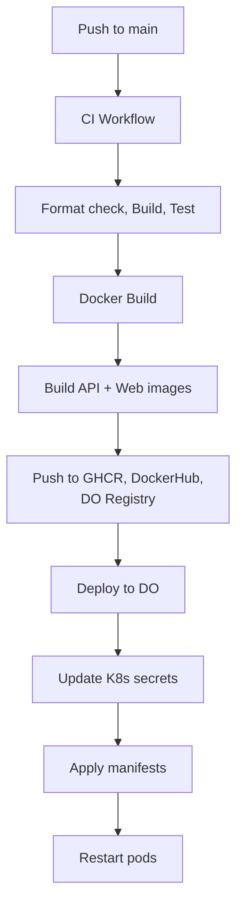

# CI/CD Pipeline

Ever Works uses GitHub Actions for continuous integration and deployment. The pipeline consists of three workflows that handle testing, Docker image building, and Kubernetes deployment.

## Workflow Overview

| Workflow                   | File                            | Trigger                                | Purpose                      |
| -------------------------- | ------------------------------- | -------------------------------------- | ---------------------------- |
| **CI**                     | `ci.yml`                        | Push/PR to `main`, `develop`, `stage`  | Lint, build, test            |
| **Docker Build & Publish** | `docker-build-publish-prod.yml` | Push to `main`                         | Build and push Docker images |
| **Deploy to DO Prod**      | `deploy-do-prod.yml`            | After Docker Build completes on `main` | Deploy to Kubernetes         |

## CI Workflow

**File**: `.github/workflows/ci.yml`

### Triggers

```yaml
on:
    push:
        branches: [main, develop, stage]
    pull_request:
        branches: [main, develop, stage]
    workflow_dispatch:
```

The CI workflow runs on every push and pull request to the three main branches, plus manual dispatch.

### Concurrency

```yaml
concurrency:
    group: ${{ github.workflow }}-${{ github.ref }}
    cancel-in-progress: true
```

Only one CI run per branch at a time. New pushes cancel in-progress runs on the same branch.

### Runner

```yaml
runs-on: ubicloud-standard-8
```

Uses Ubicloud runners (8-core) for faster builds compared to standard GitHub-hosted runners.

### Steps

| Step                  | Command                              | Purpose                          |
| --------------------- | ------------------------------------ | -------------------------------- |
| 1. Checkout           | `actions/checkout@v4`                | Clone repository                 |
| 2. Install pnpm       | `pnpm/action-setup@v3` (v10.13.1)    | Set up package manager           |
| 3. Setup Node.js      | `actions/setup-node@v4` (20.x)       | Configure Node with pnpm cache   |
| 4. Install deps       | `pnpm install --frozen-lockfile`     | Reproducible dependency install  |
| 5. Format check       | `pnpm format:check`                  | Verify Prettier formatting       |
| 6. Build              | `pnpm build`                         | Build all packages via Turborepo |
| 7. Test               | `pnpm test`                          | Run all test suites              |
| 8. Build Internal CLI | `pnpm build:cli` (apps/internal-cli) | Build internal CLI binary        |
| 9. Build External CLI | `pnpm build:cli` (apps/cli)          | Build public CLI binary          |
| 10. Test Internal CLI | `pnpm test:cli`                      | Verify internal CLI              |
| 11. Test External CLI | `pnpm test:cli`                      | Verify public CLI                |

The CLI build steps inject `API_URL` and `WEB_URL` secrets to embed production endpoints.

## Docker Build & Publish Workflow

**File**: `.github/workflows/docker-build-publish-prod.yml`

### Triggers

```yaml
on:
    push:
        branches: [main]
    workflow_dispatch:
```

Builds run on every push to `main` and can be manually triggered.

### Concurrency

```yaml
concurrency:
    group: ${{ github.ref }}-${{ github.workflow }}
    cancel-in-progress: true
```

### Permissions

```yaml
permissions:
    contents: read
    packages: write
```

The `packages: write` permission is required for pushing to GitHub Container Registry (GHCR).

### Build Jobs

The workflow defines two parallel jobs: `ever-works-api` and `ever-works-web`.

Each job follows the same pattern:

1. **Checkout** the repository.
2. **Set up QEMU** for multi-platform support.
3. **Set up Docker Buildx** for advanced build features.
4. **Build** the Docker image with multi-tag support.
5. **Push** to multiple registries.

### Multi-Registry Push

Each image is tagged for three registries:

| Registry                  | Tag Pattern                                            | Priority                                |
| ------------------------- | ------------------------------------------------------ | --------------------------------------- |
| GitHub Container Registry | `ghcr.io/ever-works/ever-works-api:latest`             | Primary (always succeeds)               |
| Docker Hub                | `everco/ever-works-api:latest`                         | Secondary (`continue-on-error: true`)   |
| DigitalOcean Registry     | `registry.digitalocean.com/ever/ever-works-api:latest` | Deployment target (`continue-on-error`) |

GHCR is the primary registry (authentication via `GITHUB_TOKEN`). Docker Hub and DigitalOcean registries use `continue-on-error: true` so builds succeed even if one push fails.

### Build Caching

```yaml
cache-from: type=registry,ref=ghcr.io/ever-works/ever-works-api:latest
cache-to: type=inline
```

Docker layer caching uses the previous GHCR image as a cache source, significantly speeding up rebuilds when only a few layers change.

### Platform

```yaml
platforms: linux/amd64
```

Currently builds for `linux/amd64` only. The QEMU setup enables future multi-architecture builds.

## Deploy to DigitalOcean Workflow

**File**: `.github/workflows/deploy-do-prod.yml`

### Trigger

```yaml
on:
    workflow_run:
        workflows: ['Build and Publish Docker Images Prod']
        branches: [main]
        types:
            - completed
```

This workflow runs automatically after the Docker build workflow completes on `main`. This creates a sequential pipeline: CI validates, Docker builds images, then deployment applies them.

### Environment

```yaml
environment:
    name: prod
    url: https://app.ever.works
```

Uses GitHub's environment feature for deployment protection rules and secrets isolation.

### Deployment Steps

| Step                            | Purpose                                                               |
| ------------------------------- | --------------------------------------------------------------------- |
| 1. Checkout                     | Access K8s manifests                                                  |
| 2. Install doctl                | DigitalOcean CLI for cluster access                                   |
| 3. Save kubeconfig              | Get short-lived (600s) K8s credentials                                |
| 4. Write PostgreSQL certificate | Decode and write the database CA certificate                          |
| 5. Generate TLS secrets         | Create Kubernetes TLS secrets for API and Web ingress                 |
| 6. Apply K8s manifests          | Use `envsubst` to inject secrets into manifests, then `kubectl apply` |
| 7. Restart pods                 | Rolling restart to pick up the new `:latest` images                   |

### TLS Secret Management

The workflow manages TLS certificates for two domains:

```bash
kubectl create secret tls api.ever.works-tls \
  --cert=${HOME}/ingress.api.crt \
  --key=${HOME}/ingress.api.key \
  -o yaml | kubectl apply -f -

kubectl create secret tls app.ever.works-tls \
  --cert=${HOME}/ingress.webapp.crt \
  --key=${HOME}/ingress.webapp.key \
  -o yaml | kubectl apply -f -
```

Uses `--dry-run=client` with `kubectl apply` to create-or-update the secrets idempotently.

### Environment Variable Injection

The K8s manifest template (`.deploy/k8s/k8s-manifest.prod.yaml`) uses `envsubst` to inject GitHub secrets:

```bash
envsubst < $GITHUB_WORKSPACE/.deploy/k8s/k8s-manifest.prod.yaml \
  | kubectl --context do-sfo2-k8s-gauzy apply -f -
```

Injected variables span all configuration areas: auth, database, OAuth providers, plugins, mail, monitoring, and Trigger.dev.

### Pod Restart Strategy

Since images use the `:latest` tag, the deployment uses rolling restarts to force pods to pull the new image:

```bash
kubectl rollout restart deployment/ever-works-api
kubectl rollout restart deployment/ever-works-web
```

## Pipeline Flow



## Required Secrets

| Category         | Secrets                                                                                                                                                               |
| ---------------- | --------------------------------------------------------------------------------------------------------------------------------------------------------------------- |
| **Docker Hub**   | `DOCKERHUB_USERNAME`, `DOCKERHUB_TOKEN`                                                                                                                               |
| **DigitalOcean** | `DIGITALOCEAN_ACCESS_TOKEN`                                                                                                                                           |
| **TLS**          | `INGRESS_API_CERT`, `INGRESS_API_CERT_KEY`, `INGRESS_WEBAPP_CERT`, `INGRESS_WEBAPP_CERT_KEY`                                                                          |
| **Database**     | `DATABASE_TYPE`, `DATABASE_URL`, `DATABASE_HOST`, `DATABASE_PORT`, `DATABASE_USERNAME`, `DATABASE_PASSWORD`, `DATABASE_NAME`, `DATABASE_SSL_MODE`, `DATABASE_CA_CERT` |
| **Auth**         | `JWT_SECRET`, `AUTH_SECRET`, `GH_CLIENT_ID`, `GH_CLIENT_SECRET`, `GOOGLE_CLIENT_ID`, `GOOGLE_CLIENT_SECRET`                                                           |
| **Plugins**      | `PLUGIN_OPENROUTER_API_KEY`, `PLUGIN_GITHUB_CLIENT_ID`, `PLUGIN_TAVILY_API_KEY`, etc.                                                                                 |
| **Mail**         | `MAILER_PROVIDER`, `SMTP_HOST`, `SMTP_PORT`, `SMTP_USER`, `SMTP_PASSWORD`, `RESEND_APIKEY`                                                                            |
| **Trigger.dev**  | `TRIGGER_ENABLED`, `TRIGGER_SECRET_KEY`, `TRIGGER_INTERNAL_SECRET`                                                                                                    |
| **CLI**          | `API_URL`, `WEB_URL`                                                                                                                                                  |
