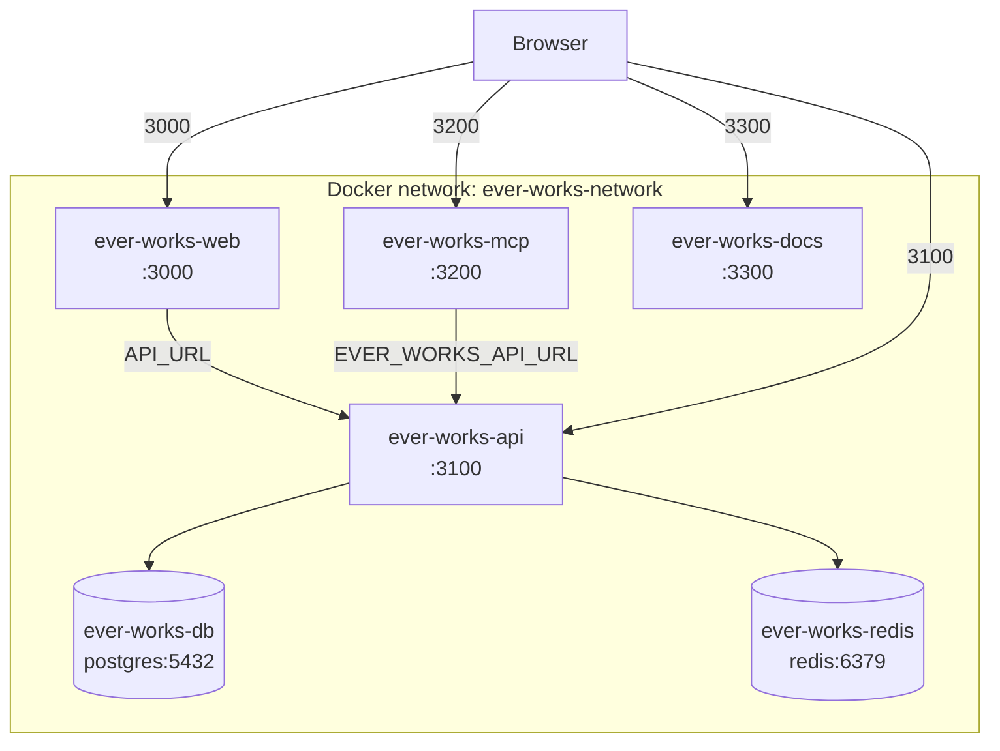

# Docker Compose Setup

Ever Works ships five layered Compose files at the repository root, so you can pick the right stack for what you're doing:

| File                         | Purpose                                                                 | Use when                                                          |
| ---------------------------- | ----------------------------------------------------------------------- | ----------------------------------------------------------------- |
| `docker-compose.demo.yml`    | Minimal SQLite showcase, pre-built images. No infra deps.               | First-time evaluator, "clone and run" to kick the tires.          |
| `docker-compose.infra.yml`   | PostgreSQL + Redis only. No application services.                       | Running the platform apps locally with `pnpm dev` against real deps. |
| `docker-compose.yml`         | Full platform from pre-built GHCR images + bundled Postgres/Redis.      | Production-shaped self-host, no local Docker build.               |
| `docker-compose.build.yml`   | Same as above, but builds api/web/mcp/docs from source.                 | Hacking on the apps, or building your own registry images.        |
| `docker-compose.trigger.yml` | Optional self-hosted Trigger.dev (profile-gated, off by default).       | Local Trigger.dev webapp for background jobs.                     |

The infra file is `include:`d by both `docker-compose.yml` and `docker-compose.build.yml`, so Postgres and Redis come up automatically with either flavour.

## Quick start (demo path)

```bash
git clone https://github.com/ever-works/ever-works.git
cd ever-works

docker compose -f docker-compose.demo.yml --env-file .env.demo.compose up -d
open http://localhost:3000
```

That's it. SQLite, no Redis, no Trigger.dev. Ports: web on `3000`, API on `3100`, MCP on `3200`, docs on `3300`.

## Quick start (full stack from GHCR)

```bash
cp .env.compose .env                       # optional — edit secrets first
docker compose up -d                       # uses docker-compose.yml + infra
open http://localhost:3000
```

Defaults match `docker-compose.infra.yml`:

- Postgres on `localhost:5432`, db `ever_works`, user `postgres`, password `ever_works_password`.
- Redis on `localhost:6379`.

Override anything via `.env.compose` or shell env before launch. For a non-trivial deployment, **rotate every default password and secret** before exposing the host publicly.

## Build from source

```bash
docker compose -f docker-compose.build.yml up --build -d
```

Same services as `docker-compose.yml`, but each application image is built from the Dockerfiles under `.deploy/docker/`. The build context is the monorepo root so `turbo prune` can see every workspace. First build takes a few minutes; layer caching makes subsequent builds fast.

## Just the infra (run platform apps with `pnpm dev`)

```bash
docker compose -f docker-compose.infra.yml --env-file .env.compose up -d

# In another terminal, run the apps natively against the containers
pnpm install
pnpm dev
```

The apps will reach Postgres at `localhost:5432` and Redis at `localhost:6379` using the values in `.env.compose`.

## Optional: self-hosted Trigger.dev

By default, the platform talks to **Trigger.dev Cloud** at `https://api.trigger.dev` — recommended for most setups. Sign up, mint a project token, and set `TRIGGER_SECRET_KEY` in `.env.compose`.

If you'd rather self-host the Trigger.dev webapp alongside the platform:

```bash
docker compose \
    -f docker-compose.yml -f docker-compose.trigger.yml \
    --profile trigger up -d

open http://localhost:3040                 # Trigger.dev webapp
```

The `trigger` Compose profile keeps the Trigger.dev services (webapp, its own Postgres on `5433`, its own Redis on `6389`) off unless you opt in. Update `.env.compose` to flip `TRIGGER_ENABLED=true`, set `TRIGGER_API_URL=http://ever-works-trigger-webapp:3000`, and replace the placeholder `TRIGGER_*_SECRET` / `TRIGGER_ENCRYPTION_KEY` values with `openssl rand -hex 32` output.

For a full production self-host (workers on separate machines, ClickHouse, object storage), follow the upstream guide at <https://trigger.dev/docs/self-hosting/docker>. The file here is intentionally minimal — sufficient for local development of background jobs, not a substitute for the official template.

## Services

### `ever-works-api`

NestJS REST API. Listens on `3100`. Reads `.env.compose` for all backing-service config — the compose file only hardcodes the container's *role* (`APP_TYPE=api`, `PORT=3100`), so every DB / Redis / Trigger.dev knob below can be overridden by editing `.env.compose` (or shelling out an env var before `docker compose up`) without touching the compose YAML.

| Env var               | Default in `.env.compose`            | Notes                                                                    |
| --------------------- | ------------------------------------ | ------------------------------------------------------------------------ |
| `DATABASE_TYPE`       | `postgres`                           | Demo path overrides to `sqlite` via `.env.demo.compose`.                 |
| `DATABASE_HOST`       | `ever-works-db`                      | Compose service name. Point at a managed Postgres FQDN to swap.          |
| `DATABASE_PORT`       | `5432`                               |                                                                          |
| `DATABASE_USERNAME`   | `postgres`                           |                                                                          |
| `DATABASE_PASSWORD`   | `ever_works_password`                | **Replace before any non-local use.**                                    |
| `DATABASE_NAME`       | `ever_works`                         |                                                                          |
| `THROTTLER_REDIS_URL` | `redis://ever-works-redis:6379`      | Used by the distributed rate limiter (`apps/api`).                       |
| `REDIS_URL`           | `redis://ever-works-redis:6379`      | Used by BullMQ queues in `@ever-works/agent`.                            |
| `RUN_MIGRATIONS`      | `true`                               | Set to `false` if you run migrations out-of-band.                        |

### `ever-works-web`

Next.js dashboard. Listens on `3000`. Reaches the API via the Docker-internal hostname `ever-works-api:3100`.

### `ever-works-mcp`

Model Context Protocol server. Listens on `3200`. For tooling that needs structured access to platform data.

### `ever-works-docs`

Static Docusaurus site served via nginx. Listens on `3300` (mapped to container port `80`).

### `ever-works-db`

PostgreSQL 17 with a `pg_isready` healthcheck and a persistent named volume. Default credentials live in `.env.compose` — change them before exposing the host.

### `ever-works-redis`

Redis 7 with appendonly persistence. Backs the throttler and BullMQ.

### Trigger.dev (profile-gated)

`ever-works-trigger-webapp`, `ever-works-trigger-db`, `ever-works-trigger-redis`. All sit behind the `trigger` profile; nothing starts unless `--profile trigger` is passed.

## Network architecture



When the `trigger` profile is active, three more containers join `ever-works-network`: the Trigger.dev webapp (`3040`), its dedicated Postgres (`5433`), and its dedicated Redis (`6389`). They use separate ports to avoid colliding with the platform's own Postgres/Redis.

## Volumes

| Volume                    | Mount                                      | File                          |
| ------------------------- | ------------------------------------------ | ----------------------------- |
| `postgres_data`           | `/var/lib/postgresql/data/`                | infra                         |
| `redis_data`              | `/data`                                    | infra                         |
| `api_data`                | `/app/apps/api/data` (SQLite)              | demo                          |
| `trigger_postgres_data`   | `/var/lib/postgresql/data/`                | trigger (profile)             |
| `trigger_redis_data`      | `/data`                                    | trigger (profile)             |

Named volumes survive `docker compose down`. Wipe them with `docker compose down -v`.

## Environment files

| File                  | Paired compose file                                   | Defaults to              |
| --------------------- | ----------------------------------------------------- | ------------------------ |
| `.env.compose`        | `docker-compose.yml`, `docker-compose.build.yml`      | Postgres + Redis         |
| `.env.demo.compose`   | `docker-compose.demo.yml`                             | SQLite, no Redis         |

Both files are committed with placeholder secrets — replace them before any non-local use. Compose loads variables with this priority (highest first):

1. Inline `environment:` block in the compose file (kept deliberately minimal — only the values that genuinely define container role, like `APP_TYPE` / `PORT`, so they can't be accidentally overridden).
2. Shell-exported env vars (e.g. `DATABASE_HOST=managed.db.example.com docker compose up`).
3. The `env_file:` specified in the service (`.env.compose` or `.env.demo.compose` here).
4. `.env` next to the compose file (if present).
5. Defaults in the application code.

The practical effect: every backing-service knob (`DATABASE_*`, `REDIS_URL`, `THROTTLER_REDIS_URL`, `RUN_MIGRATIONS`, `WEB_URL`, all `TRIGGER_*`, ...) lives in `.env.compose` and can be repointed at managed Postgres / managed Redis / Trigger.dev Cloud by editing that file alone — no compose-YAML changes required.

## Production checklist

Before exposing the stack to the internet:

1. **Rotate every default secret** — `DATABASE_PASSWORD`, `AUTH_SECRET`, all `TRIGGER_*_SECRET`, `TRIGGER_ENCRYPTION_KEY`. Use `openssl rand -hex 32`.
2. **Pin image tags** — replace `:latest` with a specific version (e.g. `ghcr.io/ever-works/ever-works-api:v1.2.3`).
3. **Add health checks on the application services**, not just the infra ones.
4. **Front the stack with a TLS-terminating reverse proxy** — Traefik, nginx, Caddy.
5. **Move state off named volumes** if you need backups — bind-mount to a managed disk, or use a managed Postgres/Redis and remove the bundled ones from infra compose.
6. **Use Trigger.dev Cloud** rather than the bundled self-hosted webapp, unless you have a specific reason to self-host.

## Common operations

```bash
# Default stack (Postgres + Redis + apps from GHCR)
docker compose up -d
docker compose logs -f
docker compose ps

# Demo stack (SQLite)
docker compose -f docker-compose.demo.yml --env-file .env.demo.compose up -d

# Build flavour
docker compose -f docker-compose.build.yml up --build -d

# Just the deps
docker compose -f docker-compose.infra.yml up -d

# Full stack + self-hosted Trigger.dev
docker compose -f docker-compose.yml -f docker-compose.trigger.yml --profile trigger up -d

# Pull newer images
docker compose pull && docker compose up -d

# Shell into the API
docker compose exec ever-works-api sh

# Stop and wipe everything (including volumes)
docker compose down -v
```

## Troubleshooting

| Symptom                                       | Likely cause                                                | Fix                                                                                        |
| --------------------------------------------- | ----------------------------------------------------------- | ------------------------------------------------------------------------------------------ |
| Web shows "Unable to connect to API"          | API still starting up                                       | `docker compose logs -f ever-works-api`. Healthcheck on `ever-works-db` may still be amber. |
| API exits with `ECONNREFUSED 127.0.0.1:6379`  | Stale `REDIS_URL` pointing at localhost                     | Confirm `REDIS_URL=redis://ever-works-redis:6379` in the running container's env.          |
| Port already in use                           | Another local service on 3000/3100/5432/6379                | Remap the host side: `'3001:3000'` in the compose file, or stop the conflicting process.   |
| `pg_isready` healthcheck never goes green     | Custom `DATABASE_USERNAME` not matched in healthcheck cmd   | The healthcheck uses `$POSTGRES_USER`/`$POSTGRES_DB` — both come from the env, so make sure your overrides are consistent. |
| Trigger.dev webapp 500s on first login        | Placeholder `TRIGGER_ENCRYPTION_KEY` still 32 ASCII chars   | Regenerate: `openssl rand -hex 32` and bounce the webapp container.                        |
| `RUN_MIGRATIONS=true` with SQLite fails       | Migration script targets Postgres/MySQL                     | Set `RUN_MIGRATIONS=false` in `.env.demo.compose` (already the default there).             |
