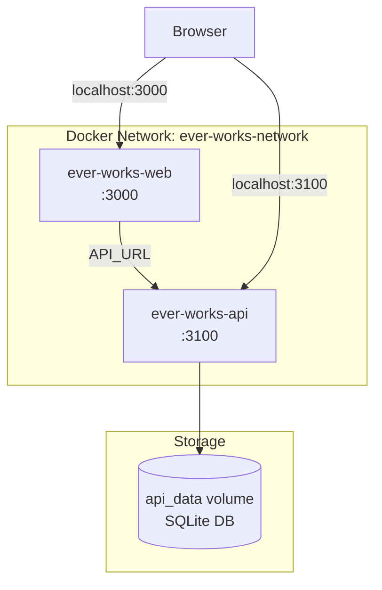

# Docker Compose Setup

Ever Works provides a `compose.yaml` at the repository root for running the entire platform with a single command. The Compose file defines two services backed by pre-built container images published to the GitHub Container Registry.

## Quick Start

```bash
# 1. Clone the repository
git clone https://github.com/ever-works/ever-works.git
cd ever-works

# 2. Create your environment file
cp .env.compose .env.compose.local   # optional -- edit as needed

# 3. Start all services
docker compose up -d

# 4. Open the dashboard
open http://localhost:3000
```

The API is available at `http://localhost:3100` and the web dashboard at `http://localhost:3000`.

## Compose File Reference

The full `compose.yaml` at the project root:

```yaml
services:
    ever-works-api:
        image: ghcr.io/ever-works/ever-works-api:latest
        container_name: ever-works-api
        ports:
            - '3100:3100'
        networks:
            - ever-works-network
        environment:
            - DATABASE_TYPE=sqlite
            - DATABASE_PATH=/app/apps/api/data/database.db
        volumes:
            - api_data:/app/apps/api/data
        env_file: .env.compose

    ever-works-web:
        image: ghcr.io/ever-works/ever-works-web:latest
        container_name: ever-works-web
        ports:
            - '3000:3000'
        depends_on:
            - ever-works-api
        environment:
            - API_URL=http://ever-works-api:3100
        networks:
            - ever-works-network
        env_file: .env.compose

networks:
    ever-works-network:
        driver: bridge

volumes:
    api_data:
```

## Services

### ever-works-api

The NestJS REST API backend.

| Property     | Value                                      | Description                                        |
| ------------ | ------------------------------------------ | -------------------------------------------------- |
| **Image**    | `ghcr.io/ever-works/ever-works-api:latest` | Pre-built API image from GitHub Container Registry |
| **Port**     | `3100:3100`                                | API listens on port 3100                           |
| **Database** | SQLite (default)                           | Persisted to a named volume                        |
| **Volume**   | `api_data:/app/apps/api/data`              | Persists the SQLite database and generated assets  |
| **Network**  | `ever-works-network`                       | Bridge network for inter-service communication     |

The API service uses SQLite by default with the database file stored at `/app/apps/api/data/database.db` inside the container. The `api_data` named volume ensures data persists across container restarts.

### ever-works-web

The Next.js web dashboard frontend.

| Property       | Value                                      | Description                                        |
| -------------- | ------------------------------------------ | -------------------------------------------------- |
| **Image**      | `ghcr.io/ever-works/ever-works-web:latest` | Pre-built web image from GitHub Container Registry |
| **Port**       | `3000:3000`                                | Dashboard listens on port 3000                     |
| **Dependency** | `ever-works-api`                           | Waits for the API service to start first           |
| **API_URL**    | `http://ever-works-api:3100`               | Internal Docker network URL to reach the API       |
| **Network**    | `ever-works-network`                       | Same bridge network as the API                     |

The `API_URL` environment variable is set to the Docker-internal hostname `ever-works-api` so that server-side rendering can reach the API without going through the host network.

## Network Architecture



Both services share the `ever-works-network` bridge network, allowing them to communicate by container name. The web service addresses the API as `http://ever-works-api:3100` internally.

## Volumes

| Volume     | Mount Point          | Purpose                                     |
| ---------- | -------------------- | ------------------------------------------- |
| `api_data` | `/app/apps/api/data` | SQLite database file and any generated data |

The named volume `api_data` is managed by Docker and survives `docker compose down`. To completely reset data, remove the volume explicitly:

```bash
docker compose down -v   # removes containers AND volumes
```

## Environment Variables

Both services load environment variables from the `.env.compose` file via the `env_file` directive. The inline `environment` block provides overrides that take precedence.

### Priority Order

1. Inline `environment` values (highest priority)
2. `.env.compose` file values
3. Default values in the application code

### Key Variables

| Variable        | Service | Default                          | Description                                     |
| --------------- | ------- | -------------------------------- | ----------------------------------------------- |
| `DATABASE_TYPE` | API     | `sqlite`                         | Database engine (`sqlite`, `postgres`, `mysql`) |
| `DATABASE_PATH` | API     | `/app/apps/api/data/database.db` | Path to the SQLite database file                |
| `API_URL`       | Web     | `http://ever-works-api:3100`     | API endpoint for server-side requests           |
| `WEB_URL`       | Both    | `http://localhost:3000`          | Public URL of the web dashboard                 |
| `PORT`          | API     | `3100`                           | Port the API listens on                         |
| `JWT_SECRET`    | API     | (required)                       | Secret key for JWT token signing                |
| `AUTH_SECRET`   | Web     | (required)                       | Secret for cookie encryption                    |

See the [Environment Management](./environment-management.md) page for the complete variable reference.

## Using PostgreSQL Instead of SQLite

To switch from SQLite to PostgreSQL, add a PostgreSQL service and update the API environment:

```yaml
services:
    ever-works-db:
        image: postgres:16-alpine
        container_name: ever-works-db
        environment:
            POSTGRES_DB: ever_works
            POSTGRES_USER: postgres
            POSTGRES_PASSWORD: your_secure_password
        volumes:
            - db_data:/var/lib/postgresql/data
        networks:
            - ever-works-network
        ports:
            - '5432:5432'

    ever-works-api:
        image: ghcr.io/ever-works/ever-works-api:latest
        container_name: ever-works-api
        ports:
            - '3100:3100'
        depends_on:
            - ever-works-db
        networks:
            - ever-works-network
        environment:
            - DATABASE_TYPE=postgres
            - DATABASE_HOST=ever-works-db
            - DATABASE_PORT=5432
            - DATABASE_USERNAME=postgres
            - DATABASE_PASSWORD=your_secure_password
            - DATABASE_NAME=ever_works
        env_file: .env.compose

    ever-works-web:
        # ... same as before

volumes:
    db_data:
```

## Development vs Production

### Development Setup

For local development, you typically run services directly with `pnpm dev` rather than Docker. However, you can use Compose to run just the database:

```bash
# Start only the database
docker compose up ever-works-db -d

# Run API and web locally
pnpm dev
```

### Production Considerations

For production deployments, apply these changes:

1. **Set strong secrets**: Replace all placeholder values for `JWT_SECRET`, `AUTH_SECRET`, and database passwords.

2. **Use a persistent database**: Switch from SQLite to PostgreSQL for better concurrency and reliability.

3. **Pin image versions**: Replace `latest` with specific version tags:

    ```yaml
    image: ghcr.io/ever-works/ever-works-api:v1.2.3
    ```

4. **Add health checks**:

    ```yaml
    ever-works-api:
        healthcheck:
            test: ['CMD', 'curl', '-f', 'http://localhost:3100/api/health']
            interval: 30s
            timeout: 10s
            retries: 3
    ```

5. **Configure restart policies**:

    ```yaml
    ever-works-api:
        restart: unless-stopped
    ```

6. **Use a reverse proxy**: Place Nginx or Traefik in front for TLS termination:
    ```yaml
    reverse-proxy:
        image: traefik:v3
        ports:
            - '80:80'
            - '443:443'
    ```

## Common Operations

```bash
# Start all services in the background
docker compose up -d

# View logs for all services
docker compose logs -f

# View logs for a specific service
docker compose logs -f ever-works-api

# Stop all services (preserves data)
docker compose down

# Stop and remove all data
docker compose down -v

# Rebuild after image updates
docker compose pull && docker compose up -d

# Check service status
docker compose ps

# Execute a command inside the API container
docker compose exec ever-works-api sh

# View the SQLite database
docker compose exec ever-works-api cat /app/apps/api/data/database.db | sqlite3
```

## Troubleshooting

| Issue                                | Cause                        | Solution                                                 |
| ------------------------------------ | ---------------------------- | -------------------------------------------------------- |
| Web shows "Unable to connect to API" | API not yet ready            | Check API logs with `docker compose logs ever-works-api` |
| Port 3000 already in use             | Another process on port 3000 | Change the port mapping: `'3001:3000'`                   |
| Database is empty after restart      | Volume not mounted           | Ensure `api_data` volume is defined and mapped           |
| Container exits immediately          | Missing required env vars    | Check `.env.compose` has `JWT_SECRET` set                |
| Permission denied on volume          | Docker file permissions      | Run `docker compose down -v` and restart                 |
