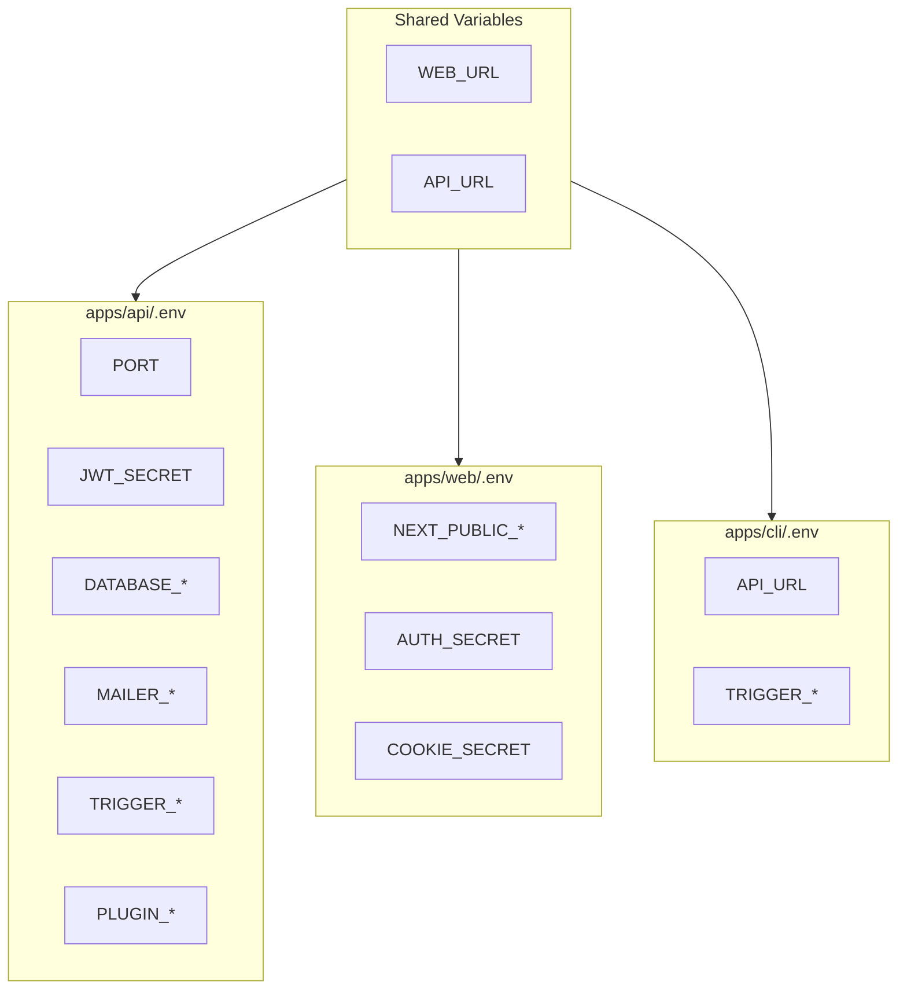
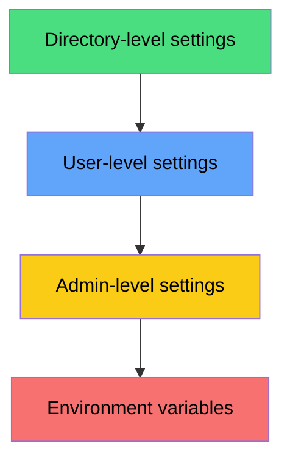

# Environment Management

Ever Works uses environment variables extensively to configure every aspect of the platform -- from database connections and authentication to plugin API keys and billing. This page documents the env file structure, variable categories, and how configuration flows across the monorepo.

## Environment File Structure

The monorepo contains multiple `.env` files, each scoped to a specific application:

```
platform/
  .env.compose          # Docker Compose shared config
  apps/
    api/
      .env              # API runtime config (gitignored)
      .env.example      # API reference template
    web/
      .env              # Web runtime config (gitignored)
      .env.example      # Web reference template
    cli/
      .env              # CLI runtime config (gitignored)
      .env.example      # CLI reference template
```

### File Conventions

| File | Committed | Purpose |
|---|---|---|
| `.env.example` | Yes | Template with all supported variables and documentation |
| `.env` | No (gitignored) | Local runtime values for development |
| `.env.compose` | Yes | Default values for Docker Compose deployment |
| `.env.local` | No (gitignored) | Next.js local overrides for the web app |

## Variable Flow Across Apps



## API Environment Variables

The API (`apps/api/.env.example`) is the most configuration-heavy app.

### Core Configuration

| Variable | Default | Description |
|---|---|---|
| `APP_TYPE` | `api` | Application type identifier |
| `PORT` | `3100` | HTTP port for the API server |
| `HTTP_DEBUG` | `false` | Enable HTTP request/response logging |
| `WEB_URL` | `http://localhost:3000` | Public URL of the web dashboard |
| `ALLOWED_ORIGINS` | `http://localhost:3000,http://localhost:3001` | CORS allowed origins (comma-separated) |

### JWT Authentication

| Variable | Default | Description |
|---|---|---|
| `JWT_SECRET` | (required) | Secret key for signing JWT access tokens |
| `JWT_ACCESS_TOKEN_EXPIRATION` | `7d` | Access token lifetime (`15m`, `1h`, `7d`, or `never`) |
| `JWT_REFRESH_TOKEN_EXPIRATION_DAYS` | `14` | Refresh token lifetime in days (or `never`) |
| `JWT_DISABLE_EXPIRATION` | `false` | Disable all token expiration (development only) |

### OAuth Providers

| Variable | Default | Description |
|---|---|---|
| `GH_CLIENT_ID` | (empty) | GitHub OAuth app client ID |
| `GH_CLIENT_SECRET` | (empty) | GitHub OAuth app client secret |
| `GH_CALLBACK_URL` | `${WEB_URL}/api/oauth/github/callback` | GitHub OAuth callback URL |
| `GOOGLE_CLIENT_ID` | (empty) | Google OAuth client ID |
| `GOOGLE_CLIENT_SECRET` | (empty) | Google OAuth client secret |
| `GOOGLE_CALLBACK_URL` | `${WEB_URL}/api/oauth/google/callback` | Google OAuth callback URL |

### Database Configuration

The API supports three database engines. Set `DATABASE_TYPE` to select one:

| Variable | Default | Description |
|---|---|---|
| `DATABASE_TYPE` | `sqlite` | Engine: `sqlite`, `postgres`, or `mysql` |
| `DATABASE_LOGGING` | `false` | Enable SQL query logging |
| `DATABASE_SSL_MODE` | `false` | Enable SSL/TLS for database connections |
| `DATABASE_CA_CERT` | (empty) | CA certificate for SSL connections |

#### SQLite-specific

| Variable | Default | Description |
|---|---|---|
| `DATABASE_PATH` | `./data/database.db` | Path to the SQLite database file |
| `DATABASE_IN_MEMORY` | `true` (dev) | Force in-memory database |

#### PostgreSQL-specific

| Variable | Default | Description |
|---|---|---|
| `DATABASE_HOST` | `localhost` | PostgreSQL host |
| `DATABASE_PORT` | `5432` | PostgreSQL port |
| `DATABASE_USERNAME` | `postgres` | Database user |
| `DATABASE_PASSWORD` | (required) | Database password |
| `DATABASE_NAME` | `ever_works` | Database name |
| `DATABASE_URL` | (empty) | Full connection URL (overrides individual fields) |

#### MySQL-specific

| Variable | Default | Description |
|---|---|---|
| `DATABASE_HOST` | `localhost` | MySQL host |
| `DATABASE_PORT` | `3306` | MySQL port |
| `DATABASE_USERNAME` | `root` | Database user |
| `DATABASE_PASSWORD` | (required) | Database password |
| `DATABASE_NAME` | `ever_works` | Database name |

### Email / Mailer

| Variable | Default | Description |
|---|---|---|
| `MAILER_PROVIDER` | `none` | Mail provider: `smtp`, `none`, or `resend` |
| `EMAIL_FROM` | `Ever Works <ever@ever.works>` | Sender address |
| `SMTP_HOST` | `smtp.gmail.com` | SMTP server host |
| `SMTP_PORT` | `587` | SMTP server port |
| `SMTP_USER` | (required) | SMTP username |
| `SMTP_PASSWORD` | (required) | SMTP password |
| `SMTP_SECURE` | `false` | Use TLS for SMTP |
| `RESEND_APIKEY` | (empty) | Resend API key |
| `RESEND_EMAIL_FROM` | (empty) | Resend sender address |

### Trigger.dev (Background Jobs)

| Variable | Default | Description |
|---|---|---|
| `TRIGGER_ENABLED` | `false` | Enable Trigger.dev integration |
| `TRIGGER_SECRET_KEY` | (empty) | Trigger.dev project secret key |
| `TRIGGER_API_URL` | `https://api.trigger.dev` | Trigger.dev API endpoint |
| `TRIGGER_INTERNAL_SECRET` | (empty) | Secret for internal Trigger.dev webhook |
| `TRIGGER_MACHINE` | (empty) | Machine size (`micro`, `small-1x`, `medium-1x`, `large-1x`) |
| `TRIGGER_INTERNAL_API_URL` | `http://localhost:3100/internal/trigger` | Internal API endpoint for Trigger.dev workers |

### Subscriptions and Billing

| Variable | Default | Description |
|---|---|---|
| `SUBSCRIPTIONS_ENABLED` | `false` | Enable subscription management |
| `BILLING_DEFAULT_CURRENCY` | `usd` | Default billing currency |
| `SUBSCRIPTIONS_DEFAULT_PLAN` | `free` | Default subscription plan |
| `STRIPE_SECRET_KEY` | (empty) | Stripe API secret key |
| `STRIPE_WEBHOOK_SECRET` | (empty) | Stripe webhook signing secret |
| `PAY_PER_USE_PRICE_USD` | `5` | Pay-per-use pricing |

### Plugin Environment Variables

Plugins can read API keys from environment variables. The convention is `PLUGIN_<NAME>_<KEY>`:

| Variable | Plugin | Description |
|---|---|---|
| `PLUGIN_TAVILY_API_KEY` | Tavily | Tavily search API key |
| `PLUGIN_SCREENSHOTONE_ACCESS_KEY` | ScreenshotOne | Screenshot service access key |
| `PLUGIN_SCREENSHOTONE_SECRET_KEY` | ScreenshotOne | Screenshot service secret key |
| `PLUGIN_OPENROUTER_API_KEY` | OpenRouter | OpenRouter API key |
| `PLUGIN_OPENROUTER_DEFAULT_MODEL` | OpenRouter | Default model identifier |
| `PLUGIN_GITHUB_CLIENT_ID` | GitHub Plugin | Plugin-specific GitHub OAuth client ID |
| `PLUGIN_GITHUB_CLIENT_SECRET` | GitHub Plugin | Plugin-specific GitHub OAuth secret |

### Scheduled Updates

| Variable | Default | Description |
|---|---|---|
| `SCHEDULED_UPDATES_ENABLED` | `true` | Enable scheduled directory updates |
| `SCHEDULED_UPDATES_DISPATCH_INTERVAL_MINUTES` | `5` | Dispatch check interval |
| `SCHEDULED_UPDATES_MAX_BATCH` | `25` | Max directories to update per batch |
| `SCHEDULED_UPDATES_MAX_FAILURE_BEFORE_PAUSE` | `3` | Failures before pausing a directory |

## Web Environment Variables

The web app (`apps/web/.env.example`) uses the `NEXT_PUBLIC_` prefix for client-exposed variables.

### Application Settings

| Variable | Default | Description |
|---|---|---|
| `APP_NAME` | `Ever Works` | Application display name |
| `NEXT_PUBLIC_WEB_URL` | `http://localhost:3000` | Public web app URL |
| `API_URL` | `http://localhost:3100` | API endpoint (server-side only) |
| `AUTH_SECRET` / `COOKIE_SECRET` | (required) | Cookie encryption secret |

### Site Branding (Multi-tenant)

| Variable | Default | Description |
|---|---|---|
| `NEXT_PUBLIC_SITE_NAME` | `Ever Works` | Site display name |
| `NEXT_PUBLIC_SITE_TITLE` | `Ever Works` | HTML title / SEO title |
| `NEXT_PUBLIC_SITE_DESCRIPTION` | `Build Directories with AI` | Meta description |
| `NEXT_PUBLIC_SITE_KEYWORDS` | `Ever Works,Directories,AI,...` | Meta keywords |
| `NEXT_PUBLIC_LOGO_LIGHT` | `/logo-light.png` | Logo for light mode |
| `NEXT_PUBLIC_LOGO_DARK` | `/logo-ever-work.png` | Logo for dark mode |
| `NEXT_PUBLIC_FAVICON_LIGHT` | `/favicon-light.png` | Favicon for light mode |
| `NEXT_PUBLIC_FAVICON_DARK` | `/favicon-dark.png` | Favicon for dark mode |

### Internationalization

| Variable | Default | Description |
|---|---|---|
| `NEXT_PUBLIC_LOCALES` | `en,ar,de,es,fr,zh` | Supported locales (comma-separated) |
| `NEXT_PUBLIC_DEFAULT_LOCALE` | `en` | Default locale |

## CLI Environment Variables

The CLI (`apps/cli/.env.example`) needs minimal configuration:

| Variable | Default | Description |
|---|---|---|
| `NODE_ENV` | `production` | Node environment |
| `CLI_VERBOSE` | `false` | Enable verbose logging |
| `API_URL` | `http://localhost:3100` | API endpoint |
| `WEB_URL` | `http://localhost:3000` | Web app URL |
| `TRIGGER_*` | (various) | Same Trigger.dev variables as the API |

## Environment Profiles

### Development

```bash
# apps/api/.env
DATABASE_TYPE=sqlite
DATABASE_IN_MEMORY=true
MAILER_PROVIDER=none
JWT_DISABLE_EXPIRATION=true
HTTP_DEBUG=true
TRIGGER_ENABLED=false
```

### Staging

```bash
# apps/api/.env
DATABASE_TYPE=postgres
DATABASE_HOST=staging-db.internal
MAILER_PROVIDER=resend
JWT_ACCESS_TOKEN_EXPIRATION=1h
TRIGGER_ENABLED=true
SUBSCRIPTIONS_ENABLED=false
```

### Production

```bash
# apps/api/.env
DATABASE_TYPE=postgres
DATABASE_HOST=prod-db.internal
DATABASE_SSL_MODE=true
MAILER_PROVIDER=resend
JWT_ACCESS_TOKEN_EXPIRATION=15m
JWT_REFRESH_TOKEN_EXPIRATION_DAYS=7
TRIGGER_ENABLED=true
SUBSCRIPTIONS_ENABLED=true
STRIPE_SECRET_KEY=sk_live_...
```

## Plugin Settings Resolution

Plugin settings are resolved through a 4-level hierarchy (highest priority first):



1. **Directory-level**: Per-directory overrides set in the directory plugin settings modal
2. **User-level**: User's personal settings for a plugin (e.g., their own API key)
3. **Admin-level**: Platform-wide defaults set by the administrator
4. **Environment variable**: Fallback from `PLUGIN_*` env vars defined in `.env`

Plugins declare which env var maps to a setting using the `x-envVar` schema extension:

```json
{
    "apiKey": {
        "type": "string",
        "x-secret": true,
        "x-envVar": "PLUGIN_TAVILY_API_KEY"
    }
}
```

## Security Best Practices

- **Never commit `.env` files** -- they are gitignored by default.
- **Use `.env.example` as the template** -- copy it to `.env` and fill in real values.
- **Rotate secrets regularly** -- especially `JWT_SECRET`, `AUTH_SECRET`, and API keys.
- **Use different secrets per environment** -- never share production secrets with development.
- **Mark sensitive plugin settings** with `x-secret: true` so the UI masks them.
- **Prefix client-safe variables** with `NEXT_PUBLIC_` -- all other web variables are server-side only.
