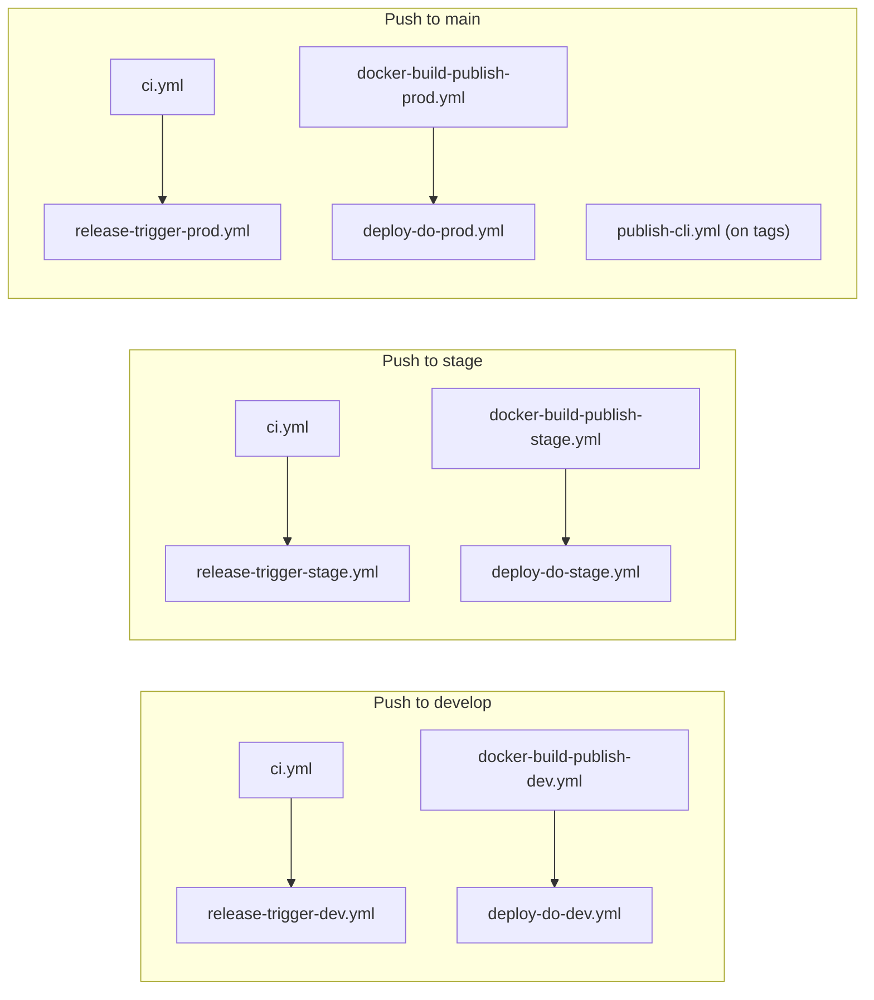
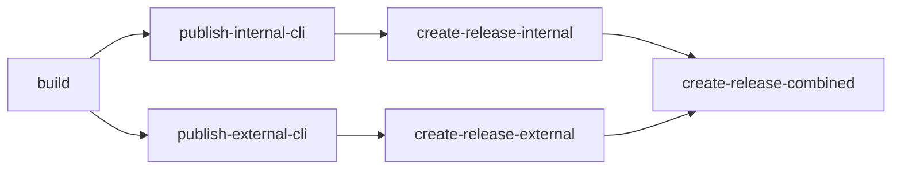

# GitHub Workflows Deep Dive

The Ever Works platform uses 11 GitHub Actions workflow files in `.github/workflows/` to automate CI, Docker image builds, Kubernetes deployments, CLI publishing, and Trigger.dev deployments across three environments (dev, stage, prod).

## Workflow Inventory

| Workflow File                    | Name                                  | Trigger                         | Purpose                       |
| -------------------------------- | ------------------------------------- | ------------------------------- | ----------------------------- |
| `ci.yml`                         | CI                                    | Push/PR to main, develop, stage | Lint, build, test             |
| `docker-build-publish-dev.yml`   | Build and Publish Docker Images Dev   | Push to develop                 | Build Docker images for dev   |
| `docker-build-publish-stage.yml` | Build and Publish Docker Images Stage | Push to stage                   | Build Docker images for stage |
| `docker-build-publish-prod.yml`  | Build and Publish Docker Images Prod  | Push to main                    | Build Docker images for prod  |
| `deploy-do-dev.yml`              | Deploy to DO Dev                      | After Docker Dev completes      | Deploy to K8s dev             |
| `deploy-do-stage.yml`            | Deploy to DO Stage                    | After Docker Stage completes    | Deploy to K8s stage           |
| `deploy-do-prod.yml`             | Deploy to DO Prod                     | After Docker Prod completes     | Deploy to K8s prod            |
| `release-trigger-dev.yml`        | Deploy to Trigger.dev Dev             | After CI on develop             | Deploy Trigger.dev dev        |
| `release-trigger-stage.yml`      | Deploy to Trigger.dev Stage           | After CI on stage               | Deploy Trigger.dev staging    |
| `release-trigger-prod.yml`       | Deploy to Trigger.dev Prod            | After CI on main                | Deploy Trigger.dev prod       |
| `publish-cli.yml`                | Build and Publish CLIs                | Push to main, tags, manual      | Publish CLI packages          |

## Pipeline Flow



## CI Workflow (`ci.yml`)

The foundational workflow that all other workflows depend on.

**Triggers:**

- Push to `main`, `develop`, `stage`
- Pull requests targeting those branches
- Manual `workflow_dispatch`

**Concurrency:** Groups by workflow + ref with `cancel-in-progress: true` to avoid redundant runs.

**Runner:** `ubicloud-standard-8` (high-performance runner)

**Steps:**

| Step               | Command                              | Purpose                 |
| ------------------ | ------------------------------------ | ----------------------- |
| Checkout           | `actions/checkout@v4`                | Clone repository        |
| Install pnpm       | `pnpm/action-setup@v3` (v10.13.1)    | Package manager setup   |
| Setup Node.js      | `actions/setup-node@v4` (20.x)       | Node.js with pnpm cache |
| Install deps       | `pnpm install --frozen-lockfile`     | Reproducible install    |
| Format check       | `pnpm format:check`                  | Prettier validation     |
| Build all          | `pnpm build`                         | Turborepo build         |
| Run tests          | `pnpm test`                          | All test suites         |
| Build Internal CLI | `pnpm build:cli` (apps/internal-cli) | CLI compilation         |
| Build External CLI | `pnpm build:cli` (apps/cli)          | CLI compilation         |
| Test Internal CLI  | `pnpm test:cli` (apps/internal-cli)  | CLI tests               |
| Test External CLI  | `pnpm test:cli` (apps/cli)           | CLI tests               |

**Secrets Used:** `API_URL`, `WEB_URL`

## Docker Build Workflows

Three identical workflows for dev/stage/prod that build and push Docker images to multiple registries.

### Build Process (per environment)

Two parallel jobs build the API and Web images:

**Job: `ever-works-api`**

```yaml
- Build with Docker Buildx
  - File: .deploy/docker/api/Dockerfile
  - Platform: linux/amd64
  - Tags: ghcr.io/ever-works/ever-works-api-{env}:latest
          everco/ever-works-api-{env}:latest
          registry.digitalocean.com/ever/ever-works-api-{env}:latest
  - Cache: registry-based layer caching
  - Build args: NODE_ENV={environment}
```

**Job: `ever-works-web`** (same pattern for web image)

### Registry Push Order

Each image is pushed to up to four registries:

| Registry                  | Action                                     | Failure Policy            |
| ------------------------- | ------------------------------------------ | ------------------------- |
| GitHub Container Registry | `docker/login-action` + push               | Required                  |
| Docker Hub                | `docker/login-action` + push               | `continue-on-error: true` |
| DigitalOcean Registry     | `doctl registry login` + push              | `continue-on-error: true` |
| CW Container Registry     | `docker/login-action` (push commented out) | `continue-on-error: true` |

**Secrets Used:** `DOCKERHUB_USERNAME`, `DOCKERHUB_TOKEN`, `DIGITALOCEAN_ACCESS_TOKEN`, `GITHUB_TOKEN`, `CW_DOCKER_REGISTRY`, `CW_DOCKER_USER`, `CW_DOCKER_USER_PASSWORD`

## Kubernetes Deploy Workflows

Three workflows (`deploy-do-dev.yml`, `deploy-do-stage.yml`, `deploy-do-prod.yml`) deploy to DigitalOcean Kubernetes.

### Trigger

Each runs after its corresponding Docker build workflow completes:

```yaml
on:
    workflow_run:
        workflows: ['Build and Publish Docker Images {Env}']
        branches: [{ branch }]
        types: [completed]
```

### Deployment Steps

| Step                 | Description                                 |
| -------------------- | ------------------------------------------- |
| Install doctl        | DigitalOcean CLI setup                      |
| Save kubeconfig      | Short-lived credentials (600s expiry)       |
| Write DB certificate | Decode base64 CA certificate                |
| Generate TLS secrets | Create API and Web TLS secrets for ingress  |
| Apply K8s manifests  | `envsubst` + `kubectl apply`                |
| Restart pods         | Rolling restart to pick up `:latest` images |

### Environment Variables (injected via envsubst)

The manifests receive a comprehensive set of environment variables:

**Application:**

| Variable          | Example                                                             |
| ----------------- | ------------------------------------------------------------------- |
| `WEB_URL`         | `https://app.ever.works` (prod) / `https://appdev.ever.works` (dev) |
| `ALLOWED_ORIGINS` | `https://app.ever.works,https://api.ever.works`                     |
| `JWT_SECRET`      | From secrets                                                        |
| `AUTH_SECRET`     | From secrets                                                        |

**Trigger.dev:**

| Variable                  | Description                |
| ------------------------- | -------------------------- |
| `TRIGGER_ENABLED`         | Enable/disable Trigger.dev |
| `TRIGGER_SECRET_KEY`      | Trigger.dev authentication |
| `TRIGGER_INTERNAL_SECRET` | Internal API secret        |

**OAuth:**

| Variable                                    | Description           |
| ------------------------------------------- | --------------------- |
| `GH_CLIENT_ID` / `GH_CLIENT_SECRET`         | GitHub OAuth          |
| `GH_CALLBACK_URL`                           | GitHub OAuth callback |
| `GOOGLE_CLIENT_ID` / `GOOGLE_CLIENT_SECRET` | Google OAuth          |
| `GOOGLE_CALLBACK_URL`                       | Google OAuth callback |

**Plugins:**

| Variable                                         | Description            |
| ------------------------------------------------ | ---------------------- |
| `PLUGIN_OPENROUTER_API_KEY`                      | OpenRouter AI provider |
| `PLUGIN_OPENROUTER_DEFAULT_MODEL`                | Default model          |
| `PLUGIN_OPENROUTER_SIMPLE_MODEL`                 | Simple tasks model     |
| `PLUGIN_OPENROUTER_MEDIUM_MODEL`                 | Medium tasks model     |
| `PLUGIN_OPENROUTER_COMPLEX_MODEL`                | Complex tasks model    |
| `PLUGIN_GITHUB_CLIENT_ID` / `CLIENT_SECRET`      | GitHub plugin OAuth    |
| `PLUGIN_TAVILY_API_KEY`                          | Tavily search          |
| `PLUGIN_SCREENSHOTONE_ACCESS_KEY` / `SECRET_KEY` | Screenshot provider    |

**Database:**

| Variable                                                    | Description                  |
| ----------------------------------------------------------- | ---------------------------- |
| `DATABASE_TYPE`                                             | Database driver              |
| `DATABASE_URL`                                              | Connection string            |
| `DATABASE_HOST` / `PORT` / `USERNAME` / `PASSWORD` / `NAME` | Individual connection params |
| `DATABASE_SSL_MODE`                                         | Enable SSL/TLS               |
| `DATABASE_CA_CERT`                                          | CA certificate (base64)      |

**Mail:**

| Variable                                              | Description                         |
| ----------------------------------------------------- | ----------------------------------- |
| `MAILER_PROVIDER`                                     | Mail transport (`smtp` or `resend`) |
| `EMAIL_FROM`                                          | Sender address                      |
| `SMTP_HOST` / `PORT` / `SECURE` / `USER` / `PASSWORD` | SMTP config                         |
| `RESEND_APIKEY` / `RESEND_EMAIL_FROM`                 | Resend config                       |

### Environment URLs

| Environment | Web URL                        | API URL                        |
| ----------- | ------------------------------ | ------------------------------ |
| dev         | `https://appdev.ever.works`    | `https://apidev.ever.works`    |
| stage       | (configured in stage manifest) | (configured in stage manifest) |
| prod        | `https://app.ever.works`       | `https://api.ever.works`       |

## Trigger.dev Deploy Workflows

Three workflows deploy background tasks to Trigger.dev across environments.

### Trigger

Each runs after CI completes on the corresponding branch:

```yaml
on:
    workflow_run:
        workflows: ['CI']
        branches: [{ branch }]
        types: [completed]
```

### Runner

All use `ubicloud-standard-2` (lighter runner, as deployment is simpler).

### Steps

| Step            | Dev                                        | Stage/Prod                                 |
| --------------- | ------------------------------------------ | ------------------------------------------ |
| Build packages  | `pnpm build --filter './packages/**'`      | Same                                       |
| Prepare plugins | --                                         | `pnpm prepare:plugins`                     |
| Deploy          | Login only (`npx trigger.dev@4.4.1 login`) | `npx trigger.dev@4.4.1 deploy --env {env}` |

The dev workflow only verifies Trigger.dev connectivity (login) without deploying, because the dev environment uses NestJS built-in scheduling instead.

**Secrets Used:** `TRIGGER_ACCESS_TOKEN`

## CLI Publish Workflow (`publish-cli.yml`)

The most complex workflow, handling builds, version bumps, publishing, and GitHub releases.

### Triggers

- Push to `main` branch
- Tags: `v*`, `cli-v*`, `internal-cli-v*`
- Manual dispatch with options:

| Input                  | Type    | Description                 |
| ---------------------- | ------- | --------------------------- |
| `publish_internal_cli` | boolean | Publish internal CLI        |
| `publish_external_cli` | boolean | Publish external CLI        |
| `do_version_bump`      | boolean | Bump version before publish |
| `version_bump`         | choice  | `patch`, `minor`, `major`   |

### Jobs



**Build Job:** Builds all packages, then builds and tests both CLIs. Uploads `dist/` as artifacts.

**Publish Jobs:** Download artifacts, optionally bump version, publish to npm:

- Internal CLI: `npm publish --access restricted` (private)
- External CLI: `npm publish --access public` (public)

**Release Jobs:** Create GitHub releases with installation instructions using `softprops/action-gh-release@v2`.

| Tag Pattern       | Release Type  | Packages          |
| ----------------- | ------------- | ----------------- |
| `v*`              | Combined      | Both CLIs         |
| `cli-v*`          | External only | `ever-works-cli`  |
| `internal-cli-v*` | Internal only | `@ever-works/cli` |

**Secrets Used:** `NPM_TOKEN`, `API_URL`, `WEB_URL`

## Complete Secrets Reference

| Secret                                               | Used In                       |
| ---------------------------------------------------- | ----------------------------- |
| `API_URL`                                            | CI, CLI publish               |
| `WEB_URL`                                            | CI, CLI publish               |
| `JWT_SECRET`                                         | K8s deploys                   |
| `AUTH_SECRET`                                        | K8s deploys                   |
| `DIGITALOCEAN_ACCESS_TOKEN`                          | Docker builds, K8s deploys    |
| `DOCKERHUB_USERNAME` / `DOCKERHUB_TOKEN`             | Docker builds                 |
| `GITHUB_TOKEN`                                       | Docker builds (auto-provided) |
| `NPM_TOKEN`                                          | CLI publish                   |
| `TRIGGER_ACCESS_TOKEN`                               | Trigger.dev deploys           |
| `TRIGGER_ENABLED` / `SECRET_KEY` / `INTERNAL_SECRET` | K8s deploys                   |
| `DATABASE_*` (7 vars)                                | K8s deploys                   |
| `SMTP_*` (6 vars)                                    | K8s deploys                   |
| `RESEND_*` (2 vars)                                  | K8s deploys                   |
| `PLUGIN_*` (10 vars)                                 | K8s deploys                   |
| `GH_*` / `GOOGLE_*` (6 vars)                         | K8s deploys                   |
| `INGRESS_*` (4 vars)                                 | K8s deploys                   |
| `CW_DOCKER_*` (3 vars)                               | Docker builds                 |

## Source Files

| File                                               | Purpose               |
| -------------------------------------------------- | --------------------- |
| `.github/workflows/ci.yml`                         | CI pipeline           |
| `.github/workflows/docker-build-publish-dev.yml`   | Docker build (dev)    |
| `.github/workflows/docker-build-publish-stage.yml` | Docker build (stage)  |
| `.github/workflows/docker-build-publish-prod.yml`  | Docker build (prod)   |
| `.github/workflows/deploy-do-dev.yml`              | K8s deploy (dev)      |
| `.github/workflows/deploy-do-stage.yml`            | K8s deploy (stage)    |
| `.github/workflows/deploy-do-prod.yml`             | K8s deploy (prod)     |
| `.github/workflows/release-trigger-dev.yml`        | Trigger.dev (dev)     |
| `.github/workflows/release-trigger-stage.yml`      | Trigger.dev (stage)   |
| `.github/workflows/release-trigger-prod.yml`       | Trigger.dev (prod)    |
| `.github/workflows/publish-cli.yml`                | CLI build and publish |
