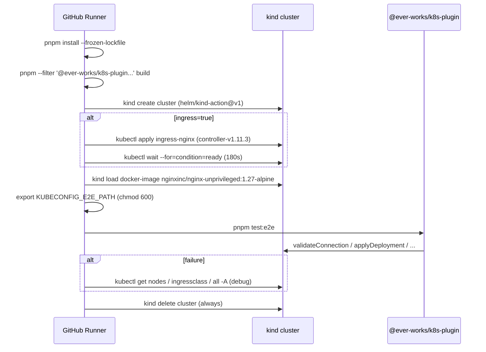

# Kubernetes Plugin E2E Runbook (kind)

The `@ever-works/k8s-plugin` package ships with two test tiers:

1. **Unit tests** (~133 cases) — fully hermetic, mock the
   `@kubernetes/client-node` ESM surface. Run on every CI build of the
   `k8s` plugin.
2. **End-to-end tests** — provision a real
   [kind](https://kind.sigs.k8s.io/) cluster, install ingress-nginx, and
   exercise the plugin against the live Kubernetes API.

This runbook covers the e2e tier: **how it runs in CI, how to run it
locally, what it verifies, and how to triage a failure.**

## When the e2e suite runs

The workflow is defined in
[`.github/workflows/k8s-e2e.yml`](https://github.com/ever-works/ever-works/blob/develop/.github/workflows/k8s-e2e.yml)
and runs only when **the runtime path could be affected**:

| Trigger             | Filter                                                     |
| ------------------- | ---------------------------------------------------------- |
| `push`              | `main`, `develop`, `stage`                                 |
| `pull_request`      | `main`, `develop`, `stage`                                 |
| `workflow_dispatch` | manual run (any branch)                                    |
| Path filter         | `packages/plugins/k8s/**`, `.github/workflows/k8s-e2e.yml` |

Docs-only PRs and changes outside the k8s plugin do **not** spend
the ~5 minutes per matrix-cell that cluster provisioning costs.

## Test matrix

The job is fanned out across two axes — Kubernetes minor version and
whether ingress-nginx is installed — for **four total cells per run**:

| Kubernetes | kind node image         | Ingress controller |
| ---------- | ----------------------- | ------------------ |
| `v1.28`    | `kindest/node:v1.28.15` | none / nginx       |
| `v1.30`    | `kindest/node:v1.30.13` | none / nginx       |

The "none" row exercises the **no-ingress-controller** branch in
`validateConnection.listIngressClasses`; the "nginx" row exercises the
**nginx-detected** branch (`k8s.io/ingress-nginx`). Both rows must
pass for the workflow to succeed.

When promoting a new Kubernetes floor:

1. Edit the `matrix.kubernetes` array in `.github/workflows/k8s-e2e.yml`.
2. Pick a `kindest/node:v<minor>.<patch>` image from the
   [kind release notes](https://github.com/kubernetes-sigs/kind/releases).
3. Open a PR. The matrix expansion runs against the new cell on the
   same PR — if it goes green, you can drop the oldest minor in a
   follow-up.

## What the e2e suite verifies

Source: [`packages/plugins/k8s/src/__tests__/e2e/cluster.e2e.spec.ts`](https://github.com/ever-works/ever-works/blob/develop/packages/plugins/k8s/src/__tests__/e2e/cluster.e2e.spec.ts).

| Test case                                                         | Why mocks can't cover it                                             |
| ----------------------------------------------------------------- | -------------------------------------------------------------------- |
| `validateConnection` returns server version + ingress classes     | Real cluster fingerprint, real `IngressClass` schema across versions |
| `ensureNamespace` is idempotent                                   | Real `409 Already Exists` round-trip on second call                  |
| `applyDeployment` + `applyService` converge to a Ready Deployment | Server-side apply field-manager semantics + real readiness probes    |
| `listManagedDeployments` returns the deployment we just created   | Label-selector matching against a real API list                      |
| `getDeployment` returns null for a missing Deployment             | Real `404` error class round-trip                                    |
| `getIngressLoadBalancerHost` returns null when no Ingress exists  | Real "no Ingress" path through `@kubernetes/client-node`             |

The suite gates on the `KUBECONFIG_E2E_PATH` environment variable —
when it is unset, every test is `describe.skip`-ed. This lets the same
spec file run inside the unit-test command (where it skips) and inside
the e2e command (where it executes).

## Workflow walkthrough

The workflow goes through six phases for each matrix cell:



### Why each step exists

- **`pnpm --filter '@ever-works/k8s-plugin...' build`** — builds k8s
  and every upstream workspace dep (`contracts`, `plugin`, `agent`).
  Without `contracts`, the plugin's dts build can't resolve
  `@ever-works/contracts` imports. Cheaper than a full `pnpm build`.
- **Pinned ingress-nginx tag (`controller-v1.11.3`)** — using `main`
  makes the cluster state non-deterministic across runs (a breaking
  change merged to nginx's main would silently alter behaviour
  without a diff in this repo). Bump deliberately when promoting
  a new floor.
- **`kind load docker-image`** — pre-pulls
  `nginxinc/nginx-unprivileged:1.27-alpine` so the Deployment's
  `imagePullPolicy: IfNotPresent` resolves immediately, cutting
  test time by ~30s on slow runners.
- **`kubectl wait` returns 0 even on timeout (`|| echo …`)** — the
  e2e suite only enumerates `IngressClass` resources; it doesn't
  require the controller pod to be Ready. We still wait so the
  job reports realistic state if a regression makes startup slower.
- **Failure-only debug step** — `kubectl get` / `describe` snapshots
  are captured so you can triage without re-running the workflow.
- **`kind delete cluster` runs `if: always()`** — ephemeral clusters
  must be torn down even when the test step errors, otherwise the
  runner would leak resources between matrix cells on self-hosted
  runners.

## Running the e2e suite locally

You need [`kind`](https://kind.sigs.k8s.io/docs/user/quick-start/),
`kubectl`, and Docker. Then:

```bash
# 1. Provision a cluster (matches the CI image)
kind create cluster --name ever-works-e2e --image kindest/node:v1.30.13

# 2. (Optional) Install ingress-nginx to exercise the "nginx detected"
#    code path — skip to exercise the "no ingress controller" path.
kubectl apply -f https://raw.githubusercontent.com/kubernetes/ingress-nginx/controller-v1.11.3/deploy/static/provider/kind/deploy.yaml
kubectl wait --namespace ingress-nginx \
    --for=condition=ready pod \
    --selector=app.kubernetes.io/component=controller \
    --timeout=180s

# 3. Pre-pull the test image so applyDeployment converges quickly.
docker pull nginxinc/nginx-unprivileged:1.27-alpine
kind load docker-image nginxinc/nginx-unprivileged:1.27-alpine --name ever-works-e2e

# 4. Export kubeconfig where the e2e suite expects it.
kind get kubeconfig --name ever-works-e2e > /tmp/kubeconfig
chmod 600 /tmp/kubeconfig
export KUBECONFIG_E2E_PATH=/tmp/kubeconfig

# 5. Build the plugin + dependencies.
pnpm --filter '@ever-works/k8s-plugin...' build

# 6. Run the e2e suite.
pnpm --filter @ever-works/k8s-plugin test:e2e

# 7. Tear down (cluster is ephemeral; do this even on success).
kind delete cluster --name ever-works-e2e
```

The suite creates a fresh namespace per run
(`everworks-e2e-<timestamp>`) so concurrent runs do not collide.
Cleanup happens in `afterAll` and is best-effort — a leaked namespace
on a long-lived cluster will be cleaned up on next run if you reuse
the timestamp shape, otherwise delete it manually with
`kubectl delete namespace everworks-e2e-<timestamp>`.

## Triaging a failure

Pull the failed run from
[Actions → K8s Plugin E2E](https://github.com/ever-works/ever-works/actions/workflows/k8s-e2e.yml).
The "Show cluster state on failure" step contains:

- `kubectl get nodes -o wide` — confirms the node is `Ready` and the
  cluster reached a healthy steady state.
- `kubectl get ingressclass -o wide` — verifies the test premise
  (`none`-row clusters should have zero `IngressClass`; `nginx`-row
  clusters should have at least the `nginx` class).
- `kubectl get all -A | head -100` — surfaces deployment/replicaset
  state for the namespace under test.
- `kubectl describe deployment -A | head -200` — surfaces image pull
  errors, readiness probe failures, etc.

Common failure modes and the right next step:

| Symptom                                                                   | Likely cause                                                 | Fix                                                                                                            |
| ------------------------------------------------------------------------- | ------------------------------------------------------------ | -------------------------------------------------------------------------------------------------------------- |
| `applyDeployment + applyService converge to a Ready Deployment` times out | Image pull is slow on a contended runner                     | First check: was `kind load docker-image` skipped? Bump test timeout `120_000` only if confirmed environmental |
| `validateConnection` returns the wrong fingerprint shape                  | A new minor of `@kubernetes/client-node` changed `getCode()` | Update `KubernetesApiService.fingerprint(...)` and the expectation in the e2e spec                             |
| `IngressClass not found` in the `nginx` row                               | Controller manifest moved or pin-tag was retired             | Confirm `controller-v1.11.3` still resolves, or bump the pinned tag                                            |
| `npm ERR! Missing peer dep` during `pnpm install`                         | Lockfile drift between develop and the branch                | Re-run `pnpm install` from a clean clone; if reproducible, the lockfile is broken on develop                   |
| Workflow times out before `kind create cluster` finishes                  | Runner congestion (typical for Saturday/late-night runs)     | Re-run the failed cell. If repeated, raise `helm/kind-action@v1` `wait` from `120s` to `240s`                  |

## Operating envelope

- **One test image only**: `nginxinc/nginx-unprivileged:1.27-alpine`.
  It runs as a non-root user, matches what the platform-rendered
  Deployment expects, and is small enough that the kind pre-pull
  takes <10 s on a fresh runner.
- **One namespace per run**, `everworks-e2e-<timestamp>`. The
  workflow tears down the cluster at the end so we do **not** rely on
  the `afterAll` namespace cleanup; that's belt-and-suspenders.
- **No persistent volumes** are exercised. The plugin contract is
  Deployment + Service + Ingress; nothing in the e2e suite needs a
  storage class.
- **No external network** is exercised. The Deployment's container
  serves a local `nginx-unprivileged` page on port 8080 and the
  readiness probe hits `/`.

## Related references

- [Workflow source](https://github.com/ever-works/ever-works/blob/develop/.github/workflows/k8s-e2e.yml)
- [Spec: `k8s-deployment` feature](https://github.com/ever-works/ever-works/tree/develop/docs/specs/features/k8s-deployment)
- [`@ever-works/k8s-plugin` README](https://github.com/ever-works/ever-works/blob/develop/packages/plugins/k8s/README.md)
- [kind release notes](https://github.com/kubernetes-sigs/kind/releases) — for choosing new node images
- [ingress-nginx releases](https://github.com/kubernetes/ingress-nginx/releases) — for bumping the pinned controller tag
